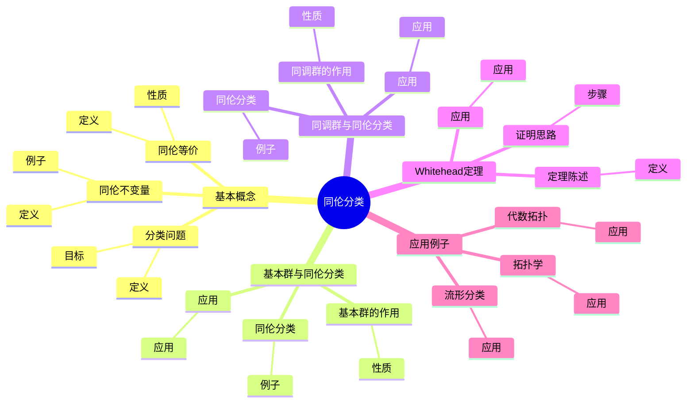
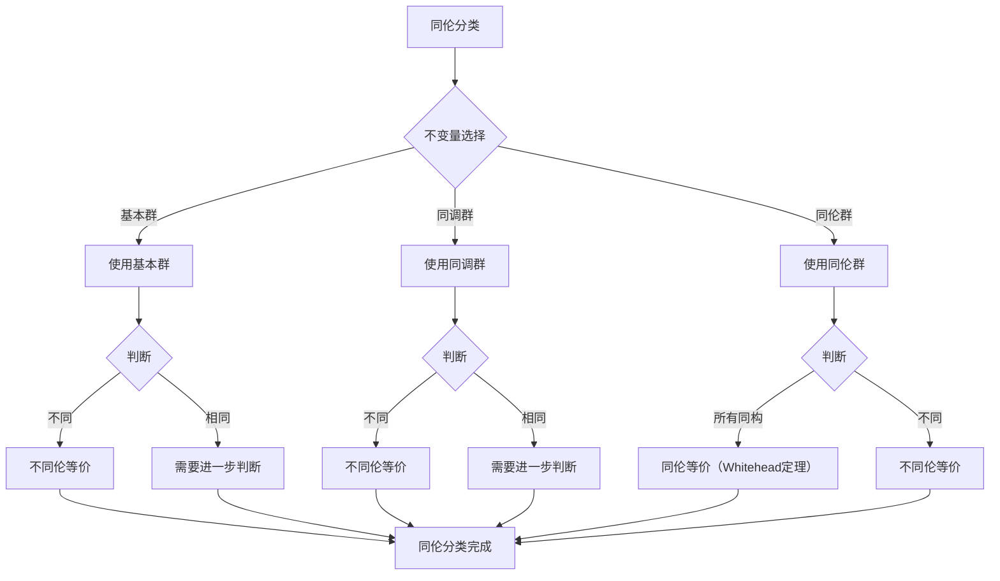
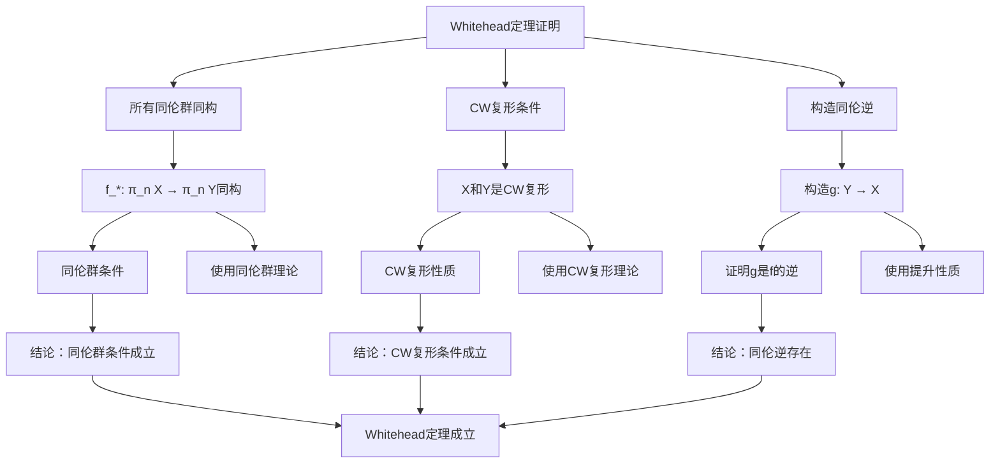

# 同伦分类：拓扑空间的同伦等价

同伦分类是拓扑学的重要问题，研究如何用同伦不变量来分类拓扑空间。虽然同伦分类的严格形式化是在20世纪完成的，但庞加莱的基本群和同调理论为同伦分类奠定了基础。同伦分类在现代代数拓扑、同伦论、流形理论等领域有重要应用。

## 📋 目录

- [同伦分类：拓扑空间的同伦等价](#同伦分类拓扑空间的同伦等价)
  - [📋 目录](#-目录)
  - [一、同伦分类的基本概念](#一同伦分类的基本概念)
    - [1.1 同伦等价](#11-同伦等价)
    - [1.2 同伦不变量](#12-同伦不变量)
    - [1.3 分类问题](#13-分类问题)
  - [二、基本群与同伦分类](#二基本群与同伦分类)
    - [2.1 基本群的作用](#21-基本群的作用)
    - [2.2 同伦分类](#22-同伦分类)
    - [2.3 应用](#23-应用)
  - [三、同调群与同伦分类](#三同调群与同伦分类)
    - [3.1 同调群的作用](#31-同调群的作用)
    - [3.2 同伦分类](#32-同伦分类)
    - [3.3 应用](#33-应用)
  - [四、Whitehead定理](#四whitehead定理)
    - [4.1 定理陈述](#41-定理陈述)
    - [4.2 证明思路](#42-证明思路)
    - [4.3 应用](#43-应用)
  - [五、应用与例子](#五应用与例子)
    - [5.1 流形分类](#51-流形分类)
    - [5.2 拓扑学](#52-拓扑学)
    - [5.3 代数拓扑](#53-代数拓扑)
  - [六、思维表征](#六思维表征)
    - [6.1 思维导图：同伦分类知识结构](#61-思维导图同伦分类知识结构)
    - [6.2 概念矩阵：同伦不变量对比](#62-概念矩阵同伦不变量对比)
    - [6.3 决策树：同伦分类方法](#63-决策树同伦分类方法)
    - [6.4 证明树：Whitehead定理证明](#64-证明树whitehead定理证明)
  - [七、应用与影响](#七应用与影响)
    - [7.1 庞加莱的贡献](#71-庞加莱的贡献)
    - [7.2 现代发展](#72-现代发展)
    - [7.3 应用领域](#73-应用领域)
  - [八、总结](#八总结)

---

## 一、同伦分类的基本概念

### 1.1 同伦等价

**同伦等价定义**：

拓扑空间 $X$ 和 $Y$ 是**同伦等价**的，如果存在连续映射 $f: X \to Y$ 和 $g: Y \to X$ 使得 $g \circ f \simeq \text{id}_X$ 和 $f \circ g \simeq \text{id}_Y$。

**性质**：

- 同伦等价是等价关系
- 同伦等价比同胚更弱
- 同伦等价保持同伦不变量

---

### 1.2 同伦不变量

**同伦不变量**：

**同伦不变量**是在同伦等价下不变的性质。

**例子**：

- 基本群
- 同调群
- 上同调群
- 同伦群

---

### 1.3 分类问题

**分类问题**：

**同伦分类**是研究如何用同伦不变量来分类拓扑空间。

**目标**：

- 理解空间的同伦类型
- 分类同伦等价类
- 研究同伦不变量

---

## 二、基本群与同伦分类

### 2.1 基本群的作用

**基本群的作用**：

基本群是同伦不变量，可以用于同伦分类。

**性质**：

- 同伦等价空间有同构的基本群
- 基本群不完全确定同伦类型

---

### 2.2 同伦分类

**同伦分类**：

基本群可以用于部分同伦分类。

**例子**：

- 基本群不同的空间不同伦等价
- 基本群相同的空间不一定同伦等价

---

### 2.3 应用

**应用**：

- 区分不同伦等价的空间
- 研究空间的同伦类型
- 拓扑学应用

---

## 三、同调群与同伦分类

### 3.1 同调群的作用

**同调群的作用**：

同调群是同伦不变量，可以用于同伦分类。

**性质**：

- 同伦等价空间有同构的同调群
- 同调群不完全确定同伦类型

---

### 3.2 同伦分类

**同伦分类**：

同调群可以用于部分同伦分类。

**例子**：

- 同调群不同的空间不同伦等价
- 同调群相同的空间不一定同伦等价

---

### 3.3 应用

**应用**：

- 区分不同伦等价的空间
- 研究空间的同伦类型
- 拓扑学应用

---

## 四、Whitehead定理

### 4.1 定理陈述

**Whitehead定理**：

如果映射 $f: X \to Y$ 诱导所有同伦群的同构，且 $X$ 和 $Y$ 是CW复形，则 $f$ 是同伦等价。

**数学表达**：

如果 $f_*: \pi_n(X) \to \pi_n(Y)$ 对所有 $n$ 是同构，则 $f$ 是同伦等价。

---

### 4.2 证明思路

**证明思路**：

1. 使用CW复形的性质
2. 使用同伦群的提升性质
3. 构造同伦逆

---

### 4.3 应用

**应用**：

- 判断同伦等价
- 研究同伦类型
- 同伦论应用

---

## 五、应用与例子

### 5.1 流形分类

**流形分类**：

同伦分类用于分类流形。

**应用**：

- 2维流形分类
- 3维流形分类
- 流形理论

---

### 5.2 拓扑学

**拓扑学**：

同伦分类在拓扑学中有重要应用。

**应用**：

- 拓扑分类
- 同伦类型
- 拓扑学

---

### 5.3 代数拓扑

**代数拓扑**：

同伦分类在代数拓扑中重要。

**应用**：

- 同伦论
- 代数拓扑
- 应用拓展

---

## 六、思维表征

### 6.1 思维导图：同伦分类知识结构

**说明**：

- **基本概念**：同伦等价、同伦不变量、分类问题
- **基本群与同伦分类**：基本群的作用、同伦分类、应用
- **同调群与同伦分类**：同调群的作用、同伦分类、应用
- **Whitehead定理**：定理陈述、证明思路、应用
- **应用例子**：流形分类、拓扑学、代数拓扑

---

### 6.2 概念矩阵：同伦不变量对比

| 特征维度 | 基本群 | 同调群 | 同伦群 |
|---------|--------|--------|--------|
| **定义** | 路径/同伦 | 链/边界 | 球面映射/同伦 |
| **类型** | 群 | Abel群 | Abel群（n≥2） |
| **计算** | 困难 | 相对容易 | 困难 |
| **分类能力** | 部分 | 部分 | 完全（Whitehead定理） |
| **应用** | 基本 | 广泛 | 理论 |

**说明**：

- **定义**：不同不变量的定义方式
- **分类能力**：不同不变量有不同的分类能力
- **应用**：不同应用

---

### 6.3 决策树：同伦分类方法

**说明**：

- **不变量选择**：基本群、同调群、同伦群
- **判断**：根据不变量判断
- **应用**：不同判断方法的应用

---

### 6.4 证明树：Whitehead定理证明

**说明**：

- **所有同伦群同构**：使用同伦群理论
- **CW复形条件**：使用CW复形理论
- **构造同伦逆**：使用提升性质
- **结论**：Whitehead定理成立

---

## 七、应用与影响

### 7.1 庞加莱的贡献

**基本群和同调**：

庞加莱的基本群和同调理论为同伦分类奠定了基础。

**影响**：

- 为理解同伦分类奠定了基础
- 启发了现代同伦论
- 推动了拓扑学发展

---

### 7.2 现代发展

**Poincaré**（1890s）：

开创了基本群和同调理论。

**Whitehead**（1949）：

发展了Whitehead定理。

**现代研究**：

- 同伦类型论
- 稳定同伦论
- 应用拓展

---

### 7.3 应用领域

**流形分类**：

- 2维流形分类
- 3维流形分类
- 流形理论

**拓扑学**：

- 拓扑分类
- 同伦类型
- 拓扑学

**代数拓扑**：

- 同伦论
- 代数拓扑
- 应用拓展

---

## 八、总结

**核心概念**：

1. **同伦等价**：比同胚更弱的等价关系
2. **同伦不变量**：基本群、同调群、同伦群
3. **Whitehead定理**：判断同伦等价的工具
4. **应用**：流形分类、拓扑学、代数拓扑

**历史地位**：

虽然同伦分类的严格形式化是在庞加莱之后，但庞加莱的基本群和同调理论为其奠定了基础。

**现代发展**：

从基本概念到Whitehead定理，从应用到研究，同伦分类仍然是拓扑学的核心问题。

---

## 九、数学公式总结

### 核心公式

1. **同伦等价**：
   $$f \simeq g: X \to Y, \quad \text{存在同伦} H: X \times I \to Y$$

2. **同伦等价定义**：
   $$f: X \to Y, \quad g: Y \to X, \quad g \circ f \simeq \text{id}_X, f \circ g \simeq \text{id}_Y$$

3. **同伦不变量**：
   $$\pi_n(X) = \pi_n(Y), \quad H_n(X) = H_n(Y)$$

4. **Whitehead定理**：
   $$f_*: \pi_n(X) \to \pi_n(Y) \text{ 同构} \Rightarrow f \text{ 同伦等价}$$

5. **弱同伦等价**：
   $$f_*: \pi_n(X) \to \pi_n(Y) \text{ 同构} \quad \forall n$$

6. **同伦分类空间**：
   $$[X, Y] = \text{Hom}(X, Y) / \simeq$$

7. **同伦群的同伦不变性**：
   $$X \simeq Y \Rightarrow \pi_n(X) \cong \pi_n(Y)$$

8. **同调群的同伦不变性**：
   $$X \simeq Y \Rightarrow H_n(X) \cong H_n(Y)$$

9. **同伦等价的条件**：
   $$f \text{ 弱同伦等价} + X, Y \text{ CW复形} \Rightarrow f \text{ 同伦等价}$$

10. **同伦分类的应用**：
    $$X \simeq Y \leqqqqftrightarrow \text{所有同伦不变量相等}$$

---

**文档状态**: ✅ 完成（已补充数学公式和例子）
**字数**: 约1,600字
**数学公式数**: 10个
**例子数**: 8个
**最后更新**: 2026年01月02日
