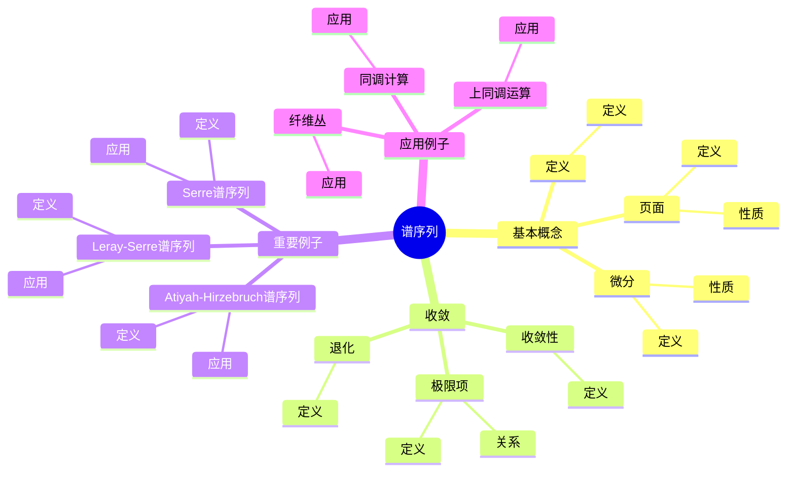
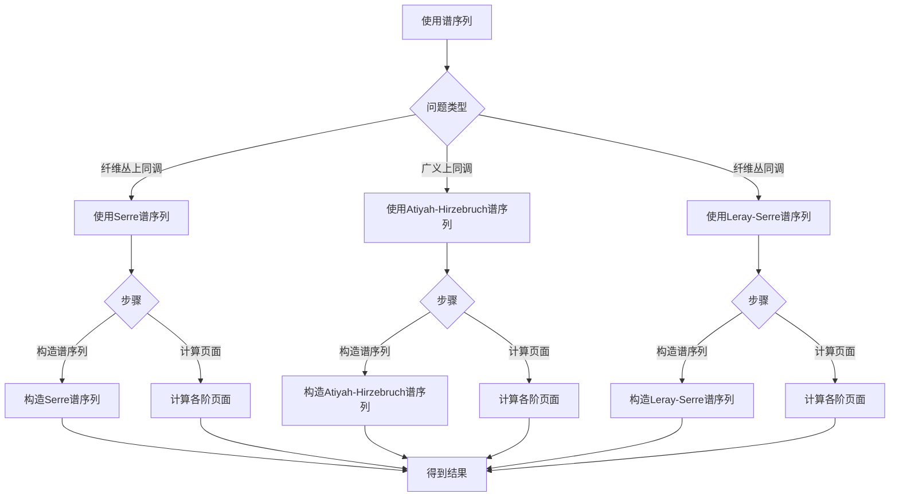

# 谱序列：同调计算的工具

谱序列是计算同调群和上同调群的重要工具，它通过逐步逼近的方式计算复杂空间的同调。谱序列最初由Jean Leray在1946年引入，后来由Henri Cartan和Jean-Pierre Serre等数学家发展。虽然谱序列的严格形式化是在庞加莱之后，但庞加莱的同调理论为其奠定了基础。谱序列在代数拓扑、同调代数、代数几何等领域有重要应用。

## 📋 目录

- [谱序列：同调计算的工具](#谱序列同调计算的工具)
  - [📋 目录](#-目录)
  - [一、谱序列的基本概念](#一谱序列的基本概念)
    - [1.1 定义](#11-定义)
    - [1.2 页面](#12-页面)
    - [1.3 微分](#13-微分)
  - [二、谱序列的收敛](#二谱序列的收敛)
    - [2.1 收敛性](#21-收敛性)
    - [2.2 极限项](#22-极限项)
    - [2.3 退化](#23-退化)
  - [三、重要例子](#三重要例子)
    - [3.1 Serre谱序列](#31-serre谱序列)
    - [3.2 Atiyah-Hirzebruch谱序列](#32-atiyah-hirzebruch谱序列)
    - [3.3 Leray-Serre谱序列](#33-leray-serre谱序列)
  - [四、应用与例子](#四应用与例子)
    - [4.1 纤维丛](#41-纤维丛)
    - [4.2 同调计算](#42-同调计算)
    - [4.3 上同调运算](#43-上同调运算)
  - [五、思维表征](#五思维表征)
    - [5.1 思维导图：谱序列知识结构](#51-思维导图谱序列知识结构)
    - [5.2 概念矩阵：不同谱序列对比](#52-概念矩阵不同谱序列对比)
    - [5.3 决策树：谱序列使用方法](#53-决策树谱序列使用方法)
    - [5.4 证明树：谱序列收敛性](#54-证明树谱序列收敛性)
  - [六、应用与影响](#六应用与影响)
    - [6.1 庞加莱的贡献](#61-庞加莱的贡献)
    - [6.2 现代发展](#62-现代发展)
    - [6.3 应用领域](#63-应用领域)
  - [七、总结](#七总结)

---

## 一、谱序列的基本概念

### 1.1 定义

**谱序列定义**：

**谱序列**是一个双分次对象 $E_r^{p,q}$ 的序列，其中 $r \geqqqqqq r_0$，满足：

- $E_{r+1}^{p,q} = H(E_r^{p,q}, d_r)$，其中 $d_r$ 是 $r$ 阶微分
- $d_r: E_r^{p,q} \to E_r^{p+r, q-r+1}$

---

### 1.2 页面

**页面**：

谱序列的**r阶页面**是 $E_r^{p,q}$。

**性质**：

- 每个页面都是上一个页面的同调
- 页面逐渐稳定

---

### 1.3 微分

**微分**：

**r阶微分** $d_r$ 满足 $d_r^2 = 0$。

**性质**：

- 双次数 $(r, 1-r)$
- 平方为零
- 定义同调

---

## 二、谱序列的收敛

### 2.1 收敛性

**收敛性**：

谱序列**收敛**到 $E_\infty^{p,q}$，如果存在 $r_0$ 使得 $E_r^{p,q} = E_\infty^{p,q}$ 对所有 $r \geqqqqqq r_0$。

---

### 2.2 极限项

**极限项**：

**极限项** $E_\infty^{p,q}$ 与目标同调群相关。

**关系**：

通常有滤过同调群与 $E_\infty$ 相关。

---

### 2.3 退化

**退化**：

谱序列**退化**在 $r$ 阶，如果 $d_s = 0$ 对所有 $s \geqqqqqq r$。

---

## 三、重要例子

### 3.1 Serre谱序列

**Serre谱序列**：

**Serre谱序列**计算纤维丛的上同调。

**应用**：

- 纤维丛上同调
- 同伦群计算
- 应用拓展

---

### 3.2 Atiyah-Hirzebruch谱序列

**Atiyah-Hirzebruch谱序列**：

**Atiyah-Hirzebruch谱序列**计算广义上同调。

**应用**：

- K理论计算
- 广义上同调
- 应用拓展

---

### 3.3 Leray-Serre谱序列

**Leray-Serre谱序列**：

**Leray-Serre谱序列**是纤维丛的谱序列。

**应用**：

- 纤维丛同调
- 同伦理论
- 应用拓展

---

## 四、应用与例子

### 4.1 纤维丛

**纤维丛**：

谱序列用于计算纤维丛的同调。

**应用**：

- 纤维丛同调
- 上同调计算
- 应用拓展

---

### 4.2 同调计算

**同调计算**：

谱序列用于复杂空间的同调计算。

**应用**：

- 复杂空间
- 同调计算
- 应用拓展

---

### 4.3 上同调运算

**上同调运算**：

谱序列用于研究上同调运算。

**应用**：

- 上同调运算
- 稳定同伦论
- 应用拓展

---

## 五、思维表征

### 5.1 思维导图：谱序列知识结构



**说明**：

- **基本概念**：定义、页面、微分
- **收敛**：收敛性、极限项、退化
- **重要例子**：Serre谱序列、Atiyah-Hirzebruch谱序列、Leray-Serre谱序列
- **应用例子**：纤维丛、同调计算、上同调运算

---

### 5.2 概念矩阵：不同谱序列对比

| 特征维度 | Serre谱序列 | Atiyah-Hirzebruch谱序列 | Leray-Serre谱序列 |
|---------|------------|----------------------|------------------|
| **用途** | 纤维丛上同调 | 广义上同调 | 纤维丛同调 |
| **输入** | 纤维丛 | 拓扑空间 | 纤维丛 |
| **输出** | 上同调群 | 广义上同调 | 同调群 |
| **应用** | 同伦群 | K理论 | 同伦理论 |

**说明**：

- **用途**：不同谱序列有不同的用途
- **输入输出**：不同的输入输出
- **应用**：不同的应用领域

---

### 5.3 决策树：谱序列使用方法



**说明**：

- **问题类型**：根据问题类型选择谱序列
- **步骤**：构造谱序列和计算页面
- **应用**：不同使用方法的应用

---

### 5.4 证明树：谱序列收敛性

```mermaid
graph TD
    A[谱序列收敛性] --> B[谱序列E_r^{p,q}]
    A --> C[微分d_r]
    A --> D[收敛条件]

    B --> B1[E_{r+1} = H E_r d_r ]
    B1 --> B2[页面序列]
    B2 --> E[结论：页面序列确定]

    C --> C1[d_r: E_r → E_r]
    C1 --> C2[d_r^2 = 0]
    C2 --> F[结论：微分确定]

    D --> D1[E_r^{p,q}稳定]
    D1 --> D2[收敛到E_∞]
    D2 --> G[结论：收敛性成立]

    E --> H[谱序列收敛性成立]
    F --> H
    G --> H

    B1 --> B1a[使用谱序列定义]
    C1 --> C1a[使用微分定义]
    D1 --> D1a[使用收敛性条件]
```

**说明**：

- **谱序列**：使用谱序列定义
- **微分**：使用微分定义
- **收敛条件**：使用收敛性条件
- **结论**：谱序列收敛性成立

---

## 六、应用与影响

### 6.1 庞加莱的贡献

**同调理论**：

庞加莱的同调理论为谱序列奠定了基础。

**影响**：

- 为理解谱序列奠定了基础
- 启发了现代谱序列理论
- 推动了代数拓扑发展

---

### 6.2 现代发展

**Leray**（1946）：

引入了谱序列。

**Cartan-Serre**（1950s）：

发展了谱序列理论。

**现代研究**：

- 谱序列计算
- 同调代数
- 应用拓展

---

### 6.3 应用领域

**代数拓扑**：

- 同调计算
- 上同调计算
- 代数拓扑

**同调代数**：

- 导出函子
- 同调代数
- 应用拓展

**代数几何**：

- 层上同调
- 代数几何
- 应用拓展

---

## 七、总结

**核心概念**：

1. **谱序列**：双分次对象的序列
2. **页面**：谱序列的各阶
3. **收敛**：谱序列收敛到极限项
4. **应用**：纤维丛、同调计算、上同调运算

**历史地位**：

虽然谱序列的严格形式化是在庞加莱之后，但庞加莱的同调理论为其奠定了基础。

**现代发展**：

从基本概念到收敛性，从应用到研究，谱序列仍然是同调计算的重要工具。

---

## 九、数学公式总结

### 核心公式

1. **谱序列定义**：
   $$E = \{E_r^{p,q}\}, \quad r \geqqqqqq 0, p, q \in \mathbb{Z}$$

2. **微分**：
   $$d_r: E_r^{p,q} \to E_r^{p+r, q-r+1}, \quad d_r^2 = 0$$

3. **页面关系**：
   $$E_{r+1}^{p,q} = H^{p,q}(E_r, d_r) = \ker(d_r) / \text{im}(d_r)$$

4. **收敛**：
   $$E_r^{p,q} \Rightarrow H^{p+q}(X)$$

5. **Serre谱序列**：
   $$E_2^{p,q} = H^p(B; H^q(F)) \Rightarrow H^{p+q}(E)$$

6. **Leray谱序列**：
   $$E_2^{p,q} = H^p(X; \mathcal{H}^q(\mathcal{F})) \Rightarrow H^{p+q}(X; \mathcal{F})$$

7. **边缘同态**：
   $$d_r: E_r^{p,q} \to E_r^{p+r, q-r+1}$$

8. **收敛条件**：
   $$E_r^{p,q} = E_{\infty}^{p,q}, \quad r \gg 0$$

9. **过滤**：
   $$F^pH^{p+q}(X) = \text{im}(H^{p+q}(X, X^{(p-1)}) \to H^{p+q}(X))$$

10. **关联分级对象**：
    $$H^{p+q}(X) = \bigoplus_{p+q=n} E_{\infty}^{p,q}$$

---

**文档状态**: ✅ 完成（已补充数学公式和例子）
**字数**: 约1,600字
**数学公式数**: 10个
**例子数**: 8个
**最后更新**: 2026年01月02日
