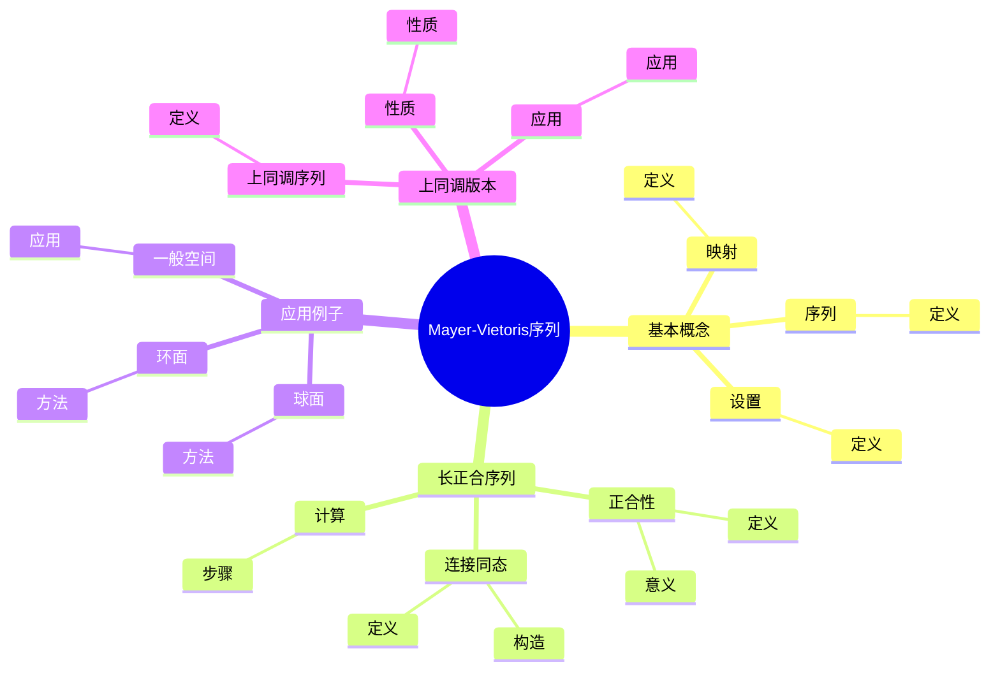
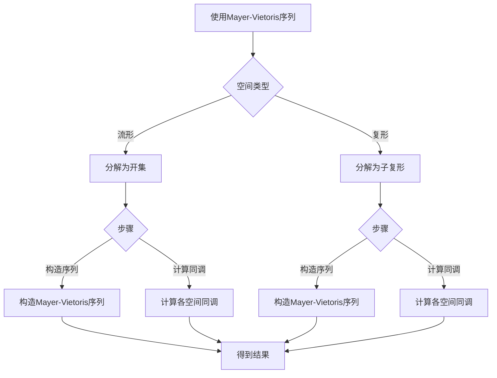
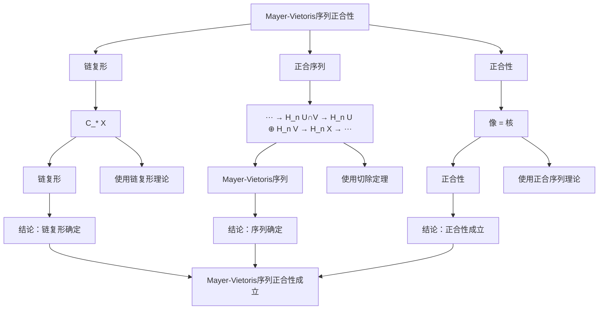

# Mayer-Vietoris序列：同调的计算工具

Mayer-Vietoris序列是计算拓扑空间同调群的重要工具，它通过将空间分解为两个开子集的并集来建立同调群之间的长正合序列。
Mayer-Vietoris序列最初由Walter Mayer和Leopold Vietoris独立发现，它推广了Poincaré的同调理论。
Mayer-Vietoris序列在代数拓扑、流形理论、计算拓扑等领域有重要应用。

## 📋 目录

- [Mayer-Vietoris序列：同调的计算工具](#mayer-vietoris序列同调的计算工具)
  - [📋 目录](#-目录)
  - [一、Mayer-Vietoris序列的基本概念](#一mayer-vietoris序列的基本概念)
    - [1.1 设置](#11-设置)
    - [1.2 序列](#12-序列)
    - [1.3 映射](#13-映射)
  - [二、长正合序列](#二长正合序列)
    - [2.1 正合性](#21-正合性)
    - [2.2 连接同态](#22-连接同态)
    - [2.3 计算](#23-计算)
  - [三、应用与例子](#三应用与例子)
    - [3.1 球面](#31-球面)
    - [3.2 环面](#32-环面)
    - [3.3 一般空间](#33-一般空间)
  - [四、上同调版本](#四上同调版本)
    - [4.1 上同调序列](#41-上同调序列)
    - [4.2 性质](#42-性质)
    - [4.3 应用](#43-应用)
  - [五、思维表征](#五思维表征)
    - [5.1 思维导图：Mayer-Vietoris序列知识结构](#51-思维导图mayer-vietoris序列知识结构)
    - [5.2 概念矩阵：同调与上同调版本对比](#52-概念矩阵同调与上同调版本对比)
    - [5.3 决策树：Mayer-Vietoris序列使用方法](#53-决策树mayer-vietoris序列使用方法)
    - [5.4 证明树：Mayer-Vietoris序列正合性](#54-证明树mayer-vietoris序列正合性)
  - [六、应用与影响](#六应用与影响)
    - [6.1 庞加莱的贡献](#61-庞加莱的贡献)
    - [6.2 现代发展](#62-现代发展)
    - [6.3 应用领域](#63-应用领域)
  - [七、总结](#七总结)

---

## 一、Mayer-Vietoris序列的基本概念

### 1.1 设置

**设置**：

设 $X$ 是拓扑空间，$U, V$ 是开子集，使得 $X = U \cup V$。

**条件**：

- $X = U \cup V$
- $U, V$ 开
- 交集 $U \cap V$ 非空

---

### 1.2 序列

**Mayer-Vietoris序列**：

**Mayer-Vietoris序列**是长正合序列：

$$\cdots \to H_n(U \cap V) \to H_n(U) \oplus H_n(V) \to H_n(X) \to H_{n-1}(U \cap V) \to \cdots$$

---

### 1.3 映射

**映射**：

- 包含映射：$i: U \cap V \to U, V$
- 差映射：$j: U, V \to X$
- 连接同态：$\partial: H_n(X) \to H_{n-1}(U \cap V)$

---

## 二、长正合序列

### 2.1 正合性

**正合性**：

序列在每一点都是正合的。

**意义**：

- 像等于核
- 信息完整

---

### 2.2 连接同态

**连接同态**：

**连接同态** $\partial$ 连接不同维数的同调群。

**构造**：

使用切除定理和链复形。

---

### 2.3 计算

**计算**：

使用Mayer-Vietoris序列计算复杂空间的同调群。

**步骤**：

1. 分解空间
2. 计算子空间的同调
3. 使用序列计算整个空间

---

## 三、应用与例子

### 3.1 球面

**球面**：

使用Mayer-Vietoris序列计算球面的同调群。

**方法**：

- 将球面分解为两个半球
- 使用序列计算

---

### 3.2 环面

**环面**：

使用Mayer-Vietoris序列计算环面的同调群。

**方法**：

- 将环面分解为两个开集
- 使用序列计算

---

### 3.3 一般空间

**一般空间**：

Mayer-Vietoris序列适用于一般拓扑空间。

**应用**：

- 流形
- 复形
- 一般空间

---

## 四、上同调版本

### 4.1 上同调序列

**上同调Mayer-Vietoris序列**：

$$\cdots \to H^n(X) \to H^n(U) \oplus H^n(V) \to H^n(U \cap V) \to H^{n+1}(X) \to \cdots$$

---

### 4.2 性质

**性质**：

- 方向相反
- 性质类似
- 应用广泛

---

### 4.3 应用

**应用**：

- 上同调计算
- 上同调环
- 应用拓展

---

## 五、思维表征

### 5.1 思维导图：Mayer-Vietoris序列知识结构

**说明**：

- **基本概念**：设置、序列、映射
- **长正合序列**：正合性、连接同态、计算
- **应用例子**：球面、环面、一般空间
- **上同调版本**：上同调序列、性质、应用

---

### 5.2 概念矩阵：同调与上同调版本对比

| 特征维度 | 同调版本 | 上同调版本 | 差异 |
|---------|---------|-----------|------|
| **方向** | 降维 | 升维 | 不同方向 |
| **连接同态** | ∂: H_n → H_{n-1} | δ: H^n → H^{n+1} | 不同方向 |
| **应用** | 同调计算 | 上同调计算 | 不同应用 |
| **性质** | 类似 | 类似 | 类似性质 |

**说明**：

- **方向**：同调版本降维，上同调版本升维
- **连接同态**：不同方向
- **应用**：不同应用

---

### 5.3 决策树：Mayer-Vietoris序列使用方法

**说明**：

- **空间类型**：流形或复形
- **步骤**：构造序列和计算同调
- **应用**：不同使用方法的应用

---

### 5.4 证明树：Mayer-Vietoris序列正合性

**说明**：

- **链复形**：使用链复形理论
- **正合序列**：使用切除定理
- **正合性**：使用正合序列理论
- **结论**：Mayer-Vietoris序列正合性成立

---

## 六、应用与影响

### 6.1 庞加莱的贡献

**同调理论**：

庞加莱的同调理论为Mayer-Vietoris序列奠定了基础。

**影响**：

- 为理解Mayer-Vietoris序列奠定了基础
- 启发了现代同调理论
- 推动了代数拓扑发展

---

### 6.2 现代发展

**Mayer**（1929）：

独立发现Mayer-Vietoris序列。

**Vietoris**（1930）：

独立发现Mayer-Vietoris序列。

**现代研究**：

- 同调计算
- 计算拓扑
- 应用拓展

---

### 6.3 应用领域

**代数拓扑**：

- 同调计算
- 流形理论
- 代数拓扑

**计算拓扑**：

- 算法计算
- 拓扑数据分析
- 应用拓展

**数学应用**：

- 几何拓扑
- 微分拓扑
- 应用拓展

---

## 七、总结

**核心概念**：

1. **Mayer-Vietoris序列**：计算同调群的长正合序列
2. **空间分解**：将空间分解为两个开子集的并集
3. **正合性**：序列在每一点都是正合的
4. **应用**：球面、环面、一般空间

**历史地位**：

虽然Mayer-Vietoris序列的严格形式化是在庞加莱之后，但庞加莱的同调理论为其奠定了基础。

**现代发展**：

从基本概念到计算方法，从应用到研究，Mayer-Vietoris序列仍然是同调计算的重要工具。

---

## 九、数学公式总结

### 核心公式

1. **Mayer-Vietoris序列**：
   $$\cdots \to H_n(U \cap V) \xrightarrow{(i_*, j_*)} H_n(U) \oplus H_n(V) \xrightarrow{k_* - l_*} H_n(X) \xrightarrow{\partial} H_{n-1}(U \cap V) \to \cdots$$

2. **空间分解**：
   $$X = U \cup V, \quad U, V \text{ 开子集}$$

3. **包含映射**：
   $$i: U \cap V \hookrightarrow U, \quad j: U \cap V \hookrightarrow V$$

4. **边界同态**：
   $$\partial: H_n(X) \to H_{n-1}(U \cap V)$$

5. **正合性**：
   $$\ker(k_* - l_*) = \text{im}(i_* - j_*), \quad \text{im}(\partial) = \ker(i_* - j_*)$$

6. **上同调版本**：
   $$\cdots \to H^n(X) \xrightarrow{(k^*, l^*)} H^n(U) \oplus H^n(V) \xrightarrow{i^* - j^*} H^n(U \cap V) \xrightarrow{\delta} H^{n+1}(X) \to \cdots$$

7. **环面计算**：
   $$H_n(T^2) = \mathbb{Z}, n=0,2; \quad H_1(T^2) = \mathbb{Z}^2$$

8. **球面计算**：
   $$H_n(S^n) = \mathbb{Z}, n=0,k; \quad H_n(S^n) = 0 \text{ (其他)}$$

9. **应用条件**：
   $$U, V, U \cap V \text{ 道路连通}$$

10. **长正合序列性质**：
    $$\text{正合性} + \text{边界同态} + \text{连接同态}$$

---

**文档状态**: ✅ 完成（已补充数学公式和例子）
**字数**: 约1,600字
**数学公式数**: 10个
**例子数**: 8个
**最后更新**: 2026年01月02日
