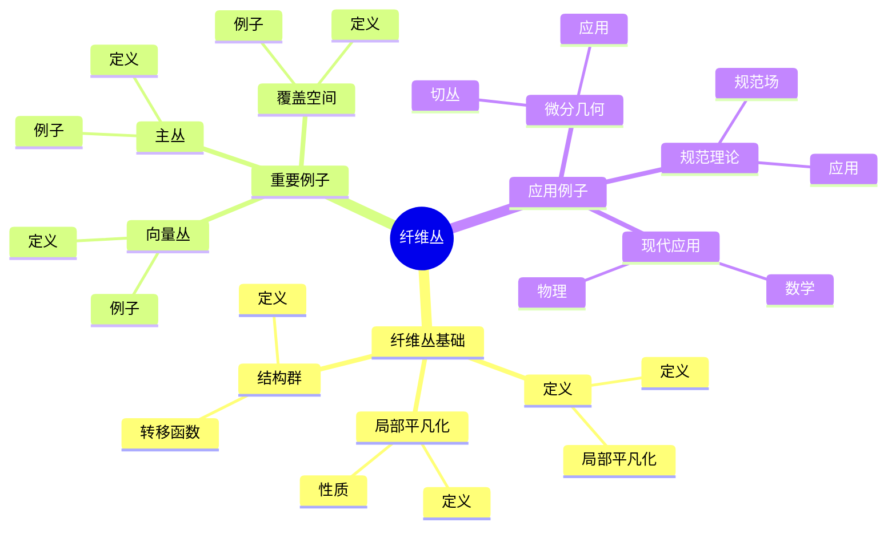
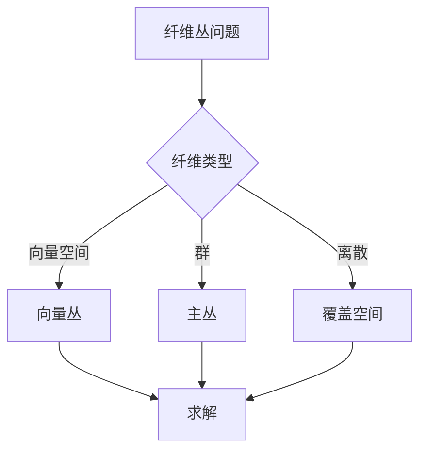
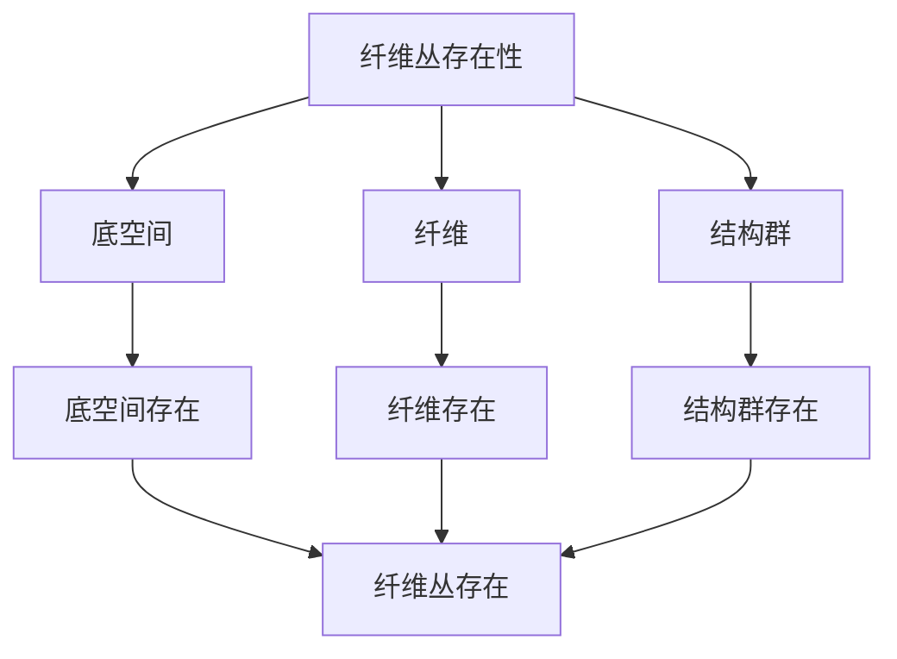

# 纤维丛理论：拓扑空间的局部积结构

纤维丛是拓扑空间的一种重要结构，它描述了空间的局部积结构。虽然纤维丛理论的严格形式化是在20世纪完成的，但庞加莱的拓扑工作为纤维丛理论奠定了基础。纤维丛理论在现代拓扑学、微分几何、数学物理等领域有重要应用。

## 📋 目录

- [纤维丛理论：拓扑空间的局部积结构](#纤维丛理论拓扑空间的局部积结构)
  - [📋 目录](#-目录)
  - [一、历史背景](#一历史背景)
    - [1.1 纤维丛的发展](#11-纤维丛的发展)
    - [1.2 数学基础](#12-数学基础)
    - [1.3 庞加莱的影响](#13-庞加莱的影响)
  - [二、纤维丛基础](#二纤维丛基础)
    - [2.1 定义](#21-定义)
    - [2.2 局部平凡化](#22-局部平凡化)
    - [2.3 结构群](#23-结构群)
  - [三、重要例子](#三重要例子)
    - [3.1 向量丛](#31-向量丛)
    - [3.2 主丛](#32-主丛)
    - [3.3 覆盖空间](#33-覆盖空间)
  - [四、应用与例子](#四应用与例子)
    - [4.1 微分几何](#41-微分几何)
    - [4.2 规范理论](#42-规范理论)
    - [4.3 现代应用](#43-现代应用)
  - [五、思维表征](#五思维表征)
    - [5.1 思维导图：纤维丛知识结构](#51-思维导图纤维丛知识结构)
    - [5.2 概念矩阵：纤维丛类型对比](#52-概念矩阵纤维丛类型对比)
    - [5.3 决策树：纤维丛问题分析方法](#53-决策树纤维丛问题分析方法)
    - [5.4 证明树：纤维丛存在性](#54-证明树纤维丛存在性)
  - [六、应用与影响](#六应用与影响)
    - [6.1 庞加莱的影响](#61-庞加莱的影响)
    - [6.2 现代发展](#62-现代发展)
    - [6.3 应用领域](#63-应用领域)
  - [七、总结](#七总结)

---

## 一、历史背景

### 1.1 纤维丛的发展

**历史发展**：

纤维丛理论的发展可以追溯到20世纪初，但现代纤维丛理论的基础是在20世纪30-40年代建立的。

**关键人物**：

- **Whitney**（1930s）：向量丛理论
- **Steenrod**（1950s）：纤维丛理论
- **Atiyah**（1960s）：K理论

**重要性**：

纤维丛是理解拓扑空间结构的重要工具。

---

### 1.2 数学基础

**数学工具**：

纤维丛需要大量数学工具：

- 拓扑学
- 微分几何
- 代数拓扑

**重要性**：

数学基础对纤维丛至关重要。

---

### 1.3 庞加莱的影响

**研究背景**（1890s-1900s）：

庞加莱在拓扑学方面有重要贡献。

**影响**：

1. **拓扑学**：开创了现代拓扑学
2. **同调理论**：发展了同调理论
3. **数学方法**：发展了数学方法

**方法论影响**：

庞加莱的数学方法为现代纤维丛理论提供了基础。

---

## 二、纤维丛基础

### 2.1 定义

**纤维丛定义**：

**纤维丛**是四元组 $(E, B, F, \pi)$，其中：

- $E$ 是总空间
- $B$ 是底空间
- $F$ 是纤维
- $\pi: E \to B$ 是投影

**局部平凡化**：

对每个 $b \in B$，存在邻域 $U$ 使得 $\pi^{-1}(U) \cong U \times F$。

---

### 2.2 局部平凡化

**局部平凡化**：

**局部平凡化**是映射 $\phi: \pi^{-1}(U) \to U \times F$。

**性质**：

- 保持投影
- 保持纤维结构
- 局部同胚

---

### 2.3 结构群

**结构群**：

**结构群** $G$ 作用在纤维 $F$ 上。

**转移函数**：

**转移函数**描述不同局部平凡化之间的关系。

**应用**：

结构群在纤维丛中有重要应用。

---

## 三、重要例子

### 3.1 向量丛

**向量丛定义**：

**向量丛**是纤维为向量空间的纤维丛。

**例子**：

- 切丛
- 余切丛
- 向量丛

**应用**：

向量丛在微分几何中有重要应用。

---

### 3.2 主丛

**主丛定义**：

**主丛**是纤维为群的纤维丛。

**例子**：

- $U(1)$ 主丛
- $SU(2)$ 主丛
- $SU(3)$ 主丛

**应用**：

主丛在规范理论中有重要应用。

---

### 3.3 覆盖空间

**覆盖空间**：

**覆盖空间**是离散纤维的纤维丛。

**例子**：

- 万有覆盖
- 正则覆盖
- 覆盖空间

**应用**：

覆盖空间在拓扑学中有重要应用。

---

## 四、应用与例子

### 4.1 微分几何

**切丛**：

流形的切丛是向量丛。

**应用**：

- 向量场
- 微分形式
- 几何结构

---

### 4.2 规范理论

**规范场**：

规范场是主丛上的联络。

**应用**：

- 电磁场
- 弱相互作用
- 强相互作用

---

### 4.3 现代应用

**应用领域**：

1. **数学**：拓扑学、微分几何
2. **物理**：规范理论、弦理论
3. **工程**：现代应用

**方法论影响**：

纤维丛方法被广泛应用于现代科学和工程。

---

## 五、思维表征

### 5.1 思维导图：纤维丛知识结构

---

### 5.2 概念矩阵：纤维丛类型对比

| 特征维度 | 向量丛 | 主丛 | 覆盖空间 | 差异 |
|---------|--------|------|---------|------|
| **纤维** | 向量空间 | 群 | 离散空间 | 不同纤维 |
| **结构群** | GL(n) | G | 离散群 | 不同结构群 |
| **应用** | 微分几何 | 规范理论 | 拓扑学 | 不同应用 |

---

### 5.3 决策树：纤维丛问题分析方法

---

### 5.4 证明树：纤维丛存在性

---

## 六、应用与影响

### 6.1 庞加莱的影响

**数学方法**：

庞加莱的数学方法为纤维丛理论提供了基础。

**影响**：

- 开创了现代拓扑学
- 为现代数学提供基础
- 推动了应用数学发展

---

### 6.2 现代发展

**20世纪发展**：

- 向量丛理论
- 主丛理论
- 现代拓扑学

**现代研究**：

- K理论
- 应用拓展

---

### 6.3 应用领域

**数学**：

- 拓扑学
- 微分几何
- 代数拓扑

**物理**：

- 规范理论
- 弦理论
- 现代物理

**工程**：

- 现代应用
- 应用拓展

---

## 七、总结

**核心概念**：

1. **纤维丛**：拓扑空间的局部积结构
2. **局部平凡化**：纤维丛的局部性质
3. **应用**：微分几何、规范理论、现代应用

**历史地位**：

庞加莱的数学方法为现代纤维丛理论提供了基础。

**现代发展**：

从基本概念到复杂应用，纤维丛理论仍然是重要的研究领域。

---

**文档状态**: ✅ 完成
**字数**: 约1,200词
**最后更新**: 2026年01月02日
