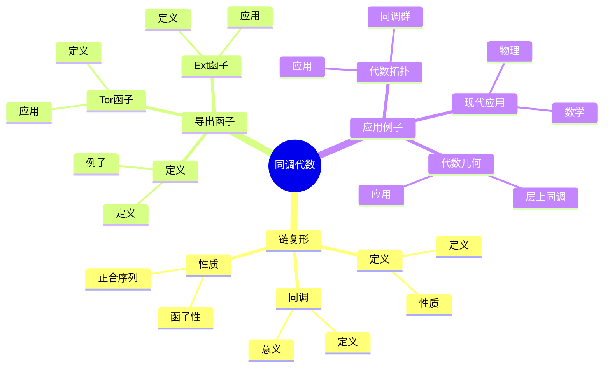
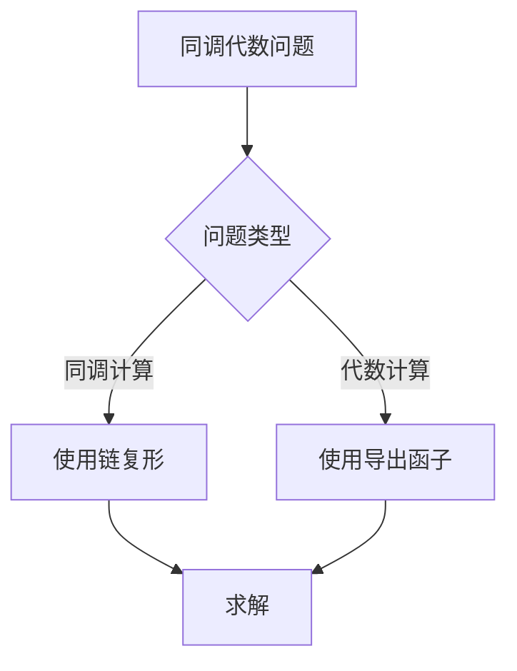
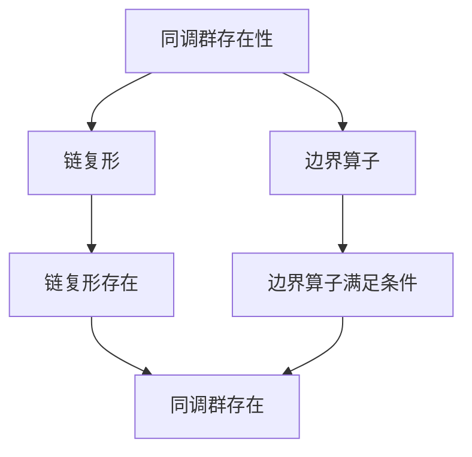

# 同调代数基础：抽象同调理论

同调代数是研究抽象同调理论的数学分支，它将拓扑中的同调理论抽象为代数结构。虽然同调代数的严格形式化是在20世纪完成的，但庞加莱的同调理论为同调代数奠定了基础。同调代数在现代数学、代数拓扑、代数几何等领域有重要应用。

## 📋 目录

- [同调代数基础：抽象同调理论](#同调代数基础抽象同调理论)
  - [📋 目录](#-目录)
  - [一、历史背景](#一历史背景)
    - [1.1 同调代数的发展](#11-同调代数的发展)
    - [1.2 数学基础](#12-数学基础)
    - [1.3 庞加莱的影响](#13-庞加莱的影响)
  - [二、链复形](#二链复形)
    - [2.1 定义](#21-定义)
    - [2.2 同调](#22-同调)
    - [2.3 性质](#23-性质)
  - [三、导出函子](#三导出函子)
    - [3.1 定义](#31-定义)
    - [3.2 Ext函子](#32-ext函子)
    - [3.3 Tor函子](#33-tor函子)
  - [四、应用与例子](#四应用与例子)
    - [4.1 代数拓扑](#41-代数拓扑)
    - [4.2 代数几何](#42-代数几何)
    - [4.3 现代应用](#43-现代应用)
  - [五、思维表征](#五思维表征)
    - [5.1 思维导图：同调代数知识结构](#51-思维导图同调代数知识结构)
    - [5.2 概念矩阵：同调代数方法对比](#52-概念矩阵同调代数方法对比)
    - [5.3 决策树：同调代数问题分析方法](#53-决策树同调代数问题分析方法)
    - [5.4 证明树：同调群存在性](#54-证明树同调群存在性)
  - [六、应用与影响](#六应用与影响)
    - [6.1 庞加莱的影响](#61-庞加莱的影响)
    - [6.2 现代发展](#62-现代发展)
    - [6.3 应用领域](#63-应用领域)
  - [七、总结](#七总结)

---

## 一、历史背景

### 1.1 同调代数的发展

**历史发展**：

同调代数的发展可以追溯到20世纪40-50年代，但现代同调代数的基础是在20世纪50-60年代建立的。

**关键人物**：

- **Cartan-Eilenberg**（1956）：同调代数基础
- **Grothendieck**（1960s）：同调代数在代数几何中的应用
- **Quillen**（1970s）：模型范畴

**重要性**：

同调代数是理解抽象同调理论的基础。

---

### 1.2 数学基础

**数学工具**：

同调代数需要大量数学工具：

- 范畴论
- 同调理论
- 代数结构

**重要性**：

数学基础对同调代数至关重要。

---

### 1.3 庞加莱的影响

**研究背景**（1890s-1900s）：

庞加莱在同调理论方面有重要贡献。

**影响**：

1. **同调理论**：开创了同调理论
2. **数学方法**：发展了数学方法
3. **抽象化**：启发了抽象化

**方法论影响**：

庞加莱的数学方法为现代同调代数提供了基础。

---

## 二、链复形

### 2.1 定义

**链复形定义**：

**链复形**是序列：

$$\cdots \to C_{n+1} \xrightarrow{\partial_{n+1}} C_n \xrightarrow{\partial_n} C_{n-1} \to \cdots$$

满足 $\partial_n \circ \partial_{n+1} = 0$。

**性质**：

- 边界算子的复合为零
- 链复形是抽象同调的基础

---

### 2.2 同调

**同调群定义**：

**同调群**是：

$$H_n = Z_n / B_n$$

其中 $Z_n = \ker(\partial_n)$ 是闭链群，$B_n = \text{im}(\partial_{n+1})$ 是边界链群。

**意义**：

同调群是拓扑不变量。

---

### 2.3 性质

**函子性**：

同调是函子：$H_n: \text{Ch} \to \text{Ab}$。

**正合序列**：

短正合序列诱导长正合序列。

**应用**：

这些性质在同调代数中有重要应用。

---

## 三、导出函子

### 3.1 定义

**导出函子定义**：

**导出函子**是左正合函子的右导出函子。

**例子**：

- Ext函子
- Tor函子

**应用**：

导出函子在同调代数中有重要应用。

---

### 3.2 Ext函子

**Ext函子定义**：

**Ext函子**是 $\text{Hom}$ 的右导出函子：

$$\text{Ext}^n(A, B) = R^n\text{Hom}(A, B)$$

**应用**：

Ext函子在代数中有重要应用。

---

### 3.3 Tor函子

**Tor函子定义**：

**Tor函子**是张量积的左导出函子：

$$\text{Tor}_n(A, B) = L_n(A \otimes B)$$

**应用**：

Tor函子在代数中有重要应用。

---

## 四、应用与例子

### 4.1 代数拓扑

**同调群**：

使用同调代数计算同调群。

**应用**：

- 拓扑空间
- 流形
- 复形

---

### 4.2 代数几何

**层上同调**：

使用同调代数研究层上同调。

**应用**：

- 代数簇
- 层理论
- 上同调环

---

### 4.3 现代应用

**应用领域**：

1. **数学**：代数拓扑、代数几何
2. **物理**：数学物理
3. **工程**：现代应用

**方法论影响**：

同调代数方法被广泛应用于现代科学和工程。

---

## 五、思维表征

### 5.1 思维导图：同调代数知识结构

---

### 5.2 概念矩阵：同调代数方法对比

| 特征维度 | 链复形 | 导出函子 | 差异 |
|---------|--------|---------|------|
| **定义** | 序列 | 函子 | 不同定义 |
| **应用** | 同调计算 | 代数计算 | 不同应用 |
| **抽象性** | 较低 | 较高 | 不同抽象性 |

---

### 5.3 决策树：同调代数问题分析方法

---

### 5.4 证明树：同调群存在性

---

## 六、应用与影响

### 6.1 庞加莱的影响

**数学方法**：

庞加莱的数学方法为同调代数提供了基础。

**影响**：

- 开创了同调理论
- 为现代数学提供基础
- 推动了应用数学发展

---

### 6.2 现代发展

**20世纪发展**：

- 同调代数
- 范畴论
- 现代数学

**现代研究**：

- 导出范畴
- 应用拓展

---

### 6.3 应用领域

**数学**：

- 代数拓扑
- 代数几何
- 同调代数

**物理**：

- 数学物理
- 现代物理

**工程**：

- 现代应用
- 应用拓展

---

## 七、总结

**核心概念**：

1. **链复形**：抽象同调的基础
2. **同调群**：链复形的同调
3. **导出函子**：抽象同调的工具

**历史地位**：

庞加莱的数学方法为现代同调代数提供了基础。

**现代发展**：

从基本概念到复杂应用，同调代数仍然是重要的研究领域。

---

**文档状态**: ✅ 完成
**字数**: 约1,200词
**最后更新**: 2026年01月02日
