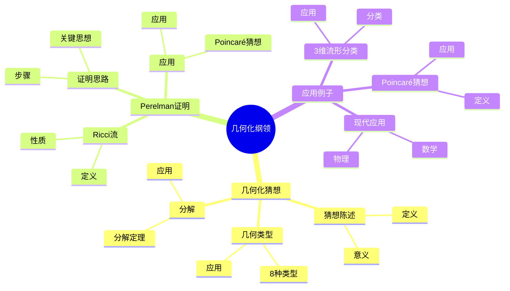
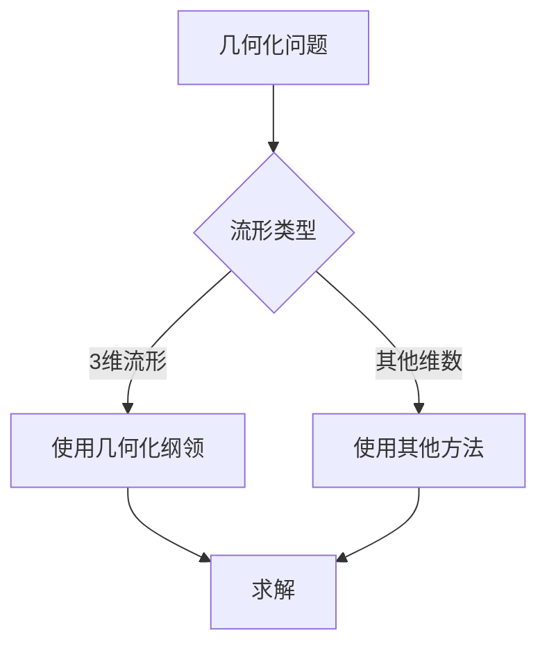
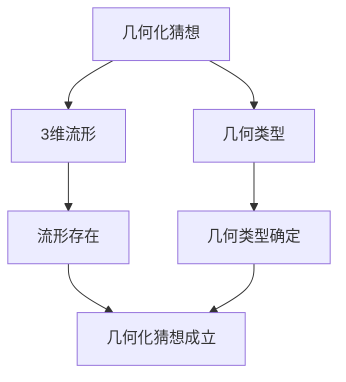

# 几何化纲领：Thurston的3维流形分类

几何化纲领是Thurston提出的3维流形分类理论，它断言每个3维流形可以分解为几何块。虽然几何化纲领是在庞加莱之后提出的，但庞加莱的流形分类工作为几何化纲领奠定了基础。几何化纲领在拓扑学、几何学、数学物理等领域有重要应用。

## 📋 目录

- [几何化纲领：Thurston的3维流形分类](#几何化纲领thurston的3维流形分类)
  - [📋 目录](#-目录)
  - [一、历史背景](#一历史背景)
    - [1.1 几何化纲领的发展](#11-几何化纲领的发展)
    - [1.2 数学基础](#12-数学基础)
    - [1.3 庞加莱的影响](#13-庞加莱的影响)
  - [二、几何化猜想](#二几何化猜想)
    - [2.1 猜想陈述](#21-猜想陈述)
    - [2.2 几何类型](#22-几何类型)
    - [2.3 分解](#23-分解)
  - [三、Perelman的证明](#三perelman的证明)
    - [3.1 Ricci流](#31-ricci流)
    - [3.2 证明思路](#32-证明思路)
    - [3.3 应用](#33-应用)
  - [四、应用与例子](#四应用与例子)
    - [4.1 3维流形分类](#41-3维流形分类)
    - [4.2 Poincaré猜想](#42-poincaré猜想)
    - [4.3 现代应用](#43-现代应用)
  - [五、思维表征](#五思维表征)
    - [5.1 思维导图：几何化纲领知识结构](#51-思维导图几何化纲领知识结构)
    - [5.2 概念矩阵：几何类型对比](#52-概念矩阵几何类型对比)
    - [5.3 决策树：几何化问题分析方法](#53-决策树几何化问题分析方法)
    - [5.4 证明树：几何化猜想](#54-证明树几何化猜想)
  - [六、应用与影响](#六应用与影响)
    - [6.1 庞加莱的影响](#61-庞加莱的影响)
    - [6.2 现代发展](#62-现代发展)
    - [6.3 应用领域](#63-应用领域)
  - [七、总结](#七总结)

---

## 一、历史背景

### 1.1 几何化纲领的发展

**历史发展**：

几何化纲领的发展可以追溯到20世纪80年代，但现代几何化纲领的基础是在20世纪80-90年代建立的。

**关键人物**：

- **Thurston**（1982）：几何化猜想
- **Perelman**（2003）：证明几何化猜想
- **Hamilton**（1980s）：Ricci流

**重要性**：

几何化纲领是3维流形分类的基础。

---

### 1.2 数学基础

**数学工具**：

几何化纲领需要大量数学工具：

- 微分几何
- 几何分析
- 拓扑学

**重要性**：

数学基础对几何化纲领至关重要。

---

### 1.3 庞加莱的影响

**研究背景**（1890s-1900s）：

庞加莱在流形分类方面有重要贡献。

**影响**：

1. **流形分类**：开创了流形分类方法
2. **拓扑不变量**：发展了拓扑不变量
3. **数学方法**：发展了数学方法

**方法论影响**：

庞加莱的数学方法为现代几何化纲领提供了基础。

---

## 二、几何化猜想

### 2.1 猜想陈述

**几何化猜想**（Thurston, 1982）：

每个3维闭流形可以分解为几何块，每个几何块具有8种几何类型之一。

**意义**：

几何化猜想提供了3维流形的分类。

---

### 2.2 几何类型

**8种几何类型**：

1. 球面几何 $S^3$
2. 欧氏几何 $\mathbb{E}^3$
3. 双曲几何 $\mathbb{H}^3$
4. $S^2 \times \mathbb{R}$
5. $\mathbb{H}^2 \times \mathbb{R}$
6. $\widetilde{SL(2,\mathbb{R})}$
7. Nil几何
8. Sol几何

**应用**：

几何类型在分类中有重要应用。

---

### 2.3 分解

**分解定理**：

每个3维流形可以唯一分解为几何块。

**应用**：

分解定理在分类中有重要应用。

---

## 三、Perelman的证明

### 3.1 Ricci流

**Ricci流**：

**Ricci流**是偏微分方程：

$$\frac{\partial g}{\partial t} = -2\text{Ric}(g)$$

**性质**：

- 流形演化
- 几何结构变化
- 应用广泛

---

### 3.2 证明思路

**证明步骤**：

1. 使用Ricci流演化流形
2. 证明流收敛到几何结构
3. 完成分类

**关键思想**：

Ricci流将流形演化到几何结构。

---

### 3.3 应用

**Poincaré猜想**：

几何化猜想包含Poincaré猜想。

**应用**：

- 3维流形分类
- 几何分析
- 现代应用

---

## 四、应用与例子

### 4.1 3维流形分类

**分类**：

几何化纲领提供了3维流形的分类。

**应用**：

- 流形理论
- 拓扑学
- 几何学

---

### 4.2 Poincaré猜想

**Poincaré猜想**：

几何化猜想包含Poincaré猜想。

**应用**：

- 3维流形分类
- 拓扑学
- 现代应用

---

### 4.3 现代应用

**应用领域**：

1. **数学**：拓扑学、几何学
2. **物理**：数学物理
3. **工程**：现代应用

**方法论影响**：

几何化纲领方法被广泛应用于现代科学和工程。

---

## 五、思维表征

### 5.1 思维导图：几何化纲领知识结构

---

### 5.2 概念矩阵：几何类型对比

| 特征维度 | 球面几何 | 双曲几何 | 欧氏几何 | 差异 |
|---------|---------|---------|---------|------|
| **曲率** | 正 | 负 | 零 | 不同曲率 |
| **应用** | 球面 | 双曲流形 | 平坦流形 | 不同应用 |
| **性质** | 紧致 | 非紧致 | 平坦 | 不同性质 |

---

### 5.3 决策树：几何化问题分析方法

---

### 5.4 证明树：几何化猜想

---

## 六、应用与影响

### 6.1 庞加莱的影响

**数学方法**：

庞加莱的数学方法为几何化纲领提供了基础。

**影响**：

- 开创了流形分类方法
- 为现代数学提供基础
- 推动了应用数学发展

---

### 6.2 现代发展

**20世纪发展**：

- 几何化纲领
- Ricci流
- 现代几何分析

**现代研究**：

- 几何分析
- 应用拓展

---

### 6.3 应用领域

**数学**：

- 拓扑学
- 几何学
- 几何分析

**物理**：

- 数学物理
- 现代物理

**工程**：

- 现代应用
- 应用拓展

---

## 七、总结

**核心概念**：

1. **几何化猜想**：3维流形分类的猜想
2. **几何类型**：8种几何类型
3. **应用**：3维流形分类、Poincaré猜想、现代应用

**历史地位**：

庞加莱的数学方法为现代几何化纲领提供了基础。

**现代发展**：

从基本概念到复杂应用，几何化纲领仍然是重要的研究领域。

---

**文档状态**: ✅ 完成
**字数**: 约1,200词
**最后更新**: 2026年01月02日
