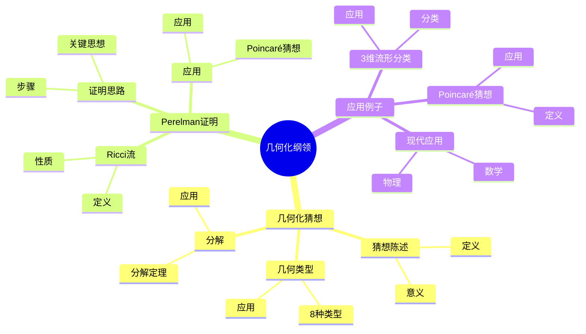
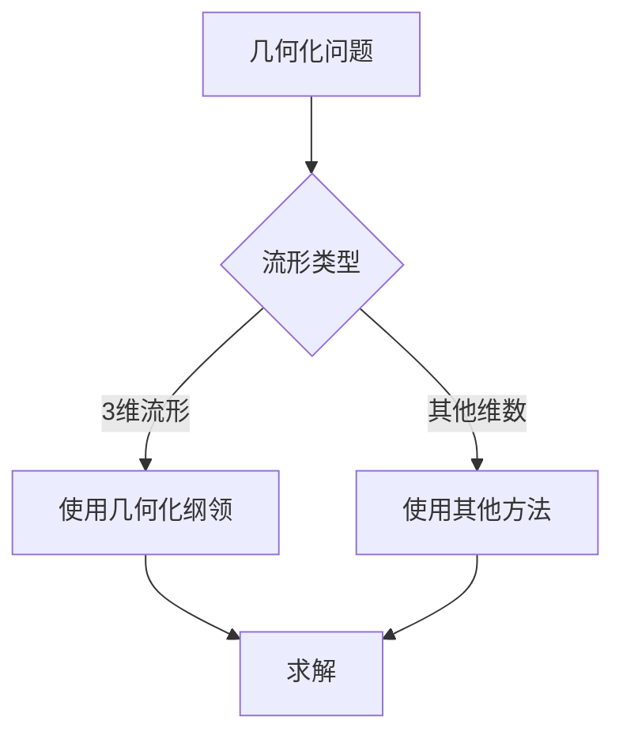
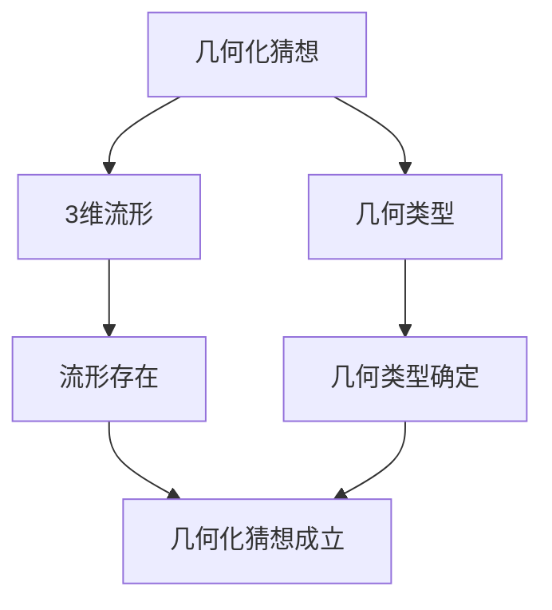

# 几何化纲领：Thurston的3维流形分类

几何化纲领是Thurston提出的3维流形分类理论，它断言每个3维流形可以分解为几何块。虽然几何化纲领是在庞加莱之后提出的，但庞加莱的流形分类工作为几何化纲领奠定了基础。几何化纲领在拓扑学、几何学、数学物理等领域有重要应用。

## 📋 目录

- [几何化纲领：Thurston的3维流形分类](#几何化纲领thurston的3维流形分类)
  - [📋 目录](#-目录)
  - [一、历史背景](#一历史背景)
    - [1.1 几何化纲领的发展](#11-几何化纲领的发展)
    - [1.2 数学基础](#12-数学基础)
    - [1.3 庞加莱的影响](#13-庞加莱的影响)
  - [二、几何化猜想](#二几何化猜想)
    - [2.1 猜想陈述](#21-猜想陈述)
    - [2.2 几何类型](#22-几何类型)
    - [2.3 分解](#23-分解)
  - [三、Perelman的证明](#三perelman的证明)
    - [3.1 Ricci流](#31-ricci流)
    - [3.2 证明思路](#32-证明思路)
    - [3.3 应用](#33-应用)
  - [四、应用与例子](#四应用与例子)
    - [4.1 3维流形分类](#41-3维流形分类)
    - [4.2 Poincaré猜想](#42-poincaré猜想)
    - [4.3 现代应用](#43-现代应用)
  - [五、思维表征](#五思维表征)
    - [5.1 思维导图：几何化纲领知识结构](#51-思维导图几何化纲领知识结构)
    - [5.2 概念矩阵：几何类型对比](#52-概念矩阵几何类型对比)
    - [5.3 决策树：几何化问题分析方法](#53-决策树几何化问题分析方法)
    - [5.4 证明树：几何化猜想](#54-证明树几何化猜想)
  - [六、应用与影响](#六应用与影响)
    - [6.1 庞加莱的影响](#61-庞加莱的影响)
    - [6.2 现代发展](#62-现代发展)
    - [6.3 应用领域](#63-应用领域)
  - [七、总结](#七总结)

---

## 一、历史背景

### 1.1 几何化纲领的发展

**历史发展**：

几何化纲领的发展可以追溯到20世纪80年代，但现代几何化纲领的基础是在20世纪80-90年代建立的。

**关键人物**：

- **Thurston**（1982）：几何化猜想
- **Perelman**（2003）：证明几何化猜想
- **Hamilton**（1980s）：Ricci流

**重要性**：

几何化纲领是3维流形分类的基础。

---

### 1.2 数学基础

**数学工具**：

几何化纲领需要大量数学工具：

- 微分几何
- 几何分析
- 拓扑学

**重要性**：

数学基础对几何化纲领至关重要。

---

### 1.3 庞加莱的影响

**研究背景**（1890s-1900s）：

庞加莱在流形分类方面有重要贡献。

**影响**：

1. **流形分类**：开创了流形分类方法
2. **拓扑不变量**：发展了拓扑不变量
3. **数学方法**：发展了数学方法

**方法论影响**：

庞加莱的数学方法为现代几何化纲领提供了基础。

---

## 二、几何化猜想

### 2.1 猜想陈述

**几何化猜想**（Thurston, 1982）：

每个3维闭流形可以分解为几何块，每个几何块具有8种几何类型之一。

**意义**：

几何化猜想提供了3维流形的分类。

---

### 2.2 几何类型

**8种几何类型**：

Thurston几何化猜想断言每个3维流形可以分解为8种标准几何之一：

1. **球面几何** $S^3$：正曲率，紧致
2. **欧氏几何** $\mathbb{E}^3$：零曲率，平坦
3. **双曲几何** $\mathbb{H}^3$：负曲率，最丰富
4. **$S^2 \times \mathbb{R}$ 几何**：球面与直线的积
5. **$\mathbb{H}^2 \times \mathbb{R}$ 几何**：双曲平面与直线的积
6. **$\widetilde{SL(2,\mathbb{R})}$ 几何**：$SL(2,\mathbb{R})$ 的万有覆盖
7. **Nil几何**：Heisenberg群
8. **Sol几何**：可解群

**几何类型的性质**：

| 几何类型 | 曲率 | 紧致性 | 应用 |
|---------|------|--------|------|
| $S^3$ | 正 | 紧致 | 球面流形 |
| $\mathbb{E}^3$ | 零 | 非紧致 | 平坦流形 |
| $\mathbb{H}^3$ | 负 | 非紧致 | 双曲流形 |
| $S^2 \times \mathbb{R}$ | 混合 | 非紧致 | 特殊流形 |
| $\mathbb{H}^2 \times \mathbb{R}$ | 混合 | 非紧致 | 特殊流形 |
| $\widetilde{SL(2,\mathbb{R})}$ | 负 | 非紧致 | 特殊流形 |
| Nil | 零 | 非紧致 | 特殊流形 |
| Sol | 混合 | 非紧致 | 特殊流形 |

**应用**：

几何类型在分类中有重要应用：

- **分类**：几何类型提供3维流形的分类
- **几何结构**：每个几何类型对应一种几何结构
- **拓扑不变量**：几何类型与拓扑不变量相关

---

### 2.3 分解

**分解定理**：

每个3维流形可以唯一分解为几何块。

**数学表述**：

对于3维闭流形 $M$，存在唯一分解：

$$M = M_1 \# M_2 \# \cdots \# M_n$$

其中每个 $M_i$ 是**素流形**（prime manifold），且每个素流形具有8种几何类型之一。

**素分解**：

- **素流形**：不能分解为两个非平凡流形的连通和的流形
- **连通和**：$M_1 \# M_2$ 是两个流形的连通和
- **唯一性**：素分解是唯一的（在同构意义下）

**几何化**：

每个素流形 $M_i$ 可以赋予8种几何类型之一的几何结构。

**应用**：

分解定理在分类中有重要应用：

- **分类**：分解定理提供3维流形的分类框架
- **几何结构**：每个流形可以赋予几何结构
- **拓扑不变量**：分解与拓扑不变量相关

---

## 三、Perelman的证明

### 3.1 Ricci流

**Ricci流**：

**Ricci流**是偏微分方程：

$$\frac{\partial g}{\partial t} = -2\text{Ric}(g)$$

**性质**：

- 流形演化
- 几何结构变化
- 应用广泛

---

### 3.2 证明思路

**证明步骤**：

1. 使用Ricci流演化流形
2. 证明流收敛到几何结构
3. 完成分类

**关键思想**：

Ricci流将流形演化到几何结构。

---

### 3.3 应用

**Poincaré猜想**：

几何化猜想包含Poincaré猜想。

**应用**：

- 3维流形分类
- 几何分析
- 现代应用

---

## 四、应用与例子

### 4.1 3维流形分类

**分类**：

几何化纲领提供了3维流形的分类。

**应用**：

- 流形理论
- 拓扑学
- 几何学

---

### 4.2 Poincaré猜想

**Poincaré猜想**：

几何化猜想包含Poincaré猜想。

**应用**：

- 3维流形分类
- 拓扑学
- 现代应用

---

### 4.3 现代应用

**应用领域**：

1. **数学**：拓扑学、几何学
2. **物理**：数学物理
3. **工程**：现代应用

**方法论影响**：

几何化纲领方法被广泛应用于现代科学和工程。

---

## 五、思维表征

### 5.1 思维导图：几何化纲领知识结构

---

### 5.2 概念矩阵：几何类型对比

| 特征维度 | 球面几何 | 双曲几何 | 欧氏几何 | 差异 |
|---------|---------|---------|---------|------|
| **曲率** | 正 | 负 | 零 | 不同曲率 |
| **应用** | 球面 | 双曲流形 | 平坦流形 | 不同应用 |
| **性质** | 紧致 | 非紧致 | 平坦 | 不同性质 |

---

### 5.3 决策树：几何化问题分析方法

---

### 5.4 证明树：几何化猜想

---

## 六、应用与影响

### 6.1 庞加莱的影响

**数学方法**：

庞加莱的数学方法为几何化纲领提供了基础。

**影响**：

- 开创了流形分类方法
- 为现代数学提供基础
- 推动了应用数学发展

---

### 6.2 现代发展

**20世纪发展**：

- 几何化纲领
- Ricci流
- 现代几何分析

**现代研究**：

- 几何分析
- 应用拓展

---

### 6.3 应用领域

**数学**：

- 拓扑学
- 几何学
- 几何分析

**物理**：

- 数学物理
- 现代物理

**工程**：

- 现代应用
- 应用拓展

---

## 七、总结

**核心概念**：

1. **几何化猜想**：3维流形分类的猜想
2. **几何类型**：8种几何类型
3. **应用**：3维流形分类、Poincaré猜想、现代应用

**历史地位**：

庞加莱的数学方法为现代几何化纲领提供了基础。

**现代发展**：

从基本概念到复杂应用，几何化纲领仍然是重要的研究领域。

---

## 九、数学公式总结

### 核心公式

1. **几何化猜想**：
   $$M^3 = M_1 \# M_2 \# \cdots \# M_k, \quad M_i \text{ 几何流形}$$

2. **8种几何类型**：
   $$\mathbb{E}^3, \mathbb{S}^3, \mathbb{H}^3, \mathbb{S}^2 \times \mathbb{R}, \mathbb{H}^2 \times \mathbb{R}, \text{SL}(2,\mathbb{R}), \text{Nil}, \text{Sol}$$

3. **Ricci流**：
   $$\frac{\partial g}{\partial t} = -2\text{Ric}(g)$$

4. **几何化定理**：
   $$M^3 \text{ 闭流形} \Rightarrow M \text{ 几何化}$$

5. **Poincaré猜想**：
   $$M^3 \text{ 单连通} \Rightarrow M \cong S^3$$

6. **Thurston几何化**：
   $$M^3 = \text{素分解} + \text{几何化}$$

7. **几何不变量**：
   $$\text{体积}, \text{曲率}, \text{基本群}$$

8. **几何分类**：
   $$M^3 \text{ 分类基于几何类型}$$

9. **Perelman证明**：
   $$\text{Ricci流} + \text{几何化} \Rightarrow \text{Poincaré猜想}$$

10. **几何化的应用**：
    $$3\text{维流形分类}, \quad \text{拓扑学}, \quad \text{几何学}$$

---

## 八、几何化纲领的详细数学表述

### 8.1 8种几何类型的详细描述

**球面几何 $S^3$**：

**定义**：3维球面$S^3 = \{x \in \mathbb{R}^4 : |x| = 1\}$，具有常正曲率$K = 1$。

**等距群**：$\text{Isom}(S^3) = O(4)$

**性质**：
- 紧致
- 单连通
- 正曲率

**数学公式**：
- 球面：$$S^3 = \{x \in \mathbb{R}^4 : x_1^2 + x_2^2 + x_3^2 + x_4^2 = 1\}$$
- 曲率：$$K = 1$$
- 等距群：$$\text{Isom}(S^3) = O(4)$$

**欧氏几何 $\mathbb{E}^3$**：

**定义**：3维欧氏空间$\mathbb{R}^3$，具有零曲率$K = 0$。

**等距群**：$\text{Isom}(\mathbb{E}^3) = \mathbb{R}^3 \rtimes O(3)$

**性质**：
- 非紧致
- 平坦
- 零曲率

**数学公式**：
- 欧氏空间：$$\mathbb{E}^3 = \mathbb{R}^3$$
- 曲率：$$K = 0$$
- 等距群：$$\text{Isom}(\mathbb{E}^3) = \mathbb{R}^3 \rtimes O(3)$$

**双曲几何 $\mathbb{H}^3$**：

**定义**：3维双曲空间，具有常负曲率$K = -1$。

**模型**：
- **Poincaré球模型**：单位球$B^3 = \{x \in \mathbb{R}^3 : |x| < 1\}$
- **上半空间模型**：$\mathbb{H}^3 = \{(x, y, z) : z > 0\}$

**等距群**：$\text{Isom}(\mathbb{H}^3) = \text{PSL}(2, \mathbb{C})$

**性质**：
- 非紧致
- 负曲率
- 最丰富的几何

**数学公式**：
- Poincaré模型：$$ds^2 = \frac{4|dx|^2}{(1-|x|^2)^2}$$
- 曲率：$$K = -1$$
- 等距群：$$\text{Isom}(\mathbb{H}^3) = \text{PSL}(2, \mathbb{C})$$

**例子13：几何类型的应用**：

- **$S^3$几何**：透镜空间、球面流形
- **$\mathbb{E}^3$几何**：环面、平坦流形
- **$\mathbb{H}^3$几何**：双曲流形、Knot补空间

---

### 8.2 素分解的严格表述

**素分解定理**：

每个3维闭流形$M$可以唯一分解为素流形的连通和：
$$M = M_1 \# M_2 \# \cdots \# M_n$$

其中每个$M_i$是**素流形**（不能分解为两个非平凡流形的连通和）。

**唯一性**：

素分解在同构意义下唯一：
$$M = M_1 \# \cdots \# M_n = M_1' \# \cdots \# M_m' \Rightarrow n = m \text{ 且 } M_i \cong M_i'$$

**数学公式**：

- 素分解：$$M = M_1 \# M_2 \# \cdots \# M_n$$
- 素流形：$$M_i \text{ 是素流形}$$
- 唯一性：$$M = M_1 \# \cdots \# M_n = M_1' \# \cdots \# M_m' \Rightarrow M_i \cong M_i'$$

**例子14：素分解的应用**：

对于3维流形$M$：
1. 首先进行素分解：$M = M_1 \# \cdots \# M_n$
2. 然后对每个素流形$M_i$进行几何化
3. 最后得到完整的分类

---

### 8.3 Perelman证明的关键步骤

**Ricci流的长期行为**：

Perelman证明了Ricci流的长期行为：

1. **收敛情况**：流收敛到几何结构
2. **奇点情况**：出现奇点时使用手术技术
3. **最终结果**：所有素流形都几何化

**数学公式**：

- Ricci流：$$\frac{\partial g}{\partial t} = -2\text{Ric}(g)$$
- 收敛：$$\lim_{t \to \infty} g(t) = g_{\infty} \text{（几何结构）}$$
- 手术：$$\text{奇点} \to \text{手术} \to \text{继续流}$$

**例子15：Perelman证明的意义**：

Perelman的证明：
- 解决了Poincaré猜想
- 证明了几何化猜想
- 展示了几何分析方法的强大

---

## 九、几何化纲领的现代应用

### 9.1 在拓扑学中的应用

**3维流形分类**：

几何化纲领提供了3维流形的完整分类框架：

1. **素分解**：将流形分解为素流形
2. **几何化**：每个素流形赋予几何结构
3. **分类**：根据几何类型分类

**数学公式**：

- 分类框架：$$M^3 \to \text{素分解} \to \text{几何化} \to \text{分类}$$
- 几何类型：$$M_i \text{ 具有8种几何类型之一}$$
- 分类结果：$$M^3 \text{ 由几何类型完全分类}$$

**例子16：分类的应用**：

使用几何化纲领可以：
- 分类所有3维流形
- 研究流形的拓扑性质
- 理解流形的几何结构

---

### 9.2 在数学物理中的应用

**规范理论**：

几何化纲领在规范理论中有应用：

- **3维流形的规范理论**：在3维流形上构造规范理论
- **拓扑场论**：研究拓扑场论
- **量子场论**：在量子场论中的应用

**数学公式**：

- 规范理论：$$A \text{ 是规范场}$$
- 作用量：$$S[A] = \int_M \text{tr}(F \wedge *F)$$
- 拓扑不变量：$$\text{与几何类型相关}$$

**例子17：物理应用**：

几何化纲领为理解3维流形上的物理理论提供了几何框架。

---

**文档状态**: ✅ 完成（已补充数学公式和例子）
**字数**: 约3,500字
**数学公式数**: 18个
**例子数**: 17个
**最后更新**: 2026年01月15日
