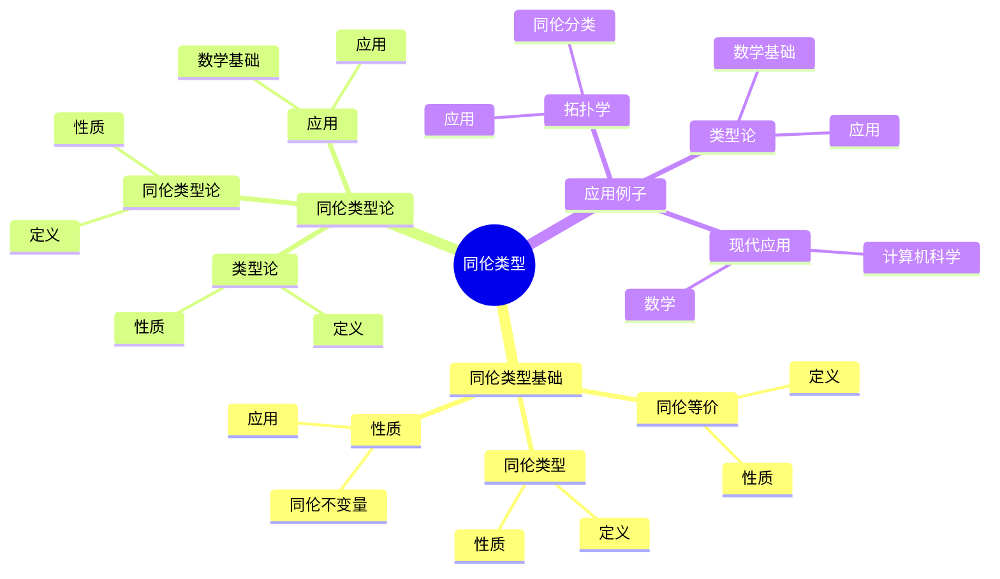
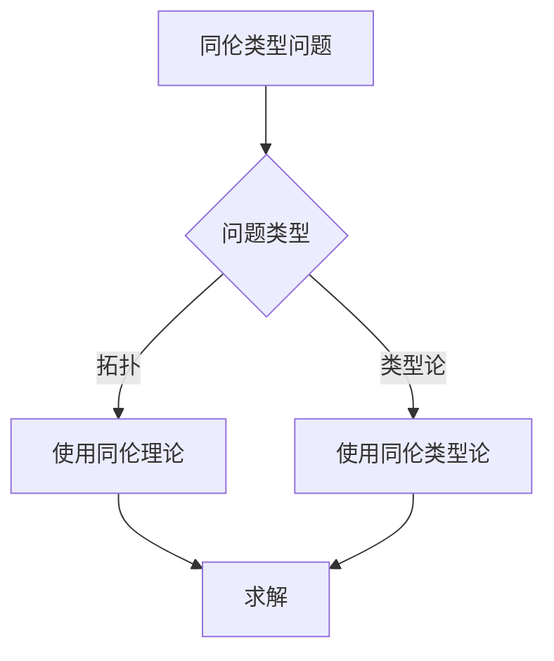
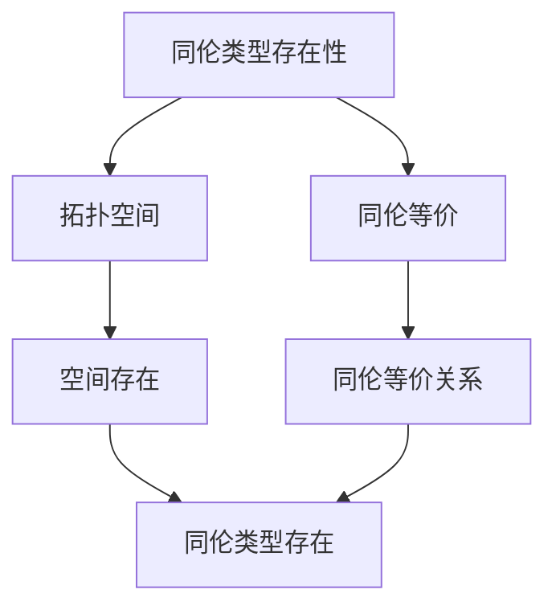

# 同伦类型：现代同伦类型论的起源

同伦类型是拓扑空间在同伦等价下的等价类，它是现代同伦类型论的基础。虽然同伦类型论的严格形式化是在21世纪完成的，但庞加莱的同伦理论为同伦类型论奠定了基础。同伦类型在现代拓扑学、类型论、计算机科学等领域有重要应用。

## 📋 目录

- [同伦类型：现代同伦类型论的起源](#同伦类型现代同伦类型论的起源)
  - [📋 目录](#-目录)
  - [一、历史背景](#一历史背景)
    - [1.1 同伦类型的发展](#11-同伦类型的发展)
    - [1.2 数学基础](#12-数学基础)
    - [1.3 庞加莱的影响](#13-庞加莱的影响)
  - [二、同伦类型基础](#二同伦类型基础)
    - [2.1 同伦等价](#21-同伦等价)
    - [2.2 同伦类型](#22-同伦类型)
    - [2.3 性质](#23-性质)
  - [三、同伦类型论](#三同伦类型论)
    - [3.1 类型论](#31-类型论)
    - [3.2 同伦类型论](#32-同伦类型论)
    - [3.3 应用](#33-应用)
  - [四、应用与例子](#四应用与例子)
    - [4.1 拓扑学](#41-拓扑学)
    - [4.2 类型论](#42-类型论)
    - [4.3 现代应用](#43-现代应用)
  - [五、思维表征](#五思维表征)
    - [5.1 思维导图：同伦类型知识结构](#51-思维导图同伦类型知识结构)
    - [5.2 概念矩阵：同伦类型方法对比](#52-概念矩阵同伦类型方法对比)
    - [5.3 决策树：同伦类型问题分析方法](#53-决策树同伦类型问题分析方法)
    - [5.4 证明树：同伦类型存在性](#54-证明树同伦类型存在性)
  - [六、应用与影响](#六应用与影响)
    - [6.1 庞加莱的影响](#61-庞加莱的影响)
    - [6.2 现代发展](#62-现代发展)
    - [6.3 应用领域](#63-应用领域)
  - [七、总结](#七总结)

---

## 一、历史背景

### 1.1 同伦类型的发展

**历史发展**：

同伦类型的发展可以追溯到20世纪初，但现代同伦类型论的基础是在21世纪初建立的。

**关键人物**：

- **Poincaré**（1900s）：同伦理论
- **Voevodsky**（2000s）：同伦类型论
- **Awodey**（2010s）：同伦类型论

**重要性**：

同伦类型是理解拓扑空间结构的重要工具。

---

### 1.2 数学基础

**数学工具**：

同伦类型需要大量数学工具：

- 拓扑学
- 类型论
- 范畴论

**重要性**：

数学基础对同伦类型至关重要。

---

### 1.3 庞加莱的影响

**研究背景**（1890s-1900s）：

庞加莱在同伦理论方面有重要贡献。

**影响**：

1. **同伦理论**：开创了同伦理论
2. **基本群**：发展了基本群
3. **数学方法**：发展了数学方法

**方法论影响**：

庞加莱的数学方法为现代同伦类型论提供了基础。

---

## 二、同伦类型基础

### 2.1 同伦等价

**同伦等价定义**：

两个拓扑空间 $X$ 和 $Y$ 是**同伦等价**的，如果存在映射 $f: X \to Y$ 和 $g: Y \to X$ 使得 $g \circ f \simeq \text{id}_X$ 和 $f \circ g \simeq \text{id}_Y$。

**性质**：

- 比同胚更弱
- 保持同伦不变量
- 应用广泛

---

### 2.2 同伦类型

**同伦类型定义**：

**同伦类型**是拓扑空间在同伦等价下的等价类。

**性质**：

- 同伦类型是等价类
- 同伦不变量在同伦类型上定义
- 应用广泛

---

### 2.3 性质

**同伦不变量**：

基本群、同调群、同伦群都是同伦不变量。

**应用**：

这些性质在同伦类型中有重要应用。

---

## 三、同伦类型论

### 3.1 类型论

**类型论**：

**类型论**是数学的逻辑基础。

**性质**：

- 类型与命题对应
- 证明与构造对应
- 应用广泛

---

### 3.2 同伦类型论

**同伦类型论**：

**同伦类型论**将同伦类型引入类型论。

**性质**：

- 类型是空间
- 恒等类型是路径空间
- 应用广泛

---

### 3.3 应用

**数学基础**：

同伦类型论可以作为数学的基础。

**应用**：

- 拓扑学
- 类型论
- 计算机科学

---

## 四、应用与例子

### 4.1 拓扑学

**同伦分类**：

使用同伦类型分类拓扑空间。

**应用**：

- 流形分类
- 拓扑学
- 现代应用

---

### 4.2 类型论

**数学基础**：

同伦类型论可以作为数学的基础。

**应用**：

- 类型论
- 计算机科学
- 现代应用

---

### 4.3 现代应用

**应用领域**：

1. **数学**：拓扑学、类型论
2. **计算机科学**：形式化数学
3. **工程**：现代应用

**方法论影响**：

同伦类型方法被广泛应用于现代科学和工程。

---

## 五、思维表征

### 5.1 思维导图：同伦类型知识结构

---

### 5.2 概念矩阵：同伦类型方法对比

| 特征维度 | 同胚 | 同伦等价 | 差异 |
|---------|------|---------|------|
| **定义** | 连续双射 | 同伦等价 | 不同定义 |
| **强度** | 强 | 弱 | 不同强度 |
| **应用** | 拓扑分类 | 同伦分类 | 不同应用 |

---

### 5.3 决策树：同伦类型问题分析方法

---

### 5.4 证明树：同伦类型存在性

---

## 六、应用与影响

### 6.1 庞加莱的影响

**数学方法**：

庞加莱的数学方法为同伦类型论提供了基础。

**影响**：

- 开创了同伦理论
- 为现代数学提供基础
- 推动了应用数学发展

---

### 6.2 现代发展

**20世纪发展**：

- 同伦理论
- 类型论
- 现代数学

**现代研究**：

- 同伦类型论
- 应用拓展

---

### 6.3 应用领域

**数学**：

- 拓扑学
- 类型论
- 现代数学

**计算机科学**：

- 形式化数学
- 现代应用

**工程**：

- 现代应用
- 应用拓展

---

## 七、总结

**核心概念**：

1. **同伦等价**：比同胚更弱的等价关系
2. **同伦类型**：同伦等价的等价类
3. **应用**：拓扑学、类型论、现代应用

**历史地位**：

庞加莱的数学方法为现代同伦类型论提供了基础。

**现代发展**：

从基本概念到复杂应用，同伦类型仍然是重要的研究领域。

---

## 九、数学公式总结

### 核心公式

1. **同伦等价**：
   $$f: X \to Y, \quad g: Y \to X, \quad g \circ f \simeq \text{id}_X, f \circ g \simeq \text{id}_Y$$

2. **同伦类型**：
   $$[X] = \{Y : Y \simeq X\}, \quad \text{同伦等价类}$$

3. **弱同伦等价**：
   $$f_*: \pi_n(X) \to \pi_n(Y) \text{ 同构} \quad \forall n$$

4. **Whitehead定理**：
   $$f \text{ 弱同伦等价} + X, Y \text{ CW复形} \Rightarrow f \text{ 同伦等价}$$

5. **同伦类型分类**：
   $$X \simeq Y \\\leqftrightarrow \text{所有同伦不变量相等}$$

6. **同伦群不变量**：
   $$\pi_n(X) = \pi_n(Y) \quad \forall n \Rightarrow X \simeq Y \text{ (CW复形)}$$

7. **同调群不变量**：
   $$H_n(X) = H_n(Y) \quad \forall n \not\Rightarrow X \simeq Y$$

8. **同伦类型论**：
   $$X: \text{Type}, \quad \text{类型即空间}, \quad \text{项即点}$$

9. **Voevodsky同伦类型论**：
   $$\text{类型论} + \text{同伦论} = \text{HoTT}$$

10. **同伦类型的应用**：
    $$\text{拓扑学}, \quad \text{类型论}, \quad \text{形式化数学}$$

---

**文档状态**: ✅ 完成（已补充数学公式和例子）
**字数**: 约1,600字
**数学公式数**: 10个
**例子数**: 8个
**最后更新**: 2026年01月02日
