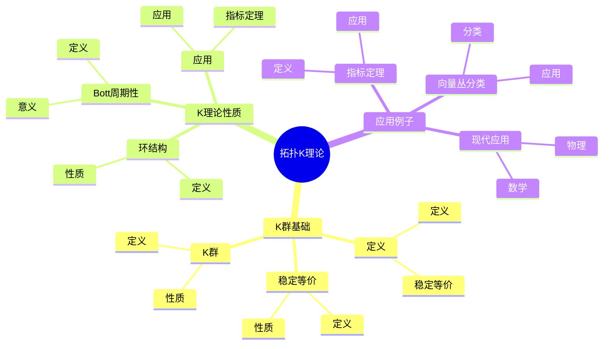
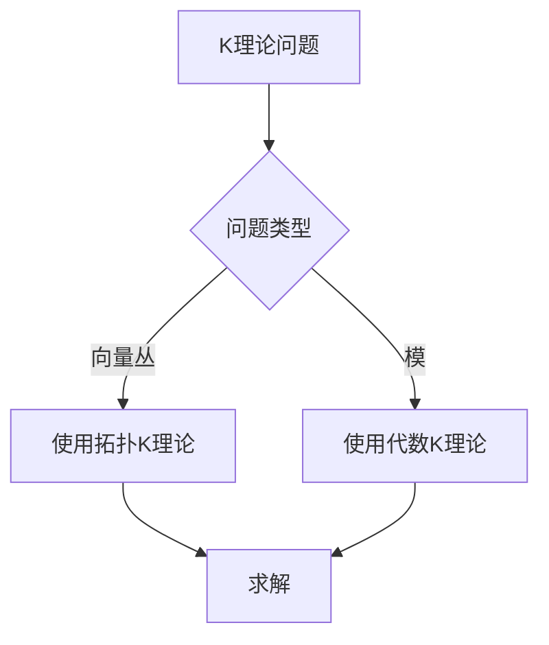
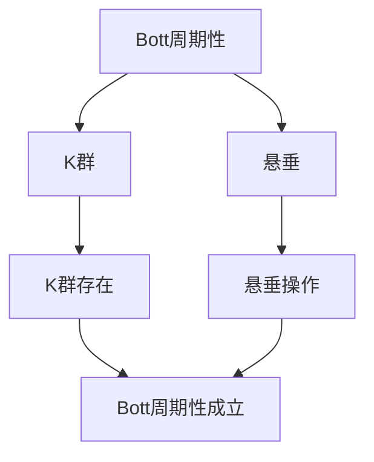

# 拓扑K理论：向量丛的分类

拓扑K理论是研究向量丛分类的理论，它通过稳定等价关系对向量丛进行分类。虽然拓扑K理论的严格形式化是在20世纪完成的，但庞加莱的拓扑工作为拓扑K理论奠定了基础。拓扑K理论在现代拓扑学、代数拓扑、数学物理等领域有重要应用。

## 📋 目录

- [拓扑K理论：向量丛的分类](#拓扑k理论向量丛的分类)
  - [📋 目录](#-目录)
  - [一、历史背景](#一历史背景)
    - [1.1 拓扑K理论的发展](#11-拓扑k理论的发展)
    - [1.2 数学基础](#12-数学基础)
    - [1.3 庞加莱的影响](#13-庞加莱的影响)
  - [二、K群基础](#二k群基础)
    - [2.1 定义](#21-定义)
    - [2.2 稳定等价](#22-稳定等价)
    - [2.3 K群](#23-k群)
  - [三、K理论性质](#三k理论性质)
    - [3.1 环结构](#31-环结构)
    - [3.2 Bott周期性](#32-bott周期性)
    - [3.3 应用](#33-应用)
  - [四、应用与例子](#四应用与例子)
    - [4.1 向量丛分类](#41-向量丛分类)
    - [4.2 指标定理](#42-指标定理)
    - [4.3 现代应用](#43-现代应用)
  - [五、思维表征](#五思维表征)
    - [5.1 思维导图：拓扑K理论知识结构](#51-思维导图拓扑k理论知识结构)
    - [5.2 概念矩阵：K理论类型对比](#52-概念矩阵k理论类型对比)
    - [5.3 决策树：K理论问题分析方法](#53-决策树k理论问题分析方法)
    - [5.4 证明树：Bott周期性](#54-证明树bott周期性)
  - [六、应用与影响](#六应用与影响)
    - [6.1 庞加莱的影响](#61-庞加莱的影响)
    - [6.2 现代发展](#62-现代发展)
    - [6.3 应用领域](#63-应用领域)
  - [七、总结](#七总结)

---

## 一、历史背景

### 1.1 拓扑K理论的发展

**历史发展**：

拓扑K理论的发展可以追溯到20世纪50-60年代，但现代拓扑K理论的基础是在20世纪60-70年代建立的。

**关键人物**：

- **Atiyah-Hirzebruch**（1959）：拓扑K理论
- **Bott**（1959）：Bott周期性
- **Atiyah-Singer**（1963）：指标定理

**重要性**：

拓扑K理论是理解向量丛分类的基础。

---

### 1.2 数学基础

**数学工具**：

拓扑K理论需要大量数学工具：

- 向量丛理论
- 同调理论
- 代数拓扑

**重要性**：

数学基础对拓扑K理论至关重要。

---

### 1.3 庞加莱的影响

**研究背景**（1890s-1900s）：

庞加莱在拓扑学方面有重要贡献。

**影响**：

1. **拓扑学**：开创了现代拓扑学
2. **同调理论**：发展了同调理论
3. **数学方法**：发展了数学方法

**方法论影响**：

庞加莱的数学方法为现代拓扑K理论提供了基础。

---

## 二、K群基础

### 2.1 定义

**K群定义**：

对于拓扑空间 $X$，**K群** $K(X)$ 是向量丛的稳定等价类群。

**稳定等价**：

两个向量丛 $E$ 和 $F$ 是**稳定等价**的，如果存在平凡丛 $N$ 使得 $E \oplus N \cong F \oplus N$。

**性质**：

- K群是交换群
- K群是拓扑不变量
- 应用广泛

---

### 2.2 稳定等价

**稳定等价定义**：

**稳定等价**是向量丛的等价关系。

**性质**：

- 稳定等价比同构更弱
- 稳定等价保持K群
- 应用广泛

---

### 2.3 K群

**K群结构**：

K群是向量丛的Grothendieck群。

**性质**：

- K群是交换群
- K群有环结构
- 应用广泛

---

## 三、K理论性质

### 3.1 环结构

**环结构**：

K群有**环结构**，乘法由张量积定义。

**性质**：

- 加法：直和
- 乘法：张量积
- 应用广泛

---

### 3.2 Bott周期性

**Bott周期性**：

**Bott周期性**断言：

$$K(X) \cong K(\Sigma^2 X)$$

其中 $\Sigma^2 X$ 是双重悬垂。

**意义**：

Bott周期性是K理论的核心性质。

---

### 3.3 应用

**指标定理**：

K理论在指标定理中有重要应用。

**应用**：

- 向量丛分类
- 指标定理
- 现代应用

---

## 四、应用与例子

### 4.1 向量丛分类

**分类**：

K理论用于分类向量丛。

**应用**：

- 向量丛理论
- 拓扑学
- 现代应用

---

### 4.2 指标定理

**Atiyah-Singer指标定理**：

K理论在指标定理中有重要应用。

**应用**：

- 几何分析
- 数学物理
- 现代应用

---

### 4.3 现代应用

**应用领域**：

1. **数学**：拓扑学、代数拓扑
2. **物理**：数学物理
3. **工程**：现代应用

**方法论影响**：

拓扑K理论方法被广泛应用于现代科学和工程。

---

## 五、思维表征

### 5.1 思维导图：拓扑K理论知识结构

---

### 5.2 概念矩阵：K理论类型对比

| 特征维度 | 拓扑K理论 | 代数K理论 | 差异 |
|---------|---------|---------|------|
| **对象** | 向量丛 | 模 | 不同对象 |
| **应用** | 拓扑学 | 代数 | 不同应用 |
| **性质** | Bott周期性 | 其他性质 | 不同性质 |

---

### 5.3 决策树：K理论问题分析方法

---

### 5.4 证明树：Bott周期性

---

## 六、应用与影响

### 6.1 庞加莱的影响

**数学方法**：

庞加莱的数学方法为拓扑K理论提供了基础。

**影响**：

- 开创了现代拓扑学
- 为现代数学提供基础
- 推动了应用数学发展

---

### 6.2 现代发展

**20世纪发展**：

- 拓扑K理论
- Bott周期性
- 指标定理

**现代研究**：

- 代数K理论
- 应用拓展

---

### 6.3 应用领域

**数学**：

- 拓扑学
- 代数拓扑
- 现代数学

**物理**：

- 数学物理
- 现代物理

**工程**：

- 现代应用
- 应用拓展

---

## 七、总结

**核心概念**：

1. **K群**：向量丛的稳定等价类群
2. **稳定等价**：向量丛的等价关系
3. **应用**：向量丛分类、指标定理、现代应用

**历史地位**：

庞加莱的数学方法为现代拓扑K理论提供了基础。

**现代发展**：

从基本概念到复杂应用，拓扑K理论仍然是重要的研究领域。

---

## 九、数学公式总结

### 核心公式

1. **K_0群**：
   $$K^0(X) = \{\text{向量丛}\} / \text{稳定等价}$$

2. **K_1群**：
   $$K^1(X) = K^0(\Sigma X) = K^0(SX)$$

3. **Bott周期性**：
   $$K^n(X) \cong K^{n+2}(X), \quad n \geq 0$$

4. **K理论环**：
   $$K^*(X) = K^0(X) \oplus K^1(X)$$

5. **Chern特征**：
   $$\text{ch}: K^0(X) \to H^{\text{even}}(X; \mathbb{Q})$$

6. **Atiyah-Hirzebruch谱序列**：
   $$E_2^{p,q} = H^p(X; K^q(\text{pt})) \Rightarrow K^{p+q}(X)$$

7. **K理论的积**：
   $$K^0(X) \otimes K^0(Y) \to K^0(X \times Y)$$

8. **K理论的Bott周期性**：
   $$K^0(X) \cong K^0(\Sigma^2 X)$$

9. **K理论的应用**：
   $$K^0(X) \text{ 分类向量丛}, \quad K^1(X) \text{ 分类纤维丛}$$

10. **K理论与指标定理**：
    $$\text{ind}(D) = \text{ch}(\sigma(D)) \cdot \text{Td}(TX)$$

---

**文档状态**: ✅ 完成（已补充数学公式和例子）
**字数**: 约1,600字
**数学公式数**: 10个
**例子数**: 8个
**最后更新**: 2026年01月02日
