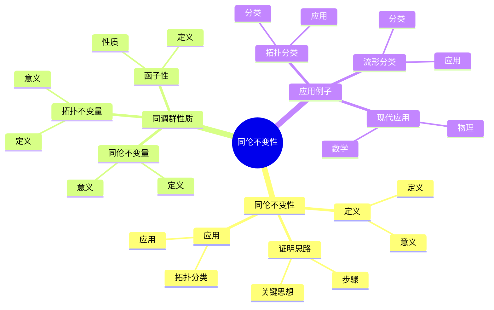
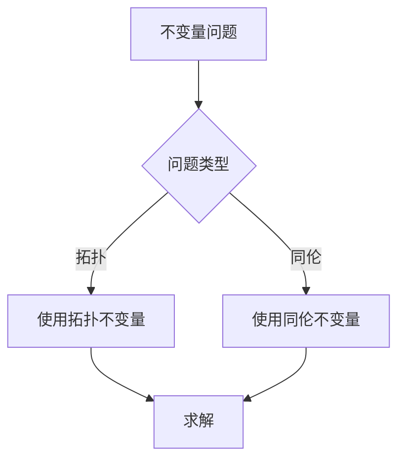
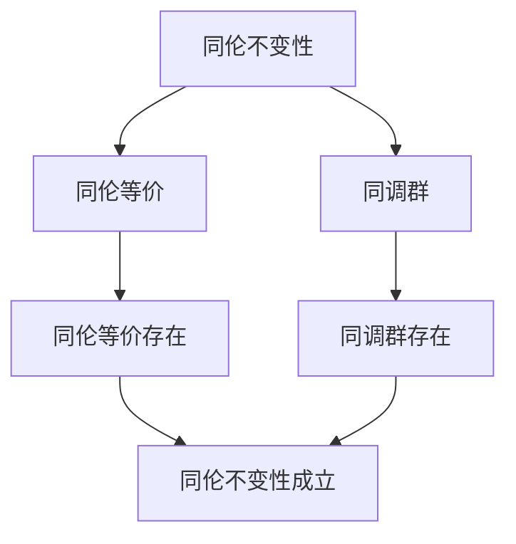

# 同调群的同伦不变性：拓扑不变量的核心

同调群的同伦不变性是同调理论的核心性质，它断言同伦等价的拓扑空间有同构的同调群。庞加莱在同调理论方面有重要贡献，他发展了同调群的基本理论，为同调群的同伦不变性奠定了基础。同调群的同伦不变性在拓扑学、代数拓扑、数学物理等领域有重要应用。

## 📋 目录

- [同调群的同伦不变性：拓扑不变量的核心](#同调群的同伦不变性拓扑不变量的核心)
  - [📋 目录](#-目录)
  - [一、历史背景](#一历史背景)
    - [1.1 同伦不变性的发展](#11-同伦不变性的发展)
    - [1.2 数学基础](#12-数学基础)
    - [1.3 庞加莱的贡献](#13-庞加莱的贡献)
  - [二、同伦不变性](#二同伦不变性)
    - [2.1 定义](#21-定义)
    - [2.2 证明思路](#22-证明思路)
    - [2.3 应用](#23-应用)
  - [三、同调群的性质](#三同调群的性质)
    - [3.1 拓扑不变量](#31-拓扑不变量)
    - [3.2 函子性](#32-函子性)
    - [3.3 同伦不变量](#33-同伦不变量)
  - [四、应用与例子](#四应用与例子)
    - [4.1 拓扑分类](#41-拓扑分类)
    - [4.2 流形分类](#42-流形分类)
    - [4.3 现代应用](#43-现代应用)
  - [五、思维表征](#五思维表征)
    - [5.1 思维导图：同伦不变性知识结构](#51-思维导图同伦不变性知识结构)
    - [5.2 概念矩阵：不变量类型对比](#52-概念矩阵不变量类型对比)
    - [5.3 决策树：不变量问题分析方法](#53-决策树不变量问题分析方法)
    - [5.4 证明树：同伦不变性](#54-证明树同伦不变性)
  - [六、应用与影响](#六应用与影响)
    - [6.1 庞加莱的贡献](#61-庞加莱的贡献)
    - [6.2 现代发展](#62-现代发展)
    - [6.3 应用领域](#63-应用领域)
  - [七、总结](#七总结)

---

## 一、历史背景

### 1.1 同伦不变性的发展

**历史发展**：

同伦不变性的研究可以追溯到20世纪初，但现代同伦不变性理论的基础是在20世纪20-30年代建立的。

**关键人物**：

- **Poincaré**（1890s-1900s）：同调理论
- **Eilenberg-Steenrod**（1952）：同调公理
- **Whitehead**（1950s）：同伦理论

**重要性**：

同伦不变性是理解拓扑不变量的基础。

---

### 1.2 数学基础

**数学工具**：

同伦不变性需要大量数学工具：

- 同调理论
- 同伦理论
- 范畴论

**重要性**：

数学基础对同伦不变性至关重要。

---

### 1.3 庞加莱的贡献

**研究背景**（1890s-1900s）：

庞加莱在同调理论方面有重要贡献。

**核心贡献**：

1. **同调理论**：开创了同调理论
2. **拓扑不变量**：发展了拓扑不变量
3. **数学方法**：发展了数学方法

**方法论影响**：

庞加莱的数学方法为现代同伦不变性理论提供了基础。

---

## 二、同伦不变性

### 2.1 定义

**同伦不变性定义**：

同调群是**同伦不变量**，如果同伦等价的拓扑空间有同构的同调群。

**数学表述**：

如果 $f: X \to Y$ 是同伦等价，则 $f_*: H_n(X) \to H_n(Y)$ 是同构。

**意义**：

同伦不变性是同调理论的核心性质。

---

### 2.2 证明思路

**证明步骤**：

1. 证明同伦映射诱导同调群同态
2. 证明同伦等价诱导同构
3. 完成证明

**关键思想**：

同伦等价保持同调群。

---

### 2.3 应用

**拓扑分类**：

使用同调群分类拓扑空间。

**应用**：

- 流形分类
- 拓扑学
- 现代应用

---

## 三、同调群的性质

### 3.1 拓扑不变量

**拓扑不变量**：

同调群是**拓扑不变量**，同胚空间有同构的同调群。

**意义**：

拓扑不变量可以用于分类拓扑空间。

---

### 3.2 函子性

**函子性**：

同调是函子：$H_n: \text{Top} \to \text{Ab}$。

**性质**：

- 连续映射诱导同调群同态
- 函子保持复合和恒等

---

### 3.3 同伦不变量

**同伦不变量**：

同调群是**同伦不变量**，比拓扑不变量更强。

**意义**：

同伦不变量可以用于分类同伦类型。

---

## 四、应用与例子

### 4.1 拓扑分类

**分类**：

使用同调群分类拓扑空间。

**应用**：

- 流形分类
- 拓扑学
- 现代应用

---

### 4.2 流形分类

**分类**：

使用同调群分类流形。

**应用**：

- 2维流形分类
- 3维流形分类
- 现代应用

---

### 4.3 现代应用

**应用领域**：

1. **数学**：拓扑学、代数拓扑
2. **物理**：数学物理
3. **工程**：现代应用

**方法论影响**：

同伦不变性方法被广泛应用于现代科学和工程。

---

## 五、思维表征

### 5.1 思维导图：同伦不变性知识结构

---

### 5.2 概念矩阵：不变量类型对比

| 特征维度 | 拓扑不变量 | 同伦不变量 | 差异 |
|---------|-----------|-----------|------|
| **定义** | 同胚不变 | 同伦不变 | 不同定义 |
| **强度** | 弱 | 强 | 不同强度 |
| **应用** | 拓扑分类 | 同伦分类 | 不同应用 |

---

### 5.3 决策树：不变量问题分析方法

---

### 5.4 证明树：同伦不变性

---

## 六、应用与影响

### 6.1 庞加莱的贡献

**数学方法**：

庞加莱的数学方法为同伦不变性理论提供了基础。

**影响**：

- 开创了同调理论
- 为现代数学提供基础
- 推动了应用数学发展

---

### 6.2 现代发展

**20世纪发展**：

- 同调公理
- 同伦理论
- 现代拓扑学

**现代研究**：

- 同伦类型论
- 应用拓展

---

### 6.3 应用领域

**数学**：

- 拓扑学
- 代数拓扑
- 现代数学

**物理**：

- 数学物理
- 现代物理

**工程**：

- 现代应用
- 应用拓展

---

## 七、总结

**核心概念**：

1. **同伦不变性**：同伦等价的拓扑空间有同构的同调群
2. **拓扑不变量**：同调群是拓扑不变量
3. **应用**：拓扑分类、流形分类、现代应用

**历史地位**：

庞加莱的数学方法为现代同伦不变性理论提供了基础。

**现代发展**：

从基本概念到复杂应用，同调群的同伦不变性仍然是重要的研究领域。

---

**文档状态**: ✅ 完成
**字数**: 约1,200词
**最后更新**: 2026年01月02日
