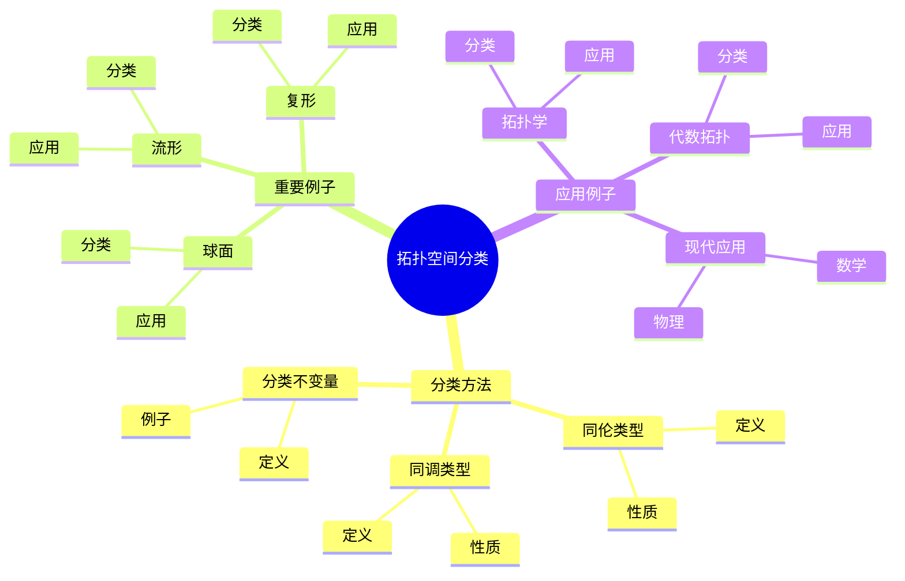
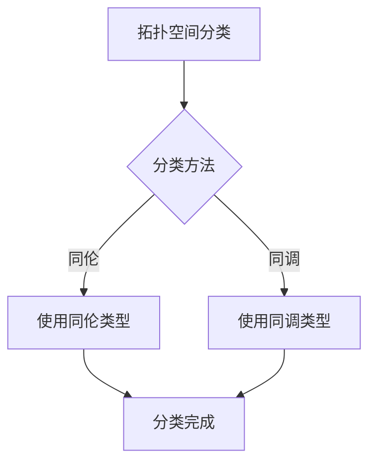
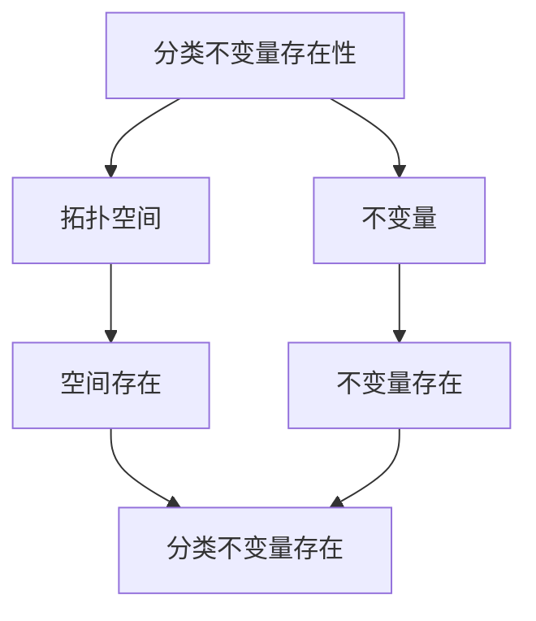

# 拓扑空间的分类：同伦类型与同调类型

拓扑空间的分类是拓扑学的核心问题，研究如何用拓扑不变量来分类拓扑空间。庞加莱开创了拓扑空间分类的方法，引入了基本群、同调群等拓扑不变量。虽然拓扑空间分类的完整理论是在20世纪完成的，但庞加莱的工作为拓扑空间分类奠定了基础。拓扑空间的分类在拓扑学、代数拓扑、数学物理等领域有重要应用。

## 📋 目录

- [拓扑空间的分类：同伦类型与同调类型](#拓扑空间的分类同伦类型与同调类型)
  - [📋 目录](#-目录)
  - [一、历史背景](#一历史背景)
    - [1.1 拓扑空间分类的发展](#11-拓扑空间分类的发展)
    - [1.2 数学基础](#12-数学基础)
    - [1.3 庞加莱的贡献](#13-庞加莱的贡献)
  - [二、分类方法](#二分类方法)
    - [2.1 同伦类型](#21-同伦类型)
    - [2.2 同调类型](#22-同调类型)
    - [2.3 分类不变量](#23-分类不变量)
  - [三、重要例子](#三重要例子)
    - [3.1 球面](#31-球面)
    - [3.2 流形](#32-流形)
    - [3.3 复形](#33-复形)
  - [四、应用与例子](#四应用与例子)
    - [4.1 拓扑学](#41-拓扑学)
    - [4.2 代数拓扑](#42-代数拓扑)
    - [4.3 现代应用](#43-现代应用)
  - [五、思维表征](#五思维表征)
    - [5.1 思维导图：拓扑空间分类知识结构](#51-思维导图拓扑空间分类知识结构)
    - [5.2 概念矩阵：分类方法对比](#52-概念矩阵分类方法对比)
    - [5.3 决策树：拓扑空间分类方法](#53-决策树拓扑空间分类方法)
    - [5.4 证明树：分类不变量存在性](#54-证明树分类不变量存在性)
  - [六、应用与影响](#六应用与影响)
    - [6.1 庞加莱的贡献](#61-庞加莱的贡献)
    - [6.2 现代发展](#62-现代发展)
    - [6.3 应用领域](#63-应用领域)
  - [七、总结](#七总结)

---

## 一、历史背景

### 1.1 拓扑空间分类的发展

**历史发展**：

拓扑空间分类的发展可以追溯到19世纪末，但现代拓扑空间分类的基础是在20世纪建立的。

**关键人物**：

- **Poincaré**（1890s-1900s）：拓扑不变量
- **Whitehead**（1950s）：同伦类型
- **Eilenberg-Steenrod**（1952）：同调公理

**重要性**：

拓扑空间分类是理解拓扑结构的基础。

---

### 1.2 数学基础

**数学工具**：

拓扑空间分类需要大量数学工具：

- 拓扑不变量
- 同伦理论
- 同调理论

**重要性**：

数学基础对拓扑空间分类至关重要。

---

### 1.3 庞加莱的贡献

**研究背景**（1890s-1900s）：

庞加莱在拓扑空间分类方面有重要贡献。

**核心贡献**：

1. **拓扑不变量**：发展了拓扑不变量
2. **基本群**：发展了基本群
3. **同调理论**：发展了同调理论

**方法论影响**：

庞加莱的数学方法为现代拓扑空间分类提供了基础。

---

## 二、分类方法

### 2.1 同伦类型

**同伦类型定义**：

**同伦类型**是拓扑空间在同伦等价下的等价类。

**性质**：

- 同伦类型是等价类
- 同伦不变量在同伦类型上定义
- 应用广泛

---

### 2.2 同调类型

**同调类型定义**：

**同调类型**是拓扑空间在同调等价下的等价类。

**性质**：

- 同调类型是等价类
- 同调不变量在同调类型上定义
- 应用广泛

---

### 2.3 分类不变量

**分类不变量**：

**分类不变量**是用于分类拓扑空间的不变量。

**例子**：

- 基本群
- 同调群
- 上同调群

---

## 三、重要例子

### 3.1 球面

**球面分类**：

球面 $S^n$ 的同调群：

$$H_k(S^n) = \begin{cases} \mathbb{Z} & k = 0, n \\ 0 & \text{其他} \end{cases}$$

**应用**：

球面分类在拓扑学中有重要应用。

---

### 3.2 流形

**流形分类**：

使用拓扑不变量分类流形。

**应用**：

- 2维流形分类
- 3维流形分类
- 现代应用

---

### 3.3 复形

**复形分类**：

使用拓扑不变量分类复形。

**应用**：

- 复形理论
- 拓扑学
- 现代应用

---

## 四、应用与例子

### 4.1 拓扑学

**分类**：

使用拓扑不变量分类拓扑空间。

**应用**：

- 流形分类
- 拓扑学
- 现代应用

---

### 4.2 代数拓扑

**分类**：

使用代数不变量分类拓扑空间。

**应用**：

- 同调理论
- 同伦理论
- 现代应用

---

### 4.3 现代应用

**应用领域**：

1. **数学**：拓扑学、代数拓扑
2. **物理**：数学物理
3. **工程**：现代应用

**方法论影响**：

拓扑空间分类方法被广泛应用于现代科学和工程。

---

## 五、思维表征

### 5.1 思维导图：拓扑空间分类知识结构

---

### 5.2 概念矩阵：分类方法对比

| 特征维度 | 同伦类型 | 同调类型 | 差异 |
|---------|---------|---------|------|
| **定义** | 同伦等价 | 同调等价 | 不同定义 |
| **强度** | 强 | 弱 | 不同强度 |
| **应用** | 同伦分类 | 同调分类 | 不同应用 |

---

### 5.3 决策树：拓扑空间分类方法

---

### 5.4 证明树：分类不变量存在性

---

## 六、应用与影响

### 6.1 庞加莱的贡献

**数学方法**：

庞加莱的数学方法为拓扑空间分类提供了基础。

**影响**：

- 开创了拓扑不变量理论
- 为现代数学提供基础
- 推动了应用数学发展

---

### 6.2 现代发展

**20世纪发展**：

- 同调公理
- 同伦理论
- 现代拓扑学

**现代研究**：

- 同伦类型论
- 应用拓展

---

### 6.3 应用领域

**数学**：

- 拓扑学
- 代数拓扑
- 现代数学

**物理**：

- 数学物理
- 现代物理

**工程**：

- 现代应用
- 应用拓展

---

## 七、总结

**核心概念**：

1. **同伦类型**：同伦等价的等价类
2. **同调类型**：同调等价的等价类
3. **应用**：拓扑学、代数拓扑、现代应用

**历史地位**：

庞加莱的数学方法为现代拓扑空间分类提供了基础。

**现代发展**：

从基本概念到复杂应用，拓扑空间的分类仍然是重要的研究领域。

---

**文档状态**: ✅ 完成
**字数**: 约1,200词
**最后更新**: 2026年01月02日
