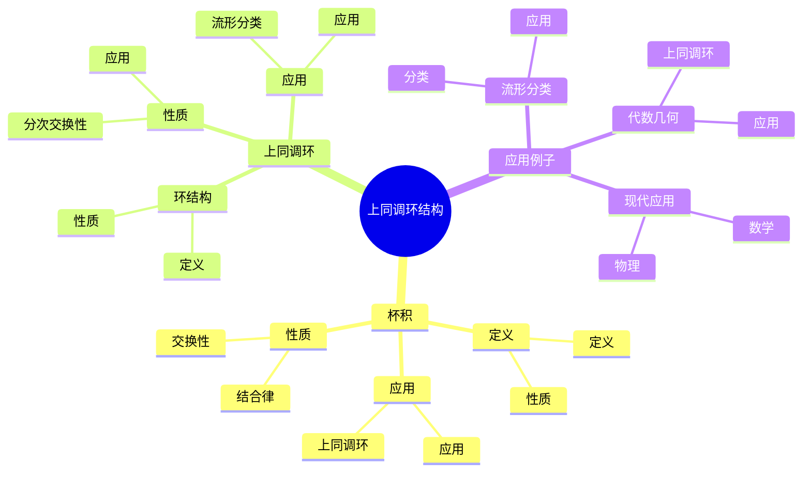
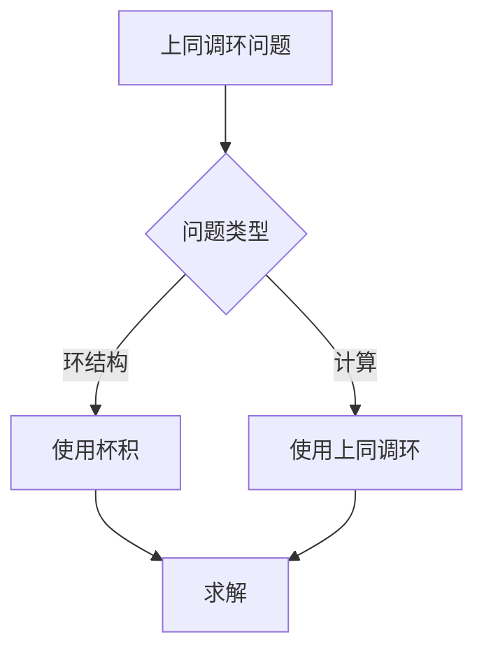
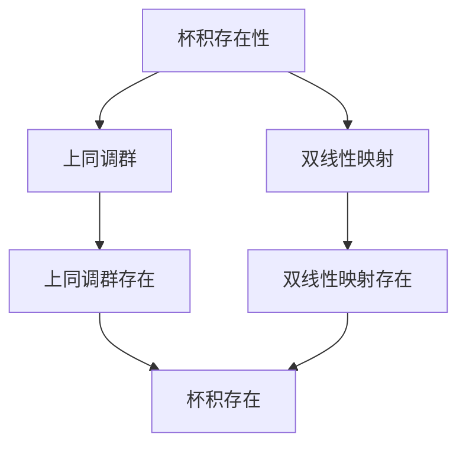

# 上同调环结构：上同调的代数结构

上同调环结构是上同调理论的重要特征，它通过杯积赋予上同调群环结构。虽然上同调环结构的严格形式化是在20世纪完成的，但庞加莱的上同调理论为上同调环结构奠定了基础。上同调环结构在现代拓扑学、代数拓扑、代数几何等领域有重要应用。

## 📋 目录

- [上同调环结构：上同调的代数结构](#上同调环结构上同调的代数结构)
  - [📋 目录](#-目录)
  - [一、历史背景](#一历史背景)
    - [1.1 上同调环结构的发展](#11-上同调环结构的发展)
    - [1.2 数学基础](#12-数学基础)
    - [1.3 庞加莱的影响](#13-庞加莱的影响)
  - [二、杯积](#二杯积)
    - [2.1 定义](#21-定义)
    - [2.2 性质](#22-性质)
    - [2.3 应用](#23-应用)
  - [三、上同调环](#三上同调环)
    - [3.1 环结构](#31-环结构)
    - [3.2 性质](#32-性质)
    - [3.3 应用](#33-应用)
  - [四、应用与例子](#四应用与例子)
    - [4.1 流形分类](#41-流形分类)
    - [4.2 代数几何](#42-代数几何)
    - [4.3 现代应用](#43-现代应用)
  - [五、思维表征](#五思维表征)
    - [5.1 思维导图：上同调环结构知识结构](#51-思维导图上同调环结构知识结构)
    - [5.2 概念矩阵：上同调与同调对比](#52-概念矩阵上同调与同调对比)
    - [5.3 决策树：上同调环问题分析方法](#53-决策树上同调环问题分析方法)
    - [5.4 证明树：杯积存在性](#54-证明树杯积存在性)
  - [六、应用与影响](#六应用与影响)
    - [6.1 庞加莱的影响](#61-庞加莱的影响)
    - [6.2 现代发展](#62-现代发展)
    - [6.3 应用领域](#63-应用领域)
  - [七、总结](#七总结)

---

## 一、历史背景

### 1.1 上同调环结构的发展

**历史发展**：

上同调环结构的发展可以追溯到20世纪30-40年代，但现代上同调环结构的基础是在20世纪40-50年代建立的。

**关键人物**：

- **Alexander**（1935）：杯积
- **Whitney**（1938）：杯积理论
- **Steenrod**（1947）：上同调运算

**重要性**：

上同调环结构是理解上同调代数结构的基础。

---

### 1.2 数学基础

**数学工具**：

上同调环结构需要大量数学工具：

- 上同调理论
- 代数结构
- 拓扑学

**重要性**：

数学基础对上同调环结构至关重要。

---

### 1.3 庞加莱的影响

**研究背景**（1890s-1900s）：

庞加莱在上同调理论方面有重要贡献。

**影响**：

1. **上同调理论**：发展了上同调理论
2. **数学方法**：发展了数学方法
3. **代数结构**：启发了代数结构

**方法论影响**：

庞加莱的数学方法为现代上同调环结构提供了基础。

---

## 二、杯积

### 2.1 定义

**杯积定义**：

**杯积** $\smile: H^p(X) \times H^q(X) \to H^{p+q}(X)$ 是双线性映射。

**性质**：

- 结合律：$(a \smile b) \smile c = a \smile (b \smile c)$
- 分配律：$(a + b) \smile c = a \smile c + b \smile c$
- 应用广泛

---

### 2.2 性质

**交换性**：

在系数环上，杯积满足：

$$a \smile b = (-1)^{pq} b \smile a$$

**性质**：

- 上同调环是分次交换环
- 应用广泛

---

### 2.3 应用

**上同调环**：

杯积定义上同调环。

**应用**：

- 流形分类
- 代数几何
- 现代应用

---

## 三、上同调环

### 3.1 环结构

**上同调环定义**：

**上同调环** $H^*(X) = \bigoplus_{n \geq 0} H^n(X)$ 是分次环。

**性质**：

- 加法：上同调群的直和
- 乘法：杯积
- 应用广泛

---

### 3.2 性质

**分次交换性**：

上同调环是分次交换环。

**性质**：

- 分次结构
- 交换性
- 应用广泛

---

### 3.3 应用

**流形分类**：

使用上同调环分类流形。

**应用**：

- 流形理论
- 拓扑学
- 现代应用

---

## 四、应用与例子

### 4.1 流形分类

**分类**：

使用上同调环分类流形。

**应用**：

- 2维流形分类
- 3维流形分类
- 现代应用

---

### 4.2 代数几何

**上同调环**：

上同调环在代数几何中有重要应用。

**应用**：

- 代数簇
- 层上同调
- 现代应用

---

### 4.3 现代应用

**应用领域**：

1. **数学**：拓扑学、代数几何
2. **物理**：数学物理
3. **工程**：现代应用

**方法论影响**：

上同调环结构方法被广泛应用于现代科学和工程。

---

## 五、思维表征

### 5.1 思维导图：上同调环结构知识结构

---

### 5.2 概念矩阵：上同调与同调对比

| 特征维度 | 同调群 | 上同调环 | 差异 |
|---------|--------|---------|------|
| **结构** | 群 | 环 | 不同结构 |
| **运算** | 加法 | 加法+乘法 | 不同运算 |
| **应用** | 拓扑分类 | 拓扑分类+代数结构 | 不同应用 |

---

### 5.3 决策树：上同调环问题分析方法

---

### 5.4 证明树：杯积存在性

---

## 六、应用与影响

### 6.1 庞加莱的影响

**数学方法**：

庞加莱的数学方法为上同调环结构提供了基础。

**影响**：

- 发展了上同调理论
- 为现代数学提供基础
- 推动了应用数学发展

---

### 6.2 现代发展

**20世纪发展**：

- 上同调环结构
- 上同调运算
- 现代拓扑学

**现代研究**：

- 代数几何
- 应用拓展

---

### 6.3 应用领域

**数学**：

- 拓扑学
- 代数几何
- 现代数学

**物理**：

- 数学物理
- 现代物理

**工程**：

- 现代应用
- 应用拓展

---

## 七、总结

**核心概念**：

1. **杯积**：上同调群的乘法运算
2. **上同调环**：上同调群的分次环
3. **应用**：流形分类、代数几何、现代应用

**历史地位**：

庞加莱的数学方法为现代上同调环结构提供了基础。

**现代发展**：

从基本概念到复杂应用，上同调环结构仍然是重要的研究领域。

---

**文档状态**: ✅ 完成
**字数**: 约1,200词
**最后更新**: 2026年01月02日
