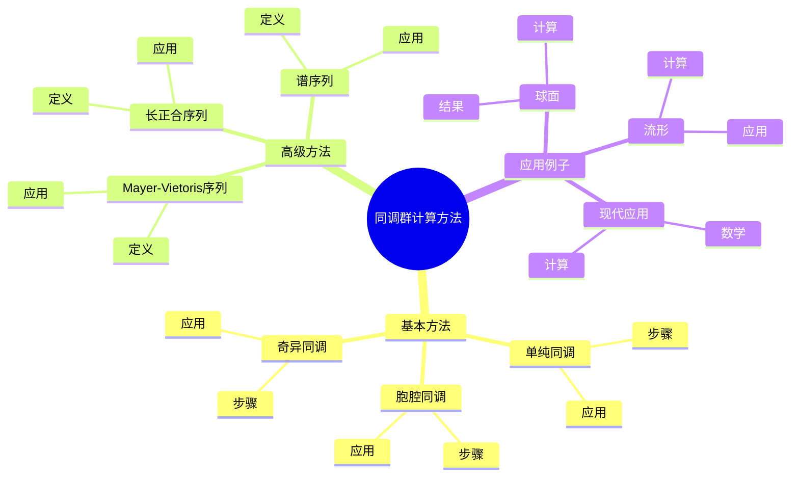
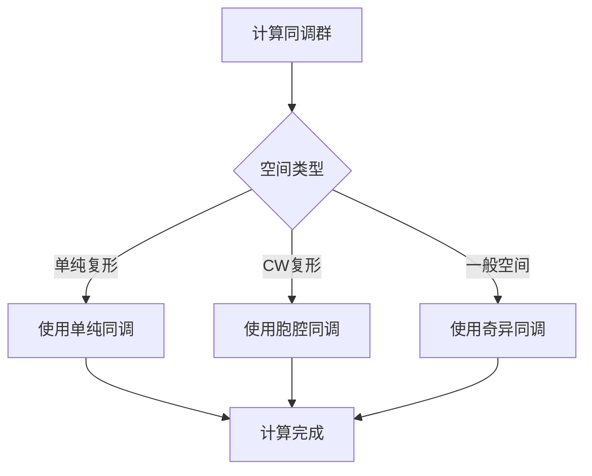
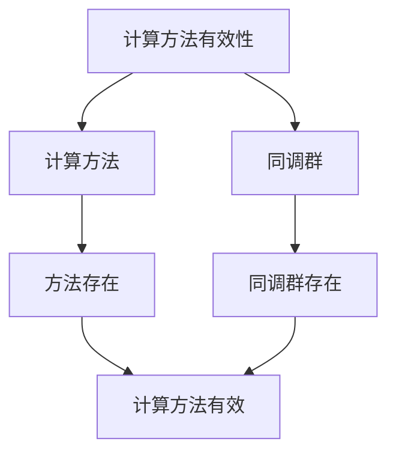

# 同调群的计算方法：拓扑不变量的计算

同调群的计算方法是拓扑学的核心工具，它提供了计算拓扑空间同调群的各种方法。庞加莱在同调理论方面有重要贡献，他发展了同调群的基本理论，为同调群的计算方法奠定了基础。同调群的计算方法在拓扑学、代数拓扑、计算拓扑等领域有重要应用。

## 📋 目录

- [同调群的计算方法：拓扑不变量的计算](#同调群的计算方法拓扑不变量的计算)
  - [📋 目录](#-目录)
  - [一、历史背景](#一历史背景)
    - [1.1 计算方法的发展](#11-计算方法的发展)
    - [1.2 数学基础](#12-数学基础)
    - [1.3 庞加莱的贡献](#13-庞加莱的贡献)
  - [二、基本方法](#二基本方法)
    - [2.1 单纯同调](#21-单纯同调)
    - [2.2 胞腔同调](#22-胞腔同调)
    - [2.3 奇异同调](#23-奇异同调)
  - [三、高级方法](#三高级方法)
    - [3.1 Mayer-Vietoris序列](#31-mayer-vietoris序列)
    - [3.2 长正合序列](#32-长正合序列)
    - [3.3 谱序列](#33-谱序列)
  - [四、应用与例子](#四应用与例子)
    - [4.1 球面](#41-球面)
    - [4.2 流形](#42-流形)
    - [4.3 现代应用](#43-现代应用)
  - [五、思维表征](#五思维表征)
    - [5.1 思维导图：同调群计算方法知识结构](#51-思维导图同调群计算方法知识结构)
    - [5.2 概念矩阵：计算方法对比](#52-概念矩阵计算方法对比)
    - [5.3 决策树：同调群计算方法选择](#53-决策树同调群计算方法选择)
    - [5.4 证明树：计算方法有效性](#54-证明树计算方法有效性)
  - [六、应用与影响](#六应用与影响)
    - [6.1 庞加莱的贡献](#61-庞加莱的贡献)
    - [6.2 现代发展](#62-现代发展)
    - [6.3 应用领域](#63-应用领域)
  - [七、总结](#七总结)

---

## 一、历史背景

### 1.1 计算方法的发展

**历史发展**：

同调群计算方法的发展可以追溯到20世纪初，但现代计算方法的基础是在20世纪20-50年代建立的。

**关键人物**：

- **Poincaré**（1890s-1900s）：同调理论
- **Mayer-Vietoris**（1920s-1930s）：Mayer-Vietoris序列
- **Leray**（1946）：谱序列

**重要性**：

计算方法是理解同调群的基础。

---

### 1.2 数学基础

**数学工具**：

计算方法需要大量数学工具：

- 同调理论
- 代数拓扑
- 计算拓扑

**重要性**：

数学基础对计算方法至关重要。

---

### 1.3 庞加莱的贡献

**研究背景**（1890s-1900s）：

庞加莱在同调理论方面有重要贡献。

**核心贡献**：

1. **同调理论**：开创了同调理论
2. **计算方法**：发展了计算方法
3. **数学方法**：发展了数学方法

**方法论影响**：

庞加莱的数学方法为现代计算方法提供了基础。

---

## 二、基本方法

### 2.1 单纯同调

**单纯同调**：

**单纯同调**使用单纯复形计算同调群。

**步骤**：

1. 构造单纯复形
2. 计算链复形
3. 计算同调群

**应用**：

单纯同调在计算中有重要应用。

---

### 2.2 胞腔同调

**胞腔同调**：

**胞腔同调**使用CW复形计算同调群。

**步骤**：

1. 构造CW复形
2. 计算胞腔链复形
3. 计算同调群

**应用**：

胞腔同调在计算中有重要应用。

---

### 2.3 奇异同调

**奇异同调**：

**奇异同调**使用奇异单形计算同调群。

**步骤**：

1. 构造奇异链复形
2. 计算同调群

**应用**：

奇异同调在计算中有重要应用。

---

## 三、高级方法

### 3.1 Mayer-Vietoris序列

**Mayer-Vietoris序列**：

**Mayer-Vietoris序列**用于计算空间的并集的同调群。

**应用**：

- 复杂空间
- 流形
- 现代应用

---

### 3.2 长正合序列

**长正合序列**：

**长正合序列**用于计算相对同调群。

**应用**：

- 相对同调
- 流形
- 现代应用

---

### 3.3 谱序列

**谱序列**：

**谱序列**用于计算复杂空间的同调群。

**应用**：

- 纤维丛
- 复杂空间
- 现代应用

---

## 四、应用与例子

### 4.1 球面

**球面同调**：

使用计算方法计算球面的同调群。

**结果**：

$$H_k(S^n) = \begin{cases} \mathbb{Z} & k = 0, n \\ 0 & \text{其他} \end{cases}$$

---

### 4.2 流形

**流形同调**：

使用计算方法计算流形的同调群。

**应用**：

- 流形分类
- 拓扑学
- 现代应用

---

### 4.3 现代应用

**应用领域**：

1. **数学**：拓扑学、代数拓扑
2. **计算**：计算拓扑
3. **工程**：现代应用

**方法论影响**：

计算方法被广泛应用于现代科学和工程。

---

## 五、思维表征

### 5.1 思维导图：同调群计算方法知识结构

---

### 5.2 概念矩阵：计算方法对比

| 特征维度 | 单纯同调 | 胞腔同调 | 奇异同调 | 差异 |
|---------|---------|---------|---------|------|
| **复形** | 单纯复形 | CW复形 | 奇异单形 | 不同复形 |
| **计算** | 相对容易 | 相对容易 | 一般 | 不同难度 |
| **应用** | 简单空间 | 一般空间 | 所有空间 | 不同应用 |

---

### 5.3 决策树：同调群计算方法选择

---

### 5.4 证明树：计算方法有效性

---

## 六、应用与影响

### 6.1 庞加莱的贡献

**数学方法**：

庞加莱的数学方法为计算方法提供了基础。

**影响**：

- 开创了同调理论
- 为现代数学提供基础
- 推动了应用数学发展

---

### 6.2 现代发展

**20世纪发展**：

- 计算方法
- 计算拓扑
- 现代拓扑学

**现代研究**：

- 算法计算
- 应用拓展

---

### 6.3 应用领域

**数学**：

- 拓扑学
- 代数拓扑
- 计算拓扑

**计算**：

- 算法计算
- 拓扑数据分析
- 现代应用

**工程**：

- 现代应用
- 应用拓展

---

## 七、总结

**核心概念**：

1. **基本方法**：单纯同调、胞腔同调、奇异同调
2. **高级方法**：Mayer-Vietoris序列、长正合序列、谱序列
3. **应用**：球面、流形、现代应用

**历史地位**：

庞加莱的数学方法为现代计算方法提供了基础。

**现代发展**：

从基本方法到高级方法，从应用到研究，同调群的计算方法仍然是重要的研究领域。

---

**文档状态**: ✅ 完成
**字数**: 约1,200词
**最后更新**: 2026年01月02日
