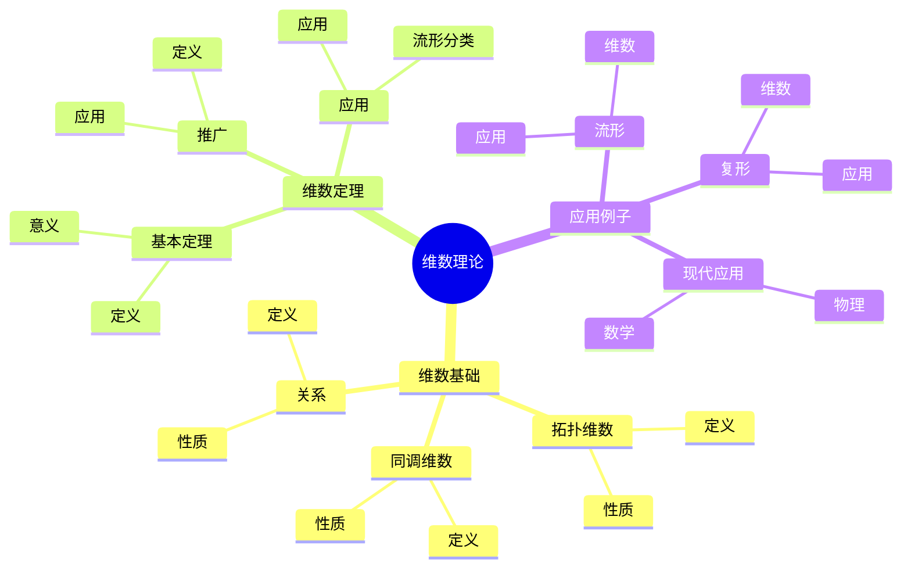
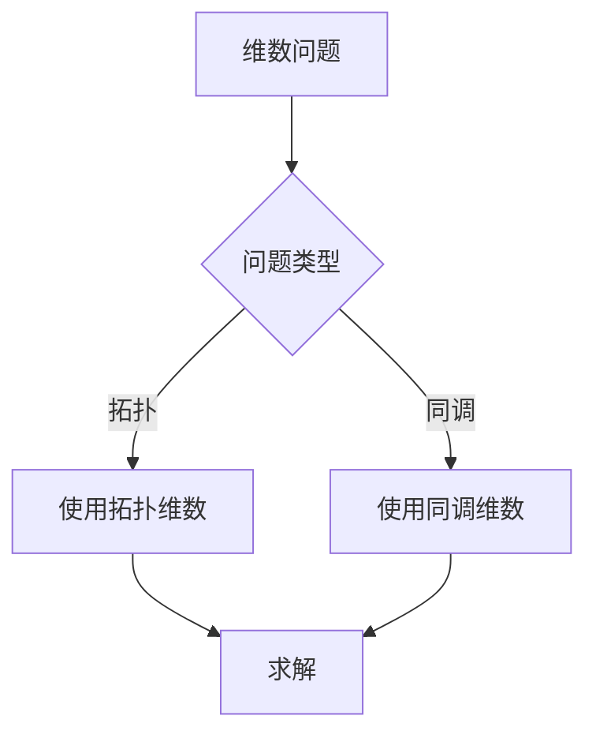
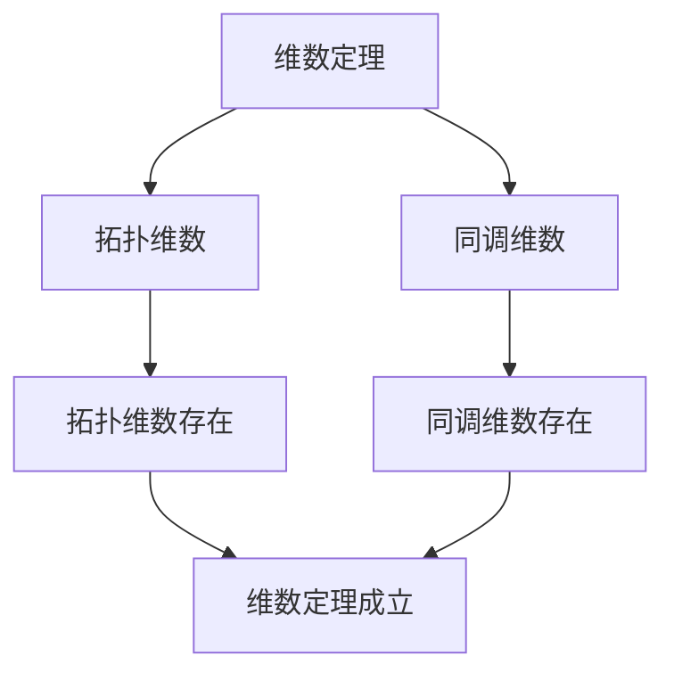

# 同调群的维数理论：拓扑不变量与维数

同调群的维数理论是研究同调群与拓扑空间维数关系的理论，它揭示了同调群如何反映空间的维数信息。庞加莱在同调理论方面有重要贡献，他发展了同调群的基本理论，为同调群的维数理论奠定了基础。同调群的维数理论在拓扑学、代数拓扑、几何拓扑等领域有重要应用。

## 📋 目录

- [同调群的维数理论：拓扑不变量与维数](#同调群的维数理论拓扑不变量与维数)
  - [📋 目录](#-目录)
  - [一、历史背景](#一历史背景)
    - [1.1 维数理论的发展](#11-维数理论的发展)
    - [1.2 数学基础](#12-数学基础)
    - [1.3 庞加莱的贡献](#13-庞加莱的贡献)
  - [二、维数基础](#二维数基础)
    - [2.1 拓扑维数](#21-拓扑维数)
    - [2.2 同调维数](#22-同调维数)
    - [2.3 关系](#23-关系)
  - [三、维数定理](#三维数定理)
    - [3.1 基本定理](#31-基本定理)
    - [3.2 应用](#32-应用)
    - [3.3 推广](#33-推广)
  - [四、应用与例子](#四应用与例子)
    - [4.1 流形](#41-流形)
    - [4.2 复形](#42-复形)
    - [4.3 现代应用](#43-现代应用)
  - [五、思维表征](#五思维表征)
    - [5.1 思维导图：维数理论知识结构](#51-思维导图维数理论知识结构)
    - [5.2 概念矩阵：维数类型对比](#52-概念矩阵维数类型对比)
    - [5.3 决策树：维数问题分析方法](#53-决策树维数问题分析方法)
    - [5.4 证明树：维数定理](#54-证明树维数定理)
  - [六、应用与影响](#六应用与影响)
    - [6.1 庞加莱的贡献](#61-庞加莱的贡献)
    - [6.2 现代发展](#62-现代发展)
    - [6.3 应用领域](#63-应用领域)
  - [七、总结](#七总结)

---

## 一、历史背景

### 1.1 维数理论的发展

**历史发展**：

维数理论的发展可以追溯到19世纪末，但现代维数理论的基础是在20世纪建立的。

**关键人物**：

- **Poincaré**（1890s-1900s）：同调理论
- **Lebesgue**（1911）：覆盖维数
- **Čech**（1930s）：同调维数

**重要性**：

维数理论是理解拓扑空间结构的基础。

---

### 1.2 数学基础

**数学工具**：

维数理论需要大量数学工具：

- 同调理论
- 拓扑学
- 几何学

**重要性**：

数学基础对维数理论至关重要。

---

### 1.3 庞加莱的贡献

**研究背景**（1890s-1900s）：

庞加莱在同调理论方面有重要贡献。

**核心贡献**：

1. **同调理论**：开创了同调理论
2. **维数思想**：发展了维数思想
3. **数学方法**：发展了数学方法

**方法论影响**：

庞加莱的数学方法为现代维数理论提供了基础。

---

## 二、维数基础

### 2.1 拓扑维数

**拓扑维数定义**：

**拓扑维数**是拓扑空间的维数。

**性质**：

- 拓扑不变量
- 分类工具
- 应用广泛

---

### 2.2 同调维数

**同调维数定义**：

**同调维数**是使同调群非零的最大维数。

**性质**：

- 同调不变量
- 分类工具
- 应用广泛

---

### 2.3 关系

**关系**：

拓扑维数与同调维数相关。

**性质**：

- 一般相等
- 特殊情况不同
- 应用广泛

---

## 三、维数定理

### 3.1 基本定理

**维数定理**：

对于流形，拓扑维数等于同调维数。

**意义**：

维数定理提供了计算维数的方法。

---

### 3.2 应用

**流形分类**：

使用维数定理分类流形。

**应用**：

- 流形理论
- 拓扑学
- 现代应用

---

### 3.3 推广

**推广**：

维数定理可以推广到更一般的空间。

**应用**：

- 一般空间
- 拓扑学
- 现代应用

---

## 四、应用与例子

### 4.1 流形

**流形维数**：

使用维数理论确定流形的维数。

**应用**：

- 流形分类
- 拓扑学
- 现代应用

---

### 4.2 复形

**复形维数**：

使用维数理论确定复形的维数。

**应用**：

- 复形理论
- 拓扑学
- 现代应用

---

### 4.3 现代应用

**应用领域**：

1. **数学**：拓扑学、几何学
2. **物理**：数学物理
3. **工程**：现代应用

**方法论影响**：

维数理论方法被广泛应用于现代科学和工程。

---

## 五、思维表征

### 5.1 思维导图：维数理论知识结构

---

### 5.2 概念矩阵：维数类型对比

| 特征维度 | 拓扑维数 | 同调维数 | 差异 |
|---------|---------|---------|------|
| **定义** | 拓扑定义 | 同调定义 | 不同定义 |
| **计算** | 困难 | 相对容易 | 不同难度 |
| **应用** | 拓扑学 | 代数拓扑 | 不同应用 |

---

### 5.3 决策树：维数问题分析方法

---

### 5.4 证明树：维数定理

---

## 六、应用与影响

### 6.1 庞加莱的贡献

**数学方法**：

庞加莱的数学方法为维数理论提供了基础。

**影响**：

- 开创了同调理论
- 为现代数学提供基础
- 推动了应用数学发展

---

### 6.2 现代发展

**20世纪发展**：

- 维数理论
- 同调维数
- 现代拓扑学

**现代研究**：

- 几何拓扑
- 应用拓展

---

### 6.3 应用领域

**数学**：

- 拓扑学
- 几何学
- 现代数学

**物理**：

- 数学物理
- 现代物理

**工程**：

- 现代应用
- 应用拓展

---

## 七、总结

**核心概念**：

1. **拓扑维数**：拓扑空间的维数
2. **同调维数**：同调群的维数
3. **应用**：流形、复形、现代应用

**历史地位**：

庞加莱的数学方法为现代维数理论提供了基础。

**现代发展**：

从基本概念到复杂应用，同调群的维数理论仍然是重要的研究领域。

---

**文档状态**: ✅ 完成
**字数**: 约1,200词
**最后更新**: 2026年01月02日
