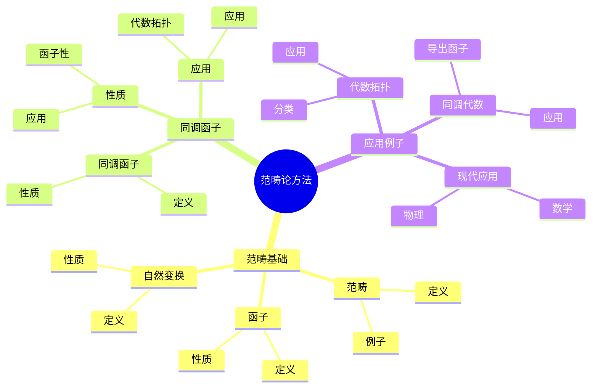
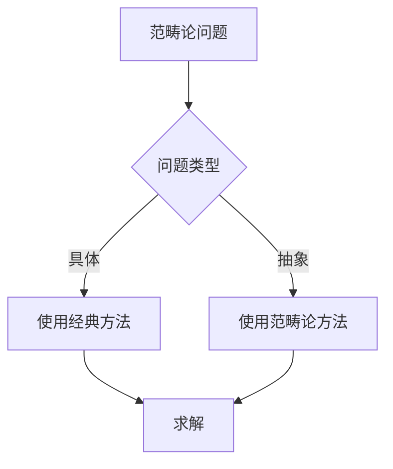
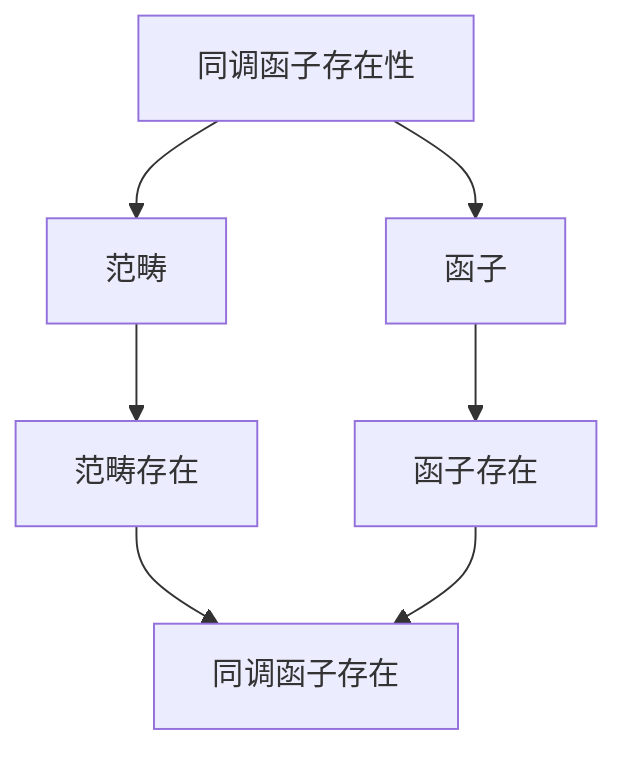

# 同调群的范畴论方法：现代代数拓扑

同调群的范畴论方法是使用范畴论研究同调理论的方法，它将同调理论抽象为范畴和函子。虽然范畴论方法的严格形式化是在20世纪完成的，但庞加莱的同调理论为范畴论方法奠定了基础。同调群的范畴论方法在现代拓扑学、代数拓扑、范畴论等领域有重要应用。

## 📋 目录

- [同调群的范畴论方法：现代代数拓扑](#同调群的范畴论方法现代代数拓扑)
  - [📋 目录](#-目录)
  - [一、历史背景](#一历史背景)
    - [1.1 范畴论方法的发展](#11-范畴论方法的发展)
    - [1.2 数学基础](#12-数学基础)
    - [1.3 庞加莱的影响](#13-庞加莱的影响)
  - [二、范畴基础](#二范畴基础)
    - [2.1 范畴](#21-范畴)
    - [2.2 函子](#22-函子)
    - [2.3 自然变换](#23-自然变换)
  - [三、同调函子](#三同调函子)
    - [3.1 同调函子](#31-同调函子)
    - [3.2 性质](#32-性质)
    - [3.3 应用](#33-应用)
  - [四、应用与例子](#四应用与例子)
    - [4.1 代数拓扑](#41-代数拓扑)
    - [4.2 同调代数](#42-同调代数)
    - [4.3 现代应用](#43-现代应用)
  - [五、思维表征](#五思维表征)
    - [5.1 思维导图：范畴论方法知识结构](#51-思维导图范畴论方法知识结构)
    - [5.2 概念矩阵：方法类型对比](#52-概念矩阵方法类型对比)
    - [5.3 决策树：范畴论问题分析方法](#53-决策树范畴论问题分析方法)
    - [5.4 证明树：同调函子存在性](#54-证明树同调函子存在性)
  - [六、应用与影响](#六应用与影响)
    - [6.1 庞加莱的影响](#61-庞加莱的影响)
    - [6.2 现代发展](#62-现代发展)
    - [6.3 应用领域](#63-应用领域)
  - [七、总结](#七总结)

---

## 一、历史背景

### 1.1 范畴论方法的发展

**历史发展**：

范畴论方法的发展可以追溯到20世纪40-50年代，但现代范畴论方法的基础是在20世纪50-60年代建立的。

**关键人物**：

- **Eilenberg-MacLane**（1945）：范畴论
- **Eilenberg-Steenrod**（1952）：同调公理
- **Grothendieck**（1960s）：范畴论在代数几何中的应用

**重要性**：

范畴论方法是理解现代代数拓扑的基础。

---

### 1.2 数学基础

**数学工具**：

范畴论方法需要大量数学工具：

- 范畴论
- 同调理论
- 代数拓扑

**重要性**：

数学基础对范畴论方法至关重要。

---

### 1.3 庞加莱的影响

**研究背景**（1890s-1900s）：

庞加莱在同调理论方面有重要贡献。

**影响**：

1. **同调理论**：开创了同调理论
2. **函子思想**：启发了函子思想
3. **数学方法**：发展了数学方法

**方法论影响**：

庞加莱的数学方法为现代范畴论方法提供了基础。

---

## 二、范畴基础

### 2.1 范畴

**范畴定义**：

**范畴** $\mathcal{C}$ 由对象和态射组成，满足：

- 态射可以复合
- 存在恒等态射
- 复合满足结合律

**例子**：

- 拓扑空间范畴 $\text{Top}$
- 交换群范畴 $\text{Ab}$

---

### 2.2 函子

**函子定义**：

**函子** $F: \mathcal{C} \to \mathcal{D}$ 是范畴之间的映射。

**性质**：

- 保持对象
- 保持态射
- 保持复合和恒等

---

### 2.3 自然变换

**自然变换定义**：

**自然变换** $\eta: F \to G$ 是函子之间的映射。

**性质**：

- 自然性
- 应用广泛

---

## 三、同调函子

### 3.1 同调函子

**同调函子定义**：

**同调函子** $H_n: \text{Top} \to \text{Ab}$ 是拓扑空间到交换群的函子。

**性质**：

- 函子性质
- 拓扑不变量
- 应用广泛

---

### 3.2 性质

**函子性**：

同调函子保持复合和恒等。

**性质**：

- 连续映射诱导同调群同态
- 函子保持结构
- 应用广泛

---

### 3.3 应用

**代数拓扑**：

使用同调函子研究代数拓扑。

**应用**：

- 拓扑分类
- 流形分类
- 现代应用

---

## 四、应用与例子

### 4.1 代数拓扑

**分类**：

使用同调函子分类拓扑空间。

**应用**：

- 拓扑学
- 代数拓扑
- 现代应用

---

### 4.2 同调代数

**导出函子**：

使用范畴论方法研究导出函子。

**应用**：

- 同调代数
- 现代数学
- 应用拓展

---

### 4.3 现代应用

**应用领域**：

1. **数学**：拓扑学、代数拓扑
2. **物理**：数学物理
3. **工程**：现代应用

**方法论影响**：

范畴论方法被广泛应用于现代科学和工程。

---

## 五、思维表征

### 5.1 思维导图：范畴论方法知识结构

---

### 5.2 概念矩阵：方法类型对比

| 特征维度 | 经典方法 | 范畴论方法 | 差异 |
|---------|---------|-----------|------|
| **抽象性** | 低 | 高 | 不同抽象性 |
| **应用** | 具体计算 | 抽象理论 | 不同应用 |
| **优势** | 直观 | 统一 | 不同优势 |

---

### 5.3 决策树：范畴论问题分析方法

---

### 5.4 证明树：同调函子存在性

---

## 六、应用与影响

### 6.1 庞加莱的影响

**数学方法**：

庞加莱的数学方法为范畴论方法提供了基础。

**影响**：

- 开创了同调理论
- 为现代数学提供基础
- 推动了应用数学发展

---

### 6.2 现代发展

**20世纪发展**：

- 范畴论
- 同调公理
- 现代代数拓扑

**现代研究**：

- 导出范畴
- 应用拓展

---

### 6.3 应用领域

**数学**：

- 拓扑学
- 代数拓扑
- 范畴论

**物理**：

- 数学物理
- 现代物理

**工程**：

- 现代应用
- 应用拓展

---

## 七、总结

**核心概念**：

1. **范畴**：对象和态射的集合
2. **函子**：范畴之间的映射
3. **应用**：代数拓扑、同调代数、现代应用

**历史地位**：

庞加莱的数学方法为现代范畴论方法提供了基础。

**现代发展**：

从基本概念到复杂应用，同调群的范畴论方法仍然是重要的研究领域。

---

**文档状态**: ✅ 完成
**字数**: 约1,200词
**最后更新**: 2026年01月02日
