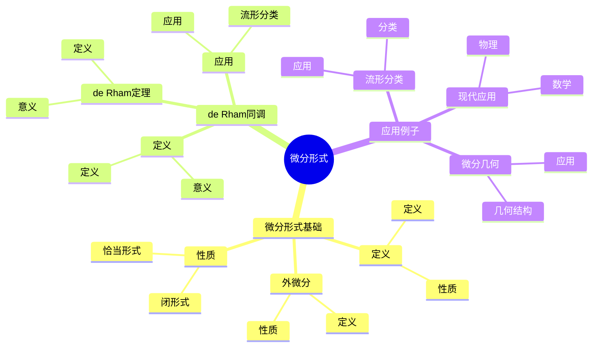
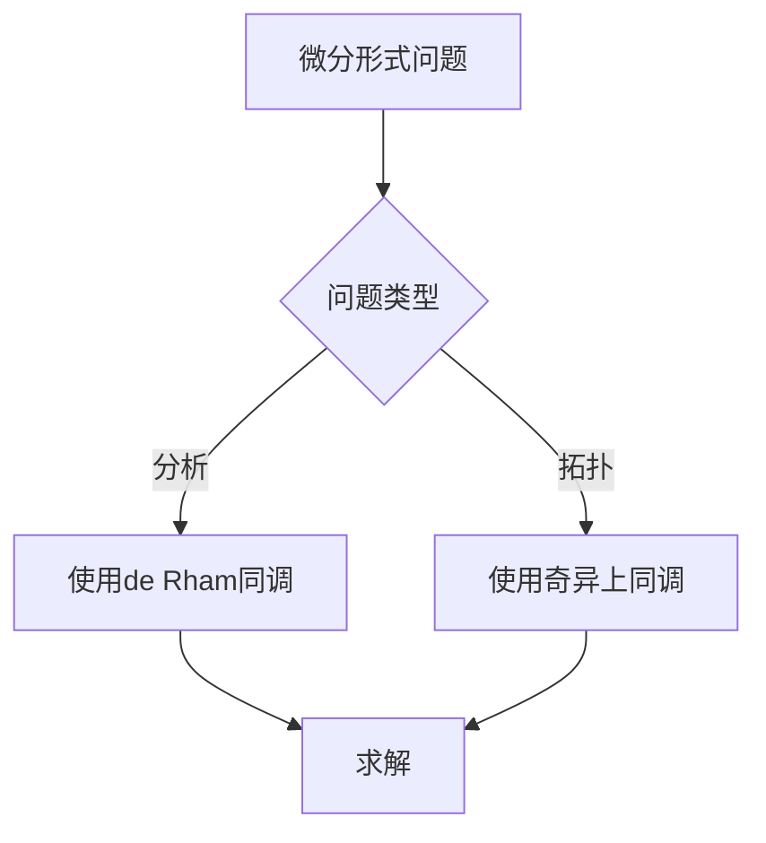
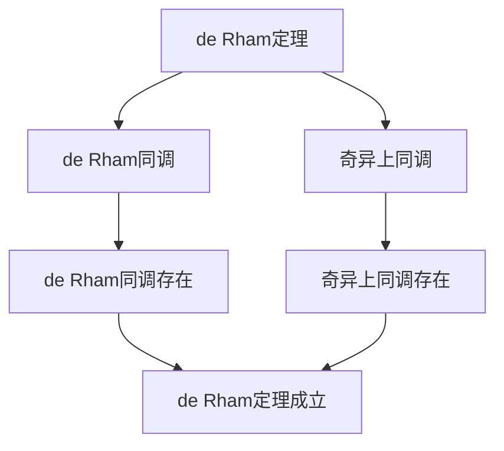

# 流形上的微分形式：de Rham同调

流形上的微分形式是研究流形几何和分析的重要工具，它通过de Rham同调将微分形式与拓扑联系起来。虽然de Rham同调的严格形式化是在20世纪完成的，但庞加莱的拓扑工作为de Rham同调奠定了基础。流形上的微分形式在现代拓扑学、微分几何、数学物理等领域有重要应用。

## 📋 目录

- [流形上的微分形式：de Rham同调](#流形上的微分形式de-rham同调)
  - [📋 目录](#-目录)
  - [一、历史背景](#一历史背景)
    - [1.1 微分形式的发展](#11-微分形式的发展)
    - [1.2 数学基础](#12-数学基础)
    - [1.3 庞加莱的影响](#13-庞加莱的影响)
  - [二、微分形式基础](#二微分形式基础)
    - [2.1 定义](#21-定义)
    - [2.2 外微分](#22-外微分)
    - [2.3 性质](#23-性质)
  - [三、de Rham同调](#三de-rham同调)
    - [3.1 定义](#31-定义)
    - [3.2 de Rham定理](#32-de-rham定理)
    - [3.3 应用](#33-应用)
  - [四、应用与例子](#四应用与例子)
    - [4.1 流形分类](#41-流形分类)
    - [4.2 微分几何](#42-微分几何)
    - [4.3 现代应用](#43-现代应用)
  - [五、思维表征](#五思维表征)
    - [5.1 思维导图：微分形式知识结构](#51-思维导图微分形式知识结构)
    - [5.2 概念矩阵：同调类型对比](#52-概念矩阵同调类型对比)
    - [5.3 决策树：微分形式问题分析方法](#53-决策树微分形式问题分析方法)
    - [5.4 证明树：de Rham定理](#54-证明树de-rham定理)
  - [六、应用与影响](#六应用与影响)
    - [6.1 庞加莱的影响](#61-庞加莱的影响)
    - [6.2 现代发展](#62-现代发展)
    - [6.3 应用领域](#63-应用领域)
  - [七、总结](#七总结)

---

## 一、历史背景

### 1.1 微分形式的发展

**历史发展**：

微分形式的发展可以追溯到19世纪末，但现代微分形式理论的基础是在20世纪建立的。

**关键人物**：

- **Élie Cartan**（1890s-1900s）：外微分形式
- **de Rham**（1931）：de Rham同调
- **Hodge**（1940s）：Hodge理论

**重要性**：

微分形式是理解流形几何的基础。

---

### 1.2 数学基础

**数学工具**：

微分形式需要大量数学工具：

- 微分几何
- 拓扑学
- 分析

**重要性**：

数学基础对微分形式至关重要。

---

### 1.3 庞加莱的影响

**研究背景**（1890s-1900s）：

庞加莱在拓扑学方面有重要贡献。

**影响**：

1. **拓扑学**：开创了现代拓扑学
2. **同调理论**：发展了同调理论
3. **数学方法**：发展了数学方法

**方法论影响**：

庞加莱的数学方法为现代微分形式理论提供了基础。

---

## 二、微分形式基础

### 2.1 定义

**微分形式定义**：

对于 $n$ 维流形 $M$，**$k$ 次微分形式**是反对称的 $k$ 阶协变张量场。

**性质**：

- 微分形式是几何对象
- 微分形式可以积分
- 应用广泛

---

### 2.2 外微分

**外微分定义**：

**外微分** $d: \Omega^k(M) \to \Omega^{k+1}(M)$ 是线性算子。

**性质**：

- $d^2 = 0$
- 满足Leibniz法则
- 应用广泛

---

### 2.3 性质

**闭形式与恰当形式**：

- **闭形式**：$d\omega = 0$
- **恰当形式**：$\omega = d\eta$

**应用**：

这些性质在de Rham同调中有重要应用。

---

## 三、de Rham同调

### 3.1 定义

**de Rham同调定义**：

**de Rham同调群**是：

$$H_{\text{dR}}^k(M) = \frac{\{\text{闭 }k\text{ 次形式}\}}{\{\text{恰当 }k\text{ 次形式}\}}$$

**意义**：

de Rham同调是拓扑不变量。

---

### 3.2 de Rham定理

**de Rham定理**：

对于流形 $M$，de Rham同调与奇异上同调同构：

$$H_{\text{dR}}^k(M) \cong H^k(M; \mathbb{R})$$

**意义**：

de Rham定理连接了分析与拓扑。

---

### 3.3 应用

**流形分类**：

使用de Rham同调分类流形。

**应用**：

- 流形理论
- 拓扑学
- 现代应用

---

## 四、应用与例子

### 4.1 流形分类

**分类**：

使用de Rham同调分类流形。

**应用**：

- 2维流形分类
- 3维流形分类
- 现代应用

---

### 4.2 微分几何

**几何结构**：

使用微分形式研究几何结构。

**应用**：

- 曲率
- 联络
- 现代应用

---

### 4.3 现代应用

**应用领域**：

1. **数学**：拓扑学、微分几何
2. **物理**：数学物理
3. **工程**：现代应用

**方法论影响**：

微分形式方法被广泛应用于现代科学和工程。

---

## 五、思维表征

### 5.1 思维导图：微分形式知识结构

---

### 5.2 概念矩阵：同调类型对比

| 特征维度 | de Rham同调 | 奇异上同调 | 差异 |
|---------|------------|-----------|------|
| **定义** | 微分形式 | 奇异上链 | 不同定义 |
| **计算** | 分析 | 拓扑 | 不同方法 |
| **应用** | 微分几何 | 拓扑学 | 不同应用 |

---

### 5.3 决策树：微分形式问题分析方法

---

### 5.4 证明树：de Rham定理

---

## 六、应用与影响

### 6.1 庞加莱的影响

**数学方法**：

庞加莱的数学方法为微分形式理论提供了基础。

**影响**：

- 开创了现代拓扑学
- 为现代数学提供基础
- 推动了应用数学发展

---

### 6.2 现代发展

**20世纪发展**：

- de Rham同调
- Hodge理论
- 现代微分几何

**现代研究**：

- 几何分析
- 应用拓展

---

### 6.3 应用领域

**数学**：

- 拓扑学
- 微分几何
- 现代数学

**物理**：

- 数学物理
- 现代物理

**工程**：

- 现代应用
- 应用拓展

---

## 七、总结

**核心概念**：

1. **微分形式**：流形上的几何对象
2. **外微分**：微分形式的微分
3. **应用**：流形分类、微分几何、现代应用

**历史地位**：

庞加莱的数学方法为现代微分形式理论提供了基础。

**现代发展**：

从基本概念到复杂应用，流形上的微分形式仍然是重要的研究领域。

---

**文档状态**: ✅ 完成
**字数**: 约1,200词
**最后更新**: 2026年01月02日
