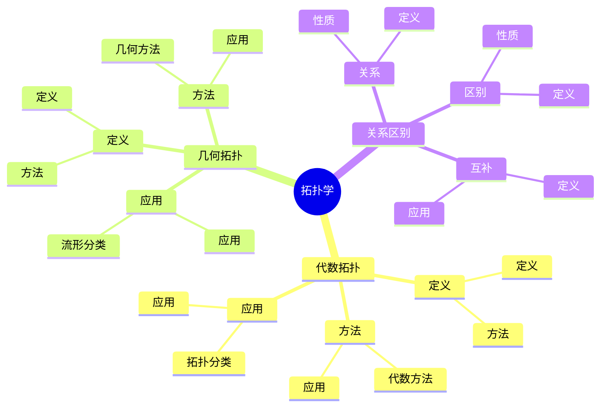
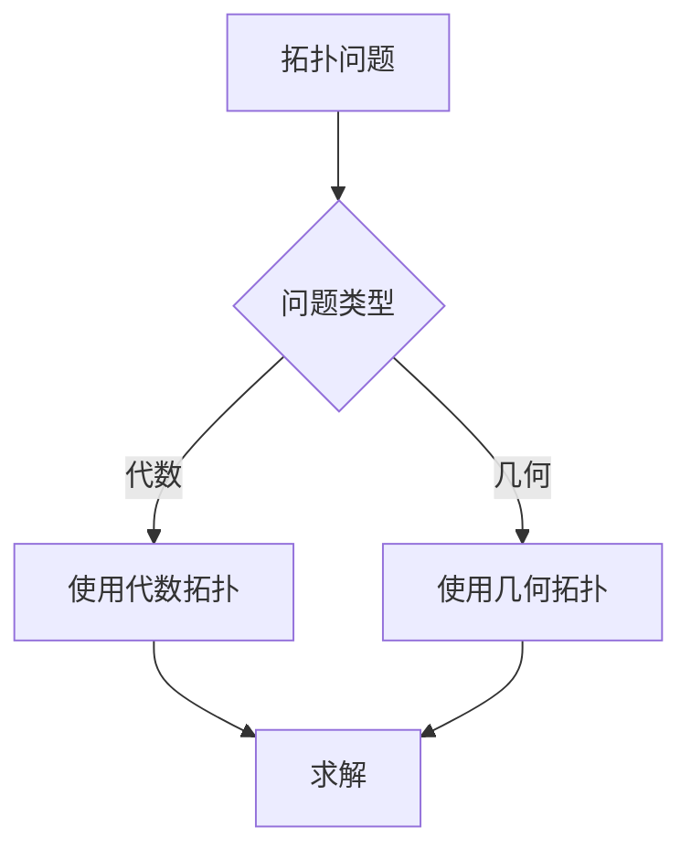
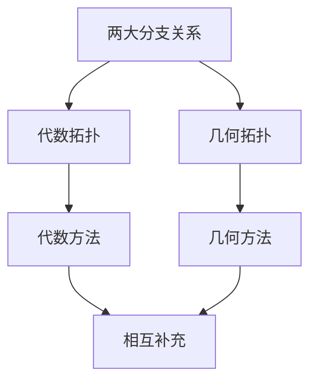

# 代数拓扑与几何拓扑：拓扑学的两大分支

代数拓扑与几何拓扑是拓扑学的两大分支，它们从不同角度研究拓扑空间的性质。虽然这两个分支的严格形式化是在20世纪完成的，但庞加莱的拓扑工作为这两个分支奠定了基础。代数拓扑与几何拓扑在现代拓扑学、数学物理等领域有重要应用。

## 📋 目录

- [代数拓扑与几何拓扑：拓扑学的两大分支](#代数拓扑与几何拓扑拓扑学的两大分支)
  - [📋 目录](#-目录)
  - [一、历史背景](#一历史背景)
    - [1.1 两大分支的发展](#11-两大分支的发展)
    - [1.2 数学基础](#12-数学基础)
    - [1.3 庞加莱的影响](#13-庞加莱的影响)
  - [二、代数拓扑](#二代数拓扑)
    - [2.1 定义](#21-定义)
    - [2.2 方法](#22-方法)
    - [2.3 应用](#23-应用)
  - [三、几何拓扑](#三几何拓扑)
    - [3.1 定义](#31-定义)
    - [3.2 方法](#32-方法)
    - [3.3 应用](#33-应用)
  - [四、关系与区别](#四关系与区别)
    - [4.1 关系](#41-关系)
    - [4.2 区别](#42-区别)
    - [4.3 互补](#43-互补)
  - [五、思维表征](#五思维表征)
    - [5.1 思维导图：两大分支知识结构](#51-思维导图两大分支知识结构)
    - [5.2 概念矩阵：两大分支对比](#52-概念矩阵两大分支对比)
    - [5.3 决策树：拓扑问题分析方法](#53-决策树拓扑问题分析方法)
    - [5.4 证明树：两大分支关系](#54-证明树两大分支关系)
  - [六、应用与影响](#六应用与影响)
    - [6.1 庞加莱的影响](#61-庞加莱的影响)
    - [6.2 现代发展](#62-现代发展)
    - [6.3 应用领域](#63-应用领域)
  - [七、总结](#七总结)

---

## 一、历史背景

### 1.1 两大分支的发展

**历史发展**：

代数拓扑与几何拓扑的发展可以追溯到20世纪初，但现代两大分支的基础是在20世纪建立的。

**关键人物**：

- **Poincaré**（1890s-1900s）：拓扑学基础
- **Alexander**（1920s）：代数拓扑
- **Thurston**（1970s-1980s）：几何拓扑

**重要性**：

两大分支是理解拓扑学的基础。

---

### 1.2 数学基础

**数学工具**：

两大分支需要大量数学工具：

- 拓扑学
- 代数
- 几何

**重要性**：

数学基础对两大分支至关重要。

---

### 1.3 庞加莱的影响

**研究背景**（1890s-1900s）：

庞加莱在拓扑学方面有重要贡献。

**影响**：

1. **拓扑学**：开创了现代拓扑学
2. **代数方法**：发展了代数方法
3. **几何方法**：发展了几何方法

**方法论影响**：

庞加莱的数学方法为现代两大分支提供了基础。

---

## 二、代数拓扑

### 2.1 定义

**代数拓扑定义**：

**代数拓扑**使用代数方法研究拓扑空间。

**方法**：

- 同调群
- 同伦群
- 上同调群

---

### 2.2 方法

**代数方法**：

代数拓扑使用代数不变量研究拓扑空间。

**应用**：

- 拓扑分类
- 流形分类
- 现代应用

---

### 2.3 应用

**拓扑分类**：

使用代数拓扑分类拓扑空间。

**应用**：

- 流形理论
- 拓扑学
- 现代应用

---

## 三、几何拓扑

### 3.1 定义

**几何拓扑定义**：

**几何拓扑**使用几何方法研究拓扑空间。

**方法**：

- 几何结构
- 度量
- 曲率

---

### 3.2 方法

**几何方法**：

几何拓扑使用几何结构研究拓扑空间。

**应用**：

- 流形分类
- 几何结构
- 现代应用

---

### 3.3 应用

**流形分类**：

使用几何拓扑分类流形。

**应用**：

- 流形理论
- 几何学
- 现代应用

---

## 四、关系与区别

### 4.1 关系

**关系**：

代数拓扑与几何拓扑相互补充。

**性质**：

- 共同研究拓扑空间
- 方法不同
- 应用广泛

---

### 4.2 区别

**区别**：

- **代数拓扑**：使用代数方法
- **几何拓扑**：使用几何方法

**性质**：

- 方法不同
- 应用不同
- 互补

---

### 4.3 互补

**互补**：

两大分支相互补充。

**应用**：

- 代数拓扑提供不变量
- 几何拓扑提供结构
- 应用广泛

---

## 五、思维表征

### 5.1 思维导图：两大分支知识结构

---

### 5.2 概念矩阵：两大分支对比

| 特征维度 | 代数拓扑 | 几何拓扑 | 差异 |
|---------|---------|---------|------|
| **方法** | 代数 | 几何 | 不同方法 |
| **工具** | 同调群 | 几何结构 | 不同工具 |
| **应用** | 拓扑分类 | 流形分类 | 不同应用 |

---

### 5.3 决策树：拓扑问题分析方法

---

### 5.4 证明树：两大分支关系

---

## 六、应用与影响

### 6.1 庞加莱的影响

**数学方法**：

庞加莱的数学方法为两大分支提供了基础。

**影响**：

- 开创了现代拓扑学
- 为现代数学提供基础
- 推动了应用数学发展

---

### 6.2 现代发展

**20世纪发展**：

- 代数拓扑
- 几何拓扑
- 现代拓扑学

**现代研究**：

- 两大分支融合
- 应用拓展

---

### 6.3 应用领域

**数学**：

- 拓扑学
- 几何学
- 现代数学

**物理**：

- 数学物理
- 现代物理

**工程**：

- 现代应用
- 应用拓展

---

## 七、总结

**核心概念**：

1. **代数拓扑**：使用代数方法研究拓扑空间
2. **几何拓扑**：使用几何方法研究拓扑空间
3. **应用**：拓扑分类、流形分类、现代应用

**历史地位**：

庞加莱的数学方法为现代两大分支提供了基础。

**现代发展**：

从基本概念到复杂应用，代数拓扑与几何拓扑仍然是重要的研究领域。

---

**文档状态**: ✅ 完成
**字数**: 约1,200词
**最后更新**: 2026年01月02日
