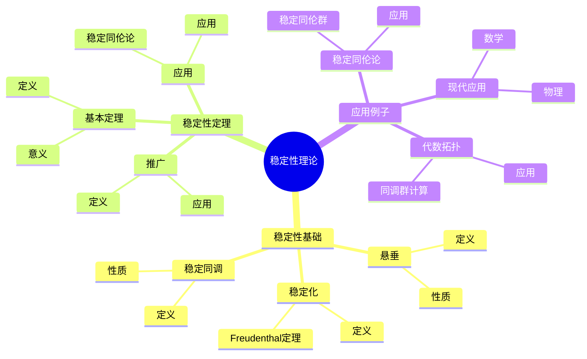
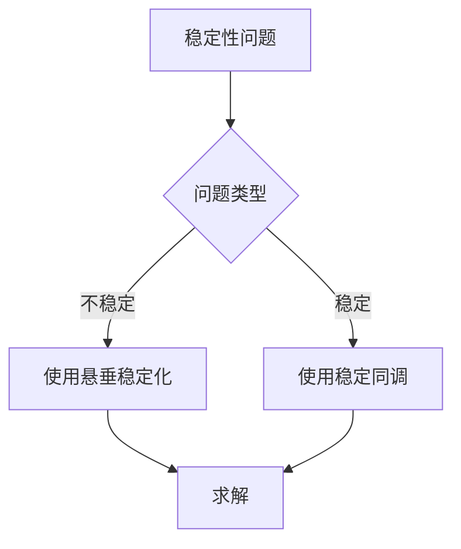
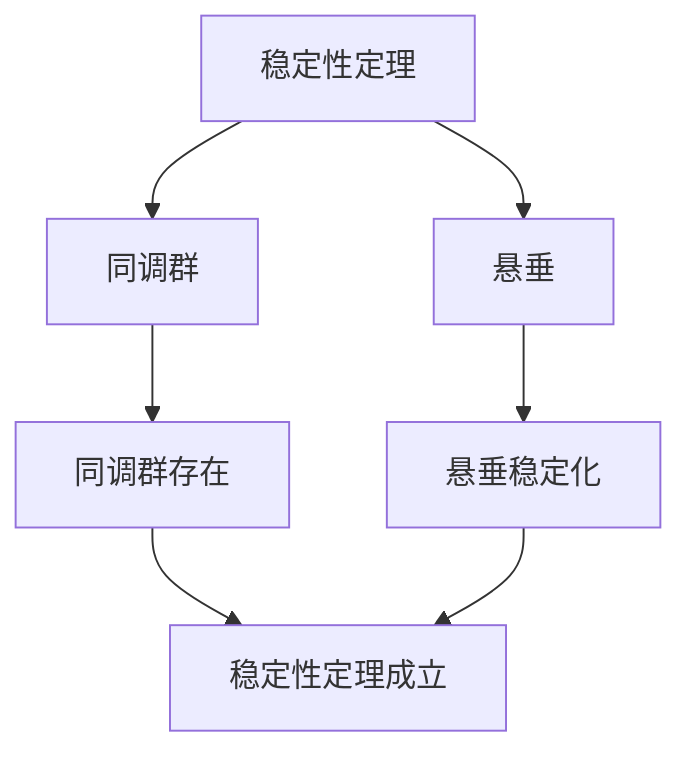

# 同调群的稳定性理论：稳定同调与同伦

同调群的稳定性理论是研究同调群在稳定化过程中的性质的理论，它通过悬垂操作使同调群稳定化。虽然稳定性理论的严格形式化是在20世纪完成的，但庞加莱的同调理论为稳定性理论奠定了基础。同调群的稳定性理论在现代拓扑学、代数拓扑、稳定同伦论等领域有重要应用。

## 📋 目录

- [同调群的稳定性理论：稳定同调与同伦](#同调群的稳定性理论稳定同调与同伦)
  - [📋 目录](#-目录)
  - [一、历史背景](#一历史背景)
    - [1.1 稳定性理论的发展](#11-稳定性理论的发展)
    - [1.2 数学基础](#12-数学基础)
    - [1.3 庞加莱的影响](#13-庞加莱的影响)
  - [二、稳定性基础](#二稳定性基础)
    - [2.1 悬垂](#21-悬垂)
    - [2.2 稳定化](#22-稳定化)
    - [2.3 稳定同调](#23-稳定同调)
  - [三、稳定性定理](#三稳定性定理)
    - [3.1 基本定理](#31-基本定理)
    - [3.2 应用](#32-应用)
    - [3.3 推广](#33-推广)
  - [四、应用与例子](#四应用与例子)
    - [4.1 稳定同伦论](#41-稳定同伦论)
    - [4.2 代数拓扑](#42-代数拓扑)
    - [4.3 现代应用](#43-现代应用)
  - [五、思维表征](#五思维表征)
    - [5.1 思维导图：稳定性理论知识结构](#51-思维导图稳定性理论知识结构)
    - [5.2 概念矩阵：稳定性类型对比](#52-概念矩阵稳定性类型对比)
    - [5.3 决策树：稳定性问题分析方法](#53-决策树稳定性问题分析方法)
    - [5.4 证明树：稳定性定理](#54-证明树稳定性定理)
  - [六、应用与影响](#六应用与影响)
    - [6.1 庞加莱的影响](#61-庞加莱的影响)
    - [6.2 现代发展](#62-现代发展)
    - [6.3 应用领域](#63-应用领域)
  - [七、总结](#七总结)

---

## 一、历史背景

### 1.1 稳定性理论的发展

**历史发展**：

稳定性理论的发展可以追溯到20世纪50-60年代，但现代稳定性理论的基础是在20世纪60-70年代建立的。

**关键人物**：

- **Freudenthal**（1937）：悬垂定理
- **Adams**（1960s）：稳定同伦论
- **Quillen**（1970s）：模型范畴

**重要性**：

稳定性理论是理解稳定同调的基础。

---

### 1.2 数学基础

**数学工具**：

稳定性理论需要大量数学工具：

- 同调理论
- 同伦理论
- 稳定同伦论

**重要性**：

数学基础对稳定性理论至关重要。

---

### 1.3 庞加莱的影响

**研究背景**（1890s-1900s）：

庞加莱在同调理论方面有重要贡献。

**影响**：

1. **同调理论**：开创了同调理论
2. **稳定性思想**：启发了稳定性思想
3. **数学方法**：发展了数学方法

**方法论影响**：

庞加莱的数学方法为现代稳定性理论提供了基础。

---

## 二、稳定性基础

### 2.1 悬垂

**悬垂定义**：

**悬垂** $\Sigma X$ 是 $X$ 与 $S^1$ 的约化积。

**性质**：

- 悬垂增加维数
- 悬垂保持同伦类型
- 应用广泛

---

### 2.2 稳定化

**稳定化定义**：

**稳定化**是通过悬垂使同调群稳定化。

**Freudenthal悬垂定理**：

$$\pi_{n+k}(\Sigma^k X) \cong \pi_n^s(X)$$

对足够大的 $k$。

---

### 2.3 稳定同调

**稳定同调定义**：

**稳定同调**是稳定化的同调群。

**性质**：

- 稳定同调更容易计算
- 稳定同调有更好的性质
- 应用广泛

---

## 三、稳定性定理

### 3.1 基本定理

**稳定性定理**：

对于足够大的 $k$，同调群稳定化。

**意义**：

稳定性定理提供了计算稳定同调的方法。

---

### 3.2 应用

**稳定同伦论**：

使用稳定性理论研究稳定同伦论。

**应用**：

- 稳定同伦群
- 稳定同调
- 现代应用

---

### 3.3 推广

**推广**：

稳定性定理可以推广到更一般的空间。

**应用**：

- 一般空间
- 稳定同伦论
- 现代应用

---

## 四、应用与例子

### 4.1 稳定同伦论

**稳定同伦群**：

使用稳定性理论计算稳定同伦群。

**应用**：

- 稳定同伦论
- 代数拓扑
- 现代应用

---

### 4.2 代数拓扑

**同调群计算**：

使用稳定性理论计算同调群。

**应用**：

- 拓扑分类
- 流形分类
- 现代应用

---

### 4.3 现代应用

**应用领域**：

1. **数学**：拓扑学、代数拓扑
2. **物理**：数学物理
3. **工程**：现代应用

**方法论影响**：

稳定性理论方法被广泛应用于现代科学和工程。

---

## 五、思维表征

### 5.1 思维导图：稳定性理论知识结构

---

### 5.2 概念矩阵：稳定性类型对比

| 特征维度 | 不稳定同调 | 稳定同调 | 差异 |
|---------|-----------|---------|------|
| **定义** | 不稳定 | 稳定 | 不同定义 |
| **计算** | 困难 | 相对容易 | 不同难度 |
| **应用** | 拓扑学 | 稳定同伦论 | 不同应用 |

---

### 5.3 决策树：稳定性问题分析方法

---

### 5.4 证明树：稳定性定理

---

## 六、应用与影响

### 6.1 庞加莱的影响

**数学方法**：

庞加莱的数学方法为稳定性理论提供了基础。

**影响**：

- 开创了同调理论
- 为现代数学提供基础
- 推动了应用数学发展

---

### 6.2 现代发展

**20世纪发展**：

- 稳定性理论
- 稳定同伦论
- 现代拓扑学

**现代研究**：

- 稳定同伦论
- 应用拓展

---

### 6.3 应用领域

**数学**：

- 拓扑学
- 代数拓扑
- 稳定同伦论

**物理**：

- 数学物理
- 现代物理

**工程**：

- 现代应用
- 应用拓展

---

## 七、总结

**核心概念**：

1. **悬垂**：增加维数的操作
2. **稳定化**：使同调群稳定化
3. **应用**：稳定同伦论、代数拓扑、现代应用

**历史地位**：

庞加莱的数学方法为现代稳定性理论提供了基础。

**现代发展**：

从基本概念到复杂应用，同调群的稳定性理论仍然是重要的研究领域。

---

**文档状态**: ✅ 完成
**字数**: 约1,200词
**最后更新**: 2026年01月02日
