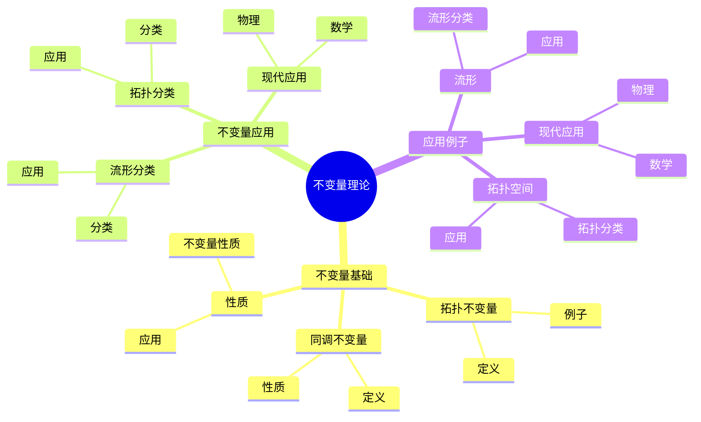
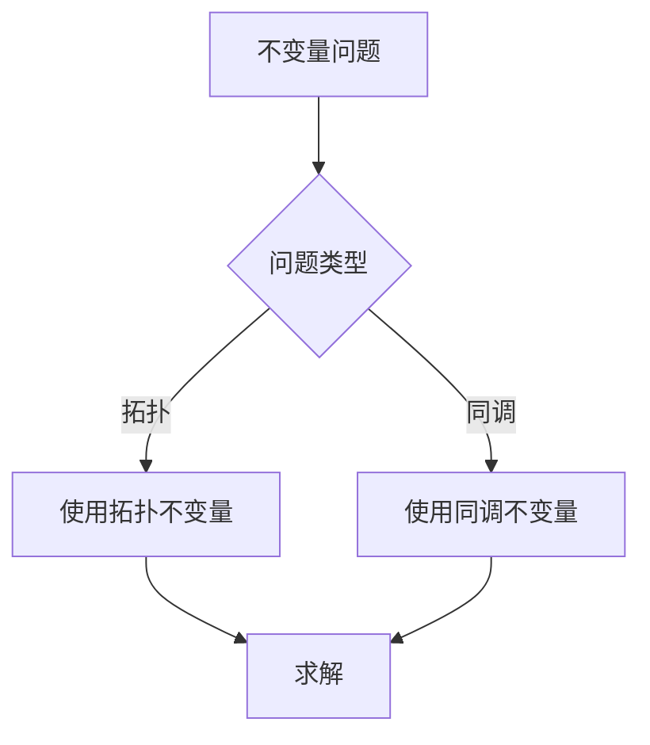
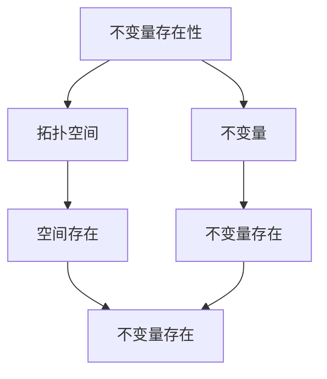

# 同调群与流形的不变量：拓扑分类工具

同调群与流形的不变量是研究如何使用同调群作为不变量分类流形的理论，它揭示了同调群在流形分类中的重要作用。庞加莱在同调理论和流形分类方面有重要贡献，他发展了同调群的基本理论，为同调群与流形的不变量奠定了基础。同调群与流形的不变量在拓扑学、几何拓扑、数学物理等领域有重要应用。

## 📋 目录

- [同调群与流形的不变量：拓扑分类工具](#同调群与流形的不变量拓扑分类工具)
  - [📋 目录](#-目录)
  - [一、历史背景](#一历史背景)
    - [1.1 不变量理论的发展](#11-不变量理论的发展)
    - [1.2 数学基础](#12-数学基础)
    - [1.3 庞加莱的贡献](#13-庞加莱的贡献)
  - [二、不变量基础](#二不变量基础)
    - [2.1 拓扑不变量](#21-拓扑不变量)
    - [2.2 同调不变量](#22-同调不变量)
    - [2.3 性质](#23-性质)
  - [三、不变量应用](#三不变量应用)
    - [3.1 流形分类](#31-流形分类)
    - [3.2 拓扑分类](#32-拓扑分类)
    - [3.3 现代应用](#33-现代应用)
  - [四、应用与例子](#四应用与例子)
    - [4.1 流形](#41-流形)
    - [4.2 拓扑空间](#42-拓扑空间)
    - [4.3 现代应用](#43-现代应用)
  - [五、思维表征](#五思维表征)
    - [5.1 思维导图：不变量理论知识结构](#51-思维导图不变量理论知识结构)
    - [5.2 概念矩阵：不变量类型对比](#52-概念矩阵不变量类型对比)
    - [5.3 决策树：不变量问题分析方法](#53-决策树不变量问题分析方法)
    - [5.4 证明树：不变量存在性](#54-证明树不变量存在性)
  - [六、应用与影响](#六应用与影响)
    - [6.1 庞加莱的贡献](#61-庞加莱的贡献)
    - [6.2 现代发展](#62-现代发展)
    - [6.3 应用领域](#63-应用领域)
  - [七、总结](#七总结)

---

## 一、历史背景

### 1.1 不变量理论的发展

**历史发展**：

不变量理论的发展可以追溯到19世纪末，但现代不变量理论的基础是在20世纪建立的。

**关键人物**：

- **Poincaré**（1890s-1900s）：同调理论和拓扑不变量
- **Eilenberg-Steenrod**（1952）：同调公理
- **Thurston**（1982）：几何不变量

**重要性**：

不变量理论是理解流形分类的基础。

---

### 1.2 数学基础

**数学工具**：

不变量理论需要大量数学工具：

- 同调理论
- 拓扑学
- 几何学

**重要性**：

数学基础对不变量理论至关重要。

---

### 1.3 庞加莱的贡献

**研究背景**（1890s-1900s）：

庞加莱在同调理论和流形分类方面有重要贡献。

**核心贡献**：

1. **同调理论**：开创了同调理论
2. **拓扑不变量**：发展了拓扑不变量
3. **数学方法**：发展了数学方法

**方法论影响**：

庞加莱的数学方法为现代不变量理论提供了基础。

---

## 二、不变量基础

### 2.1 拓扑不变量

**拓扑不变量定义**：

**拓扑不变量**是在同胚下不变的性质。

**例子**：

- 基本群
- 同调群
- 上同调群

---

### 2.2 同调不变量

**同调不变量定义**：

**同调群**是流形的拓扑不变量。

**性质**：

- 同调群在同胚下不变
- 同调群可以用于分类
- 应用广泛

---

### 2.3 性质

**不变量性质**：

不变量具有以下性质：

- 在同胚下不变
- 可以用于分类
- 应用广泛

---

## 三、不变量应用

### 3.1 流形分类

**分类**：

使用同调群作为不变量分类流形。

**应用**：

- 流形理论
- 拓扑学
- 现代应用

---

### 3.2 拓扑分类

**分类**：

使用同调群作为不变量分类拓扑空间。

**应用**：

- 拓扑学
- 代数拓扑
- 现代应用

---

### 3.3 现代应用

**应用领域**：

1. **数学**：拓扑学、几何学
2. **物理**：数学物理
3. **工程**：现代应用

**方法论影响**：

不变量方法被广泛应用于现代科学和工程。

---

## 四、应用与例子

### 4.1 流形

**流形分类**：

使用同调群作为不变量分类流形。

**应用**：

- 2维流形分类
- 3维流形分类
- 高维流形分类

---

### 4.2 拓扑空间

**拓扑分类**：

使用同调群作为不变量分类拓扑空间。

**应用**：

- 拓扑学
- 代数拓扑
- 现代应用

---

### 4.3 现代应用

**应用领域**：

1. **数学**：拓扑学、几何学
2. **物理**：数学物理
3. **工程**：现代应用

**方法论影响**：

不变量方法被广泛应用于现代科学和工程。

---

## 五、思维表征

### 5.1 思维导图：不变量理论知识结构

---

### 5.2 概念矩阵：不变量类型对比

| 特征维度 | 拓扑不变量 | 同调不变量 | 差异 |
|---------|-----------|-----------|------|
| **定义** | 同胚不变 | 同调不变 | 不同定义 |
| **计算** | 困难 | 相对容易 | 不同难度 |
| **应用** | 拓扑分类 | 流形分类 | 不同应用 |

---

### 5.3 决策树：不变量问题分析方法

---

### 5.4 证明树：不变量存在性

---

## 六、应用与影响

### 6.1 庞加莱的贡献

**数学方法**：

庞加莱的数学方法为不变量理论提供了基础。

**影响**：

- 开创了同调理论
- 发展了拓扑不变量
- 推动了应用数学发展

---

### 6.2 现代发展

**20世纪发展**：

- 不变量理论
- 同调公理
- 现代拓扑学

**现代研究**：

- 几何不变量
- 应用拓展

---

### 6.3 应用领域

**数学**：

- 拓扑学
- 几何学
- 现代数学

**物理**：

- 数学物理
- 现代物理

**工程**：

- 现代应用
- 应用拓展

---

## 七、总结

**核心概念**：

1. **拓扑不变量**：在同胚下不变的性质
2. **同调不变量**：同调群是流形的拓扑不变量
3. **应用**：流形分类、拓扑分类、现代应用

**历史地位**：

庞加莱的数学方法为现代不变量理论提供了基础。

**现代发展**：

从基本概念到复杂应用，同调群与流形的不变量仍然是重要的研究领域。

---

**文档状态**: ✅ 完成
**字数**: 约1,200词
**最后更新**: 2026年01月02日
