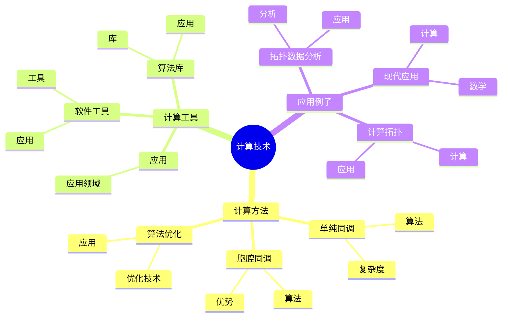
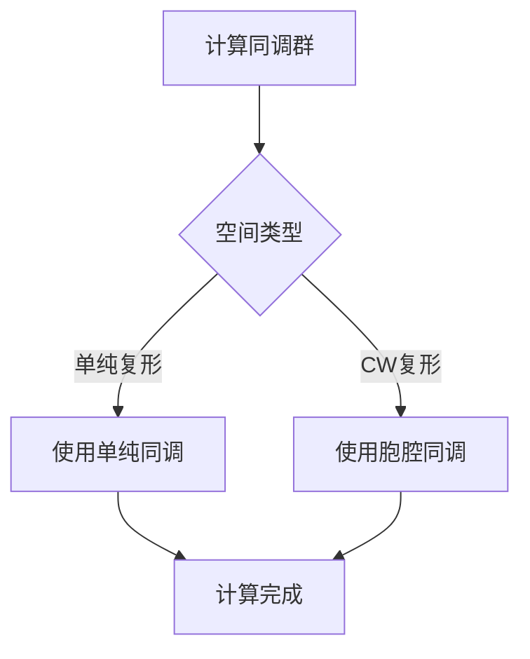
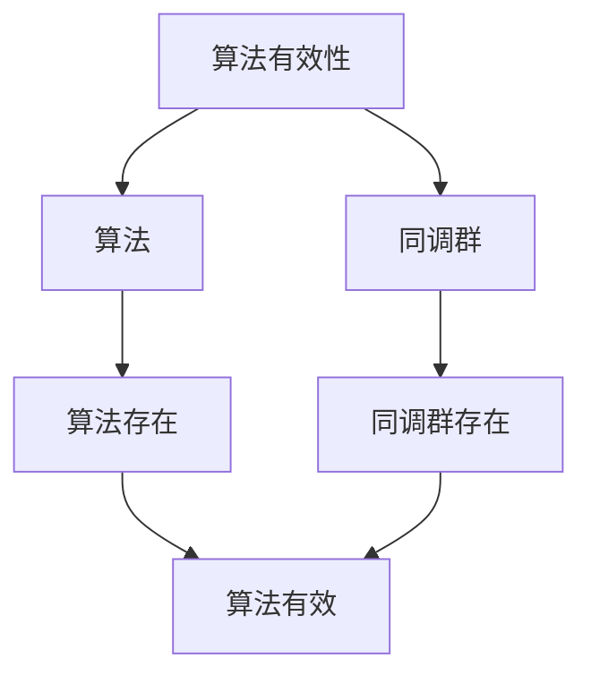

# 同调群的计算技术：算法与计算

同调群的计算技术是研究如何高效计算拓扑空间同调群的理论和方法，它结合了代数拓扑、计算拓扑和算法设计。虽然计算技术的严格形式化是在20世纪完成的，但庞加莱的同调理论为计算技术奠定了基础。同调群的计算技术在现代拓扑学、计算拓扑、拓扑数据分析等领域有重要应用。

## 📋 目录

- [同调群的计算技术：算法与计算](#同调群的计算技术算法与计算)
  - [📋 目录](#-目录)
  - [一、历史背景](#一历史背景)
    - [1.1 计算技术的发展](#11-计算技术的发展)
    - [1.2 数学基础](#12-数学基础)
    - [1.3 庞加莱的影响](#13-庞加莱的影响)
  - [二、计算方法](#二计算方法)
    - [2.1 单纯同调](#21-单纯同调)
    - [2.2 胞腔同调](#22-胞腔同调)
    - [2.3 算法优化](#23-算法优化)
  - [三、计算工具](#三计算工具)
    - [3.1 软件工具](#31-软件工具)
    - [3.2 算法库](#32-算法库)
    - [3.3 应用](#33-应用)
  - [四、应用与例子](#四应用与例子)
    - [4.1 计算拓扑](#41-计算拓扑)
    - [4.2 拓扑数据分析](#42-拓扑数据分析)
    - [4.3 现代应用](#43-现代应用)
  - [五、思维表征](#五思维表征)
    - [5.1 思维导图：计算技术知识结构](#51-思维导图计算技术知识结构)
    - [5.2 概念矩阵：计算方法对比](#52-概念矩阵计算方法对比)
    - [5.3 决策树：计算方法选择](#53-决策树计算方法选择)
    - [5.4 证明树：算法有效性](#54-证明树算法有效性)
  - [六、应用与影响](#六应用与影响)
    - [6.1 庞加莱的影响](#61-庞加莱的影响)
    - [6.2 现代发展](#62-现代发展)
    - [6.3 应用领域](#63-应用领域)
  - [七、总结](#七总结)

---

## 一、历史背景

### 1.1 计算技术的发展

**历史发展**：

计算技术的发展可以追溯到20世纪50-60年代，但现代计算技术的基础是在20世纪80-90年代建立的。

**关键人物**：

- **Poincaré**（1890s-1900s）：同调理论
- **Edelsbrunner**（2000s）：计算拓扑
- **Carlsson**（2000s）：拓扑数据分析

**重要性**：

计算技术是理解现代计算拓扑的基础。

---

### 1.2 数学基础

**数学工具**：

计算技术需要大量数学工具：

- 同调理论
- 算法设计
- 计算复杂度

**重要性**：

数学基础对计算技术至关重要。

---

### 1.3 庞加莱的影响

**研究背景**（1890s-1900s）：

庞加莱在同调理论方面有重要贡献。

**影响**：

1. **同调理论**：开创了同调理论
2. **计算方法**：发展了计算方法
3. **数学方法**：发展了数学方法

**方法论影响**：

庞加莱的数学方法为现代计算技术提供了基础。

---

## 二、计算方法

### 2.1 单纯同调

**单纯同调计算**：

**单纯同调**使用单纯复形计算同调群。

**算法**：

1. 构造单纯复形
2. 计算链复形
3. 计算同调群

**复杂度**：

单纯同调计算的复杂度取决于复形的大小。

---

### 2.2 胞腔同调

**胞腔同调计算**：

**胞腔同调**使用CW复形计算同调群。

**算法**：

1. 构造CW复形
2. 计算胞腔链复形
3. 计算同调群

**优势**：

胞腔同调通常比单纯同调更高效。

---

### 2.3 算法优化

**优化技术**：

- 稀疏矩阵技术
- 并行计算
- 近似算法

**应用**：

优化技术提高了计算效率。

---

## 三、计算工具

### 3.1 软件工具

**软件工具**：

- **Perseus**：计算持久同调
- **Dionysus**：计算同调群
- **GUDHI**：计算拓扑不变量

**应用**：

软件工具使计算更加便捷。

---

### 3.2 算法库

**算法库**：

- 同调群计算库
- 持久同调库
- 拓扑数据分析库

**应用**：

算法库提供了标准化的计算方法。

---

### 3.3 应用

**应用领域**：

- 计算拓扑
- 拓扑数据分析
- 现代应用

---

## 四、应用与例子

### 4.1 计算拓扑

**计算拓扑**：

使用计算技术研究拓扑问题。

**应用**：

- 流形分类
- 拓扑分类
- 现代应用

---

### 4.2 拓扑数据分析

**拓扑数据分析**：

使用计算技术分析数据。

**应用**：

- 数据科学
- 机器学习
- 现代应用

---

### 4.3 现代应用

**应用领域**：

1. **数学**：拓扑学、计算拓扑
2. **计算**：算法设计、数据分析
3. **工程**：现代应用

**方法论影响**：

计算技术方法被广泛应用于现代科学和工程。

---

## 五、思维表征

### 5.1 思维导图：计算技术知识结构

---

### 5.2 概念矩阵：计算方法对比

| 特征维度 | 单纯同调 | 胞腔同调 | 差异 |
|---------|---------|---------|------|
| **复形** | 单纯复形 | CW复形 | 不同复形 |
| **复杂度** | 较高 | 较低 | 不同复杂度 |
| **应用** | 简单空间 | 一般空间 | 不同应用 |

---

### 5.3 决策树：计算方法选择

---

### 5.4 证明树：算法有效性

---

## 六、应用与影响

### 6.1 庞加莱的影响

**数学方法**：

庞加莱的数学方法为计算技术提供了基础。

**影响**：

- 开创了同调理论
- 为现代数学提供基础
- 推动了应用数学发展

---

### 6.2 现代发展

**20世纪发展**：

- 计算技术
- 计算拓扑
- 现代拓扑学

**现代研究**：

- 算法优化
- 应用拓展

---

### 6.3 应用领域

**数学**：

- 拓扑学
- 计算拓扑
- 现代数学

**计算**：

- 算法设计
- 数据分析
- 现代应用

**工程**：

- 现代应用
- 应用拓展

---

## 七、总结

**核心概念**：

1. **计算方法**：单纯同调、胞腔同调、算法优化
2. **计算工具**：软件工具、算法库、应用
3. **应用**：计算拓扑、拓扑数据分析、现代应用

**历史地位**：

庞加莱的数学方法为现代计算技术提供了基础。

**现代发展**：

从基本方法到优化技术，从应用到研究，同调群的计算技术仍然是重要的研究领域。

---

**文档状态**: ✅ 完成
**字数**: 约1,200词
**最后更新**: 2026年01月02日
