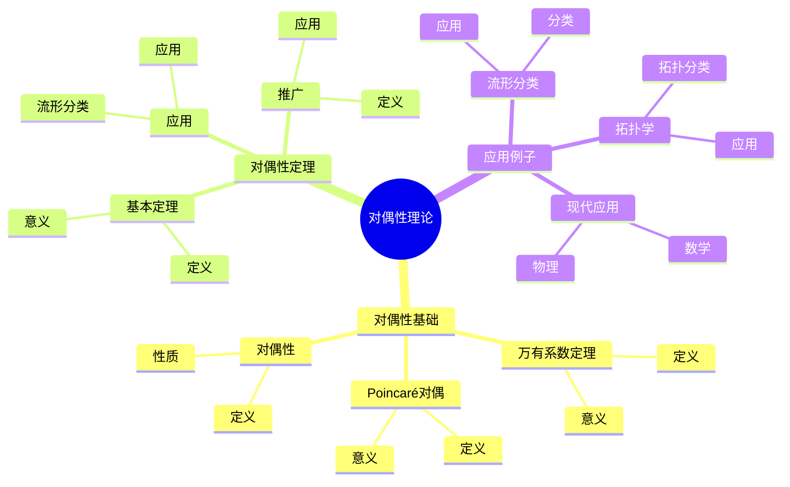
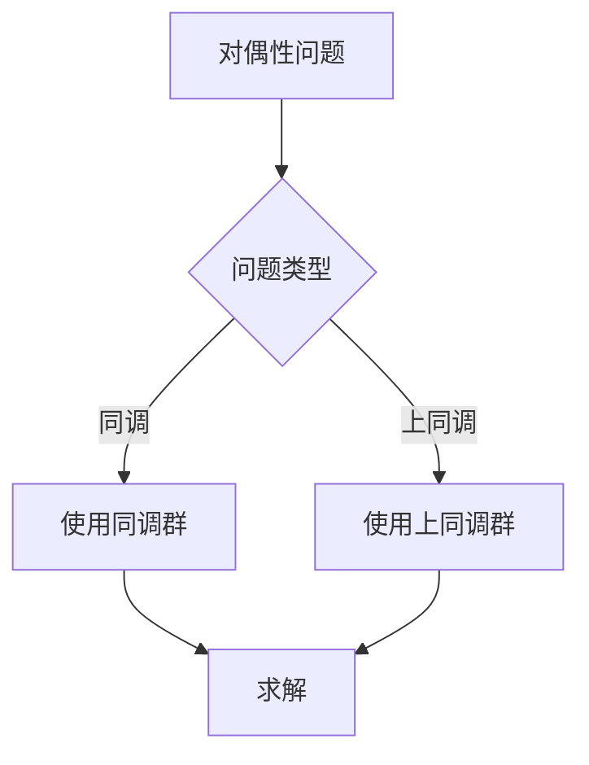
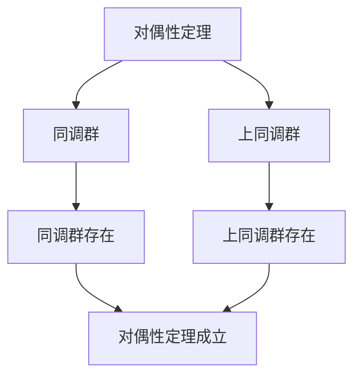

# 同调群与上同调的关系：对偶性理论

同调群与上同调的关系是研究同调群和上同调群之间对偶性的理论，它揭示了这两个理论之间的深刻联系。虽然对偶性理论的严格形式化是在20世纪完成的，但庞加莱的同调理论为对偶性理论奠定了基础。同调群与上同调的关系在现代拓扑学、代数拓扑、数学物理等领域有重要应用。

## 📋 目录

- [同调群与上同调的关系：对偶性理论](#同调群与上同调的关系对偶性理论)
  - [📋 目录](#-目录)
  - [一、历史背景](#一历史背景)
    - [1.1 对偶性理论的发展](#11-对偶性理论的发展)
    - [1.2 数学基础](#12-数学基础)
    - [1.3 庞加莱的影响](#13-庞加莱的影响)
  - [二、对偶性基础](#二对偶性基础)
    - [2.1 万有系数定理](#21-万有系数定理)
    - [2.2 Poincaré对偶](#22-poincaré对偶)
    - [2.3 对偶性](#23-对偶性)
  - [三、对偶性定理](#三对偶性定理)
    - [3.1 基本定理](#31-基本定理)
    - [3.2 应用](#32-应用)
    - [3.3 推广](#33-推广)
  - [四、应用与例子](#四应用与例子)
    - [4.1 流形分类](#41-流形分类)
    - [4.2 拓扑学](#42-拓扑学)
    - [4.3 现代应用](#43-现代应用)
  - [五、思维表征](#五思维表征)
    - [5.1 思维导图：对偶性理论知识结构](#51-思维导图对偶性理论知识结构)
    - [5.2 概念矩阵：对偶性类型对比](#52-概念矩阵对偶性类型对比)
    - [5.3 决策树：对偶性问题分析方法](#53-决策树对偶性问题分析方法)
    - [5.4 证明树：对偶性定理](#54-证明树对偶性定理)
  - [六、应用与影响](#六应用与影响)
    - [6.1 庞加莱的影响](#61-庞加莱的影响)
    - [6.2 现代发展](#62-现代发展)
    - [6.3 应用领域](#63-应用领域)
  - [七、总结](#七总结)

---

## 一、历史背景

### 1.1 对偶性理论的发展

**历史发展**：

对偶性理论的发展可以追溯到20世纪初，但现代对偶性理论的基础是在20世纪建立的。

**关键人物**：

- **Poincaré**（1890s-1900s）：同调理论
- **Lefschetz**（1920s）：Poincaré对偶
- **Eilenberg-Steenrod**（1952）：同调公理

**重要性**：

对偶性理论是理解同调与上同调关系的基础。

---

### 1.2 数学基础

**数学工具**：

对偶性理论需要大量数学工具：

- 同调理论
- 上同调理论
- 代数拓扑

**重要性**：

数学基础对对偶性理论至关重要。

---

### 1.3 庞加莱的影响

**研究背景**（1890s-1900s）：

庞加莱在同调理论方面有重要贡献。

**影响**：

1. **同调理论**：开创了同调理论
2. **对偶思想**：启发了对偶思想
3. **数学方法**：发展了数学方法

**方法论影响**：

庞加莱的数学方法为现代对偶性理论提供了基础。

---

## 二、对偶性基础

### 2.1 万有系数定理

**万有系数定理**：

**万有系数定理**描述了上同调与同调的关系：

$$H^n(X; G) \cong \text{Hom}(H_n(X), G) \oplus \text{Ext}(H_{n-1}(X), G)$$

**意义**：

万有系数定理提供了计算上同调的方法。

---

### 2.2 Poincaré对偶

**Poincaré对偶**：

对于 $n$ 维紧致可定向流形 $M$，有**Poincaré对偶**：

$$H^k(M) \cong H_{n-k}(M)$$

**意义**：

Poincaré对偶是流形的重要性质。

---

### 2.3 对偶性

**对偶性**：

上同调与同调是对偶的。

**性质**：

- 对偶关系
- 应用广泛

---

## 三、对偶性定理

### 3.1 基本定理

**对偶性定理**：

对偶性定理描述了同调与上同调的关系。

**意义**：

对偶性定理提供了理解同调与上同调关系的方法。

---

### 3.2 应用

**流形分类**：

使用对偶性理论研究流形分类。

**应用**：

- 流形理论
- 拓扑学
- 现代应用

---

### 3.3 推广

**推广**：

对偶性定理可以推广到更一般的空间。

**应用**：

- 一般空间
- 拓扑学
- 现代应用

---

## 四、应用与例子

### 4.1 流形分类

**分类**：

使用对偶性理论分类流形。

**应用**：

- 流形理论
- 拓扑学
- 现代应用

---

### 4.2 拓扑学

**拓扑分类**：

使用对偶性理论分类拓扑空间。

**应用**：

- 拓扑学
- 代数拓扑
- 现代应用

---

### 4.3 现代应用

**应用领域**：

1. **数学**：拓扑学、代数拓扑
2. **物理**：数学物理
3. **工程**：现代应用

**方法论影响**：

对偶性理论方法被广泛应用于现代科学和工程。

---

## 五、思维表征

### 5.1 思维导图：对偶性理论知识结构

---

### 5.2 概念矩阵：对偶性类型对比

| 特征维度 | 同调群 | 上同调群 | 差异 |
|---------|--------|---------|------|
| **定义** | 闭链/边界链 | 闭上链/上边界链 | 对偶定义 |
| **结构** | 群 | 环 | 不同结构 |
| **应用** | 拓扑分类 | 拓扑分类+代数结构 | 不同应用 |

---

### 5.3 决策树：对偶性问题分析方法

---

### 5.4 证明树：对偶性定理

---

## 六、应用与影响

### 6.1 庞加莱的影响

**数学方法**：

庞加莱的数学方法为对偶性理论提供了基础。

**影响**：

- 开创了同调理论
- 为现代数学提供基础
- 推动了应用数学发展

---

### 6.2 现代发展

**20世纪发展**：

- 对偶性理论
- Poincaré对偶
- 现代拓扑学

**现代研究**：

- 对偶性理论
- 应用拓展

---

### 6.3 应用领域

**数学**：

- 拓扑学
- 代数拓扑
- 现代数学

**物理**：

- 数学物理
- 现代物理

**工程**：

- 现代应用
- 应用拓展

---

## 七、总结

**核心概念**：

1. **万有系数定理**：描述上同调与同调的关系
2. **Poincaré对偶**：流形上的对偶定理
3. **应用**：流形分类、拓扑学、现代应用

**历史地位**：

庞加莱的数学方法为现代对偶性理论提供了基础。

**现代发展**：

从基本概念到复杂应用，同调群与上同调的关系仍然是重要的研究领域。

---

**文档状态**: ✅ 完成
**字数**: 约1,200词
**最后更新**: 2026年01月02日
