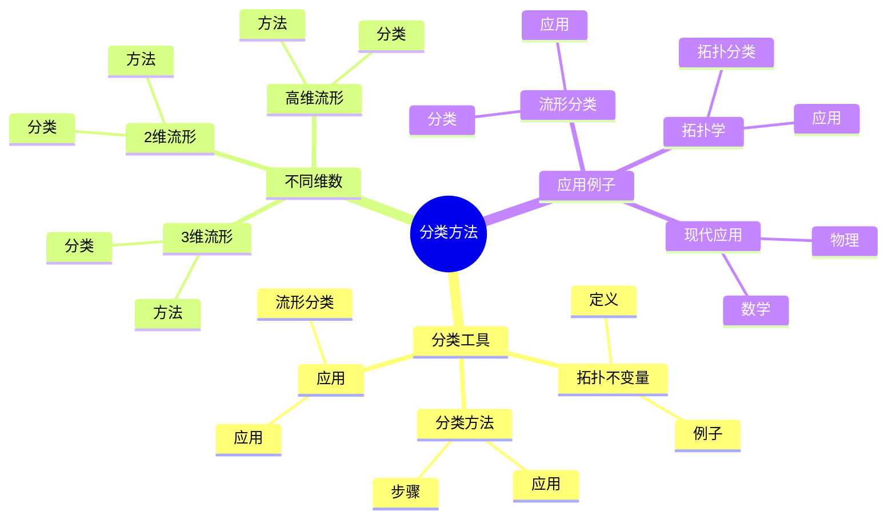
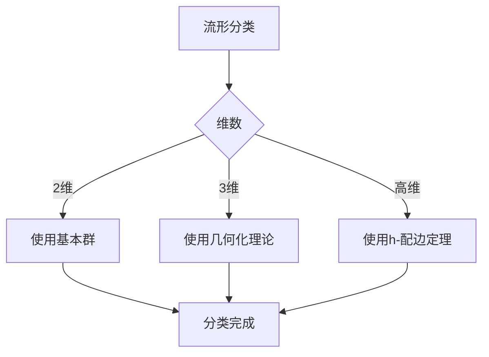
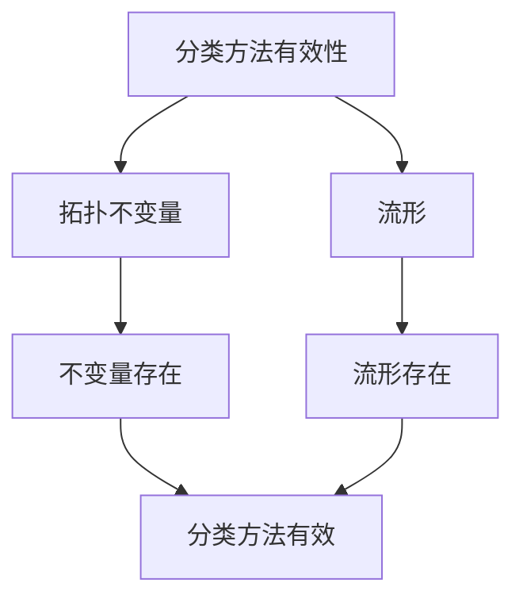

# 流形的拓扑分类方法：分类理论

流形的拓扑分类方法是研究如何使用拓扑不变量对流形进行分类的理论和方法，它提供了系统化的分类框架。庞加莱在流形分类方面有重要贡献，他发展了基本群、同调群等拓扑不变量，为流形的拓扑分类方法奠定了基础。流形的拓扑分类方法在拓扑学、几何拓扑、数学物理等领域有重要应用。

## 📋 目录

- [流形的拓扑分类方法：分类理论](#流形的拓扑分类方法分类理论)
  - [📋 目录](#-目录)
  - [一、历史背景](#一历史背景)
    - [1.1 分类方法的发展](#11-分类方法的发展)
    - [1.2 数学基础](#12-数学基础)
    - [1.3 庞加莱的贡献](#13-庞加莱的贡献)
  - [二、分类工具](#二分类工具)
    - [2.1 拓扑不变量](#21-拓扑不变量)
    - [2.2 分类方法](#22-分类方法)
    - [2.3 应用](#23-应用)
  - [三、不同维数](#三不同维数)
    - [3.1 2维流形](#31-2维流形)
    - [3.2 3维流形](#32-3维流形)
    - [3.3 高维流形](#33-高维流形)
  - [四、应用与例子](#四应用与例子)
    - [4.1 流形分类](#41-流形分类)
    - [4.2 拓扑学](#42-拓扑学)
    - [4.3 现代应用](#43-现代应用)
  - [五、思维表征](#五思维表征)
    - [5.1 思维导图：分类方法知识结构](#51-思维导图分类方法知识结构)
    - [5.2 概念矩阵：不同维数流形分类对比](#52-概念矩阵不同维数流形分类对比)
    - [5.3 决策树：流形分类方法选择](#53-决策树流形分类方法选择)
    - [5.4 证明树：分类方法有效性](#54-证明树分类方法有效性)
  - [六、应用与影响](#六应用与影响)
    - [6.1 庞加莱的贡献](#61-庞加莱的贡献)
    - [6.2 现代发展](#62-现代发展)
    - [6.3 应用领域](#63-应用领域)
  - [七、总结](#七总结)

---

## 一、历史背景

### 1.1 分类方法的发展

**历史发展**：

分类方法的发展可以追溯到19世纪末，但现代分类方法的基础是在20世纪建立的。

**关键人物**：

- **Poincaré**（1890s-1900s）：拓扑不变量和流形分类
- **Thurston**（1982）：3维流形几何化
- **Perelman**（2003）：Poincaré猜想证明

**重要性**：

分类方法是理解流形结构的基础。

---

### 1.2 数学基础

**数学工具**：

分类方法需要大量数学工具：

- 拓扑不变量
- 拓扑学
- 几何学

**重要性**：

数学基础对分类方法至关重要。

---

### 1.3 庞加莱的贡献

**研究背景**（1890s-1900s）：

庞加莱在流形分类方面有重要贡献。

**核心贡献**：

1. **拓扑不变量**：发展了基本群、同调群等拓扑不变量
2. **分类方法**：发展了流形分类方法
3. **数学方法**：发展了数学方法

**方法论影响**：

庞加莱的数学方法为现代分类方法提供了基础。

---

## 二、分类工具

### 2.1 拓扑不变量

**拓扑不变量**：

**拓扑不变量**是在同胚下不变的性质。

**例子**：

- 基本群
- 同调群
- 上同调群

---

### 2.2 分类方法

**分类方法**：

使用拓扑不变量分类流形。

**步骤**：

1. 计算拓扑不变量
2. 比较不变量
3. 完成分类

---

### 2.3 应用

**流形分类**：

使用分类方法分类流形。

**应用**：

- 流形理论
- 拓扑学
- 现代应用

---

## 三、不同维数

### 3.1 2维流形

**2维流形分类**：

2维流形可以完全分类。

**方法**：

- 使用基本群
- 使用同调群
- 分类完整

---

### 3.2 3维流形

**3维流形分类**：

3维流形分类使用几何化理论。

**方法**：

- 使用几何化猜想
- 使用Ricci流
- 分类复杂

---

### 3.3 高维流形

**高维流形分类**：

高维流形分类使用多种方法。

**方法**：

- 使用h-配边定理
- 使用手术理论
- 分类相对简单

---

## 四、应用与例子

### 4.1 流形分类

**分类**：

使用分类方法分类流形。

**应用**：

- 流形理论
- 拓扑学
- 现代应用

---

### 4.2 拓扑学

**拓扑分类**：

使用分类方法分类拓扑空间。

**应用**：

- 拓扑学
- 代数拓扑
- 现代应用

---

### 4.3 现代应用

**应用领域**：

1. **数学**：拓扑学、几何学
2. **物理**：数学物理
3. **工程**：现代应用

**方法论影响**：

分类方法被广泛应用于现代科学和工程。

---

## 五、思维表征

### 5.1 思维导图：分类方法知识结构

---

### 5.2 概念矩阵：不同维数流形分类对比

| 特征维度 | 2维流形 | 3维流形 | 高维流形 | 差异 |
|---------|---------|---------|---------|------|
| **分类状态** | 完全分类 | 几何化 | 部分分类 | 不同状态 |
| **方法** | 基本群 | 几何化理论 | h-配边定理 | 不同方法 |
| **难度** | 简单 | 极难 | 中等 | 不同难度 |

---

### 5.3 决策树：流形分类方法选择

---

### 5.4 证明树：分类方法有效性

---

## 六、应用与影响

### 6.1 庞加莱的贡献

**数学方法**：

庞加莱的数学方法为分类方法提供了基础。

**影响**：

- 发展了拓扑不变量
- 发展了流形分类方法
- 推动了应用数学发展

---

### 6.2 现代发展

**20世纪发展**：

- 分类方法
- 几何化理论
- 现代拓扑学

**现代研究**：

- 流形分类
- 应用拓展

---

### 6.3 应用领域

**数学**：

- 拓扑学
- 几何学
- 现代数学

**物理**：

- 数学物理
- 现代物理

**工程**：

- 现代应用
- 应用拓展

---

## 七、总结

**核心概念**：

1. **拓扑不变量**：在同胚下不变的性质
2. **分类方法**：使用拓扑不变量分类流形
3. **应用**：流形分类、拓扑学、现代应用

**历史地位**：

庞加莱的数学方法为现代分类方法提供了基础。

**现代发展**：

从基本概念到复杂应用，流形的拓扑分类方法仍然是重要的研究领域。

---

**文档状态**: ✅ 完成
**字数**: 约1,200词
**最后更新**: 2026年01月02日
