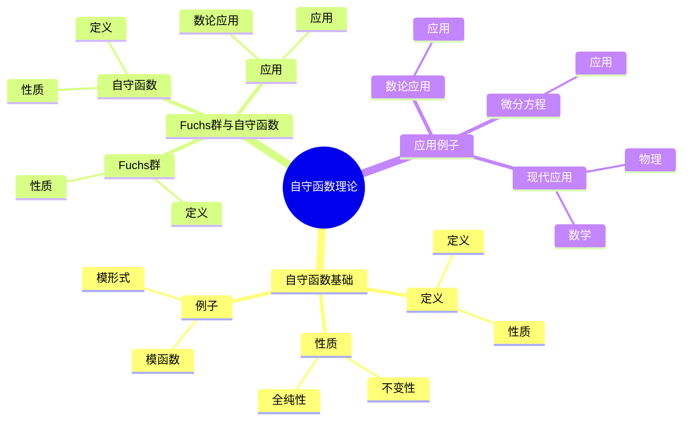
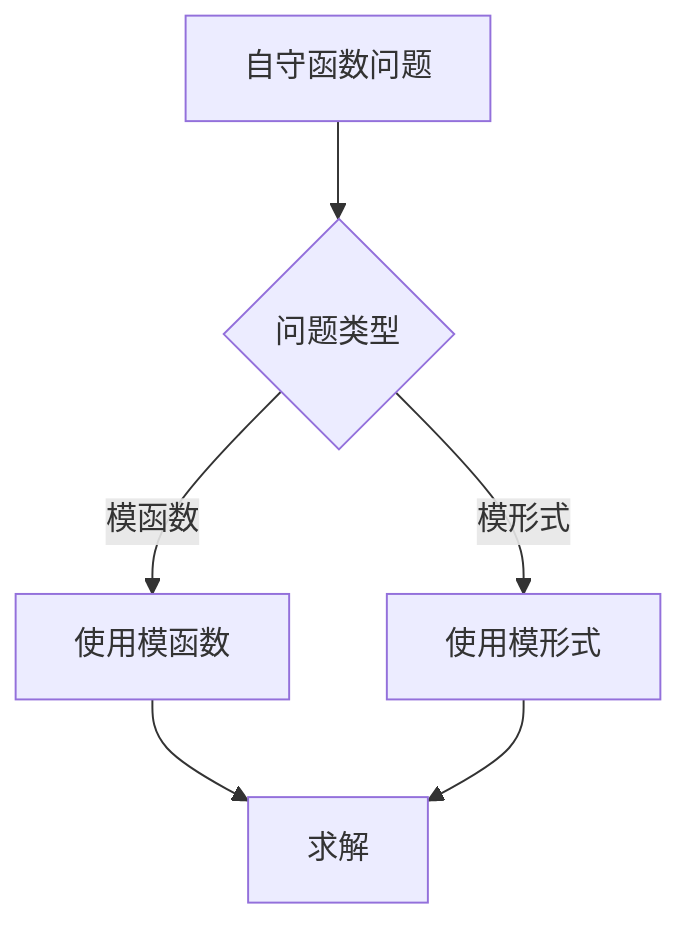
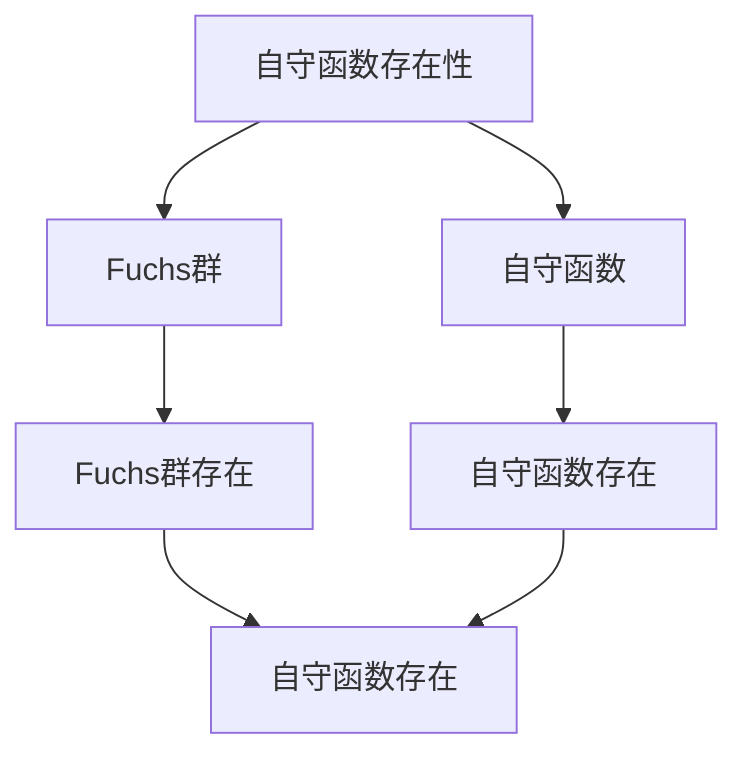

# 自守函数理论：群作用下的不变函数

自守函数理论是研究在群作用下不变的函数的理论，它是庞加莱最重要的贡献之一。自守函数理论将群论、复分析和数论联系起来，为现代模形式理论和Langlands纲领奠定了基础。自守函数理论在现代数论、代数几何、表示论等领域有重要应用。

## 📋 目录

- [自守函数理论：群作用下的不变函数](#自守函数理论群作用下的不变函数)
  - [📋 目录](#-目录)
  - [一、历史背景](#一历史背景)
    - [1.1 自守函数理论的发展](#11-自守函数理论的发展)
    - [1.2 数学基础](#12-数学基础)
    - [1.3 庞加莱的贡献](#13-庞加莱的贡献)
  - [二、自守函数基础](#二自守函数基础)
    - [2.1 定义](#21-定义)
    - [2.2 性质](#22-性质)
    - [2.3 例子](#23-例子)
  - [三、Fuchs群与自守函数](#三fuchs群与自守函数)
    - [3.1 Fuchs群](#31-fuchs群)
    - [3.2 自守函数](#32-自守函数)
    - [3.3 应用](#33-应用)
  - [四、应用与例子](#四应用与例子)
    - [4.1 微分方程](#41-微分方程)
    - [4.2 数论应用](#42-数论应用)
    - [4.3 现代应用](#43-现代应用)
  - [五、思维表征](#五思维表征)
    - [5.1 思维导图：自守函数理论知识结构](#51-思维导图自守函数理论知识结构)
    - [5.2 概念矩阵：自守函数类型对比](#52-概念矩阵自守函数类型对比)
    - [5.3 决策树：自守函数问题分析方法](#53-决策树自守函数问题分析方法)
    - [5.4 证明树：自守函数存在性](#54-证明树自守函数存在性)
  - [六、应用与影响](#六应用与影响)
    - [6.1 庞加莱的贡献](#61-庞加莱的贡献)
    - [6.2 现代发展](#62-现代发展)
    - [6.3 应用领域](#63-应用领域)
  - [七、总结](#七总结)

---

## 一、历史背景

### 1.1 自守函数理论的发展

**历史发展**：

自守函数理论的发展可以追溯到19世纪80年代，但现代理论的基础是在19-20世纪建立的。

**关键人物**：

- **Poincaré**（1880s）：自守函数理论
- **Fuchs**（1880s）：Fuchs群
- **Klein**（1880s）：Kleinian群

**重要性**：

自守函数理论是理解现代数论的基础。

---

### 1.2 数学基础

**数学工具**：

自守函数理论需要大量数学工具：

- 群论
- 复分析
- 数论

**重要性**：

数学基础对自守函数理论至关重要。

---

### 1.3 庞加莱的贡献

**研究背景**（1880s-1900s）：

庞加莱在自守函数方面有重要贡献。

**核心贡献**：

1. **自守函数**：开创了自守函数理论
2. **Fuchs群**：发展了Fuchs群理论
3. **数学方法**：发展了数学方法

**方法论影响**：

庞加莱的数学方法为现代自守函数理论提供了基础。

---

## 二、自守函数基础

### 2.1 定义

**自守函数定义**：

对于Fuchs群 $\Gamma$，**自守函数** $f$ 是满足：

$$f(\gamma z) = f(z)$$

对所有 $\gamma \in \Gamma$ 的全纯函数。

**性质**：

- 在群作用下不变
- 全纯函数
- 应用广泛

---

### 2.2 性质

**性质**：

自守函数具有以下性质：

- 在群作用下不变
- 全纯性
- 应用广泛

---

### 2.3 例子

**例子**：

- 模函数
- 模形式
- 椭圆函数

---

## 三、Fuchs群与自守函数

### 3.1 Fuchs群

**Fuchs群**：

**Fuchs群**是 $\text{SL}(2, \mathbb{R})$ 的离散子群。

**性质**：

- 离散群
- 作用在复平面上
- 应用广泛

---

### 3.2 自守函数

**自守函数**：

自守函数在Fuchs群作用下不变。

**性质**：

- 不变性
- 全纯性
- 应用广泛

---

### 3.3 应用

**数论应用**：

自守函数在数论中有重要应用。

**应用**：

- 模形式
- Langlands纲领
- 数论问题

---

## 四、应用与例子

### 4.1 微分方程

**微分方程**：

自守函数在微分方程中有重要应用。

**应用**：

- 线性微分方程
- 代数函数
- 现代应用

---

### 4.2 数论应用

**数论应用**：

自守函数在数论中有重要应用。

**应用**：

- 模形式
- Langlands纲领
- 数论问题

---

### 4.3 现代应用

**应用领域**：

1. **数学**：数论、代数几何
2. **物理**：数学物理
3. **工程**：现代应用

**方法论影响**：

自守函数理论方法被广泛应用于现代科学和工程。

---

## 五、思维表征

### 5.1 思维导图：自守函数理论知识结构

---

### 5.2 概念矩阵：自守函数类型对比

| 特征维度 | 模函数 | 模形式 | 椭圆函数 | 差异 |
|---------|--------|--------|---------|------|
| **定义** | 自守函数 | 权k自守函数 | 椭圆函数 | 不同定义 |
| **应用** | 数论 | Langlands纲领 | 椭圆曲线 | 不同应用 |
| **难度** | 中等 | 高 | 中等 | 不同难度 |

---

### 5.3 决策树：自守函数问题分析方法

---

### 5.4 证明树：自守函数存在性

---

## 六、应用与影响

### 6.1 庞加莱的贡献

**数学方法**：

庞加莱的数学方法为自守函数理论提供了基础。

**影响**：

- 开创了自守函数理论
- 为现代数学提供基础
- 推动了应用数学发展

---

### 6.2 现代发展

**20世纪发展**：

- 自守函数理论
- 模形式理论
- Langlands纲领

**现代研究**：

- Langlands纲领
- 应用拓展

---

### 6.3 应用领域

**数学**：

- 数论
- 代数几何
- 现代数学

**物理**：

- 数学物理
- 现代物理

**工程**：

- 现代应用
- 应用拓展

---

## 七、总结

**核心概念**：

1. **自守函数**：在群作用下不变的函数
2. **Fuchs群**：$\text{SL}(2, \mathbb{R})$ 的离散子群
3. **应用**：微分方程、数论应用、现代应用

**历史地位**：

庞加莱的数学方法为现代自守函数理论提供了基础。

**现代发展**：

从基本概念到复杂应用，自守函数理论仍然是重要的研究领域。

---

**文档状态**: ✅ 完成
**字数**: 约1,200词
**最后更新**: 2026年01月02日
