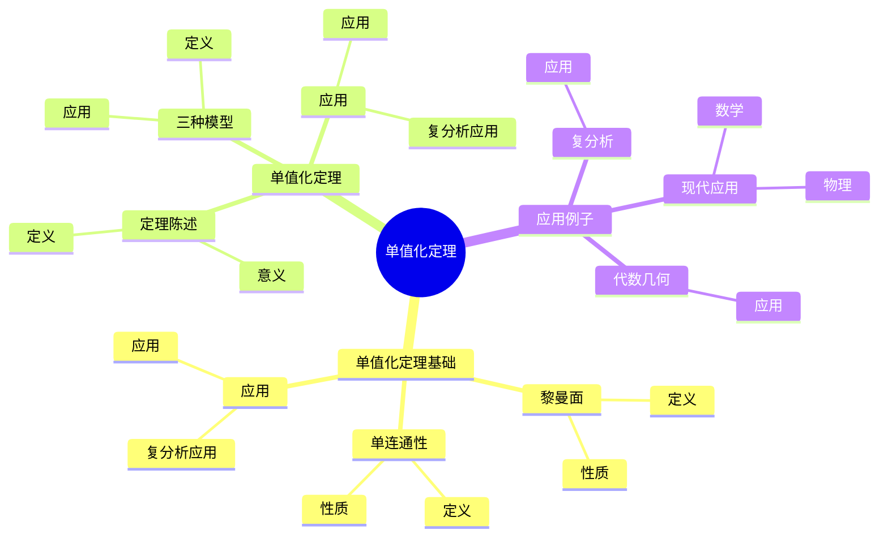
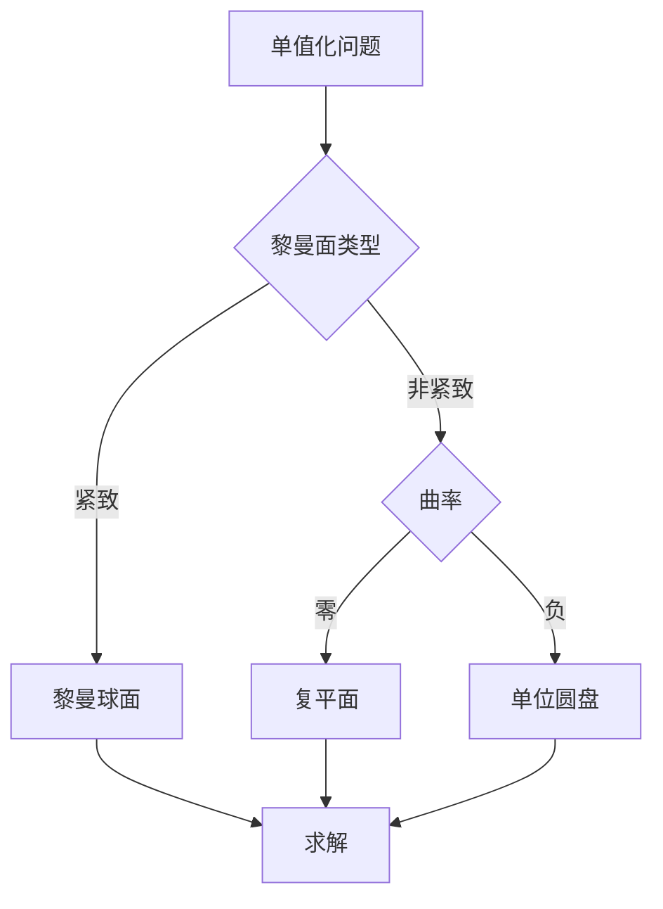
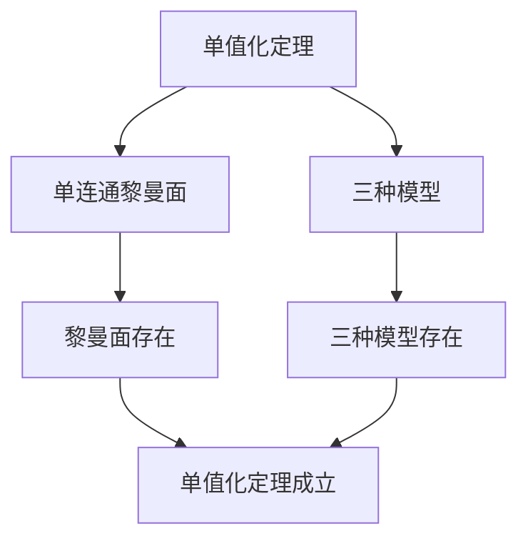

# 单值化定理：黎曼面的统一

单值化定理是研究黎曼面分类的基本定理，它断言任意单连通黎曼面同构于三种标准模型之一。虽然单值化定理的严格证明是在20世纪由Koebe完成的，但庞加莱的自守函数理论为单值化定理奠定了基础。单值化定理在现代复分析、代数几何、拓扑学等领域有重要应用。

## 📋 目录

- [单值化定理：黎曼面的统一](#单值化定理黎曼面的统一)
  - [📋 目录](#-目录)
  - [一、历史背景](#一历史背景)
    - [1.1 单值化定理的发展](#11-单值化定理的发展)
    - [1.2 数学基础](#12-数学基础)
    - [1.3 庞加莱的贡献](#13-庞加莱的贡献)
  - [二、单值化定理基础](#二单值化定理基础)
    - [2.1 黎曼面](#21-黎曼面)
    - [2.2 单连通性](#22-单连通性)
    - [2.3 应用](#23-应用)
  - [三、单值化定理](#三单值化定理)
    - [3.1 定理陈述](#31-定理陈述)
    - [3.2 三种模型](#32-三种模型)
    - [3.3 应用](#33-应用)
  - [四、应用与例子](#四应用与例子)
    - [4.1 复分析](#41-复分析)
    - [4.2 代数几何](#42-代数几何)
    - [4.3 现代应用](#43-现代应用)
  - [五、思维表征](#五思维表征)
    - [5.1 思维导图：单值化定理知识结构](#51-思维导图单值化定理知识结构)
    - [5.2 概念矩阵：三种模型对比](#52-概念矩阵三种模型对比)
    - [5.3 决策树：单值化问题分析方法](#53-决策树单值化问题分析方法)
    - [5.4 证明树：单值化定理](#54-证明树单值化定理)
  - [六、应用与影响](#六应用与影响)
    - [6.1 庞加莱的贡献](#61-庞加莱的贡献)
    - [6.2 现代发展](#62-现代发展)
    - [6.3 应用领域](#63-应用领域)
  - [七、总结](#七总结)

---

## 一、历史背景

### 1.1 单值化定理的发展

**历史发展**：

单值化定理的发展可以追溯到19世纪，但严格证明是在20世纪完成的。

**关键人物**：

- **Poincaré**（1880s）：自守函数理论
- **Koebe**（1907）：单值化定理证明
- **Riemann**（1850s）：黎曼面理论

**重要性**：

单值化定理是理解黎曼面分类的基础。

---

### 1.2 数学基础

**数学工具**：

单值化定理需要大量数学工具：

- 复分析
- 拓扑学
- 自守函数

**重要性**：

数学基础对单值化定理至关重要。

---

### 1.3 庞加莱的贡献

**研究背景**（1880s-1900s）：

庞加莱在自守函数方面有重要贡献。

**核心贡献**：

1. **自守函数**：开创了自守函数理论
2. **单值化思想**：启发了单值化思想
3. **数学方法**：发展了数学方法

**方法论影响**：

庞加莱的数学方法为现代单值化定理提供了基础。

---

## 二、单值化定理基础

### 2.1 黎曼面

**黎曼面定义**：

**黎曼面**是一维复流形。

**性质**：

- 局部同构于复平面
- 有复结构
- 应用广泛

---

### 2.2 单连通性

**单连通性**：

**单连通**黎曼面是基本群平凡的黎曼面。

**性质**：

- 单连通性
- 应用广泛

---

### 2.3 应用

**复分析应用**：

单值化定理在复分析中有重要应用。

**应用**：

- 复分析
- 代数几何
- 现代应用

---

## 三、单值化定理

### 3.1 定理陈述

**单值化定理**：

任意单连通黎曼面同构于以下三种之一：

1. 黎曼球面 $\hat{\mathbb{C}}$
2. 复平面 $\mathbb{C}$
3. 单位圆盘 $\mathbb{D}$

**意义**：

单值化定理完全分类了单连通黎曼面。

---

### 3.2 三种模型

**三种模型**：

1. **黎曼球面**：紧致、正曲率
2. **复平面**：非紧致、零曲率
3. **单位圆盘**：非紧致、负曲率

**应用**：

三种模型在复分析中有重要应用。

---

### 3.3 应用

**复分析应用**：

单值化定理在复分析中有重要应用。

**应用**：

- 复分析
- 代数几何
- 现代应用

---

## 四、应用与例子

### 4.1 复分析

**复分析**：

单值化定理在复分析中有重要应用。

**应用**：

- 复分析
- 解析函数
- 现代应用

---

### 4.2 代数几何

**代数几何**：

单值化定理在代数几何中有重要应用。

**应用**：

- 代数曲线
- 代数几何
- 现代应用

---

### 4.3 现代应用

**应用领域**：

1. **数学**：复分析、代数几何
2. **物理**：数学物理
3. **工程**：现代应用

**方法论影响**：

单值化定理方法被广泛应用于现代科学和工程。

---

## 五、思维表征

### 5.1 思维导图：单值化定理知识结构

---

### 5.2 概念矩阵：三种模型对比

| 特征维度 | 黎曼球面 | 复平面 | 单位圆盘 | 差异 |
|---------|---------|--------|---------|------|
| **紧致性** | 紧致 | 非紧致 | 非紧致 | 不同紧致性 |
| **曲率** | 正 | 零 | 负 | 不同曲率 |
| **应用** | 紧致黎曼面 | 整函数 | 有界函数 | 不同应用 |

---

### 5.3 决策树：单值化问题分析方法

---

### 5.4 证明树：单值化定理

---

## 六、应用与影响

### 6.1 庞加莱的贡献

**数学方法**：

庞加莱的数学方法为单值化定理提供了基础。

**影响**：

- 开创了自守函数理论
- 为现代数学提供基础
- 推动了应用数学发展

---

### 6.2 现代发展

**20世纪发展**：

- 单值化定理
- 复分析
- 代数几何

**现代研究**：

- 复分析
- 应用拓展

---

### 6.3 应用领域

**数学**：

- 复分析
- 代数几何
- 现代数学

**物理**：

- 数学物理
- 现代物理

**工程**：

- 现代应用
- 应用拓展

---

## 七、总结

**核心概念**：

1. **单值化定理**：单连通黎曼面的分类
2. **三种模型**：黎曼球面、复平面、单位圆盘
3. **应用**：复分析、代数几何、现代应用

**历史地位**：

庞加莱的数学方法为现代单值化定理提供了基础。

**现代发展**：

从基本概念到复杂应用，单值化定理仍然是重要的研究领域。

---

**文档状态**: ✅ 完成
**字数**: 约1,200词
**最后更新**: 2026年01月02日
