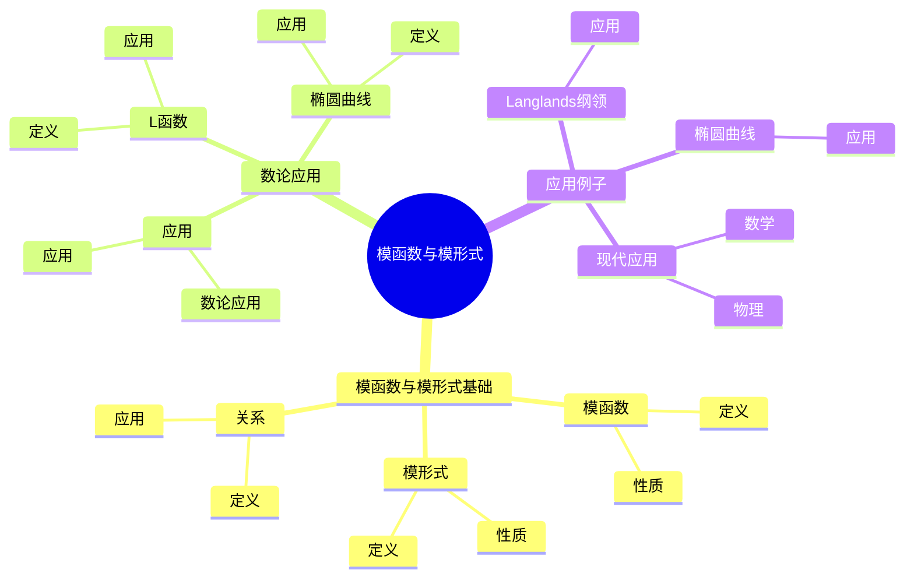
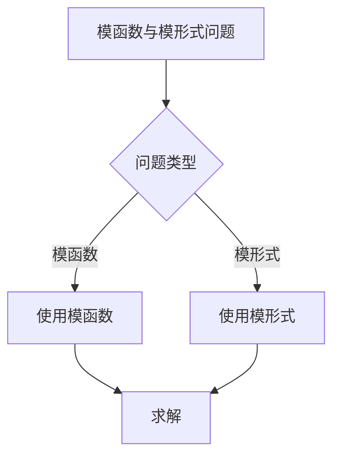
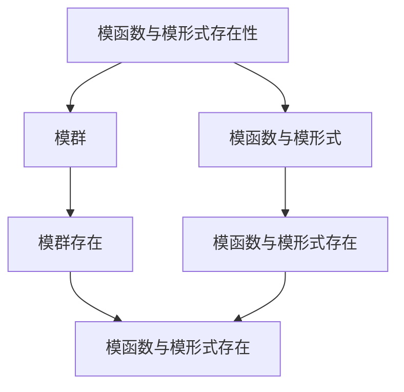

# 模函数与模形式：自守函数的数论应用

模函数与模形式是自守函数的数论应用，它们将自守函数理论与数论联系起来。虽然模函数与模形式的严格形式化是在20世纪完成的，但庞加莱的自守函数理论为模函数与模形式奠定了基础。模函数与模形式在Langlands纲领、椭圆曲线、数论等领域有重要应用。

## 📋 目录

- [模函数与模形式：自守函数的数论应用](#模函数与模形式自守函数的数论应用)
  - [📋 目录](#-目录)
  - [一、历史背景](#一历史背景)
    - [1.1 模函数与模形式的发展](#11-模函数与模形式的发展)
    - [1.2 数学基础](#12-数学基础)
    - [1.3 庞加莱的贡献](#13-庞加莱的贡献)
  - [二、模函数与模形式基础](#二模函数与模形式基础)
    - [2.1 模函数](#21-模函数)
    - [2.2 模形式](#22-模形式)
    - [2.3 关系](#23-关系)
  - [三、数论应用](#三数论应用)
    - [3.1 L函数](#31-l函数)
    - [3.2 椭圆曲线](#32-椭圆曲线)
    - [3.3 应用](#33-应用)
  - [四、应用与例子](#四应用与例子)
    - [4.1 Langlands纲领](#41-langlands纲领)
    - [4.2 椭圆曲线](#42-椭圆曲线)
    - [4.3 现代应用](#43-现代应用)
  - [五、思维表征](#五思维表征)
    - [5.1 思维导图：模函数与模形式知识结构](#51-思维导图模函数与模形式知识结构)
    - [5.2 概念矩阵：模函数与模形式对比](#52-概念矩阵模函数与模形式对比)
    - [5.3 决策树：模函数与模形式问题分析方法](#53-决策树模函数与模形式问题分析方法)
    - [5.4 证明树：模函数与模形式存在性](#54-证明树模函数与模形式存在性)
  - [六、应用与影响](#六应用与影响)
    - [6.1 庞加莱的贡献](#61-庞加莱的贡献)
    - [6.2 现代发展](#62-现代发展)
    - [6.3 应用领域](#63-应用领域)
  - [七、总结](#七总结)

---

## 一、历史背景

### 1.1 模函数与模形式的发展

**历史发展**：

模函数与模形式的发展可以追溯到20世纪，但现代理论的基础是在20世纪建立的。

**关键人物**：

- **Poincaré**（1880s）：自守函数
- **Hecke**（1920s）：Hecke算子
- **Langlands**（1960s）：Langlands纲领

**重要性**：

模函数与模形式是理解Langlands纲领的基础。

---

### 1.2 数学基础

**数学工具**：

模函数与模形式需要大量数学工具：

- 自守函数
- 数论
- 表示论

**重要性**：

数学基础对模函数与模形式至关重要。

---

### 1.3 庞加莱的贡献

**研究背景**（1880s-1900s）：

庞加莱在自守函数方面有重要贡献。

**核心贡献**：

1. **自守函数**：开创了自守函数理论
2. **模形式思想**：启发了模形式思想
3. **数学方法**：发展了数学方法

**方法论影响**：

庞加莱的数学方法为现代模函数与模形式提供了基础。

---

## 二、模函数与模形式基础

### 2.1 模函数

**模函数定义**：

**模函数**是权为0的模形式。

**性质**：

- 在模群作用下不变
- 全纯函数
- 应用广泛

---

### 2.2 模形式

**模形式定义**：

**模形式**是满足模变换性质的全纯函数。

**性质**：

- 模变换性质
- 全纯性
- Fourier展开

---

### 2.3 关系

**关系**：

模函数是模形式的特例。

**应用**：

- 数论
- Langlands纲领
- 现代应用

---

## 三、数论应用

### 3.1 L函数

**L函数**：

模形式的L函数在数论中有重要应用。

**应用**：

- Langlands纲领
- 数论问题
- 现代应用

---

### 3.2 椭圆曲线

**椭圆曲线**：

模形式与椭圆曲线相关。

**应用**：

- Fermat大定理
- 椭圆曲线
- 数论问题

---

### 3.3 应用

**数论应用**：

模函数与模形式在数论中有重要应用。

**应用**：

- Langlands纲领
- 椭圆曲线
- 数论问题

---

## 四、应用与例子

### 4.1 Langlands纲领

**Langlands纲领**：

模函数与模形式在Langlands纲领中有重要应用。

**应用**：

- Langlands纲领
- 数域研究
- 现代应用

---

### 4.2 椭圆曲线

**椭圆曲线**：

模函数与模形式在椭圆曲线中有重要应用。

**应用**：

- Fermat大定理
- 椭圆曲线
- 数论问题

---

### 4.3 现代应用

**应用领域**：

1. **数学**：数论、Langlands纲领
2. **物理**：数学物理
3. **工程**：现代应用

**方法论影响**：

模函数与模形式方法被广泛应用于现代科学和工程。

---

## 五、思维表征

### 5.1 思维导图：模函数与模形式知识结构

---

### 5.2 概念矩阵：模函数与模形式对比

| 特征维度 | 模函数 | 模形式 | 差异 |
|---------|--------|--------|------|
| **权** | 0 | k | 不同权 |
| **应用** | 数论 | Langlands纲领 | 不同应用 |
| **难度** | 中等 | 高 | 不同难度 |

---

### 5.3 决策树：模函数与模形式问题分析方法

---

### 5.4 证明树：模函数与模形式存在性

---

## 六、应用与影响

### 6.1 庞加莱的贡献

**数学方法**：

庞加莱的数学方法为模函数与模形式提供了基础。

**影响**：

- 开创了自守函数理论
- 为现代数学提供基础
- 推动了应用数学发展

---

### 6.2 现代发展

**20世纪发展**：

- 模函数与模形式
- Langlands纲领
- 椭圆曲线

**现代研究**：

- Langlands纲领
- 应用拓展

---

### 6.3 应用领域

**数学**：

- 数论
- Langlands纲领
- 现代数学

**物理**：

- 数学物理
- 现代物理

**工程**：

- 现代应用
- 应用拓展

---

## 七、总结

**核心概念**：

1. **模函数**：权为0的模形式
2. **模形式**：满足模变换性质的全纯函数
3. **应用**：Langlands纲领、椭圆曲线、现代应用

**历史地位**：

庞加莱的数学方法为现代模函数与模形式提供了基础。

**现代发展**：

从基本概念到复杂应用，模函数与模形式仍然是重要的研究领域。

---

**文档状态**: ✅ 完成
**字数**: 约1,200词
**最后更新**: 2026年01月02日
