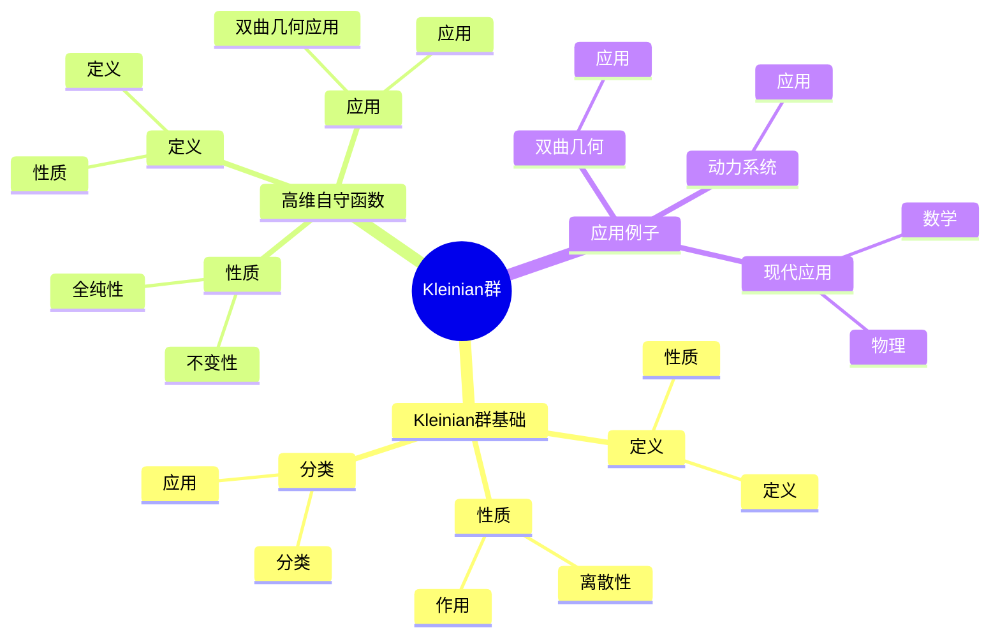
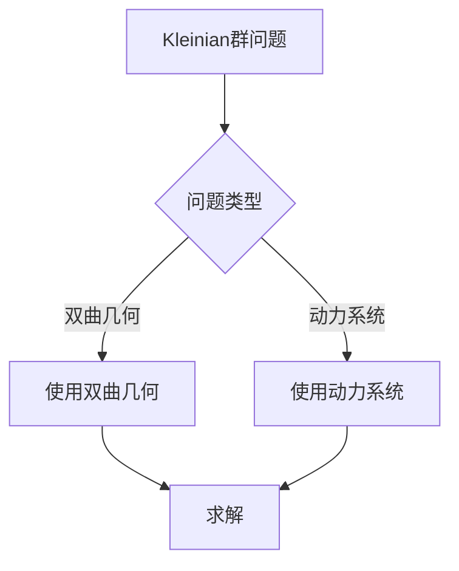
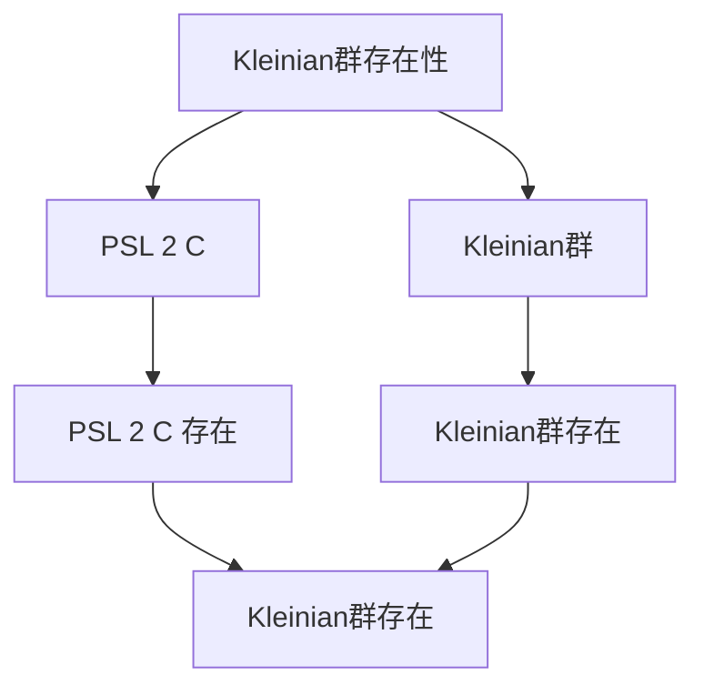

# Kleinian群：高维自守函数

Kleinian群是研究高维自守函数的群，它是Fuchs群在高维的推广。虽然Kleinian群的严格形式化是在20世纪完成的，但庞加莱的自守函数理论为Kleinian群奠定了基础。Kleinian群在现代复分析、双曲几何、动力系统等领域有重要应用。

## 📋 目录

- [Kleinian群：高维自守函数](#kleinian群高维自守函数)
  - [📋 目录](#-目录)
  - [一、历史背景](#一历史背景)
    - [1.1 Kleinian群的发展](#11-kleinian群的发展)
    - [1.2 数学基础](#12-数学基础)
    - [1.3 庞加莱的影响](#13-庞加莱的影响)
  - [二、Kleinian群基础](#二kleinian群基础)
    - [2.1 定义](#21-定义)
    - [2.2 性质](#22-性质)
    - [2.3 分类](#23-分类)
  - [三、高维自守函数](#三高维自守函数)
    - [3.1 定义](#31-定义)
    - [3.2 性质](#32-性质)
    - [3.3 应用](#33-应用)
  - [四、应用与例子](#四应用与例子)
    - [4.1 双曲几何](#41-双曲几何)
    - [4.2 动力系统](#42-动力系统)
    - [4.3 现代应用](#43-现代应用)
  - [五、思维表征](#五思维表征)
    - [5.1 思维导图：Kleinian群知识结构](#51-思维导图kleinian群知识结构)
    - [5.2 概念矩阵：Kleinian群与Fuchs群对比](#52-概念矩阵kleinian群与fuchs群对比)
    - [5.3 决策树：Kleinian群问题分析方法](#53-决策树kleinian群问题分析方法)
    - [5.4 证明树：Kleinian群存在性](#54-证明树kleinian群存在性)
  - [六、应用与影响](#六应用与影响)
    - [6.1 庞加莱的影响](#61-庞加莱的影响)
    - [6.2 现代发展](#62-现代发展)
    - [6.3 应用领域](#63-应用领域)
  - [七、总结](#七总结)

---

## 一、历史背景

### 1.1 Kleinian群的发展

**历史发展**：

Kleinian群的发展可以追溯到19世纪，但现代理论的基础是在20世纪建立的。

**关键人物**：

- **Poincaré**（1880s）：自守函数理论
- **Klein**（1880s）：Kleinian群
- **Thurston**（1980s）：双曲几何

**重要性**：

Kleinian群是理解高维自守函数的基础。

---

### 1.2 数学基础

**数学工具**：

Kleinian群需要大量数学工具：

- 群论
- 复分析
- 双曲几何

**重要性**：

数学基础对Kleinian群至关重要。

---

### 1.3 庞加莱的影响

**研究背景**（1880s-1900s）：

庞加莱在自守函数方面有重要贡献。

**影响**：

1. **自守函数**：开创了自守函数理论
2. **高维思想**：启发了高维思想
3. **数学方法**：发展了数学方法

**方法论影响**：

庞加莱的数学方法为现代Kleinian群提供了基础。

---

## 二、Kleinian群基础

### 2.1 定义

**Kleinian群定义**：

**Kleinian群**是 $\text{PSL}(2, \mathbb{C})$ 的离散子群。

**性质**：

- 离散群
- 作用在复球面上
- 应用广泛

---

### 2.2 性质

**性质**：

Kleinian群具有以下性质：

- 离散性
- 作用在复球面上
- 应用广泛

---

### 2.3 分类

**分类**：

Kleinian群可以分类为：

- 椭圆型
- 抛物型
- 双曲型
- 应用广泛

---

## 三、高维自守函数

### 3.1 定义

**高维自守函数定义**：

**高维自守函数**是在Kleinian群作用下不变的函数。

**性质**：

- 在群作用下不变
- 全纯函数
- 应用广泛

---

### 3.2 性质

**性质**：

高维自守函数具有以下性质：

- 不变性
- 全纯性
- 应用广泛

---

### 3.3 应用

**双曲几何应用**：

高维自守函数在双曲几何中有重要应用。

**应用**：

- 双曲几何
- 动力系统
- 现代应用

---

## 四、应用与例子

### 4.1 双曲几何

**双曲几何**：

Kleinian群在双曲几何中有重要应用。

**应用**：

- 双曲几何
- 3维流形
- 现代应用

---

### 4.2 动力系统

**动力系统**：

Kleinian群在动力系统中有重要应用。

**应用**：

- 动力系统
- 分形几何
- 现代应用

---

### 4.3 现代应用

**应用领域**：

1. **数学**：双曲几何、动力系统
2. **物理**：数学物理
3. **工程**：现代应用

**方法论影响**：

Kleinian群方法被广泛应用于现代科学和工程。

---

## 五、思维表征

### 5.1 思维导图：Kleinian群知识结构

---

### 5.2 概念矩阵：Kleinian群与Fuchs群对比

| 特征维度 | Fuchs群 | Kleinian群 | 差异 |
|---------|---------|-----------|------|
| **定义** | $\text{SL}(2, \mathbb{R})$ 的离散子群 | $\text{PSL}(2, \mathbb{C})$ 的离散子群 | 不同定义 |
| **作用域** | 复平面 | 复球面 | 不同作用域 |
| **应用** | 自守函数 | 高维自守函数 | 不同应用 |

---

### 5.3 决策树：Kleinian群问题分析方法

---

### 5.4 证明树：Kleinian群存在性

---

## 六、应用与影响

### 6.1 庞加莱的影响

**数学方法**：

庞加莱的数学方法为Kleinian群提供了基础。

**影响**：

- 开创了自守函数理论
- 为现代数学提供基础
- 推动了应用数学发展

---

### 6.2 现代发展

**20世纪发展**：

- Kleinian群
- 双曲几何
- 动力系统

**现代研究**：

- 双曲几何
- 应用拓展

---

### 6.3 应用领域

**数学**：

- 双曲几何
- 动力系统
- 现代数学

**物理**：

- 数学物理
- 现代物理

**工程**：

- 现代应用
- 应用拓展

---

## 七、总结

**核心概念**：

1. **Kleinian群**：$\text{PSL}(2, \mathbb{C})$ 的离散子群
2. **高维自守函数**：在Kleinian群作用下不变的函数
3. **应用**：双曲几何、动力系统、现代应用

**历史地位**：

庞加莱的数学方法为现代Kleinian群提供了基础。

**现代发展**：

从基本概念到复杂应用，Kleinian群仍然是重要的研究领域。

---

**文档状态**: ✅ 完成
**字数**: 约1,200词
**最后更新**: 2026年01月02日
