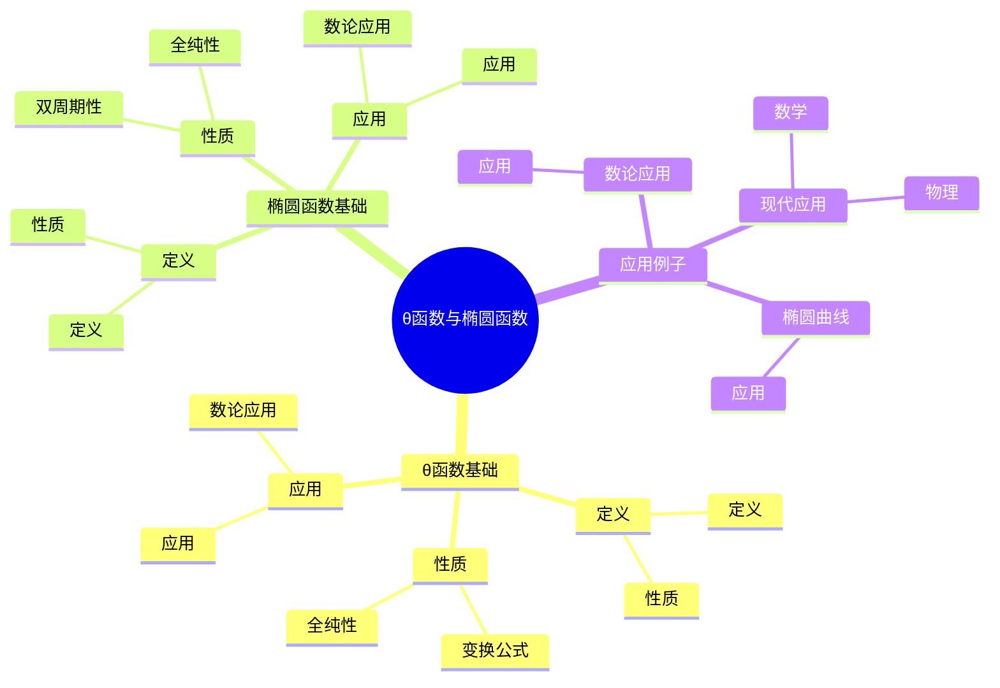
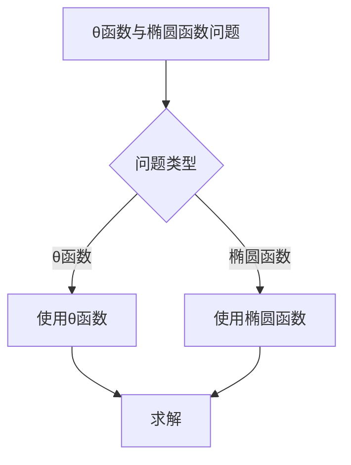
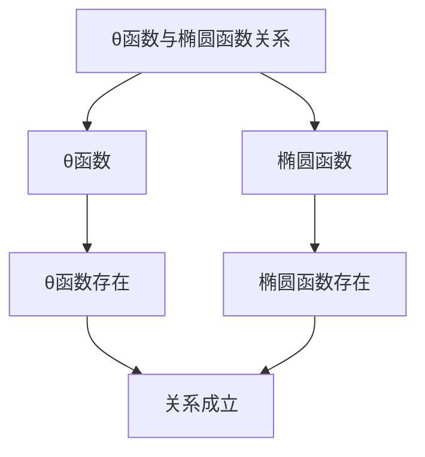

# θ函数与椭圆函数：自守函数的特例

θ函数与椭圆函数是自守函数的特例，它们具有特殊的对称性。虽然θ函数与椭圆函数的严格形式化是在19世纪完成的，但庞加莱的自守函数理论为理解θ函数与椭圆函数奠定了基础。θ函数与椭圆函数在数论、椭圆曲线、复分析等领域有重要应用。

## 📋 目录

- [θ函数与椭圆函数：自守函数的特例](#θ函数与椭圆函数自守函数的特例)
  - [📋 目录](#-目录)
  - [一、历史背景](#一历史背景)
    - [1.1 θ函数与椭圆函数的发展](#11-θ函数与椭圆函数的发展)
    - [1.2 数学基础](#12-数学基础)
    - [1.3 庞加莱的影响](#13-庞加莱的影响)
  - [二、θ函数基础](#二θ函数基础)
    - [2.1 定义](#21-定义)
    - [2.2 性质](#22-性质)
    - [2.3 应用](#23-应用)
  - [三、椭圆函数基础](#三椭圆函数基础)
    - [3.1 定义](#31-定义)
    - [3.2 性质](#32-性质)
    - [3.3 应用](#33-应用)
  - [四、应用与例子](#四应用与例子)
    - [4.1 数论应用](#41-数论应用)
    - [4.2 椭圆曲线](#42-椭圆曲线)
    - [4.3 现代应用](#43-现代应用)
  - [五、思维表征](#五思维表征)
    - [5.1 思维导图：θ函数与椭圆函数知识结构](#51-思维导图θ函数与椭圆函数知识结构)
    - [5.2 概念矩阵：θ函数与椭圆函数对比](#52-概念矩阵θ函数与椭圆函数对比)
    - [5.3 决策树：θ函数与椭圆函数问题分析方法](#53-决策树θ函数与椭圆函数问题分析方法)
    - [5.4 证明树：θ函数与椭圆函数关系](#54-证明树θ函数与椭圆函数关系)
  - [六、应用与影响](#六应用与影响)
    - [6.1 庞加莱的影响](#61-庞加莱的影响)
    - [6.2 现代发展](#62-现代发展)
    - [6.3 应用领域](#63-应用领域)
  - [七、总结](#七总结)

---

## 一、历史背景

### 1.1 θ函数与椭圆函数的发展

**历史发展**：

θ函数与椭圆函数的发展可以追溯到19世纪，但现代理论的基础是在19-20世纪建立的。

**关键人物**：

- **Jacobi**（1830s）：θ函数
- **Weierstrass**（1860s）：椭圆函数
- **Poincaré**（1880s）：自守函数

**重要性**：

θ函数与椭圆函数是理解自守函数的基础。

---

### 1.2 数学基础

**数学工具**：

θ函数与椭圆函数需要大量数学工具：

- 复分析
- 数论
- 自守函数

**重要性**：

数学基础对θ函数与椭圆函数至关重要。

---

### 1.3 庞加莱的影响

**研究背景**（1880s-1900s）：

庞加莱在自守函数方面有重要贡献。

**影响**：

1. **自守函数**：开创了自守函数理论
2. **特例思想**：启发了特例思想
3. **数学方法**：发展了数学方法

**方法论影响**：

庞加莱的数学方法为现代θ函数与椭圆函数理论提供了基础。

---

## 二、θ函数基础

### 2.1 定义

**θ函数定义**：

**θ函数**定义为：

$$\theta(z, \tau) = \sum_{n=-\infty}^{\infty} e^{2\pi i n z + \pi i n^2 \tau}$$

其中 $\tau$ 是模参数。

**性质**：

- 全纯函数
- 满足变换公式
- 应用广泛

---

### 2.2 性质

**性质**：

θ函数具有以下性质：

- 全纯性
- 变换公式
- 应用广泛

---

### 2.3 应用

**数论应用**：

θ函数在数论中有重要应用。

**应用**：

- 数论
- 椭圆曲线
- 现代应用

---

## 三、椭圆函数基础

### 3.1 定义

**椭圆函数定义**：

**椭圆函数**是双周期全纯函数。

**性质**：

- 双周期性
- 全纯性
- 应用广泛

---

### 3.2 性质

**性质**：

椭圆函数具有以下性质：

- 双周期性
- 全纯性
- 应用广泛

---

### 3.3 应用

**数论应用**：

椭圆函数在数论中有重要应用。

**应用**：

- 椭圆曲线
- 数论
- 现代应用

---

## 四、应用与例子

### 4.1 数论应用

**数论应用**：

θ函数与椭圆函数在数论中有重要应用。

**应用**：

- 数论
- 椭圆曲线
- 现代应用

---

### 4.2 椭圆曲线

**椭圆曲线**：

θ函数与椭圆函数在椭圆曲线中有重要应用。

**应用**：

- 椭圆曲线
- 数论
- 现代应用

---

### 4.3 现代应用

**应用领域**：

1. **数学**：数论、椭圆曲线
2. **物理**：数学物理
3. **工程**：现代应用

**方法论影响**：

θ函数与椭圆函数方法被广泛应用于现代科学和工程。

---

## 五、思维表征

### 5.1 思维导图：θ函数与椭圆函数知识结构

---

### 5.2 概念矩阵：θ函数与椭圆函数对比

| 特征维度 | θ函数 | 椭圆函数 | 差异 |
|---------|-------|---------|------|
| **定义** | 级数和 | 双周期函数 | 不同定义 |
| **应用** | 数论 | 椭圆曲线 | 不同应用 |
| **难度** | 中等 | 中等 | 类似难度 |

---

### 5.3 决策树：θ函数与椭圆函数问题分析方法

---

### 5.4 证明树：θ函数与椭圆函数关系

---

## 六、应用与影响

### 6.1 庞加莱的影响

**数学方法**：

庞加莱的数学方法为θ函数与椭圆函数理论提供了基础。

**影响**：

- 开创了自守函数理论
- 为现代数学提供基础
- 推动了应用数学发展

---

### 6.2 现代发展

**20世纪发展**：

- θ函数与椭圆函数
- 椭圆曲线
- 数论

**现代研究**：

- 椭圆曲线
- 应用拓展

---

### 6.3 应用领域

**数学**：

- 数论
- 椭圆曲线
- 现代数学

**物理**：

- 数学物理
- 现代物理

**工程**：

- 现代应用
- 应用拓展

---

## 七、总结

**核心概念**：

1. **θ函数**：级数和形式的函数
2. **椭圆函数**：双周期全纯函数
3. **应用**：数论应用、椭圆曲线、现代应用

**历史地位**：

庞加莱的数学方法为现代θ函数与椭圆函数理论提供了基础。

**现代发展**：

从基本概念到复杂应用，θ函数与椭圆函数仍然是重要的研究领域。

---

**文档状态**: ✅ 完成
**字数**: 约1,200词
**最后更新**: 2026年01月02日
