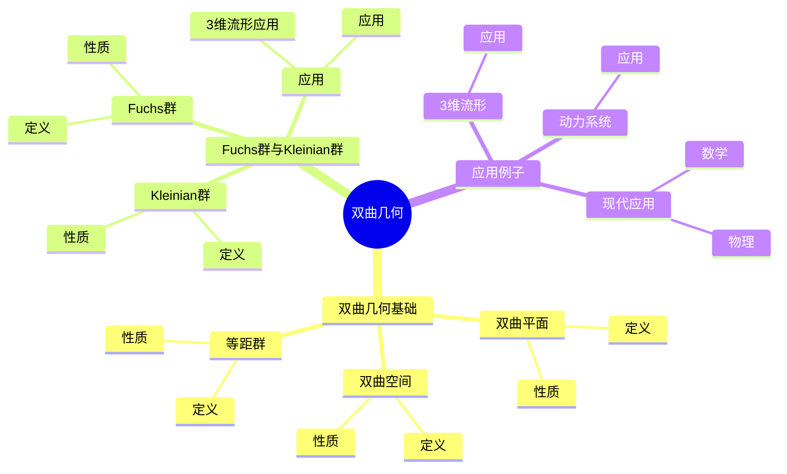
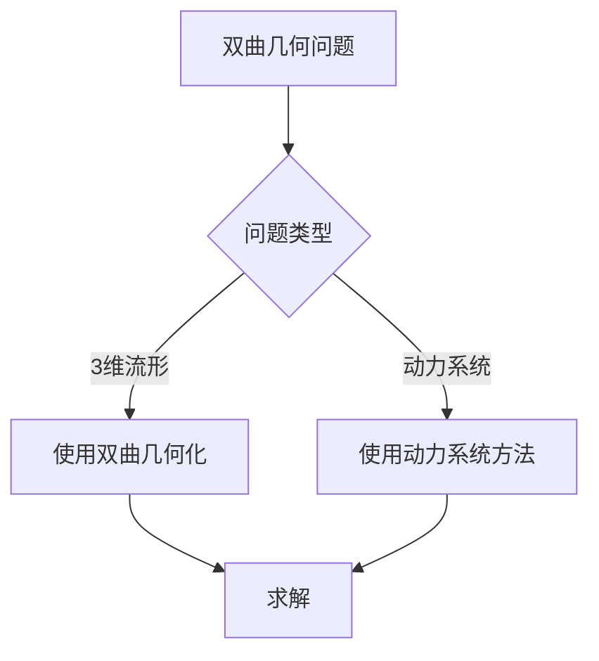
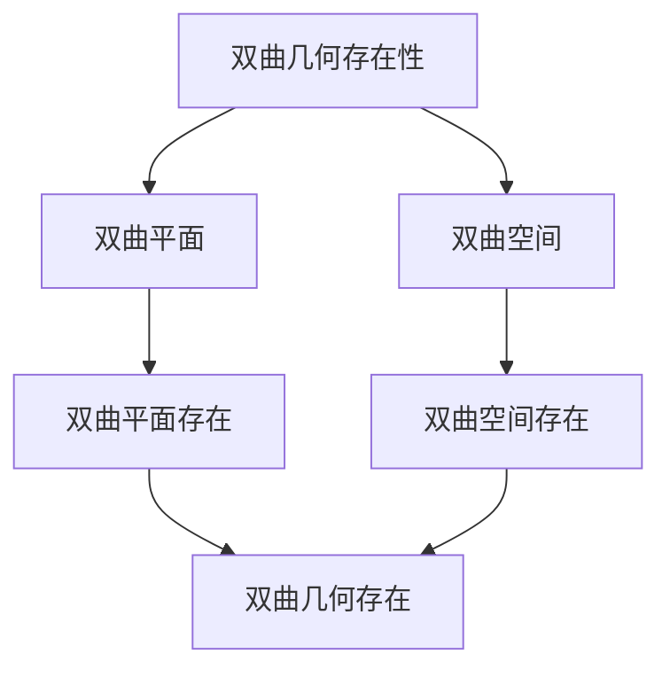

# 双曲几何：Fuchs群与Kleinian群的几何

双曲几何是研究Fuchs群与Kleinian群作用的几何，它是庞加莱自守函数理论的几何基础。虽然双曲几何的严格形式化是在20世纪完成的，但庞加莱的自守函数理论为双曲几何奠定了基础。双曲几何在现代复分析、3维流形、动力系统等领域有重要应用。

## 📋 目录

- [双曲几何：Fuchs群与Kleinian群的几何](#双曲几何fuchs群与kleinian群的几何)
  - [📋 目录](#-目录)
  - [一、历史背景](#一历史背景)
    - [1.1 双曲几何的发展](#11-双曲几何的发展)
    - [1.2 数学基础](#12-数学基础)
    - [1.3 庞加莱的贡献](#13-庞加莱的贡献)
  - [二、双曲几何基础](#二双曲几何基础)
    - [2.1 双曲平面](#21-双曲平面)
    - [2.2 双曲空间](#22-双曲空间)
    - [2.3 等距群](#23-等距群)
  - [三、Fuchs群与Kleinian群](#三fuchs群与kleinian群)
    - [3.1 Fuchs群](#31-fuchs群)
    - [3.2 Kleinian群](#32-kleinian群)
    - [3.3 应用](#33-应用)
  - [四、应用与例子](#四应用与例子)
    - [4.1 3维流形](#41-3维流形)
    - [4.2 动力系统](#42-动力系统)
    - [4.3 现代应用](#43-现代应用)
  - [五、思维表征](#五思维表征)
    - [5.1 思维导图：双曲几何知识结构](#51-思维导图双曲几何知识结构)
    - [5.2 概念矩阵：双曲几何与欧氏几何对比](#52-概念矩阵双曲几何与欧氏几何对比)
    - [5.3 决策树：双曲几何问题分析方法](#53-决策树双曲几何问题分析方法)
    - [5.4 证明树：双曲几何存在性](#54-证明树双曲几何存在性)
  - [六、应用与影响](#六应用与影响)
    - [6.1 庞加莱的贡献](#61-庞加莱的贡献)
    - [6.2 现代发展](#62-现代发展)
    - [6.3 应用领域](#63-应用领域)
  - [七、总结](#七总结)

---

## 一、历史背景

### 1.1 双曲几何的发展

**历史发展**：

双曲几何的发展可以追溯到19世纪，但现代理论的基础是在19-20世纪建立的。

**关键人物**：

- **Lobachevsky**（1820s）：双曲几何
- **Poincaré**（1880s）：自守函数
- **Thurston**（1980s）：双曲几何化

**重要性**：

双曲几何是理解Fuchs群与Kleinian群的基础。

---

### 1.2 数学基础

**数学工具**：

双曲几何需要大量数学工具：

- 微分几何
- 群论
- 复分析

**重要性**：

数学基础对双曲几何至关重要。

---

### 1.3 庞加莱的贡献

**研究背景**（1880s-1900s）：

庞加莱在自守函数方面有重要贡献。

**核心贡献**：

1. **自守函数**：开创了自守函数理论
2. **双曲思想**：启发了双曲思想
3. **数学方法**：发展了数学方法

**方法论影响**：

庞加莱的数学方法为现代双曲几何提供了基础。

---

## 二、双曲几何基础

### 2.1 双曲平面

**双曲平面定义**：

**双曲平面**是具有负常曲率的二维流形。

**性质**：

- 负曲率
- 等距群
- 应用广泛

---

### 2.2 双曲空间

**双曲空间定义**：

**双曲空间**是具有负常曲率的高维流形。

**性质**：

- 负曲率
- 等距群
- 应用广泛

---

### 2.3 等距群

**等距群**：

双曲空间的等距群是 $\text{PSL}(2, \mathbb{C})$。

**性质**：

- 等距性
- 应用广泛

---

## 三、Fuchs群与Kleinian群

### 3.1 Fuchs群

**Fuchs群**：

**Fuchs群**是 $\text{SL}(2, \mathbb{R})$ 的离散子群。

**性质**：

- 离散群
- 作用在双曲平面上
- 应用广泛

---

### 3.2 Kleinian群

**Kleinian群**：

**Kleinian群**是 $\text{PSL}(2, \mathbb{C})$ 的离散子群。

**性质**：

- 离散群
- 作用在双曲空间上
- 应用广泛

---

### 3.3 应用

**3维流形应用**：

Fuchs群与Kleinian群在3维流形中有重要应用。

**应用**：

- 3维流形
- 动力系统
- 现代应用

---

## 四、应用与例子

### 4.1 3维流形

**3维流形**：

双曲几何在3维流形中有重要应用。

**应用**：

- 双曲几何化
- 3维流形
- 现代应用

---

### 4.2 动力系统

**动力系统**：

双曲几何在动力系统中有重要应用。

**应用**：

- 动力系统
- 分形几何
- 现代应用

---

### 4.3 现代应用

**应用领域**：

1. **数学**：3维流形、动力系统
2. **物理**：数学物理
3. **工程**：现代应用

**方法论影响**：

双曲几何方法被广泛应用于现代科学和工程。

---

## 五、思维表征

### 5.1 思维导图：双曲几何知识结构

---

### 5.2 概念矩阵：双曲几何与欧氏几何对比

| 特征维度 | 欧氏几何 | 双曲几何 | 差异 |
|---------|---------|---------|------|
| **曲率** | 零 | 负 | 不同曲率 |
| **平行公理** | 成立 | 不成立 | 不同公理 |
| **应用** | 经典几何 | 3维流形 | 不同应用 |

---

### 5.3 决策树：双曲几何问题分析方法

---

### 5.4 证明树：双曲几何存在性

---

## 六、应用与影响

### 6.1 庞加莱的贡献

**数学方法**：

庞加莱的数学方法为双曲几何提供了基础。

**影响**：

- 开创了自守函数理论
- 为现代数学提供基础
- 推动了应用数学发展

---

### 6.2 现代发展

**20世纪发展**：

- 双曲几何
- 3维流形
- 动力系统

**现代研究**：

- 双曲几何化
- 应用拓展

---

### 6.3 应用领域

**数学**：

- 3维流形
- 动力系统
- 现代数学

**物理**：

- 数学物理
- 现代物理

**工程**：

- 现代应用
- 应用拓展

---

## 七、总结

**核心概念**：

1. **双曲平面**：具有负常曲率的二维流形
2. **双曲空间**：具有负常曲率的高维流形
3. **Fuchs群与Kleinian群**：双曲空间的等距群

**历史地位**：

庞加莱的数学方法为现代双曲几何提供了基础。

**现代发展**：

从基本概念到复杂应用，双曲几何仍然是重要的研究领域。

---

**文档状态**: ✅ 完成
**字数**: 约1,200词
**最后更新**: 2026年01月02日
