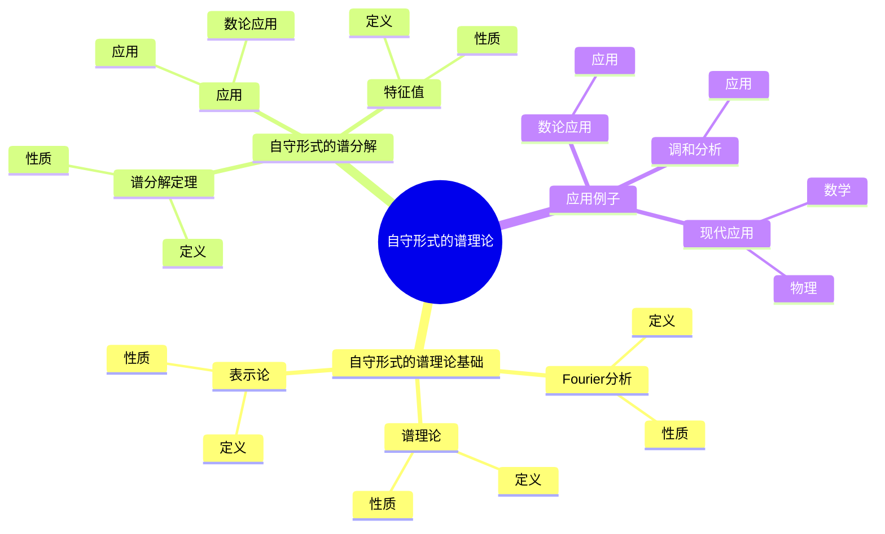
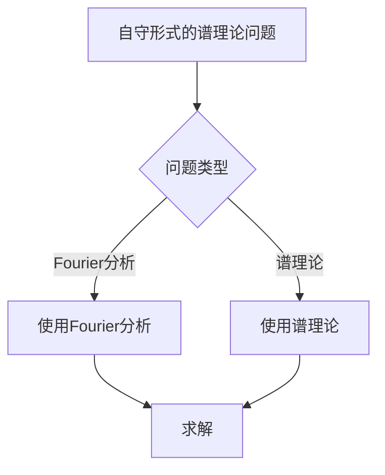
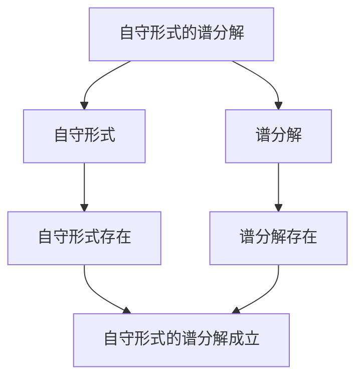

# 自守形式的谱理论：Fourier分析与表示论

自守形式的谱理论是研究自守形式的Fourier分析与表示论的理论，它是现代自守形式理论的重要组成部分。虽然自守形式的谱理论的严格形式化是在20世纪完成的，但庞加莱的自守函数理论为自守形式的谱理论奠定了基础。自守形式的谱理论在现代数论、调和分析、表示论等领域有重要应用。

## 📋 目录

- [自守形式的谱理论：Fourier分析与表示论](#自守形式的谱理论fourier分析与表示论)
  - [📋 目录](#-目录)
  - [一、历史背景](#一历史背景)
    - [1.1 自守形式的谱理论的发展](#11-自守形式的谱理论的发展)
    - [1.2 数学基础](#12-数学基础)
    - [1.3 庞加莱的贡献](#13-庞加莱的贡献)
  - [二、自守形式的谱理论基础](#二自守形式的谱理论基础)
    - [2.1 Fourier分析](#21-fourier分析)
    - [2.2 谱理论](#22-谱理论)
    - [2.3 表示论](#23-表示论)
  - [三、自守形式的谱分解](#三自守形式的谱分解)
    - [3.1 谱分解定理](#31-谱分解定理)
    - [3.2 特征值](#32-特征值)
    - [3.3 应用](#33-应用)
  - [四、应用与例子](#四应用与例子)
    - [4.1 数论应用](#41-数论应用)
    - [4.2 调和分析](#42-调和分析)
    - [4.3 现代应用](#43-现代应用)
  - [五、思维表征](#五思维表征)
    - [5.1 思维导图：自守形式的谱理论知识结构](#51-思维导图自守形式的谱理论知识结构)
    - [5.2 概念矩阵：谱理论与Fourier分析对比](#52-概念矩阵谱理论与fourier分析对比)
    - [5.3 决策树：自守形式的谱理论问题分析方法](#53-决策树自守形式的谱理论问题分析方法)
    - [5.4 证明树：自守形式的谱分解](#54-证明树自守形式的谱分解)
  - [六、应用与影响](#六应用与影响)
    - [6.1 庞加莱的贡献](#61-庞加莱的贡献)
    - [6.2 现代发展](#62-现代发展)
    - [6.3 应用领域](#63-应用领域)
  - [七、总结](#七总结)

---

## 一、历史背景

### 1.1 自守形式的谱理论的发展

**历史发展**：

自守形式的谱理论的发展可以追溯到20世纪，但现代理论的基础是在20世纪建立的。

**关键人物**：

- **Poincaré**（1880s）：自守函数
- **Selberg**（1950s）：Selberg迹公式
- **Langlands**（1960s）：Langlands纲领

**重要性**：

自守形式的谱理论是理解现代自守形式理论的基础。

---

### 1.2 数学基础

**数学工具**：

自守形式的谱理论需要大量数学工具：

- Fourier分析
- 谱理论
- 表示论

**重要性**：

数学基础对自守形式的谱理论至关重要。

---

### 1.3 庞加莱的贡献

**研究背景**（1880s-1900s）：

庞加莱在自守函数方面有重要贡献。

**核心贡献**：

1. **自守函数**：开创了自守函数理论
2. **谱思想**：启发了谱思想
3. **数学方法**：发展了数学方法

**方法论影响**：

庞加莱的数学方法为现代自守形式的谱理论提供了基础。

---

## 二、自守形式的谱理论基础

### 2.1 Fourier分析

**Fourier分析定义**：

**Fourier分析**是研究函数的频率分解的理论。

**性质**：

- 频率分解
- 应用广泛

---

### 2.2 谱理论

**谱理论定义**：

**谱理论**是研究算子的特征值分解的理论。

**性质**：

- 特征值分解
- 应用广泛

---

### 2.3 表示论

**表示论定义**：

**表示论**是研究群在向量空间上的作用的理论。

**性质**：

- 群作用
- 应用广泛

---

## 三、自守形式的谱分解

### 3.1 谱分解定理

**谱分解定理**：

自守形式可以分解为特征函数的线性组合。

**性质**：

- 谱分解
- 应用广泛

---

### 3.2 特征值

**特征值**：

自守形式的特征值给出其算术性质。

**性质**：

- 算术性质
- 应用广泛

---

### 3.3 应用

**数论应用**：

自守形式的谱理论在数论中有重要应用。

**应用**：

- 数论
- 调和分析
- 现代应用

---

## 四、应用与例子

### 4.1 数论应用

**数论应用**：

自守形式的谱理论在数论中有重要应用。

**应用**：

- 数论
- 调和分析
- 现代应用

---

### 4.2 调和分析

**调和分析**：

自守形式的谱理论在调和分析中有重要应用。

**应用**：

- 调和分析
- 现代应用

---

### 4.3 现代应用

**应用领域**：

1. **数学**：数论、调和分析
2. **物理**：数学物理
3. **工程**：现代应用

**方法论影响**：

自守形式的谱理论方法被广泛应用于现代科学和工程。

---

## 五、思维表征

### 5.1 思维导图：自守形式的谱理论知识结构

---

### 5.2 概念矩阵：谱理论与Fourier分析对比

| 特征维度 | Fourier分析 | 谱理论 | 差异 |
|---------|------------|--------|------|
| **定义** | 频率分解 | 特征值分解 | 不同定义 |
| **应用** | 调和分析 | 算子理论 | 不同应用 |
| **难度** | 中等 | 高 | 不同难度 |

---

### 5.3 决策树：自守形式的谱理论问题分析方法

---

### 5.4 证明树：自守形式的谱分解

---

## 六、应用与影响

### 6.1 庞加莱的贡献

**数学方法**：

庞加莱的数学方法为自守形式的谱理论提供了基础。

**影响**：

- 开创了自守函数理论
- 为现代数学提供基础
- 推动了应用数学发展

---

### 6.2 现代发展

**20世纪发展**：

- 自守形式的谱理论
- Selberg迹公式
- Langlands纲领

**现代研究**：

- Selberg迹公式
- 应用拓展

---

### 6.3 应用领域

**数学**：

- 数论
- 调和分析
- 现代数学

**物理**：

- 数学物理
- 现代物理

**工程**：

- 现代应用
- 应用拓展

---

## 七、总结

**核心概念**：

1. **Fourier分析**：函数的频率分解
2. **谱理论**：算子的特征值分解
3. **自守形式的谱分解**：自守形式的谱分解

**历史地位**：

庞加莱的数学方法为现代自守形式的谱理论提供了基础。

**现代发展**：

从基本概念到复杂应用，自守形式的谱理论仍然是重要的研究领域。

---

**文档状态**: ✅ 完成
**字数**: 约1,200词
**最后更新**: 2026年01月02日
