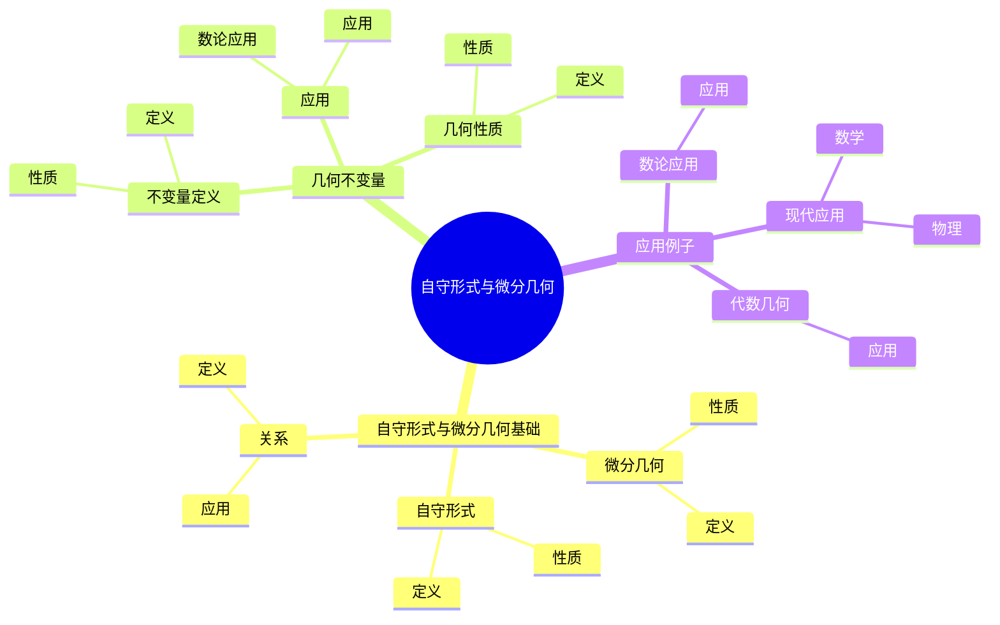
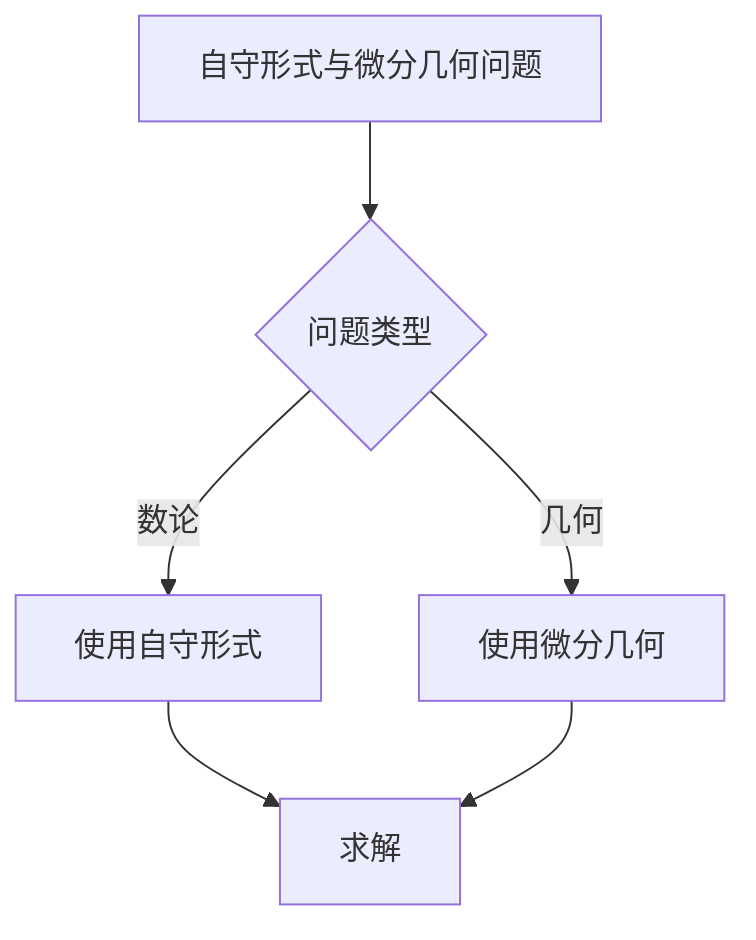
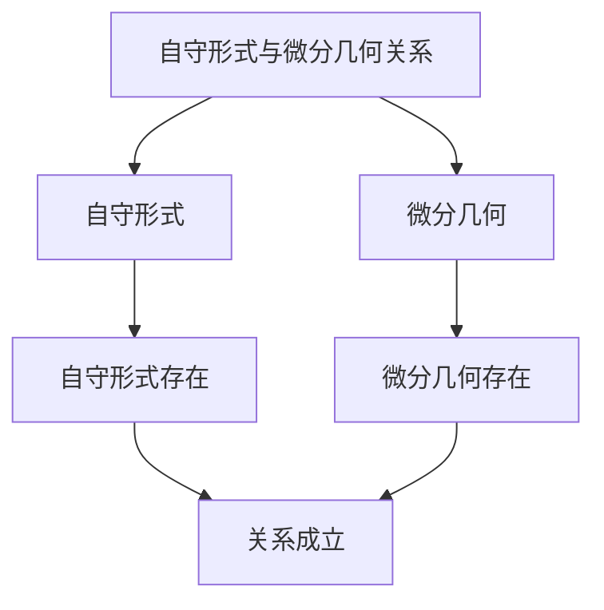

# 自守形式与微分几何：几何不变量

自守形式与微分几何是研究自守形式在微分几何中的应用的理论，它将自守形式理论与微分几何联系起来。虽然自守形式与微分几何的严格形式化是在20世纪完成的，但庞加莱的自守函数理论为自守形式与微分几何奠定了基础。自守形式与微分几何在现代数论、代数几何、微分几何等领域有重要应用。

## 📋 目录

- [自守形式与微分几何：几何不变量](#自守形式与微分几何几何不变量)
  - [📋 目录](#-目录)
  - [一、历史背景](#一历史背景)
    - [1.1 自守形式与微分几何的发展](#11-自守形式与微分几何的发展)
    - [1.2 数学基础](#12-数学基础)
    - [1.3 庞加莱的贡献](#13-庞加莱的贡献)
  - [二、自守形式与微分几何基础](#二自守形式与微分几何基础)
    - [2.1 微分几何](#21-微分几何)
    - [2.2 自守形式](#22-自守形式)
    - [2.3 关系](#23-关系)
  - [三、几何不变量](#三几何不变量)
    - [3.1 不变量定义](#31-不变量定义)
    - [3.2 几何性质](#32-几何性质)
    - [3.3 应用](#33-应用)
  - [四、应用与例子](#四应用与例子)
    - [4.1 数论应用](#41-数论应用)
    - [4.2 代数几何](#42-代数几何)
    - [4.3 现代应用](#43-现代应用)
  - [五、思维表征](#五思维表征)
    - [5.1 思维导图：自守形式与微分几何知识结构](#51-思维导图自守形式与微分几何知识结构)
    - [5.2 概念矩阵：自守形式与微分几何对比](#52-概念矩阵自守形式与微分几何对比)
    - [5.3 决策树：自守形式与微分几何问题分析方法](#53-决策树自守形式与微分几何问题分析方法)
    - [5.4 证明树：自守形式与微分几何关系](#54-证明树自守形式与微分几何关系)
  - [六、应用与影响](#六应用与影响)
    - [6.1 庞加莱的贡献](#61-庞加莱的贡献)
    - [6.2 现代发展](#62-现代发展)
    - [6.3 应用领域](#63-应用领域)
  - [七、总结](#七总结)

---

## 一、历史背景

### 1.1 自守形式与微分几何的发展

**历史发展**：

自守形式与微分几何的发展可以追溯到20世纪，但现代理论的基础是在20世纪建立的。

**关键人物**：

- **Poincaré**（1880s）：自守函数
- **Chern**（1940s）：Chern类
- **Atiyah**（1960s）：指标定理

**重要性**：

自守形式与微分几何是理解现代数论与几何的基础。

---

### 1.2 数学基础

**数学工具**：

自守形式与微分几何需要大量数学工具：

- 微分几何
- 自守形式
- 代数几何

**重要性**：

数学基础对自守形式与微分几何至关重要。

---

### 1.3 庞加莱的贡献

**研究背景**（1880s-1900s）：

庞加莱在自守函数方面有重要贡献。

**核心贡献**：

1. **自守函数**：开创了自守函数理论
2. **几何思想**：启发了几何思想
3. **数学方法**：发展了数学方法

**方法论影响**：

庞加莱的数学方法为现代自守形式与微分几何提供了基础。

---

## 二、自守形式与微分几何基础

### 2.1 微分几何

**微分几何定义**：

**微分几何**是研究流形上的几何结构的理论。

**性质**：

- 流形结构
- 几何不变量
- 应用广泛

---

### 2.2 自守形式

**自守形式定义**：

**自守形式**是满足模变换性质的全纯函数。

**性质**：

- 模变换性质
- 全纯性
- 应用广泛

---

### 2.3 关系

**关系**：

自守形式与微分几何有密切关系。

**应用**：

- 数论
- 代数几何
- 现代应用

---

## 三、几何不变量

### 3.1 不变量定义

**几何不变量定义**：

**几何不变量**是在几何变换下保持不变的量。

**性质**：

- 不变性
- 应用广泛

---

### 3.2 几何性质

**几何性质**：

自守形式给出几何不变量。

**性质**：

- 几何不变量
- 应用广泛

---

### 3.3 应用

**数论应用**：

自守形式与微分几何在数论中有重要应用。

**应用**：

- 数论
- 代数几何
- 现代应用

---

## 四、应用与例子

### 4.1 数论应用

**数论应用**：

自守形式与微分几何在数论中有重要应用。

**应用**：

- 数论
- 代数几何
- 现代应用

---

### 4.2 代数几何

**代数几何**：

自守形式与微分几何在代数几何中有重要应用。

**应用**：

- 代数几何
- 现代应用

---

### 4.3 现代应用

**应用领域**：

1. **数学**：数论、代数几何
2. **物理**：数学物理
3. **工程**：现代应用

**方法论影响**：

自守形式与微分几何方法被广泛应用于现代科学和工程。

---

## 五、思维表征

### 5.1 思维导图：自守形式与微分几何知识结构

---

### 5.2 概念矩阵：自守形式与微分几何对比

| 特征维度 | 自守形式 | 微分几何 | 差异 |
|---------|---------|---------|------|
| **定义** | 模变换性质 | 流形结构 | 不同定义 |
| **应用** | 数论 | 几何 | 不同应用 |
| **难度** | 高 | 高 | 类似难度 |

---

### 5.3 决策树：自守形式与微分几何问题分析方法

---

### 5.4 证明树：自守形式与微分几何关系

---

## 六、应用与影响

### 6.1 庞加莱的贡献

**数学方法**：

庞加莱的数学方法为自守形式与微分几何提供了基础。

**影响**：

- 开创了自守函数理论
- 为现代数学提供基础
- 推动了应用数学发展

---

### 6.2 现代发展

**20世纪发展**：

- 自守形式与微分几何
- 指标定理
- 现代应用

**现代研究**：

- 指标定理
- 应用拓展

---

### 6.3 应用领域

**数学**：

- 数论
- 代数几何
- 现代数学

**物理**：

- 数学物理
- 现代物理

**工程**：

- 现代应用
- 应用拓展

---

## 七、总结

**核心概念**：

1. **微分几何**：流形上的几何结构
2. **自守形式**：满足模变换性质的全纯函数
3. **几何不变量**：在几何变换下保持不变的量

**历史地位**：

庞加莱的数学方法为现代自守形式与微分几何提供了基础。

**现代发展**：

从基本概念到复杂应用，自守形式与微分几何仍然是重要的研究领域。

---

**文档状态**: ✅ 完成
**字数**: 约1,200词
**最后更新**: 2026年01月02日
