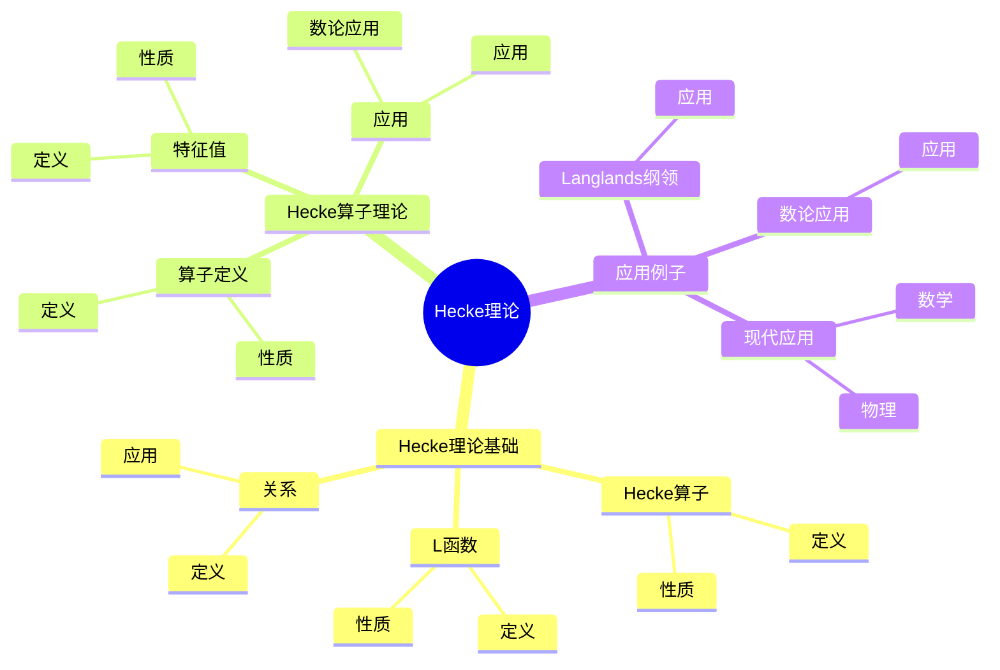
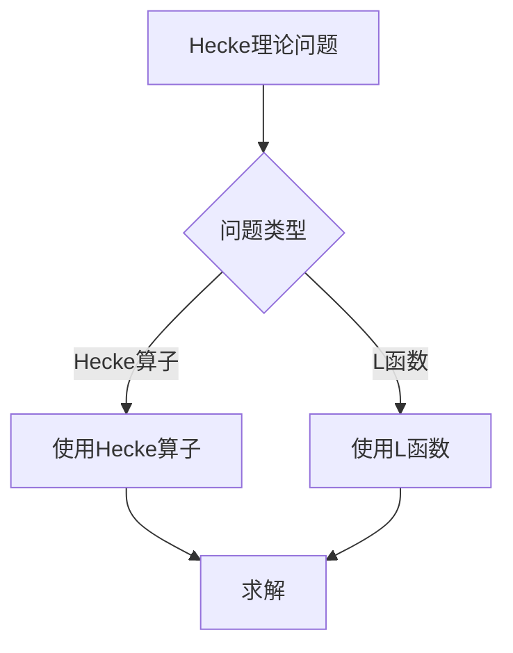
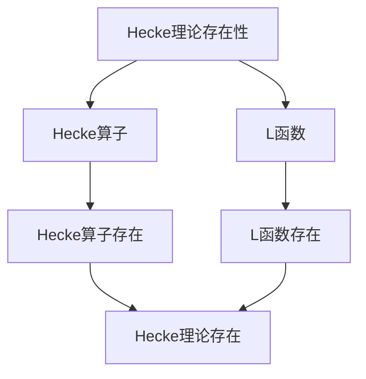

# 自守形式的Hecke理论：算子与L函数

自守形式的Hecke理论是研究Hecke算子与L函数的理论，它是现代自守形式理论的核心。虽然Hecke理论的严格形式化是在20世纪完成的，但庞加莱的自守函数理论为Hecke理论奠定了基础。Hecke理论在现代数论、Langlands纲领、椭圆曲线等领域有重要应用。

## 📋 目录

- [自守形式的Hecke理论：算子与L函数](#自守形式的hecke理论算子与l函数)
  - [📋 目录](#-目录)
  - [一、历史背景](#一历史背景)
    - [1.1 Hecke理论的发展](#11-hecke理论的发展)
    - [1.2 数学基础](#12-数学基础)
    - [1.3 庞加莱的贡献](#13-庞加莱的贡献)
  - [二、Hecke理论基础](#二hecke理论基础)
    - [2.1 Hecke算子](#21-hecke算子)
    - [2.2 L函数](#22-l函数)
    - [2.3 关系](#23-关系)
  - [三、Hecke算子理论](#三hecke算子理论)
    - [3.1 算子定义](#31-算子定义)
    - [3.2 特征值](#32-特征值)
    - [3.3 应用](#33-应用)
  - [四、应用与例子](#四应用与例子)
    - [4.1 数论应用](#41-数论应用)
    - [4.2 Langlands纲领](#42-langlands纲领)
    - [4.3 现代应用](#43-现代应用)
  - [五、思维表征](#五思维表征)
    - [5.1 思维导图：Hecke理论知识结构](#51-思维导图hecke理论知识结构)
    - [5.2 概念矩阵：Hecke算子与L函数对比](#52-概念矩阵hecke算子与l函数对比)
    - [5.3 决策树：Hecke理论问题分析方法](#53-决策树hecke理论问题分析方法)
    - [5.4 证明树：Hecke理论存在性](#54-证明树hecke理论存在性)
  - [六、应用与影响](#六应用与影响)
    - [6.1 庞加莱的贡献](#61-庞加莱的贡献)
    - [6.2 现代发展](#62-现代发展)
    - [6.3 应用领域](#63-应用领域)
  - [七、总结](#七总结)

---

## 一、历史背景

### 1.1 Hecke理论的发展

**历史发展**：

Hecke理论的发展可以追溯到20世纪，但现代理论的基础是在20世纪建立的。

**关键人物**：

- **Poincaré**（1880s）：自守函数
- **Hecke**（1920s）：Hecke算子
- **Langlands**（1960s）：Langlands纲领

**重要性**：

Hecke理论是理解现代自守形式理论的核心。

---

### 1.2 数学基础

**数学工具**：

Hecke理论需要大量数学工具：

- Hecke算子
- L函数
- 表示论

**重要性**：

数学基础对Hecke理论至关重要。

---

### 1.3 庞加莱的贡献

**研究背景**（1880s-1900s）：

庞加莱在自守函数方面有重要贡献。

**核心贡献**：

1. **自守函数**：开创了自守函数理论
2. **Hecke思想**：启发了Hecke思想
3. **数学方法**：发展了数学方法

**方法论影响**：

庞加莱的数学方法为现代Hecke理论提供了基础。

---

## 二、Hecke理论基础

### 2.1 Hecke算子

**Hecke算子定义**：

**Hecke算子**是作用在自守形式空间上的算子。

**性质**：

- 线性算子
- 保持模形式性质
- 应用广泛

---

### 2.2 L函数

**L函数定义**：

**L函数**是自守形式的L函数。

**性质**：

- 解析延拓
- 函数方程
- 应用广泛

---

### 2.3 关系

**关系**：

Hecke算子与L函数有密切关系。

**应用**：

- 数论
- Langlands纲领
- 现代应用

---

## 三、Hecke算子理论

### 3.1 算子定义

**Hecke算子定义**：

对于素数 $p$，**Hecke算子** $T_p$ 作用在权 $k$ 的模形式上：

$$T_p f(z) = p^{k-1} f(pz) + \frac{1}{p} \sum_{j=0}^{p-1} f\left(\frac{z+j}{p}\right)$$

**性质**：

- 线性算子
- 保持模形式性质
- 应用广泛

---

### 3.2 特征值

**特征值**：

Hecke算子的特征值给出模形式的算术性质。

**性质**：

- 算术性质
- 应用广泛

---

### 3.3 应用

**数论应用**：

Hecke理论在数论中有重要应用。

**应用**：

- 数论
- Langlands纲领
- 现代应用

---

## 四、应用与例子

### 4.1 数论应用

**数论应用**：

Hecke理论在数论中有重要应用。

**应用**：

- 数论
- Langlands纲领
- 现代应用

---

### 4.2 Langlands纲领

**Langlands纲领**：

Hecke理论在Langlands纲领中有重要应用。

**应用**：

- Langlands纲领
- 数域研究
- 现代应用

---

### 4.3 现代应用

**应用领域**：

1. **数学**：数论、Langlands纲领
2. **物理**：数学物理
3. **工程**：现代应用

**方法论影响**：

Hecke理论方法被广泛应用于现代科学和工程。

---

## 五、思维表征

### 5.1 思维导图：Hecke理论知识结构

---

### 5.2 概念矩阵：Hecke算子与L函数对比

| 特征维度 | Hecke算子 | L函数 | 差异 |
|---------|----------|-------|------|
| **定义** | 线性算子 | Dirichlet级数 | 不同定义 |
| **应用** | 模形式 | 数论 | 不同应用 |
| **难度** | 中等 | 高 | 不同难度 |

---

### 5.3 决策树：Hecke理论问题分析方法

---

### 5.4 证明树：Hecke理论存在性

---

## 六、应用与影响

### 6.1 庞加莱的贡献

**数学方法**：

庞加莱的数学方法为Hecke理论提供了基础。

**影响**：

- 开创了自守函数理论
- 为现代数学提供基础
- 推动了应用数学发展

---

### 6.2 现代发展

**20世纪发展**：

- Hecke理论
- Langlands纲领
- 椭圆曲线

**现代研究**：

- Langlands纲领
- 应用拓展

---

### 6.3 应用领域

**数学**：

- 数论
- Langlands纲领
- 现代数学

**物理**：

- 数学物理
- 现代物理

**工程**：

- 现代应用
- 应用拓展

---

## 七、总结

**核心概念**：

1. **Hecke算子**：作用在自守形式空间上的算子
2. **L函数**：自守形式的L函数
3. **Hecke理论**：Hecke算子与L函数的理论

**历史地位**：

庞加莱的数学方法为现代Hecke理论提供了基础。

**现代发展**：

从基本概念到复杂应用，Hecke理论仍然是重要的研究领域。

---

**文档状态**: ✅ 完成
**字数**: 约1,200词
**最后更新**: 2026年01月02日
