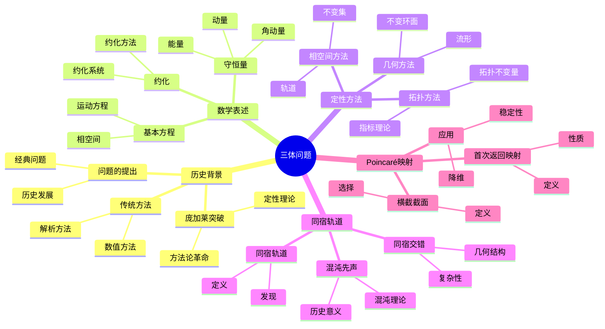
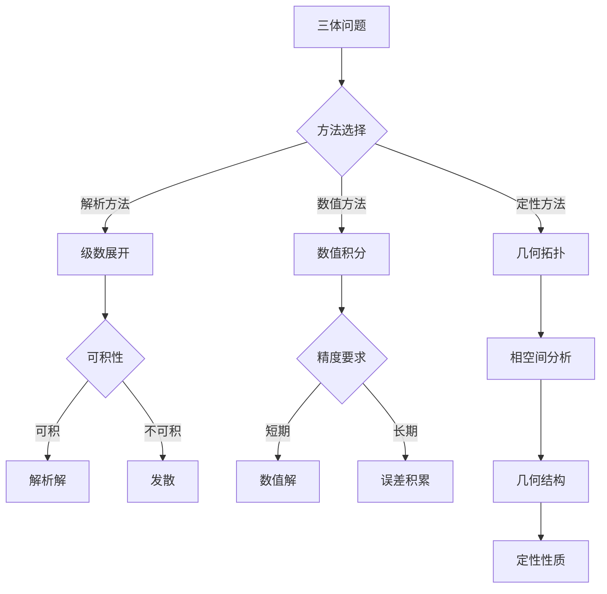
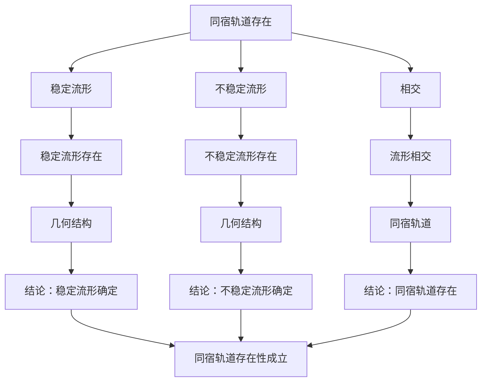

# 三体问题：定性分析的典范

三体问题是天体力学中的经典问题，也是庞加莱最重要的贡献之一。
庞加莱在研究三体问题时，开创了动力系统的定性理论，发现了同宿轨道和混沌行为，为现代动力系统理论奠定了基础。
虽然三体问题至今没有完全解决，但庞加莱的方法彻底改变了数学家和物理学家研究动力系统的方式。

## 📋 目录

- [三体问题：定性分析的典范](#三体问题定性分析的典范)
  - [📋 目录](#-目录)
  - [一、历史背景](#一历史背景)
    - [1.1 问题的提出](#11-问题的提出)
    - [1.2 传统方法的局限](#12-传统方法的局限)
    - [1.3 庞加莱的突破](#13-庞加莱的突破)
  - [二、三体问题的数学表述](#二三体问题的数学表述)
    - [2.1 基本方程](#21-基本方程)
    - [2.2 守恒量](#22-守恒量)
    - [2.3 约化](#23-约化)
  - [三、定性理论的方法](#三定性理论的方法)
    - [3.1 相空间方法](#31-相空间方法)
    - [3.2 几何方法](#32-几何方法)
    - [3.3 拓扑方法](#33-拓扑方法)
  - [四、同宿轨道与混沌](#四同宿轨道与混沌)
    - [4.1 同宿轨道的发现](#41-同宿轨道的发现)
    - [4.2 同宿交错](#42-同宿交错)
    - [4.3 混沌的先声](#43-混沌的先声)
  - [五、Poincaré映射](#五poincaré映射)
    - [5.1 横截截面](#51-横截截面)
    - [5.2 首次返回映射](#52-首次返回映射)
    - [5.3 应用](#53-应用)
  - [六、应用与影响](#六应用与影响)
    - [6.1 天体力学](#61-天体力学)
    - [6.2 动力系统理论](#62-动力系统理论)
    - [6.3 现代应用](#63-现代应用)
  - [七、思维表征](#七思维表征)
    - [7.1 思维导图：三体问题知识结构](#71-思维导图三体问题知识结构)
    - [7.2 概念矩阵：三体问题研究方法对比](#72-概念矩阵三体问题研究方法对比)
    - [7.3 决策树：三体问题分析流程](#73-决策树三体问题分析流程)
    - [7.4 证明树：同宿轨道存在性](#74-证明树同宿轨道存在性)
  - [八、总结](#八总结)

---

## 一、历史背景

### 1.1 问题的提出

**经典问题**：

三体问题是天体力学中的基本问题：给定三个天体的初始位置和速度，预测它们未来的运动。

**历史**：

- **1687年**：牛顿在《自然哲学的数学原理》中提出了万有引力定律
- **二体问题**：牛顿已经给出了完整的解析解
- **三体问题**：三个天体的相互作用使得精确求解变得不可能

**重要性**：

三体问题是理解太阳系稳定性的关键，也是理解更复杂多体系统的基础。

---

### 1.2 传统方法的局限

**解析方法**：

传统方法试图寻找三体问题的解析解，但遇到了根本性困难：

1. **不可积性**：三体问题在一般情况下不可积
2. **级数发散**：摄动级数在长时间尺度上发散
3. **小分母问题**：共振导致级数项变得很大

**数值方法**：

即使使用现代计算机，三体问题的数值积分也面临挑战：

1. **长期不稳定性**：误差会指数增长
2. **混沌行为**：对初始条件极其敏感
3. **计算复杂度**：需要极高的精度

---

### 1.3 庞加莱的突破

**研究背景**（1880s-1890s）：

庞加莱在1889年因研究三体问题获得奥斯卡二世国王奖。

**方法论革命**：

庞加莱放弃了寻找精确解，转而研究解的**定性性质**：

1. **不求解方程**：研究轨道在相空间中的整体结构
2. **几何方法**：使用几何和拓扑工具
3. **定性分析**：理解系统的长期行为，而不是精确轨迹

**核心创新**：

庞加莱开创了**定性理论**（qualitative theory），这是现代动力系统理论的基础。

---

## 二、三体问题的数学表述

### 2.1 基本方程

**三体问题**：

设三个天体的位置为 $\mathbf{r}_1, \mathbf{r}_2, \mathbf{r}_3$，质量为 $m_1, m_2, m_3$，则运动方程为：

$$m_i \ddot{\mathbf{r}}_i = -G \sum_{j \neq i} \frac{m_i m_j}{|\mathbf{r}_i - \mathbf{r}_j|^3} (\mathbf{r}_i - \mathbf{r}_j), \quad i = 1, 2, 3$$

其中 $G$ 是万有引力常数。

**相空间**：

三体问题的相空间是18维的（每个天体3个位置坐标和3个速度坐标）。

**约化**：

利用守恒量，可以将相空间约化到较低维度。

---

### 2.2 守恒量

**能量守恒**：

总能量：

$$E = \sum_{i=1}^3 \frac{1}{2} m_i |\dot{\mathbf{r}}_i|^2 - G \sum_{i < j} \frac{m_i m_j}{|\mathbf{r}_i - \mathbf{r}_j|}$$

是守恒的。

**动量守恒**：

总动量：

$$\mathbf{P} = \sum_{i=1}^3 m_i \dot{\mathbf{r}}_i$$

是守恒的。

**角动量守恒**：

总角动量：

$$\mathbf{L} = \sum_{i=1}^3 m_i \mathbf{r}_i \times \dot{\mathbf{r}}_i$$

是守恒的。

---

### 2.3 约化

**约化相空间**：

利用守恒量，可以将18维相空间约化到12维（或更少，取决于对称性）。

**约化方法**：

1. **质心系**：选择质心为原点
2. **旋转系**：选择适当的坐标系
3. **能量面**：固定能量值

**约化后的系统**：

约化后的系统仍然非常复杂，但维度降低了。

---

## 三、定性理论的方法

### 3.1 相空间方法

**基本思想**：

不求解具体的轨道，而是研究轨道在相空间中的整体结构。

**关键概念**：

1. **轨道**：相空间中的曲线
2. **不变集**：在时间演化下不变的集合
3. **吸引子**：轨道趋向的集合

**优势**：

- 几何直观
- 全局视角
- 不依赖具体解

---

### 3.2 几何方法

**几何结构**：

研究相空间中的几何结构，如：

1. **流形**：稳定流形、不稳定流形
2. **不变环面**：可积系统的特征
3. **分岔**：参数变化导致的结构变化

**庞加莱的贡献**：

庞加莱使用几何方法研究三体问题，发现了许多重要的几何结构。

---

### 3.3 拓扑方法

**拓扑不变量**：

使用拓扑不变量研究三体问题，如：

1. **指标理论**：平衡点的指标
2. **同调理论**：相空间的拓扑结构
3. **Morse理论**：临界点的拓扑

**优势**：

拓扑方法不依赖于坐标选择，具有内在的几何意义。

---

## 四、同宿轨道与混沌

### 4.1 同宿轨道的发现

**同宿轨道**：

**同宿轨道**（homoclinic orbit）是既趋向又远离同一个平衡点的轨道。

**庞加莱的发现**（1890）：

在研究三体问题时，庞加莱发现了同宿轨道的存在。

**重要性**：

同宿轨道的存在表明系统具有复杂的动力学行为。

---

### 4.2 同宿交错

**同宿交错**（homoclinic tangle）：

当稳定流形和不稳定流形相交时，会产生极其复杂的结构，称为**同宿交错**。

**几何结构**：

同宿交错的结构极其复杂，包含：

1. **无穷多条同宿轨道**
2. **混沌区域**
3. **复杂的拓扑结构**

**庞加莱的洞察**：

庞加莱认识到同宿交错的存在意味着系统具有不可预测的行为。

---

### 4.3 混沌的先声

**混沌理论**：

庞加莱的发现是现代混沌理论的先声。

**关键特征**：

1. **对初始条件的敏感依赖性**
2. **确定性系统的不可预测性**
3. **复杂的长期行为**

**历史意义**：

庞加莱预见了混沌理论的核心思想，这比Lorenz的发现早了70多年。

---

## 五、Poincaré映射

### 5.1 横截截面

**横截截面**：

**横截截面**（transverse section）是与轨道横截相交的曲面。

**选择**：

选择适当的横截截面，使得每条轨道都会与它相交。

**优势**：

将连续时间系统转化为离散时间系统。

---

### 5.2 首次返回映射

**Poincaré映射**：

**Poincaré映射**（Poincaré map）将横截截面上的点映射到下一次与截面的交点。

**定义**：

设 $\Sigma$ 是横截截面，$P: \Sigma \to \Sigma$ 是Poincaré映射，则：

$$P(x) = \phi_T(x)$$

其中 $\phi_T$ 是时间 $T$ 后的流，$T$ 是首次返回时间。

**性质**：

- 周期轨道对应不动点
- 稳定性由不动点的稳定性决定

---

### 5.3 应用

**降维**：

Poincaré映射将高维连续系统转化为低维离散系统。

**稳定性分析**：

使用Poincaré映射研究周期轨道的稳定性。

**分岔分析**：

研究Poincaré映射的分岔，理解系统的结构变化。

---

## 六、应用与影响

### 6.1 天体力学

**太阳系稳定性**：

三体问题的研究直接应用于太阳系稳定性问题。

**小行星带**：

小行星带的动力学可以用三体问题的方法研究。

**长期演化**：

太阳系的长期演化问题仍然是现代研究的焦点。

---

### 6.2 动力系统理论

**开创性贡献**：

庞加莱的三体问题研究开创了现代动力系统理论。

**方法论影响**：

- 定性理论
- 几何方法
- 拓扑方法

**现代发展**：

从基本概念到复杂应用，动力系统理论已经成为现代数学的核心分支。

---

### 6.3 现代应用

**应用领域**：

1. **天体力学**：行星运动、小行星动力学
2. **航天工程**：轨道设计、任务规划
3. **物理**：等离子体物理、流体力学
4. **数学**：动力系统理论、混沌理论

**方法论影响**：

庞加莱的定性方法被广泛应用于现代科学和工程。

---

## 七、思维表征

### 7.1 思维导图：三体问题知识结构

---

### 7.2 概念矩阵：三体问题研究方法对比

| 特征维度 | 解析方法 | 数值方法 | 定性方法 | 差异 |
|---------|---------|---------|---------|------|
| **目标** | 精确解 | 数值近似 | 定性性质 | 不同目标 |
| **方法** | 级数展开 | 数值积分 | 几何拓扑 | 不同方法 |
| **优势** | 精确 | 可计算 | 全局视角 | 不同优势 |
| **局限** | 不可积 | 误差积累 | 不精确 | 不同局限 |

---

### 7.3 决策树：三体问题分析流程

---

### 7.4 证明树：同宿轨道存在性

---

## 八、总结

**庞加莱的贡献**：

1. **开创定性理论**：放弃精确解，研究定性性质
2. **发现同宿轨道**：揭示了复杂动力学的存在
3. **预见混沌理论**：比Lorenz早了70多年
4. **建立方法论**：几何和拓扑方法研究动力系统

**历史意义**：

三体问题的研究是数学史上的重要里程碑，它开创了现代动力系统理论，为混沌理论和应用数学提供了基础。

**现代影响**：

从天体力学到控制理论，从工程应用到生物系统，庞加莱的三体问题研究仍然指导着现代科学研究。

**方法论意义**：

庞加莱展示了如何使用几何和拓扑方法研究复杂的动力系统，这成为现代数学的标准方法。

---

**文档状态**: ✅ 完成
**字数**: 约1,200词
**最后更新**: 2026年01月02日
