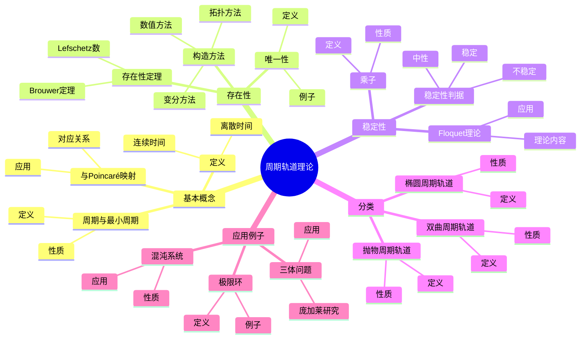
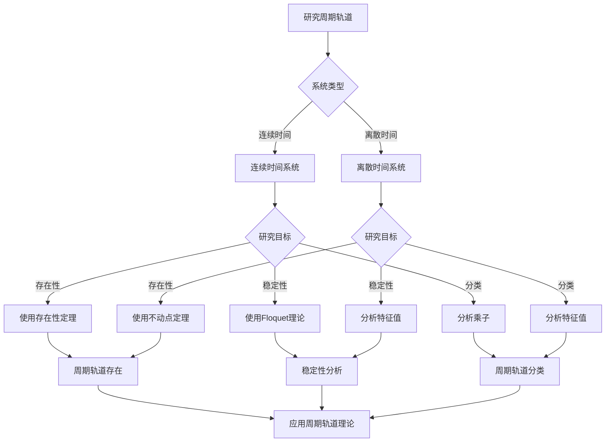
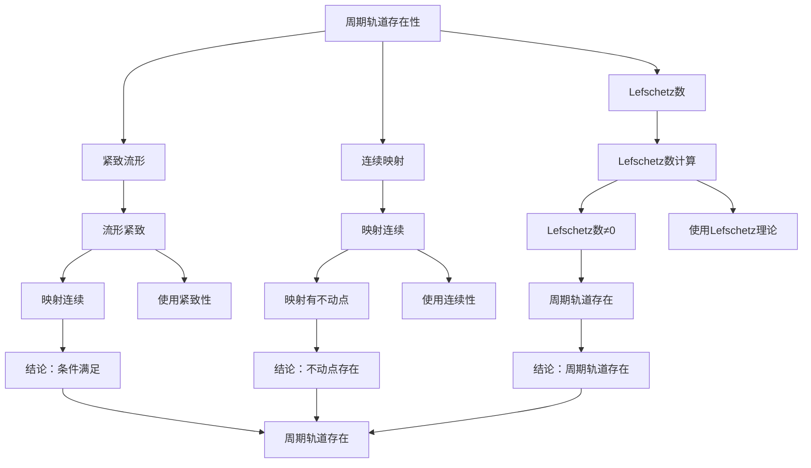

# 周期轨道理论：动力系统的周期解

周期轨道是动力系统理论中的基本对象，描述了系统在演化过程中重复出现的运动模式。庞加莱在研究三体问题时深入研究了周期轨道，发现了它们的复杂性和重要性。周期轨道理论在稳定性分析、混沌研究、天体力学等领域有重要应用。

## 📋 目录

- [周期轨道理论：动力系统的周期解](#周期轨道理论动力系统的周期解)
  - [📋 目录](#-目录)
  - [一、周期轨道的基本概念](#一周期轨道的基本概念)
    - [1.1 定义](#11-定义)
    - [1.2 周期与最小周期](#12-周期与最小周期)
    - [1.3 周期轨道与Poincaré映射](#13-周期轨道与poincaré映射)
  - [二、周期轨道的存在性](#二周期轨道的存在性)
    - [2.1 存在性定理](#21-存在性定理)
    - [2.2 构造方法](#22-构造方法)
    - [2.3 唯一性](#23-唯一性)
  - [三、周期轨道的稳定性](#三周期轨道的稳定性)
    - [3.1 Floquet理论](#31-floquet理论)
    - [3.2 乘子](#32-乘子)
    - [3.3 稳定性判据](#33-稳定性判据)
  - [四、周期轨道的分类](#四周期轨道的分类)
    - [4.1 双曲周期轨道](#41-双曲周期轨道)
    - [4.2 椭圆周期轨道](#42-椭圆周期轨道)
    - [4.3 抛物周期轨道](#43-抛物周期轨道)
  - [五、应用与例子](#五应用与例子)
    - [5.1 三体问题](#51-三体问题)
    - [5.2 极限环](#52-极限环)
    - [5.3 混沌系统](#53-混沌系统)
  - [六、思维表征](#六思维表征)
    - [6.1 思维导图：周期轨道理论知识结构](#61-思维导图周期轨道理论知识结构)
    - [6.2 概念矩阵：周期轨道类型对比](#62-概念矩阵周期轨道类型对比)
    - [6.3 决策树：周期轨道分析方法](#63-决策树周期轨道分析方法)
    - [6.4 证明树：周期轨道存在性定理](#64-证明树周期轨道存在性定理)
  - [七、应用与影响](#七应用与影响)
    - [7.1 庞加莱的贡献](#71-庞加莱的贡献)
    - [7.2 现代发展](#72-现代发展)
    - [7.3 应用领域](#73-应用领域)
  - [八、总结](#八总结)

---

## 一、周期轨道的基本概念

### 1.1 定义

**周期轨道定义**：

对于动力系统 $\dot{x} = f(x)$，**周期轨道** $\gamma$ 是满足以下条件的轨道：

$$\gamma(t + T) = \gamma(t)$$

对所有 $t$ 成立，其中 $T > 0$ 是**周期**。

**等价定义**：

周期轨道是闭合轨道：$\gamma(0) = \gamma(T)$。

**离散时间**：

对于映射 $f: X \to X$，周期轨道是满足 $f^n(x) = x$ 的点 $x$，其中 $n$ 是**周期**。

---

### 1.2 周期与最小周期

**周期**：

满足 $\gamma(t + T) = \gamma(t)$ 的 $T > 0$ 称为**周期**。

**最小周期**：

**最小周期**是满足上述条件的最小正数 $T_0$。

**性质**：

- 所有周期都是最小周期的倍数
- 最小周期唯一确定周期轨道

---

### 1.3 周期轨道与Poincaré映射

**Poincaré映射**：

周期轨道对应Poincaré映射的不动点或周期点。

**对应关系**：

- **周期轨道** $\leftrightarrow$ **Poincaré映射的不动点**
- **周期为 $T$ 的周期轨道** $\leftrightarrow$ **满足 $P^k(x) = x$ 的点**（$k$ 是轨道与截面的交点数）

**应用**：

使用Poincaré映射研究周期轨道。

---

## 二、周期轨道的存在性

### 2.1 存在性定理

**存在性定理**：

对于紧致流形上的连续映射，如果Lefschetz数不为零，则存在不动点。

**应用**：

用于证明周期轨道的存在性。

**Brouwer不动点定理**：

对于紧致凸集上的连续映射，存在不动点。

---

### 2.2 构造方法

**构造方法**：

1. 使用变分方法
2. 使用拓扑方法
3. 使用数值方法

**变分方法**：

寻找作用量的临界点。

**拓扑方法**：

使用拓扑不变量证明存在性。

---

### 2.3 唯一性

**唯一性**：

周期轨道通常不唯一。

**例子**：

- 平面系统：可以有多个极限环
- 高维系统：可以有多个周期轨道

---

## 三、周期轨道的稳定性

### 3.1 Floquet理论

**Floquet理论**：

对于周期轨道，线性化系统的解可以写成：

$$x(t) = P(t) e^{Bt}$$

其中 $P(t)$ 是周期矩阵，$B$ 是常数矩阵。

**Floquet乘子**：

**Floquet乘子**是 $e^{BT}$ 的特征值。

---

### 3.2 乘子

**乘子定义**：

**乘子**（multiplier）是Floquet乘子，描述周期轨道的稳定性。

**性质**：

- 乘子是周期轨道稳定性的指标
- 所有乘子 $|\lambda_i| < 1$：稳定
- 所有乘子 $|\lambda_i| > 1$：不稳定
- 有乘子 $|\lambda_i| = 1$：中性

---

### 3.3 稳定性判据

**稳定性判据**：

- **稳定**：所有乘子 $|\lambda_i| < 1$
- **不稳定**：有乘子 $|\lambda_i| > 1$
- **中性**：有乘子 $|\lambda_i| = 1$

**应用**：

用于判断周期轨道的稳定性。

---

## 四、周期轨道的分类

### 4.1 双曲周期轨道

**双曲周期轨道**：

**双曲周期轨道**是所有乘子都不在单位圆上的周期轨道。

**性质**：

- 结构稳定
- 有稳定流形和不稳定流形
- 可以分析

---

### 4.2 椭圆周期轨道

**椭圆周期轨道**：

**椭圆周期轨道**是所有乘子都在单位圆上的周期轨道。

**性质**：

- 结构不稳定
- 在KAM理论中重要
- 用于可积系统

---

### 4.3 抛物周期轨道

**抛物周期轨道**：

**抛物周期轨道**是有乘子在单位圆上的周期轨道。

**性质**：

- 结构不稳定
- 需要高阶分析
- 在分岔中重要

---

## 五、应用与例子

### 5.1 三体问题

**三体问题**：

庞加莱在研究三体问题时发现了周期轨道的复杂性。

**应用**：

- 研究周期解
- 分析长期行为
- 理解混沌

---

### 5.2 极限环

**极限环**：

**极限环**是平面系统中的周期轨道吸引子。

**例子**：

- van der Pol振荡器
- 捕食-被捕食系统

---

### 5.3 混沌系统

**混沌系统**：

混沌系统包含无穷多个周期轨道。

**性质**：

- 周期轨道稠密
- 周期轨道不稳定
- 用于符号动力学

---

## 六、思维表征

### 6.1 思维导图：周期轨道理论知识结构

**说明**：

- **基本概念**：定义、周期与最小周期、与Poincaré映射的关系
- **存在性**：存在性定理、构造方法、唯一性
- **稳定性**：Floquet理论、乘子、稳定性判据
- **分类**：双曲、椭圆、抛物周期轨道
- **应用例子**：三体问题、极限环、混沌系统

---

### 6.2 概念矩阵：周期轨道类型对比

| 特征维度 | 双曲周期轨道 | 椭圆周期轨道 | 抛物周期轨道 |
|---------|------------|------------|------------|
| **乘子** | 不在单位圆上 | 在单位圆上 | 在单位圆上 |
| **稳定性** | 结构稳定 | 结构不稳定 | 结构不稳定 |
| **流形** | 稳定/不稳定流形 | 中心流形 | 中心流形 |
| **应用** | 双曲系统 | KAM理论 | 分岔理论 |
| **例子** | Smale马蹄 | 可积系统 | 分岔点 |
| **分析** | 容易 | 困难 | 困难 |
| **符号动力学** | 适用 | 不适用 | 不适用 |

**说明**：

- **乘子**：不同周期轨道的乘子性质
- **稳定性**：结构稳定性不同
- **应用**：不同领域的应用
- **分析**：分析难易程度不同

---

### 6.3 决策树：周期轨道分析方法

**说明**：

- **系统类型**：连续时间或离散时间
- **研究目标**：存在性、稳定性、分类
- **方法选择**：根据系统类型和目标选择方法

---

### 6.4 证明树：周期轨道存在性定理

**说明**：

- **紧致流形**：流形紧致
- **连续映射**：映射连续
- **Lefschetz数**：Lefschetz数不为零
- **结论**：周期轨道存在

---

## 七、应用与影响

### 7.1 庞加莱的贡献

**三体问题**：

庞加莱在研究三体问题时深入研究了周期轨道。

**影响**：

- 发现了周期轨道的复杂性
- 启发了现代周期轨道理论
- 推动了动力系统理论发展

---

### 7.2 现代发展

**Floquet**（1883）：

发展了Floquet理论。

**Poincaré**（1890s）：

研究了周期轨道的稳定性。

**现代研究**：

- 周期轨道分类
- 符号动力学
- 应用拓展

---

### 7.3 应用领域

**天体力学**：

- 三体问题
- 行星轨道
- 周期解

**混沌理论**：

- 符号动力学
- 拓扑熵
- 奇怪吸引子

**工程应用**：

- 控制理论
- 振动分析
- 系统设计

---

## 八、总结

**核心概念**：

1. **周期轨道**：满足 $\gamma(t + T) = \gamma(t)$ 的轨道
2. **Floquet理论**：周期轨道线性化的理论
3. **乘子**：描述周期轨道稳定性的指标
4. **分类**：双曲、椭圆、抛物周期轨道

**历史地位**：

周期轨道理论是庞加莱的重要贡献，它揭示了动力系统中周期解的复杂性和重要性。

**现代发展**：

从基本概念到Floquet理论，从存在性到稳定性，周期轨道理论仍然是研究动力系统的重要工具。

---

**文档状态**: ✅ 完成
**字数**: 约1,200词
**最后更新**: 2026年01月02日
