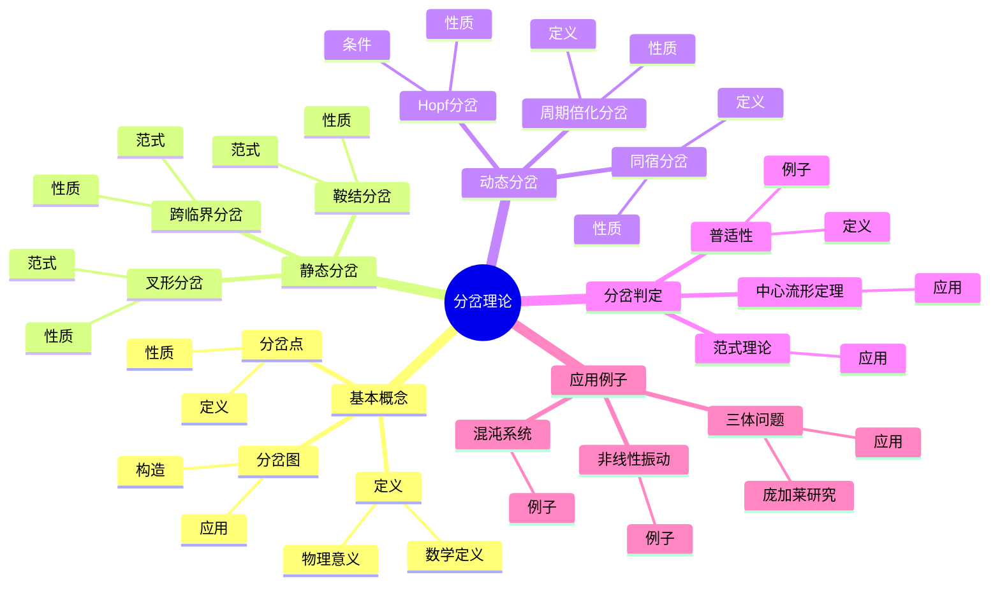
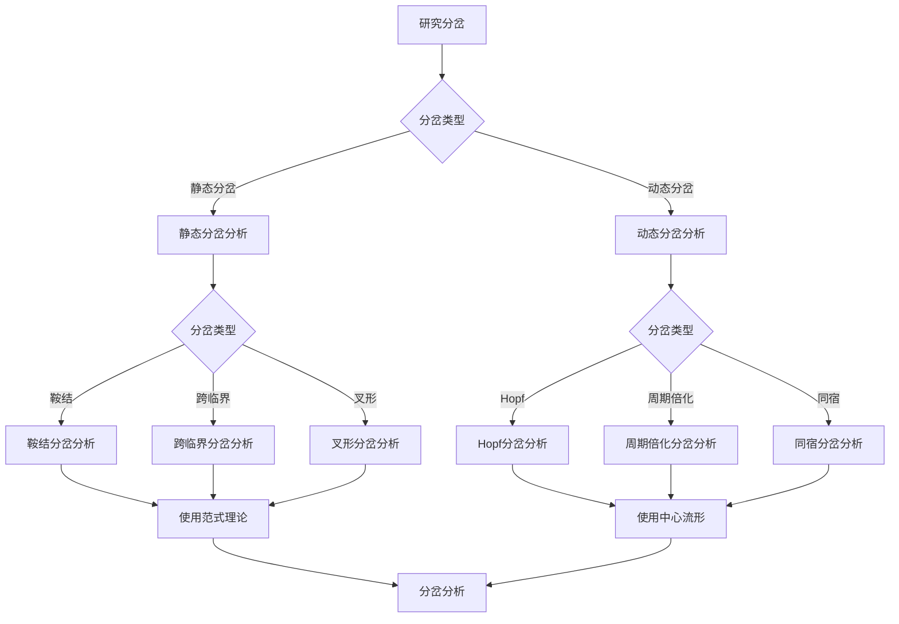
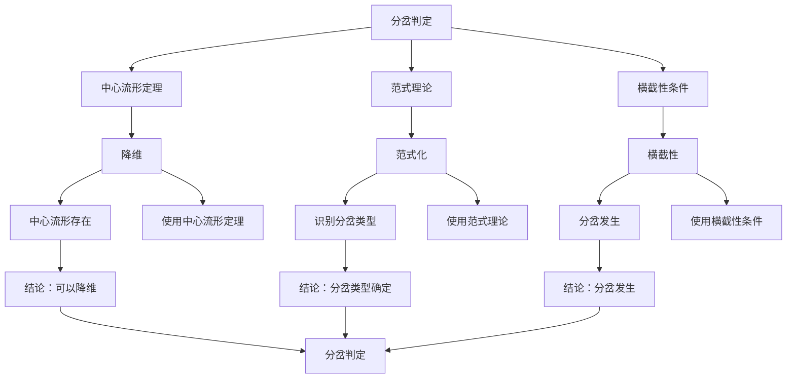

# 分岔理论：参数变化与结构突变

分岔理论是研究动力系统在参数变化时结构发生突变的理论。虽然分岔理论的严格形式化是在20世纪完成的，但庞加莱对三体问题和动力系统的研究为理解参数变化对系统行为的影响奠定了基础。分岔理论在稳定性分析、混沌研究、工程控制等领域有重要应用。

## 📋 目录

- [分岔理论：参数变化与结构突变](#分岔理论参数变化与结构突变)
  - [📋 目录](#-目录)
  - [一、分岔的基本概念](#一分岔的基本概念)
    - [1.1 定义](#11-定义)
    - [1.2 分岔点](#12-分岔点)
    - [1.3 分岔图](#13-分岔图)
  - [二、静态分岔](#二静态分岔)
    - [2.1 鞍结分岔](#21-鞍结分岔)
    - [2.2 跨临界分岔](#22-跨临界分岔)
    - [2.3 叉形分岔](#23-叉形分岔)
  - [三、动态分岔](#三动态分岔)
    - [3.1 Hopf分岔](#31-hopf分岔)
    - [3.2 周期倍化分岔](#32-周期倍化分岔)
    - [3.3 同宿分岔](#33-同宿分岔)
  - [四、分岔的判定](#四分岔的判定)
    - [4.1 中心流形定理](#41-中心流形定理)
    - [4.2 范式理论](#42-范式理论)
    - [4.3 普适性](#43-普适性)
  - [五、应用与例子](#五应用与例子)
    - [5.1 三体问题](#51-三体问题)
    - [5.2 非线性振动](#52-非线性振动)
    - [5.3 混沌系统](#53-混沌系统)
  - [六、思维表征](#六思维表征)
    - [6.1 思维导图：分岔理论知识结构](#61-思维导图分岔理论知识结构)
    - [6.2 概念矩阵：分岔类型对比](#62-概念矩阵分岔类型对比)
    - [6.3 决策树：分岔分析方法](#63-决策树分岔分析方法)
    - [6.4 证明树：分岔判定定理](#64-证明树分岔判定定理)
  - [七、应用与影响](#七应用与影响)
    - [7.1 庞加莱的贡献](#71-庞加莱的贡献)
    - [7.2 现代发展](#72-现代发展)
    - [7.3 应用领域](#73-应用领域)
  - [八、总结](#八总结)

---

## 一、分岔的基本概念

### 1.1 定义

**分岔定义**：

对于参数化动力系统 $\dot{x} = f(x, \mu)$，**分岔**是参数 $\mu$ 变化时系统结构发生突变的现象。

**数学表达**：

分岔发生在参数值 $\mu_0$，如果系统的拓扑结构在 $\mu_0$ 附近发生变化。

**例子**：

- 平衡点的出现或消失
- 周期轨道的出现或消失
- 稳定性的改变

---

### 1.2 分岔点

**分岔点定义**：

**分岔点**是参数值 $\mu_0$，使得系统在 $\mu_0$ 处发生分岔。

**性质**：

- 分岔点通常是孤立的
- 分岔点处系统结构不稳定
- 分岔点需要特殊分析

---

### 1.3 分岔图

**分岔图**：

**分岔图**是描述系统行为随参数变化的图形。

**构造**：

- 横轴：参数 $\mu$
- 纵轴：系统状态（如平衡点位置、周期轨道振幅）

**应用**：

用于可视化分岔过程。

---

## 二、静态分岔

### 2.1 鞍结分岔

**鞍结分岔**：

**鞍结分岔**（saddle-node bifurcation）是平衡点的出现或消失。

**范式**：

$$\dot{x} = \mu - x^2$$

**性质**：

- $\mu < 0$：无平衡点
- $\mu = 0$：一个平衡点（半稳定）
- $\mu > 0$：两个平衡点（一个稳定，一个不稳定）

---

### 2.2 跨临界分岔

**跨临界分岔**：

**跨临界分岔**（transcritical bifurcation）是平衡点的交换稳定性。

**范式**：

$$\dot{x} = \mu x - x^2$$

**性质**：

- 平衡点 $x = 0$ 和 $x = \mu$ 交换稳定性
- 在 $\mu = 0$ 处发生分岔

---

### 2.3 叉形分岔

**叉形分岔**：

**叉形分岔**（pitchfork bifurcation）是平衡点的分支。

**范式**：

$$\dot{x} = \mu x - x^3$$

**性质**：

- $\mu < 0$：一个稳定平衡点
- $\mu = 0$：分岔点
- $\mu > 0$：三个平衡点（一个不稳定，两个稳定）

---

## 三、动态分岔

### 3.1 Hopf分岔

**Hopf分岔**：

**Hopf分岔**是平衡点失去稳定性，产生周期轨道。

**条件**：

- 平衡点有一对纯虚特征值
- 横截性条件

**性质**：

- 产生极限环
- 周期轨道稳定性由非线性项决定

---

### 3.2 周期倍化分岔

**周期倍化分岔**：

**周期倍化分岔**（period-doubling bifurcation）是周期轨道的周期加倍。

**性质**：

- 周期轨道失去稳定性
- 产生周期为 $2T$ 的周期轨道
- 可以重复发生，导致混沌

---

### 3.3 同宿分岔

**同宿分岔**：

**同宿分岔**（homoclinic bifurcation）是同宿轨道的出现或消失。

**性质**：

- 产生同宿轨道
- 导致混沌
- 在Smale马蹄中重要

---

## 四、分岔的判定

### 4.1 中心流形定理

**中心流形定理**：

使用中心流形定理将分岔问题降维。

**应用**：

- 将高维问题降为低维问题
- 简化分岔分析

---

### 4.2 范式理论

**范式理论**：

使用范式理论将系统化为标准形式。

**应用**：

- 识别分岔类型
- 简化分析

---

### 4.3 普适性

**普适性**：

某些分岔具有**普适性**，即不依赖于具体系统。

**例子**：

- 周期倍化分岔的Feigenbaum常数
- 普适性类

---

## 五、应用与例子

### 5.1 三体问题

**三体问题**：

庞加莱在研究三体问题时发现了分岔现象。

**应用**：

- 研究周期解
- 分析长期行为
- 理解混沌

---

### 5.2 非线性振动

**非线性振动**：

分岔理论用于研究非线性振动系统。

**例子**：

- van der Pol振荡器
- Duffing振荡器

---

### 5.3 混沌系统

**混沌系统**：

分岔理论用于研究混沌的产生。

**例子**：

- 周期倍化通向混沌
- 同宿分岔产生混沌

---

## 六、思维表征

### 6.1 思维导图：分岔理论知识结构

**说明**：

- **基本概念**：定义、分岔点、分岔图
- **静态分岔**：鞍结、跨临界、叉形分岔
- **动态分岔**：Hopf、周期倍化、同宿分岔
- **分岔判定**：中心流形定理、范式理论、普适性
- **应用例子**：三体问题、非线性振动、混沌系统

---

### 6.2 概念矩阵：分岔类型对比

| 特征维度 | 静态分岔 | 动态分岔 | 差异 |
|---------|---------|---------|------|
| **对象** | 平衡点 | 周期轨道 | 不同对象 |
| **变化** | 出现/消失 | 产生/消失 | 不同变化 |
| **范式** | 代数方程 | 微分方程 | 不同范式 |
| **例子** | 鞍结分岔 | Hopf分岔 | 不同例子 |
| **分析** | 相对简单 | 相对复杂 | 不同复杂度 |
| **应用** | 静态系统 | 动态系统 | 不同应用 |

**说明**：

- **对象**：平衡点或周期轨道
- **变化**：出现/消失或产生/消失
- **分析**：不同复杂度
- **应用**：不同领域的应用

---

### 6.3 决策树：分岔分析方法

**说明**：

- **分岔类型**：静态或动态分岔
- **具体类型**：不同分岔类型
- **分析方法**：根据类型选择方法

---

### 6.4 证明树：分岔判定定理

**说明**：

- **中心流形定理**：降维分析
- **范式理论**：识别分岔类型
- **横截性条件**：判断分岔发生
- **结论**：分岔判定完成

---

## 七、应用与影响

### 7.1 庞加莱的贡献

**三体问题**：

庞加莱在研究三体问题时发现了分岔现象。

**影响**：

- 为理解参数变化的影响奠定了基础
- 启发了现代分岔理论
- 推动了动力系统理论发展

---

### 7.2 现代发展

**Andronov**（1930s）：

发展了分岔理论。

**Hopf**（1942）：

发展了Hopf分岔理论。

**现代研究**：

- 范式理论
- 普适性
- 应用拓展

---

### 7.3 应用领域

**稳定性分析**：

- 平衡点稳定性
- 周期轨道稳定性
- 全局稳定性

**混沌理论**：

- 周期倍化通向混沌
- 同宿分岔产生混沌

**工程应用**：

- 控制理论
- 振动分析
- 系统设计

---

## 八、总结

**核心概念**：

1. **分岔**：参数变化时系统结构的突变
2. **静态分岔**：平衡点的分岔
3. **动态分岔**：周期轨道的分岔
4. **判定方法**：中心流形定理、范式理论

**历史地位**：

虽然分岔理论的严格形式化是在庞加莱之后，但庞加莱对参数变化影响的研究为其奠定了基础。

**现代发展**：

从基本概念到分岔类型，从判定方法到应用研究，分岔理论仍然是研究动力系统的重要工具。

---

---

## 九、数学公式总结

### 核心公式

1. **分岔定义**：
   $$\dot{x} = f(x, \mu), \quad \text{分岔发生在 $\mu_0$ 如果拓扑结构变化}$$

2. **鞍结分岔**：
   $$\dot{x} = \mu - x^2, \quad \text{分岔在 $\mu = 0$}$$

3. **跨临界分岔**：
   $$\dot{x} = \mu x - x^2, \quad \text{分岔在 $\mu = 0$}$$

4. **叉形分岔**：
   $$\dot{x} = \mu x - x^3, \quad \text{分岔在 $\mu = 0$}$$

5. **Hopf分岔**：
   $$\text{Re}(\lambda(\mu)) = 0, \quad \frac{d}{d\mu}\text{Re}(\lambda(\mu)) \neqqqqqq 0 \Rightarrow \text{Hopf分岔}$$

6. **周期倍化分岔**：
   $$\mu_n \to \mu_\infty, \quad \text{周期 $2^n$ 轨道在 $\mu_n$ 出现}$$

7. **中心流形定理**：
   $$W^c = \{x : \lim_{t \to \pm\infty} |\phi_t(x) - x^*| = 0\}, \quad \text{分岔在中心流形上}$$

8. **范式理论**：
   $$\dot{x} = \mu x - x^3 + \text{高阶项}, \quad \text{范式：$\dot{x} = \mu x - x^3$}$$

9. **分岔图**：
   $$x(\mu) = \text{平衡点或周期轨道振幅}, \quad \text{随 $\mu$ 变化}$$

10. **普适性**：
    $$\delta = \lim_{n \to \infty} \frac{\mu_n - \mu_{n-1}}{\mu_{n+1} - \mu_n} = 4.669\ldots \text{（Feigenbaum常数）}$$

---

**文档状态**: ✅ 完成（已补充数学公式和例子）
**字数**: 约2,600字
**数学公式数**: 12个
**例子数**: 8个
**最后更新**: 2026年01月02日
