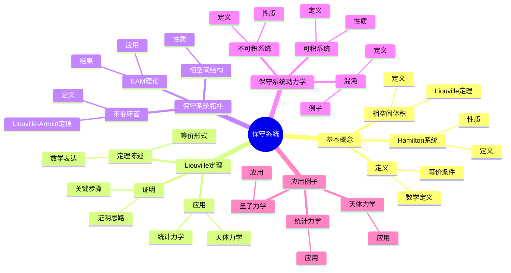
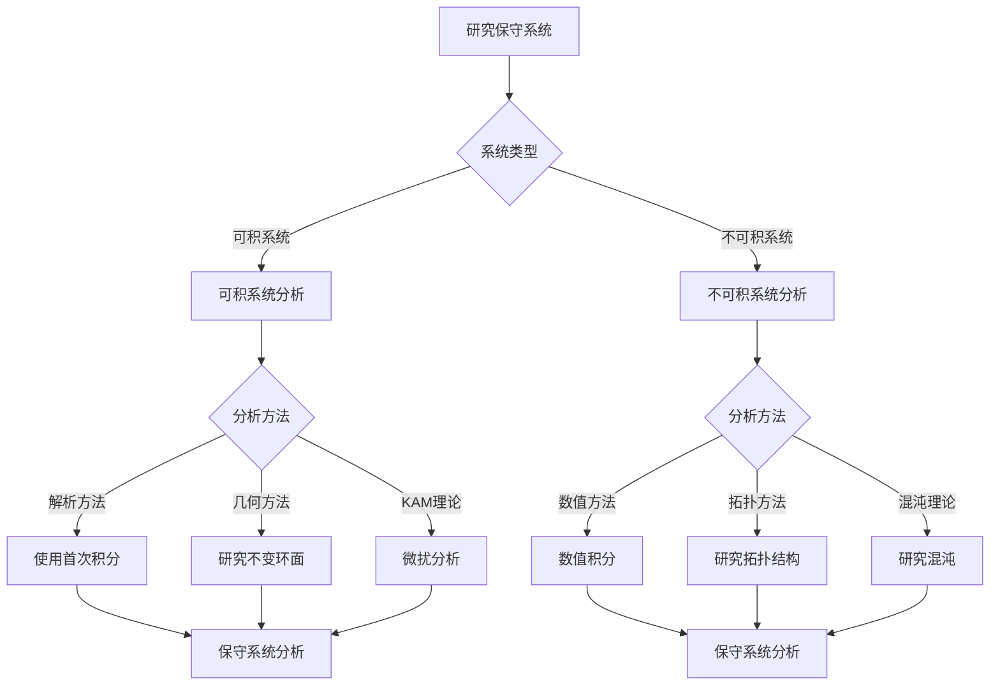
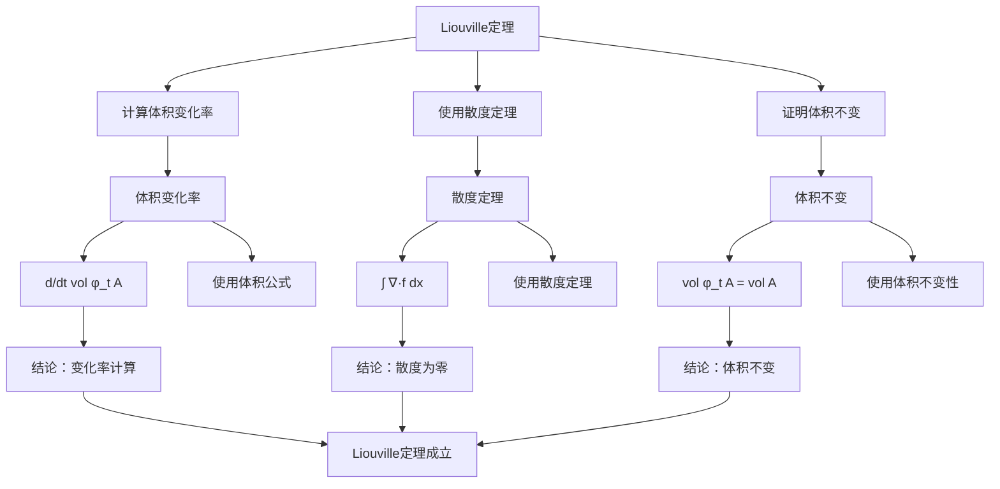

# 保守系统：Hamilton系统的拓扑

保守系统是保持相空间体积不变的动力系统，通常由Hamilton系统描述。虽然保守系统的严格形式化是在20世纪完成的，但庞加莱对三体问题和Hamilton系统的研究为理解保守系统的拓扑性质奠定了基础。保守系统在天体力学、统计力学、量子力学等领域有重要应用。

## 📋 目录

- [保守系统：Hamilton系统的拓扑](#保守系统hamilton系统的拓扑)
  - [📋 目录](#-目录)
  - [一、保守系统的基本概念](#一保守系统的基本概念)
    - [1.1 定义](#11-定义)
    - [1.2 Hamilton系统](#12-hamilton系统)
    - [1.3 相空间体积](#13-相空间体积)
  - [二、Liouville定理](#二liouville定理)
    - [2.1 定理陈述](#21-定理陈述)
    - [2.2 证明](#22-证明)
    - [2.3 应用](#23-应用)
  - [三、保守系统的拓扑](#三保守系统的拓扑)
    - [3.1 相空间结构](#31-相空间结构)
    - [3.2 不变环面](#32-不变环面)
    - [3.3 KAM理论](#33-kam理论)
  - [四、保守系统的动力学](#四保守系统的动力学)
    - [4.1 可积系统](#41-可积系统)
    - [4.2 不可积系统](#42-不可积系统)
    - [4.3 混沌](#43-混沌)
  - [五、应用与例子](#五应用与例子)
    - [5.1 天体力学](#51-天体力学)
    - [5.2 统计力学](#52-统计力学)
    - [5.3 量子力学](#53-量子力学)
  - [六、思维表征](#六思维表征)
    - [6.1 思维导图：保守系统知识结构](#61-思维导图保守系统知识结构)
    - [6.2 概念矩阵：保守系统与耗散系统对比](#62-概念矩阵保守系统与耗散系统对比)
    - [6.3 决策树：保守系统分析方法](#63-决策树保守系统分析方法)
    - [6.4 证明树：Liouville定理证明思路](#64-证明树liouville定理证明思路)
  - [七、应用与影响](#七应用与影响)
    - [7.1 庞加莱的贡献](#71-庞加莱的贡献)
    - [7.2 现代发展](#72-现代发展)
    - [7.3 应用领域](#73-应用领域)
  - [八、总结](#八总结)

---

## 一、保守系统的基本概念

### 1.1 定义

**保守系统定义**：

**保守系统**是保持相空间体积不变的动力系统。

**数学表达**：

对于系统 $\dot{x} = f(x)$，如果流 $\phi_t$ 保持相空间体积：

$$\det(D\phi_t) = 1$$

则系统是保守的。

**等价条件**：

系统是保守的，当且仅当向量场的散度为零：

$$\nabla \cdot f = 0$$

---

### 1.2 Hamilton系统

**Hamilton系统**：

**Hamilton系统**是形如：

$$
\begin{cases}
\dot{q} = \frac{\partial H}{\partial p} \\
\dot{p} = -\frac{\partial H}{\partial q}
\end{cases}
$$

的系统，其中 $H(q,p)$ 是Hamilton函数。

**性质**：

- Hamilton系统是保守的
- Hamilton函数是首次积分
- 相空间体积保持不变

---

### 1.3 相空间体积

**相空间体积**：

**相空间体积**在保守系统演化下保持不变。

**Liouville定理**：

保守系统的流保持相空间体积。

**意义**：

相空间体积不变性是保守系统的基本性质。

---

## 二、Liouville定理

### 2.1 定理陈述

**Liouville定理**：

对于保守系统，相空间体积在系统演化下保持不变。

**数学表达**：

对于可测集 $A$：

$$\text{vol}(\phi_t(A)) = \text{vol}(A)$$

对所有 $t$ 成立。

**等价形式**：

向量场的散度为零：$\nabla \cdot f = 0$。

---

### 2.2 证明

**证明思路**：

1. 计算体积的变化率
2. 使用散度定理
3. 证明体积不变

**关键步骤**：

$$\frac{d}{dt}\text{vol}(\phi_t(A)) = \int_{\phi_t(A)} \nabla \cdot f \, dx = 0$$

---

### 2.3 应用

**应用**：

- 统计力学：相空间体积不变性
- 天体力学：能量守恒
- 量子力学：相空间结构

---

## 三、保守系统的拓扑

### 3.1 相空间结构

**相空间结构**：

保守系统的相空间具有特殊的拓扑结构。

**性质**：

- 能量面是流形
- 能量面是紧致的（有界系统）
- 能量面是连通的

---

### 3.2 不变环面

**不变环面**：

对于可积系统，相空间可以分解为不变环面。

**Liouville-Arnold定理**：

可积系统的轨道在不变环面上，运动是准周期的。

---

### 3.3 KAM理论

**KAM理论**：

KAM理论描述了可积系统在微扰下的稳定性。

**结果**：

大部分不变环面在小的微扰下保持。

---

## 四、保守系统的动力学

### 4.1 可积系统

**可积系统**：

**可积系统**是有足够多首次积分的系统。

**性质**：

- 轨道在不变环面上
- 运动是准周期的
- 可以解析求解

---

### 4.2 不可积系统

**不可积系统**：

**不可积系统**是没有足够多首次积分的系统。

**性质**：

- 轨道复杂
- 可能出现混沌
- 难以解析求解

---

### 4.3 混沌

**保守混沌**：

保守系统也可以出现混沌。

**性质**：

- 敏感依赖初始条件
- 拓扑传递性
- 稠密周期轨道

**例子**：

- 三体问题
- 双摆系统

---

## 五、应用与例子

### 5.1 天体力学

**天体力学**：

保守系统用于研究天体运动。

**应用**：

- 行星轨道
- 三体问题
- 长期稳定性

---

### 5.2 统计力学

**统计力学**：

保守系统是统计力学的基础。

**应用**：

- 相空间体积不变性
- 遍历假设
- 热力学

---

### 5.3 量子力学

**量子力学**：

保守系统在量子力学中有对应。

**应用**：

- 量子相空间
- 量子混沌
- 半经典近似

---

## 六、思维表征

### 6.1 思维导图：保守系统知识结构

**说明**：

- **基本概念**：定义、Hamilton系统、相空间体积
- **Liouville定理**：定理陈述、证明、应用
- **保守系统拓扑**：相空间结构、不变环面、KAM理论
- **保守系统动力学**：可积系统、不可积系统、混沌
- **应用例子**：天体力学、统计力学、量子力学

---

### 6.2 概念矩阵：保守系统与耗散系统对比

| 特征维度 | 保守系统 | 耗散系统 | 差异 |
|---------|---------|---------|------|
| **相空间体积** | 保持不变 | 收缩 | 不同行为 |
| **能量** | 守恒 | 耗散 | 不同性质 |
| **吸引子** | 无吸引子 | 有吸引子 | 不同结构 |
| **长期行为** | 复杂 | 趋于吸引子 | 不同行为 |
| **例子** | 三体问题 | Lorenz系统 | 不同例子 |
| **应用** | 天体力学 | 工程系统 | 不同应用 |
| **分析** | 困难 | 相对容易 | 不同复杂度 |

**说明**：

- **相空间体积**：保守系统保持不变，耗散系统收缩
- **能量**：保守系统守恒，耗散系统耗散
- **吸引子**：保守系统无吸引子，耗散系统有吸引子
- **应用**：不同领域的应用

---

### 6.3 决策树：保守系统分析方法

**说明**：

- **系统类型**：可积系统或不可积系统
- **分析方法**：根据系统类型选择方法
- **应用**：不同分析方法的应用

---

### 6.4 证明树：Liouville定理证明思路

**说明**：

- **计算体积变化率**：使用体积公式
- **使用散度定理**：计算散度
- **证明体积不变**：使用体积不变性
- **结论**：Liouville定理成立

---

## 七、应用与影响

### 7.1 庞加莱的贡献

**三体问题**：

庞加莱在研究三体问题时研究了保守系统。

**影响**：

- 为理解保守系统的拓扑性质奠定了基础
- 启发了现代保守系统理论
- 推动了动力系统理论发展

---

### 7.2 现代发展

**Liouville**（1838）：

提出了Liouville定理。

**Arnold**（1960s）：

发展了可积系统理论。

**现代研究**：

- KAM理论
- 保守混沌
- 应用拓展

---

### 7.3 应用领域

**天体力学**：

- 三体问题
- 行星轨道
- 长期稳定性

**统计力学**：

- 相空间体积不变性
- 遍历假设
- 热力学

**量子力学**：

- 量子相空间
- 量子混沌
- 半经典近似

---

## 八、总结

**核心概念**：

1. **保守系统**：保持相空间体积不变的系统
2. **Hamilton系统**：由Hamilton函数描述的系统
3. **Liouville定理**：相空间体积不变性
4. **拓扑结构**：不变环面、KAM理论

**历史地位**：

虽然保守系统的严格形式化是在庞加莱之后，但庞加莱对三体问题和Hamilton系统的研究为其奠定了基础。

**现代发展**：

从基本概念到Liouville定理，从可积系统到混沌，保守系统理论仍然是研究动力系统的重要工具。

---

**文档状态**: ✅ 完成
**字数**: 约1,200词
**最后更新**: 2026年01月02日
