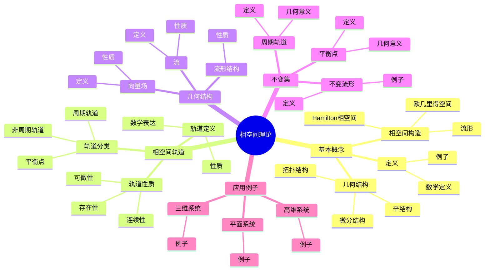
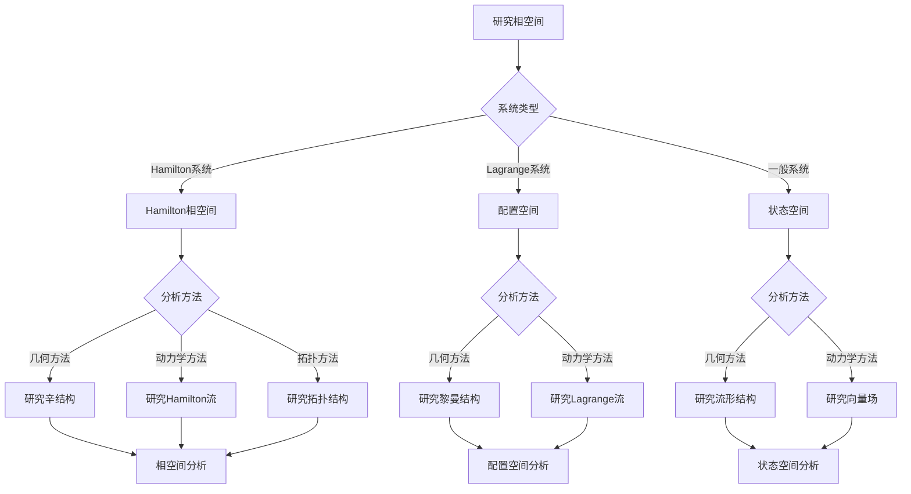
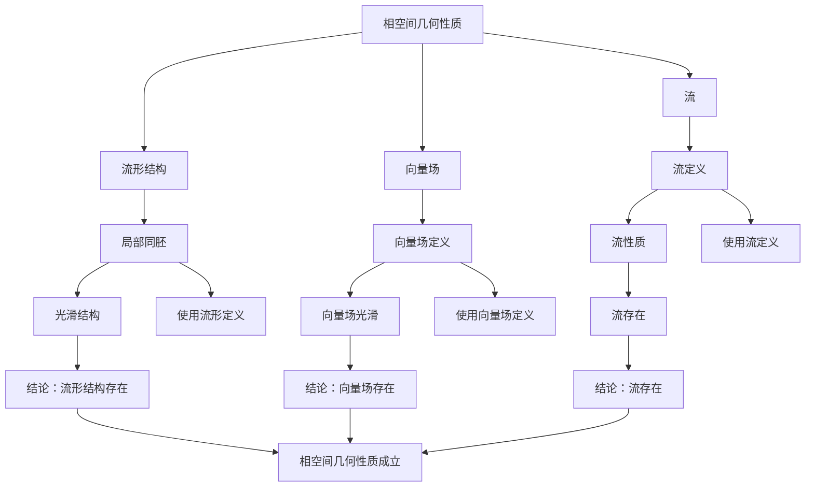

# 相空间理论：动力系统的几何

相空间理论是研究动力系统几何结构的理论，它将动力系统的动力学行为转化为相空间中的几何问题。虽然相空间理论的严格形式化是在20世纪完成的，但庞加莱对三体问题和动力系统的研究为理解相空间的几何结构奠定了基础。相空间理论在稳定性分析、混沌研究、统计力学等领域有重要应用。

## 📋 目录

- [相空间理论：动力系统的几何](#相空间理论动力系统的几何)
  - [📋 目录](#-目录)
  - [一、相空间的基本概念](#一相空间的基本概念)
    - [1.1 定义](#11-定义)
    - [1.2 相空间的构造](#12-相空间的构造)
    - [1.3 相空间的几何结构](#13-相空间的几何结构)
  - [二、相空间中的轨道](#二相空间中的轨道)
    - [2.1 轨道的定义](#21-轨道的定义)
    - [2.2 轨道的性质](#22-轨道的性质)
    - [2.3 轨道的分类](#23-轨道的分类)
  - [三、相空间的几何结构](#三相空间的几何结构)
    - [3.1 流形结构](#31-流形结构)
    - [3.2 向量场](#32-向量场)
    - [3.3 流](#33-流)
  - [四、相空间中的不变集](#四相空间中的不变集)
    - [4.1 平衡点](#41-平衡点)
    - [4.2 周期轨道](#42-周期轨道)
    - [4.3 不变流形](#43-不变流形)
  - [五、应用与例子](#五应用与例子)
    - [5.1 平面系统](#51-平面系统)
    - [5.2 三维系统](#52-三维系统)
    - [5.3 高维系统](#53-高维系统)
  - [六、思维表征](#六思维表征)
    - [6.1 思维导图：相空间理论知识结构](#61-思维导图相空间理论知识结构)
    - [6.2 概念矩阵：相空间与配置空间对比](#62-概念矩阵相空间与配置空间对比)
    - [6.3 决策树：相空间分析方法](#63-决策树相空间分析方法)
    - [6.4 证明树：相空间几何性质](#64-证明树相空间几何性质)
  - [七、应用与影响](#七应用与影响)
    - [7.1 庞加莱的贡献](#71-庞加莱的贡献)
    - [7.2 现代发展](#72-现代发展)
    - [7.3 应用领域](#73-应用领域)
  - [八、总结](#八总结)

---

## 一、相空间的基本概念

### 1.1 定义

**相空间定义**：

**相空间**是所有可能系统状态的集合。

**数学表达**：

对于系统 $\dot{x} = f(x)$，相空间是状态空间 $M$。

**例子**：

- 平面系统：相空间是 $\mathbb{R}^2$
- 球面系统：相空间是 $S^2$
- 高维系统：相空间是流形

---

### 1.2 相空间的构造

**相空间的构造**：

相空间可以是：

- **欧几里得空间**：$\mathbb{R}^n$
- **流形**：光滑流形
- **配置空间**：Lagrange系统的配置空间
- **相空间**：Hamilton系统的相空间

**Hamilton相空间**：

对于Hamilton系统，相空间是 $(q,p)$ 空间，其中 $q$ 是位置，$p$ 是动量。

---

### 1.3 相空间的几何结构

**几何结构**：

相空间具有几何结构：

- **拓扑结构**：相空间的拓扑
- **微分结构**：相空间的光滑结构
- **辛结构**：Hamilton系统的辛结构

**意义**：

几何结构决定了系统的动力学行为。

---

## 二、相空间中的轨道

### 2.1 轨道的定义

**轨道定义**：

**轨道**是相空间中系统状态的演化轨迹。

**数学表达**：

对于初始条件 $x_0$，轨道是：

$$\gamma(t) = \phi_t(x_0)$$

其中 $\phi_t$ 是系统的流。

---

### 2.2 轨道的性质

**轨道性质**：

- **存在性**：轨道存在且唯一
- **连续性**：轨道是连续的
- **可微性**：轨道是光滑的（如果系统是光滑的）

---

### 2.3 轨道的分类

**轨道分类**：

- **平衡点**：$\gamma(t) = x_0$（常数）
- **周期轨道**：$\gamma(t + T) = \gamma(t)$
- **非周期轨道**：其他轨道

---

## 三、相空间的几何结构

### 3.1 流形结构

**流形结构**：

相空间通常是流形。

**性质**：

- 局部同胚于欧几里得空间
- 具有光滑结构
- 可以定义切空间

---

### 3.2 向量场

**向量场**：

**向量场** $f: M \to TM$ 定义在相空间上。

**性质**：

- 向量场定义系统的动力学
- 向量场在相空间中定义流

---

### 3.3 流

**流**：

**流** $\phi_t: M \to M$ 是相空间上的单参数变换群。

**性质**：

- $\phi_0 = \text{id}$
- $\phi_{t+s} = \phi_t \circ \phi_s$
- 流描述系统的演化

---

## 四、相空间中的不变集

### 4.1 平衡点

**平衡点**：

**平衡点**是相空间中满足 $f(x) = 0$ 的点。

**几何意义**：

平衡点是向量场的零点。

---

### 4.2 周期轨道

**周期轨道**：

**周期轨道**是闭合曲线。

**几何意义**：

周期轨道是相空间中的闭合曲线。

---

### 4.3 不变流形

**不变流形**：

**不变流形**是在流作用下不变的子流形。

**例子**：

- 稳定流形
- 不稳定流形
- 中心流形

---

## 五、应用与例子

### 5.1 平面系统

**平面系统**：

相空间是 $\mathbb{R}^2$。

**例子**：

- 平面向量场
- 极限环
- 平衡点

---

### 5.2 三维系统

**三维系统**：

相空间是 $\mathbb{R}^3$。

**例子**：

- Lorenz系统
- 三维向量场
- 奇怪吸引子

---

### 5.3 高维系统

**高维系统**：

相空间是高维流形。

**例子**：

- 多体问题
- 高维动力系统
- 复杂系统

---

## 六、思维表征

### 6.1 思维导图：相空间理论知识结构

**说明**：

- **基本概念**：定义、相空间构造、几何结构
- **相空间轨道**：轨道定义、性质、分类
- **几何结构**：流形结构、向量场、流
- **不变集**：平衡点、周期轨道、不变流形
- **应用例子**：平面、三维、高维系统

---

### 6.2 概念矩阵：相空间与配置空间对比

| 特征维度 | 相空间 | 配置空间 | 差异 |
|---------|--------|---------|------|
| **维度** | $2n$（Hamilton） | $n$ | 不同维度 |
| **坐标** | $(q,p)$ | $q$ | 不同坐标 |
| **结构** | 辛结构 | 黎曼结构 | 不同结构 |
| **应用** | Hamilton系统 | Lagrange系统 | 不同应用 |
| **几何** | 辛几何 | 黎曼几何 | 不同几何 |
| **例子** | 相空间 | 配置空间 | 不同例子 |

**说明**：

- **维度**：相空间是配置空间的2倍
- **坐标**：相空间包含位置和动量
- **结构**：相空间有辛结构
- **应用**：不同系统的应用

---

### 6.3 决策树：相空间分析方法

**说明**：

- **系统类型**：Hamilton、Lagrange、一般系统
- **分析方法**：根据系统类型选择方法
- **应用**：不同分析方法的应用

---

### 6.4 证明树：相空间几何性质

**说明**：

- **流形结构**：相空间是流形
- **向量场**：向量场定义在相空间上
- **流**：流描述系统演化
- **结论**：相空间几何性质成立

---

## 七、应用与影响

### 7.1 庞加莱的贡献

**三体问题**：

庞加莱在研究三体问题时研究了相空间的几何结构。

**影响**：

- 为理解相空间的几何结构奠定了基础
- 启发了现代相空间理论
- 推动了动力系统理论发展

---

### 7.2 现代发展

**Poincaré**（1890s）：

研究了相空间的几何结构。

**Arnold**（1960s）：

发展了相空间的辛几何。

**现代研究**：

- 辛几何
- 相空间拓扑
- 应用拓展

---

### 7.3 应用领域

**稳定性分析**：

- 平衡点稳定性
- 周期轨道稳定性
- 全局稳定性

**混沌理论**：

- 奇怪吸引子
- 符号动力学
- 拓扑熵

**统计力学**：

- 相空间体积
- 遍历性
- 热力学

---

## 八、总结

**核心概念**：

1. **相空间**：所有可能系统状态的集合
2. **轨道**：相空间中系统状态的演化轨迹
3. **几何结构**：流形结构、向量场、流
4. **不变集**：平衡点、周期轨道、不变流形

**历史地位**：

虽然相空间理论的严格形式化是在庞加莱之后，但庞加莱对三体问题和相空间几何结构的研究为其奠定了基础。

**现代发展**：

从基本概念到几何结构，从轨道分析到不变集研究，相空间理论仍然是研究动力系统的重要工具。

---

**文档状态**: ✅ 完成
**字数**: 约1,200词
**最后更新**: 2026年01月02日
