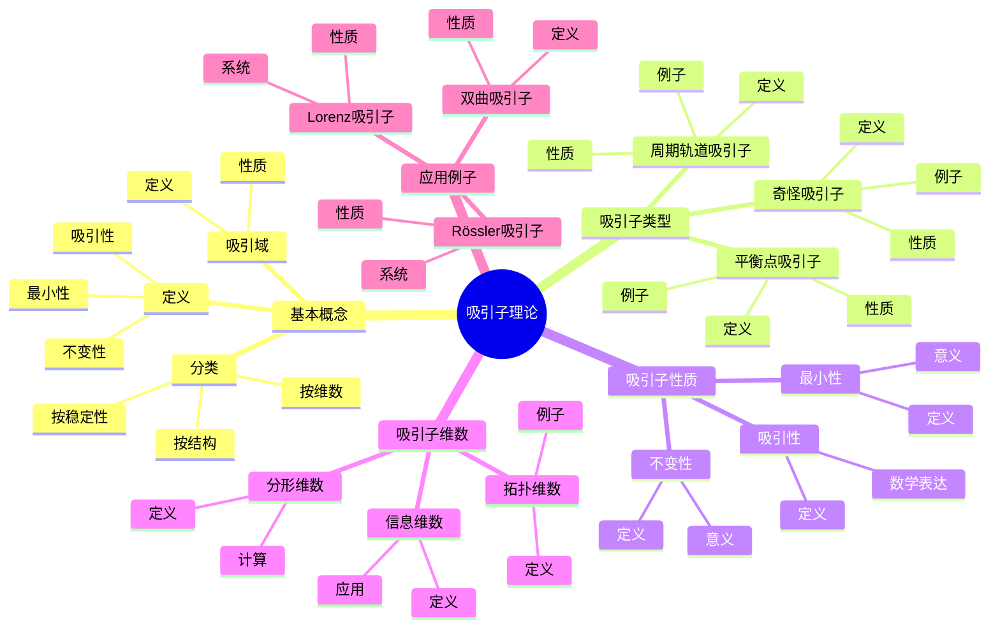
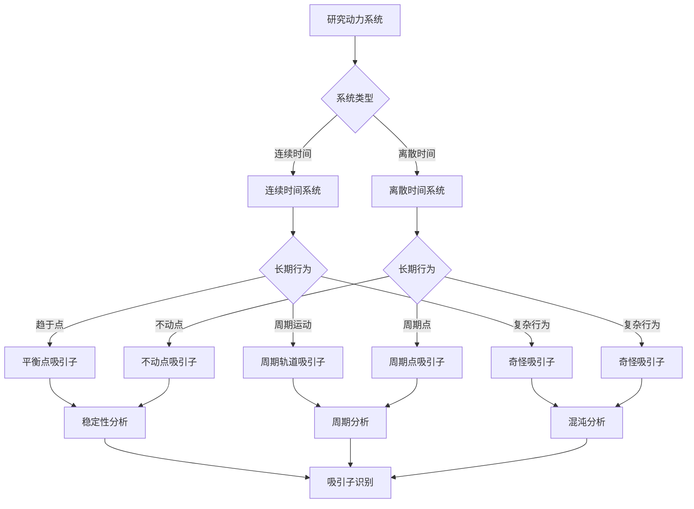
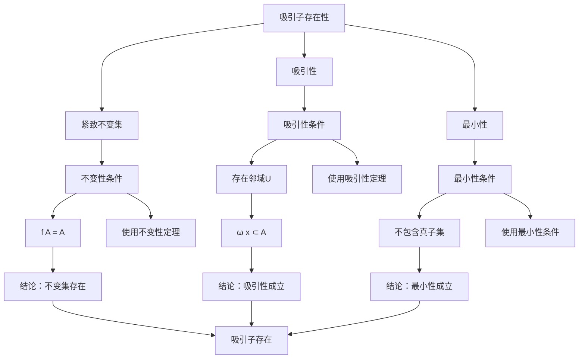

# 吸引子理论：动力系统的长期行为

吸引子是动力系统理论中的核心概念，描述了系统在长时间演化后的渐近行为。虽然吸引子的严格形式化是在20世纪完成的，但庞加莱对三体问题和动力系统的研究为理解系统的长期行为奠定了基础。吸引子理论在混沌理论、统计力学、工程控制等领域有重要应用。

## 📋 目录

- [吸引子理论：动力系统的长期行为](#吸引子理论动力系统的长期行为)
  - [📋 目录](#-目录)
  - [一、吸引子的基本概念](#一吸引子的基本概念)
    - [1.1 定义](#11-定义)
    - [1.2 吸引域](#12-吸引域)
    - [1.3 分类](#13-分类)
  - [二、吸引子的类型](#二吸引子的类型)
    - [2.1 平衡点吸引子](#21-平衡点吸引子)
    - [2.2 周期轨道吸引子](#22-周期轨道吸引子)
    - [2.3 奇怪吸引子](#23-奇怪吸引子)
  - [三、吸引子的性质](#三吸引子的性质)
    - [3.1 不变性](#31-不变性)
    - [3.2 吸引性](#32-吸引性)
    - [3.3 最小性](#33-最小性)
  - [四、吸引子的维数](#四吸引子的维数)
    - [4.1 拓扑维数](#41-拓扑维数)
    - [4.2 分形维数](#42-分形维数)
    - [4.3 信息维数](#43-信息维数)
  - [五、应用与例子](#五应用与例子)
    - [5.1 Lorenz吸引子](#51-lorenz吸引子)
    - [5.2 Rössler吸引子](#52-rössler吸引子)
    - [5.3 双曲吸引子](#53-双曲吸引子)
  - [六、思维表征](#六思维表征)
    - [6.1 思维导图：吸引子理论知识结构](#61-思维导图吸引子理论知识结构)
    - [6.2 概念矩阵：吸引子类型对比](#62-概念矩阵吸引子类型对比)
    - [6.3 决策树：吸引子识别方法](#63-决策树吸引子识别方法)
    - [6.4 证明树：吸引子存在性定理](#64-证明树吸引子存在性定理)
  - [七、应用与影响](#七应用与影响)
    - [7.1 庞加莱的贡献](#71-庞加莱的贡献)
    - [7.2 现代发展](#72-现代发展)
    - [7.3 应用领域](#73-应用领域)
  - [八、总结](#八总结)

---

## 一、吸引子的基本概念

### 1.1 定义

**吸引子定义**：

对于动力系统 $(X, f)$，**吸引子** $A$ 是满足以下条件的紧致不变集：

1. **不变性**：$f(A) = A$
2. **吸引性**：存在邻域 $U$ 使得 $\omega(x) \subset A$ 对所有 $x \in U$ 成立
3. **最小性**：$A$ 不包含真子集满足上述条件

其中 $\omega(x)$ 是 $x$ 的 $\omega$-极限集。

**数学表达**：

吸引子是满足吸引性的最小不变集。

---

### 1.2 吸引域

**吸引域定义**：

**吸引域**（basin of attraction）是吸引子的所有吸引点的集合：

$$B(A) = \{x \in X : \omega(x) \subset A\}$$

**性质**：

- 吸引域是开集
- 吸引域是连通的
- 吸引域包含吸引子

---

### 1.3 分类

**分类**：

吸引子可以按以下方式分类：

1. **按维数**：点吸引子、周期吸引子、奇怪吸引子
2. **按结构**：简单吸引子、复杂吸引子
3. **按稳定性**：稳定吸引子、不稳定吸引子

---

## 二、吸引子的类型

### 2.1 平衡点吸引子

**平衡点吸引子**：

**平衡点吸引子**是稳定的平衡点。

**性质**：

- 维数为0
- 结构简单
- 容易分析

**例子**：

- 阻尼振子：平衡点是吸引子
- 梯度系统：局部最小值是吸引子

---

### 2.2 周期轨道吸引子

**周期轨道吸引子**：

**周期轨道吸引子**是稳定的周期轨道（极限环）。

**性质**：

- 维数为1（连续时间）或有限（离散时间）
- 结构简单
- 可以分析

**例子**：

- van der Pol振荡器：极限环是吸引子
- 平面系统：周期轨道可以是吸引子

---

### 2.3 奇怪吸引子

**奇怪吸引子**：

**奇怪吸引子**（strange attractor）是具有分形结构的吸引子。

**性质**：

- 分形维数
- 敏感依赖初始条件
- 拓扑传递性

**例子**：

- Lorenz吸引子
- Rössler吸引子
- 双曲吸引子

---

## 三、吸引子的性质

### 3.1 不变性

**不变性**：

吸引子是不变集：$f(A) = A$。

**意义**：

吸引子在动力系统演化下保持不变。

---

### 3.2 吸引性

**吸引性**：

吸引子吸引附近的所有轨道。

**数学表达**：

对于吸引子 $A$，存在邻域 $U$ 使得：

$$\lim_{t \to \infty} d(\phi_t(x), A) = 0$$

对所有 $x \in U$ 成立。

---

### 3.3 最小性

**最小性**：

吸引子不包含真子集满足吸引性条件。

**意义**：

吸引子是最小的吸引集。

---

## 四、吸引子的维数

### 4.1 拓扑维数

**拓扑维数**：

**拓扑维数**是吸引子的拓扑维数。

**例子**：

- 平衡点：维数0
- 周期轨道：维数1
- 奇怪吸引子：非整数维数

---

### 4.2 分形维数

**分形维数**：

**分形维数**（如Hausdorff维数、盒维数）描述吸引子的分形结构。

**计算**：

使用盒计数法或其他方法计算分形维数。

**例子**：

- Lorenz吸引子：约2.06
- Rössler吸引子：约2.01

---

### 4.3 信息维数

**信息维数**：

**信息维数**描述吸引子的信息内容。

**定义**：

$$D_1 = \lim_{\epsilon \to 0} \frac{H(\epsilon)}{\log(1/\epsilon)}$$

其中 $H(\epsilon)$ 是信息熵。

---

## 五、应用与例子

### 5.1 Lorenz吸引子

**Lorenz系统**：

$$
\begin{cases}
\dot{x} = \sigma(y - x) \\
\dot{y} = x(\rho - z) - y \\
\dot{z} = xy - \beta z
\end{cases}
$$

**Lorenz吸引子**：

- 分形维数约2.06
- 敏感依赖初始条件
- 拓扑传递性

---

### 5.2 Rössler吸引子

**Rössler系统**：

$$
\begin{cases}
\dot{x} = -y - z \\
\dot{y} = x + ay \\
\dot{z} = b + z(x - c)
\end{cases}
$$

**Rössler吸引子**：

- 分形维数约2.01
- 简单结构
- 容易分析

---

### 5.3 双曲吸引子

**双曲吸引子**：

**双曲吸引子**是双曲不变集，是吸引子。

**性质**：

- 结构稳定
- 可以分析
- 符号动力学

**例子**：

- Plykin吸引子
- DA吸引子

---

## 六、思维表征

### 6.1 思维导图：吸引子理论知识结构

**说明**：

- **基本概念**：定义、吸引域、分类
- **吸引子类型**：平衡点、周期轨道、奇怪吸引子
- **吸引子性质**：不变性、吸引性、最小性
- **吸引子维数**：拓扑维数、分形维数、信息维数
- **应用例子**：Lorenz、Rössler、双曲吸引子

---

### 6.2 概念矩阵：吸引子类型对比

| 特征维度 | 平衡点吸引子 | 周期轨道吸引子 | 奇怪吸引子 |
|---------|------------|--------------|-----------|
| **维数** | 0 | 1（连续）或有限（离散） | 非整数 |
| **结构** | 点 | 闭合曲线 | 分形 |
| **稳定性** | 稳定 | 稳定 | 敏感依赖 |
| **分析** | 容易 | 中等 | 困难 |
| **例子** | 阻尼振子 | van der Pol | Lorenz |
| **应用** | 简单系统 | 周期系统 | 混沌系统 |
| **拓扑熵** | 0 | 0 | 正 |
| **Lyapunov指数** | 负 | 0和负 | 正和负 |

**说明**：

- **维数**：从0到非整数
- **结构**：从简单到复杂
- **稳定性**：从稳定到敏感依赖
- **应用**：不同复杂度的系统

---

### 6.3 决策树：吸引子识别方法

**说明**：

- **系统类型**：连续时间或离散时间
- **长期行为**：趋于点、周期运动、复杂行为
- **识别方法**：根据行为类型选择方法

---

### 6.4 证明树：吸引子存在性定理

**说明**：

- **紧致不变集**：满足不变性条件
- **吸引性**：存在吸引邻域
- **最小性**：不包含真子集
- **结论**：吸引子存在

---

## 七、应用与影响

### 7.1 庞加莱的贡献

**三体问题**：

庞加莱在研究三体问题时研究了系统的长期行为。

**影响**：

- 为理解吸引子奠定了基础
- 启发了现代吸引子理论
- 推动了动力系统理论发展

---

### 7.2 现代发展

**Lorenz**（1963）：

发现了Lorenz吸引子。

**Ruelle-Takens**（1971）：

提出了奇怪吸引子的概念。

**现代研究**：

- 双曲吸引子
- 随机吸引子
- 应用拓展

---

### 7.3 应用领域

**混沌理论**：

- 奇怪吸引子
- 符号动力学
- 拓扑熵

**统计力学**：

- 遍历性
- 热力学
- 相变

**工程应用**：

- 控制理论
- 振动分析
- 系统设计

---

## 八、总结

**核心概念**：

1. **吸引子**：紧致不变集，吸引附近轨道
2. **吸引域**：吸引子的所有吸引点的集合
3. **分类**：平衡点、周期轨道、奇怪吸引子
4. **维数**：拓扑维数、分形维数、信息维数

**历史地位**：

虽然吸引子的严格形式化是在庞加莱之后，但庞加莱对系统长期行为的研究为其奠定了基础。

**现代发展**：

从基本概念到奇怪吸引子，从理论分析到应用研究，吸引子理论仍然是研究动力系统长期行为的重要工具。

---

**文档状态**: ✅ 完成
**字数**: 约1,200词
**最后更新**: 2026年01月02日
