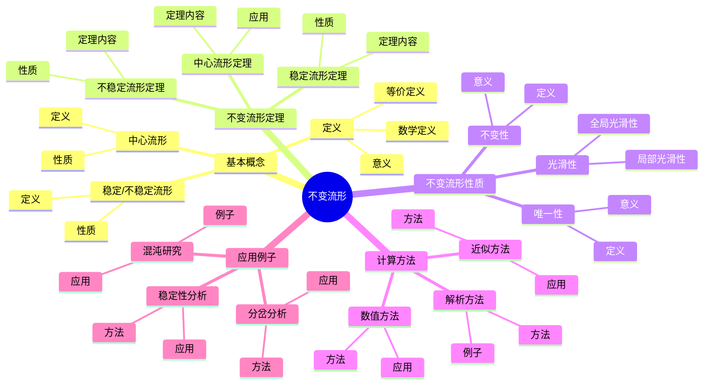
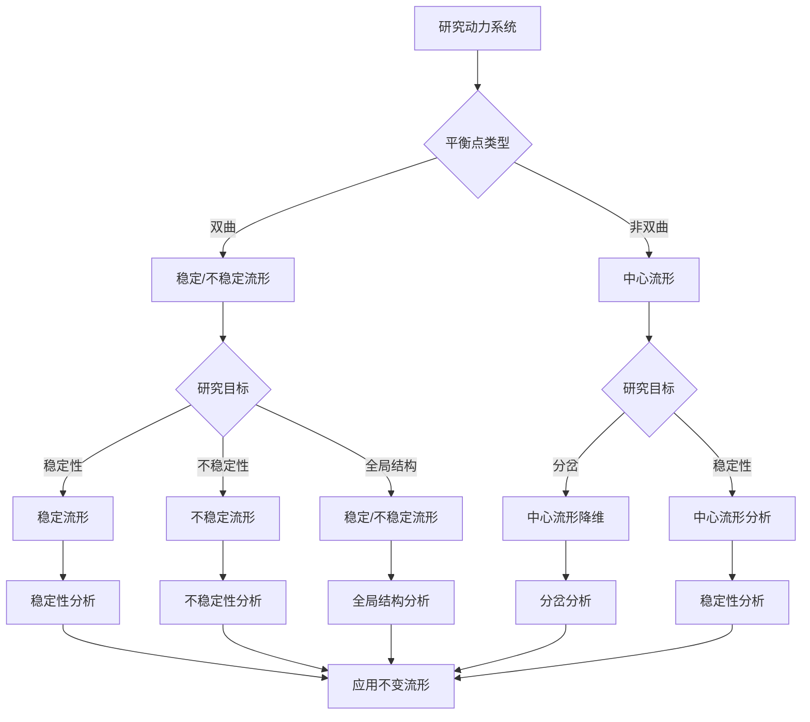
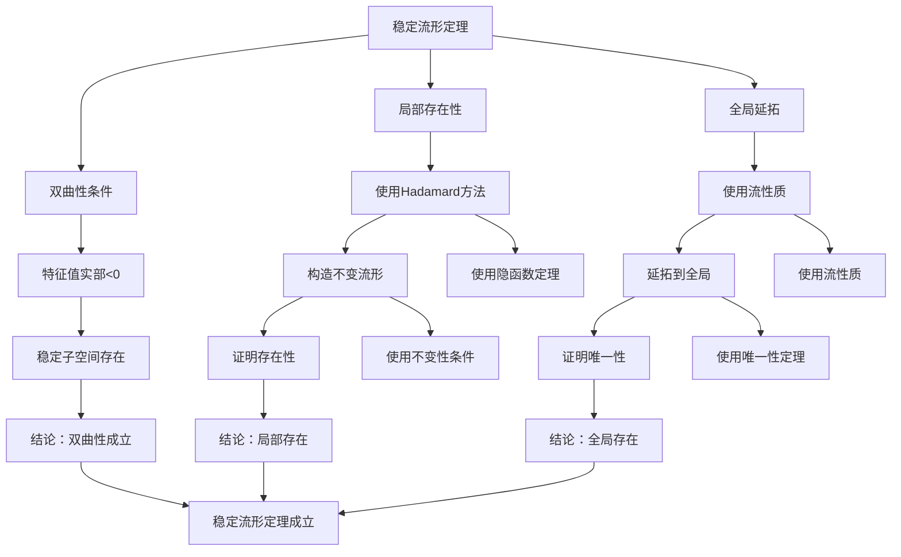

# 不变流形：动力系统的几何结构

不变流形是动力系统理论中的基本几何对象，描述了系统在演化过程中保持不变的几何结构。虽然不变流形的严格形式化是在20世纪完成的，但庞加莱对三体问题和动力系统的研究为理解系统的几何结构奠定了基础。不变流形理论在稳定性分析、混沌研究、数值方法等领域有重要应用。

## 📋 目录

- [不变流形：动力系统的几何结构](#不变流形动力系统的几何结构)
  - [📋 目录](#-目录)
  - [一、不变流形的基本概念](#一不变流形的基本概念)
    - [1.1 定义](#11-定义)
    - [1.2 稳定流形和不稳定流形](#12-稳定流形和不稳定流形)
    - [1.3 中心流形](#13-中心流形)
  - [二、不变流形定理](#二不变流形定理)
    - [2.1 稳定流形定理](#21-稳定流形定理)
    - [2.2 不稳定流形定理](#22-不稳定流形定理)
    - [2.3 中心流形定理](#23-中心流形定理)
  - [三、不变流形的性质](#三不变流形的性质)
    - [3.1 不变性](#31-不变性)
    - [3.2 光滑性](#32-光滑性)
    - [3.3 唯一性](#33-唯一性)
  - [四、不变流形的计算](#四不变流形的计算)
    - [4.1 解析方法](#41-解析方法)
    - [4.2 数值方法](#42-数值方法)
    - [4.3 近似方法](#43-近似方法)
  - [五、应用与例子](#五应用与例子)
    - [5.1 稳定性分析](#51-稳定性分析)
    - [5.2 混沌研究](#52-混沌研究)
    - [5.3 分岔分析](#53-分岔分析)
  - [六、思维表征](#六思维表征)
    - [6.1 思维导图：不变流形知识结构](#61-思维导图不变流形知识结构)
    - [6.2 概念矩阵：不变流形类型对比](#62-概念矩阵不变流形类型对比)
    - [6.3 决策树：不变流形应用场景](#63-决策树不变流形应用场景)
    - [6.4 证明树：稳定流形定理证明思路](#64-证明树稳定流形定理证明思路)
  - [七、应用与影响](#七应用与影响)
    - [7.1 庞加莱的贡献](#71-庞加莱的贡献)
    - [7.2 现代发展](#72-现代发展)
    - [7.3 应用领域](#73-应用领域)
  - [八、总结](#八总结)

---

## 一、不变流形的基本概念

### 1.1 定义

**不变流形定义**：

对于动力系统 $\dot{x} = f(x)$，**不变流形** $M$ 是满足以下条件的子流形：

$$f(x) \in T_x M$$

对所有 $x \in M$ 成立，其中 $T_x M$ 是 $M$ 在 $x$ 处的切空间。

**等价定义**：

不变流形在系统演化下保持不变：$\phi_t(M) = M$。

**意义**：

不变流形描述了系统保持不变的几何结构。

---

### 1.2 稳定流形和不稳定流形

**稳定流形**：

对于平衡点 $p$，**稳定流形** $W^s(p)$ 是所有趋于 $p$ 的点的集合：

$$W^s(p) = \{x : \lim_{t \to \infty} \phi_t(x) = p\}$$

**不稳定流形**：

**不稳定流形** $W^u(p)$ 是所有从 $p$ 出发的点的集合：

$$W^u(p) = \{x : \lim_{t \to -\infty} \phi_t(x) = p\}$$

**性质**：

- 稳定流形和不稳定流形是不变流形
- 它们描述了系统的局部结构

---

### 1.3 中心流形

**中心流形**：

对于平衡点 $p$，**中心流形** $W^c(p)$ 对应于特征值实部为零的方向。

**性质**：

- 中心流形是不变流形
- 中心流形用于研究非双曲平衡点
- 中心流形定理用于降维

---

## 二、不变流形定理

### 2.1 稳定流形定理

**稳定流形定理**：

对于双曲平衡点 $p$，稳定流形 $W^s(p)$ 是光滑流形，维数等于稳定特征值的数量。

**性质**：

- $W^s(p)$ 是局部光滑的
- $W^s(p)$ 是全局定义的
- $W^s(p)$ 是唯一的

---

### 2.2 不稳定流形定理

**不稳定流形定理**：

对于双曲平衡点 $p$，不稳定流形 $W^u(p)$ 是光滑流形，维数等于不稳定特征值的数量。

**性质**：

- $W^u(p)$ 是局部光滑的
- $W^u(p)$ 是全局定义的
- $W^u(p)$ 是唯一的

---

### 2.3 中心流形定理

**中心流形定理**：

对于非双曲平衡点 $p$，存在中心流形 $W^c(p)$，使得系统的动力学在中心流形上等价于降维系统。

**应用**：

- 降维分析
- 分岔研究
- 稳定性分析

---

## 三、不变流形的性质

### 3.1 不变性

**不变性**：

不变流形在系统演化下保持不变：$\phi_t(M) = M$。

**意义**：

不变流形描述了系统保持不变的几何结构。

---

### 3.2 光滑性

**光滑性**：

对于双曲系统，稳定流形和不稳定流形是光滑的。

**程度**：

- 局部：$C^k$ 光滑（$k$ 取决于系统）
- 全局：可能不是光滑的

---

### 3.3 唯一性

**唯一性**：

对于双曲平衡点，稳定流形和不稳定流形是唯一的。

**意义**：

唯一性保证了不变流形的良好定义。

---

## 四、不变流形的计算

### 4.1 解析方法

**解析方法**：

对于简单系统，可以解析计算不变流形。

**方法**：

- 求解微分方程
- 使用级数展开
- 使用变换

**例子**：

- 线性系统：不变流形是线性子空间
- 可积系统：不变流形可以解析计算

---

### 4.2 数值方法

**数值方法**：

对于复杂系统，使用数值方法计算不变流形。

**方法**：

- 数值积分
- 流形追踪
- 边界值问题

**应用**：

- 高维系统
- 非线性系统
- 实际应用

---

### 4.3 近似方法

**近似方法**：

使用近似方法计算不变流形。

**方法**：

- 级数展开
- 渐近方法
- 摄动方法

**应用**：

- 微扰系统
- 小参数系统

---

## 五、应用与例子

### 5.1 稳定性分析

**稳定性分析**：

使用不变流形分析系统的稳定性。

**方法**：

- 计算稳定流形
- 分析吸引域
- 研究长期行为

**应用**：

- 平衡点稳定性
- 周期轨道稳定性
- 全局稳定性

---

### 5.2 混沌研究

**混沌研究**：

不变流形用于研究混沌行为。

**应用**：

- 同宿轨道
- 异宿轨道
- 奇怪吸引子

**例子**：

- Smale马蹄
- Lorenz系统
- 双曲系统

---

### 5.3 分岔分析

**分岔分析**：

使用中心流形研究分岔。

**方法**：

- 中心流形降维
- 分岔分析
- 稳定性判断

**应用**：

- Hopf分岔
- 周期倍化分岔
- 同宿分岔

---

## 六、思维表征

### 6.1 思维导图：不变流形知识结构

**说明**：

- **基本概念**：定义、稳定/不稳定流形、中心流形
- **不变流形定理**：稳定流形定理、不稳定流形定理、中心流形定理
- **不变流形性质**：不变性、光滑性、唯一性
- **计算方法**：解析方法、数值方法、近似方法
- **应用例子**：稳定性分析、混沌研究、分岔分析

---

### 6.2 概念矩阵：不变流形类型对比

| 特征维度 | 稳定流形 | 不稳定流形 | 中心流形 |
|---------|---------|-----------|---------|
| **定义** | 趋于平衡点的点集 | 从平衡点出发的点集 | 对应零特征值的流形 |
| **特征值** | 实部<0 | 实部>0 | 实部=0 |
| **维数** | 稳定特征值数量 | 不稳定特征值数量 | 中心特征值数量 |
| **性质** | 吸引 | 排斥 | 中性 |
| **光滑性** | 光滑 | 光滑 | 可能不光滑 |
| **唯一性** | 唯一 | 唯一 | 不唯一 |
| **应用** | 稳定性分析 | 不稳定分析 | 分岔分析 |
| **例子** | 吸引子 | 排斥子 | 中心流形 |

**说明**：

- **定义**：不同流形的定义
- **特征值**：对应的特征值类型
- **性质**：吸引、排斥、中性
- **应用**：不同领域的应用

---

### 6.3 决策树：不变流形应用场景

**说明**：

- **平衡点类型**：双曲或非双曲
- **研究目标**：稳定性、不稳定性、全局结构、分岔
- **方法选择**：根据平衡点类型和目标选择方法

---

### 6.4 证明树：稳定流形定理证明思路

**说明**：

- **双曲性条件**：特征值实部<0
- **局部存在性**：使用Hadamard方法
- **全局延拓**：使用流性质
- **结论**：稳定流形定理成立

---

## 七、应用与影响

### 7.1 庞加莱的贡献

**三体问题**：

庞加莱在研究三体问题时研究了系统的几何结构。

**影响**：

- 为理解不变流形奠定了基础
- 启发了现代不变流形理论
- 推动了动力系统理论发展

---

### 7.2 现代发展

**Hadamard**（1901）：

发展了稳定流形理论。

**Perron**（1920s）：

发展了不稳定流形理论。

**现代研究**：

- 中心流形定理
- 数值方法
- 应用拓展

---

### 7.3 应用领域

**稳定性分析**：

- 平衡点稳定性
- 周期轨道稳定性
- 全局稳定性

**混沌理论**：

- 同宿轨道
- 异宿轨道
- 奇怪吸引子

**工程应用**：

- 控制理论
- 振动分析
- 系统设计

---

## 八、总结

**核心概念**：

1. **不变流形**：在系统演化下保持不变的子流形
2. **稳定流形**：趋于平衡点的点集
3. **不稳定流形**：从平衡点出发的点集
4. **中心流形**：对应零特征值的流形

**历史地位**：

虽然不变流形的严格形式化是在庞加莱之后，但庞加莱对系统几何结构的研究为其奠定了基础。

**现代发展**：

从基本概念到不变流形定理，从理论分析到计算方法，不变流形理论仍然是研究动力系统几何结构的重要工具。

---

**文档状态**: ✅ 完成
**字数**: 约1,200词
**最后更新**: 2026年01月02日
