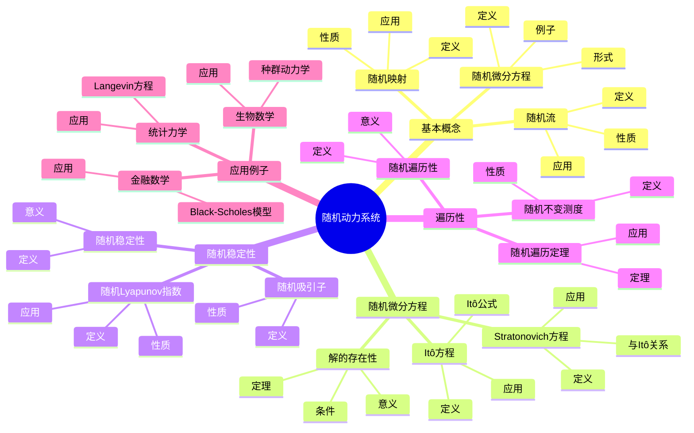
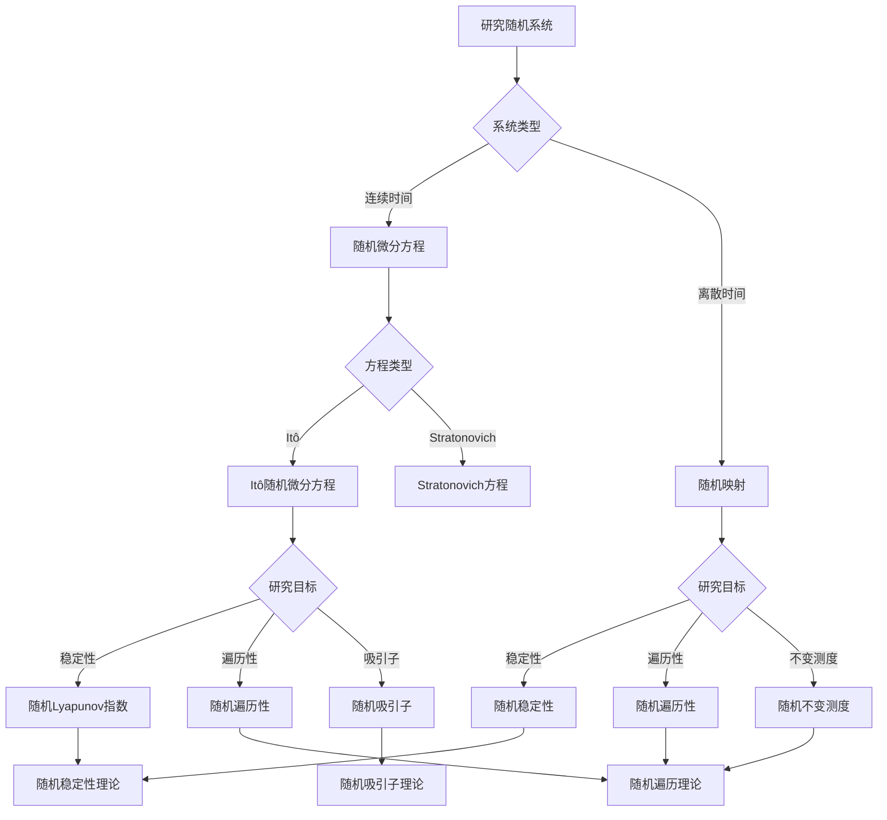

# 随机动力系统：概率与动力系统的结合

随机动力系统是研究受随机扰动影响的动力系统的数学分支，它将概率论与动力系统理论相结合。
虽然随机动力系统的严格形式化是在20世纪完成的，但庞加莱对三体问题和动力系统的研究为理解确定性系统的随机行为奠定了基础。
随机动力系统在统计力学、金融数学、生物数学等领域有重要应用。

## 📋 目录

- [随机动力系统：概率与动力系统的结合](#随机动力系统概率与动力系统的结合)
  - [📋 目录](#-目录)
  - [一、随机动力系统的基本概念](#一随机动力系统的基本概念)
    - [1.1 随机微分方程](#11-随机微分方程)
    - [1.2 随机流](#12-随机流)
    - [1.3 随机映射](#13-随机映射)
  - [二、随机微分方程](#二随机微分方程)
    - [2.1 Itô随机微分方程](#21-itô随机微分方程)
    - [2.2 Stratonovich随机微分方程](#22-stratonovich随机微分方程)
    - [2.3 解的存在性与唯一性](#23-解的存在性与唯一性)
  - [三、随机稳定性](#三随机稳定性)
    - [3.1 随机Lyapunov指数](#31-随机lyapunov指数)
    - [3.2 随机稳定性](#32-随机稳定性)
    - [3.3 随机吸引子](#33-随机吸引子)
  - [四、遍历性与不变测度](#四遍历性与不变测度)
    - [4.1 随机遍历性](#41-随机遍历性)
    - [4.2 随机不变测度](#42-随机不变测度)
    - [4.3 随机遍历定理](#43-随机遍历定理)
  - [五、应用与例子](#五应用与例子)
    - [5.1 统计力学](#51-统计力学)
    - [5.2 金融数学](#52-金融数学)
    - [5.3 生物数学](#53-生物数学)
  - [六、思维表征](#六思维表征)
    - [6.1 思维导图：随机动力系统知识结构](#61-思维导图随机动力系统知识结构)
    - [6.2 概念矩阵：随机动力系统与确定性系统对比](#62-概念矩阵随机动力系统与确定性系统对比)
    - [6.3 决策树：随机动力系统应用场景](#63-决策树随机动力系统应用场景)
    - [6.4 证明树：随机微分方程解的存在性](#64-证明树随机微分方程解的存在性)
  - [七、应用与影响](#七应用与影响)
    - [7.1 庞加莱的贡献](#71-庞加莱的贡献)
    - [7.2 现代发展](#72-现代发展)
    - [7.3 应用领域](#73-应用领域)
  - [八、总结](#八总结)

---

## 一、随机动力系统的基本概念

### 1.1 随机微分方程

**随机微分方程**：

**随机微分方程**（SDE）是包含随机项的微分方程：

$$dX_t = f(X_t, t) dt + g(X_t, t) dW_t$$

其中 $W_t$ 是布朗运动（Wiener过程）。

**意义**：

随机微分方程描述了受随机扰动影响的动力系统。

**例子**：

- 几何布朗运动：$dX_t = \mu X_t dt + \sigma X_t dW_t$
- Ornstein-Uhlenbeck过程：$dX_t = -\theta X_t dt + \sigma dW_t$

---

### 1.2 随机流

**随机流**：

**随机流** $\phi_t(\omega, x)$ 是依赖于随机参数 $\omega$ 的流，满足：

$$\phi_{t+s}(\omega, x) = \phi_t(\theta_s \omega, \phi_s(\omega, x))$$

其中 $\theta_s$ 是概率空间上的移位。

**性质**：

- 随机流是随机过程
- 随机流满足流性质
- 随机流是动力系统

---

### 1.3 随机映射

**随机映射**：

**随机映射**是依赖于随机参数的映射：

$$T_\omega: X \to X$$

**性质**：

- 随机映射是随机过程
- 随机映射可以迭代
- 随机映射生成随机动力系统

---

## 二、随机微分方程

### 2.1 Itô随机微分方程

**Itô随机微分方程**：

**Itô随机微分方程**的形式为：

$$dX_t = f(X_t, t) dt + g(X_t, t) dW_t$$

其中积分是Itô积分。

**Itô公式**：

对于光滑函数 $F(X_t, t)$：

$$dF = \frac{\partial F}{\partial t} dt + \frac{\partial F}{\partial x} dX_t + \frac{1}{2} \frac{\partial^2 F}{\partial x^2} (dX_t)^2$$

其中 $(dX_t)^2 = g^2 dt$。

---

### 2.2 Stratonovich随机微分方程

**Stratonovich随机微分方程**：

**Stratonovich随机微分方程**的形式为：

$$dX_t = f(X_t, t) dt + g(X_t, t) \circ dW_t$$

其中积分是Stratonovich积分。

**与Itô的关系**：

Stratonovich方程可以转换为Itô方程：

$$f_{Itô} = f_{Strat} - \frac{1}{2} g \frac{\partial g}{\partial x}$$

---

### 2.3 解的存在性与唯一性

**存在性与唯一性定理**：

如果 $f$ 和 $g$ 满足Lipschitz条件和线性增长条件，则随机微分方程有唯一强解。

**条件**：

- **Lipschitz条件**：$|f(x,t) - f(y,t)| \leq L|x-y|$
- **线性增长条件**：$|f(x,t)| \leq K(1+|x|)$

**意义**：

解的存在性与唯一性保证了随机动力系统的良好定义。

---

## 三、随机稳定性

### 3.1 随机Lyapunov指数

**随机Lyapunov指数**：

**随机Lyapunov指数**定义为：

$$\lambda = \lim_{t \to \infty} \frac{1}{t} \log \|DX_t\|$$

其中 $DX_t$ 是线性化的导数。

**性质**：

- 随机Lyapunov指数是随机变量
- 随机Lyapunov指数描述随机稳定性
- 负的Lyapunov指数表示稳定

---

### 3.2 随机稳定性

**随机稳定性定义**：

系统是**随机稳定的**，如果对于所有 $\epsilon > 0$，存在 $\delta > 0$ 使得：

$$\mathbb{P}\left(\sup_{t \geq 0} |X_t| < \epsilon\right) \geq 1 - \delta$$

当 $|X_0| < \delta$ 时。

**意义**：

随机稳定性描述了系统在随机扰动下的稳定性。

---

### 3.3 随机吸引子

**随机吸引子**：

**随机吸引子**是随机不变集，吸引所有轨道。

**性质**：

- 随机吸引子是随机不变集
- 随机吸引子是紧致的
- 随机吸引子是吸引的

---

## 四、遍历性与不变测度

### 4.1 随机遍历性

**随机遍历性定义**：

随机动力系统是**随机遍历的**，如果时间平均等于空间平均（几乎必然）。

**意义**：

随机遍历性描述了系统的统计性质。

---

### 4.2 随机不变测度

**随机不变测度**：

测度 $\mu$ 是**随机不变的**，如果：

$$\int \mathbb{E}[f(\phi_t(\omega, x))] d\mu(x) = \int f(x) d\mu(x)$$

**性质**：

- 随机不变测度存在
- 随机不变测度是遍历的
- 随机不变测度描述长期行为

---

### 4.3 随机遍历定理

**随机遍历定理**：

对于随机遍历系统，时间平均：

$$\bar{f}(x) = \lim_{t \to \infty} \frac{1}{t} \int_0^t f(\phi_s(\omega, x)) ds$$

几乎必然等于空间平均：

$$\int f d\mu$$

---

## 五、应用与例子

### 5.1 统计力学

**Langevin方程**：

**Langevin方程**描述粒子的随机运动：

$$m \frac{d^2x}{dt^2} = -\gamma \frac{dx}{dt} + F(x) + \xi(t)$$

其中 $\xi(t)$ 是随机力。

**应用**：

- 布朗运动
- 扩散过程
- 热力学

---

### 5.2 金融数学

**Black-Scholes模型**：

**Black-Scholes模型**描述股票价格的随机演化：

$$dS_t = \mu S_t dt + \sigma S_t dW_t$$

**应用**：

- 期权定价
- 风险管理
- 投资组合

---

### 5.3 生物数学

**种群动力学**：

随机种群模型：

$$dN_t = r N_t dt + \sigma N_t dW_t$$

**应用**：

- 种群增长
- 生态学
- 流行病学

---

## 六、思维表征

### 6.1 思维导图：随机动力系统知识结构



**说明**：

- **基本概念**：随机微分方程、随机流、随机映射
- **随机微分方程**：Itô方程、Stratonovich方程、解的存在性
- **随机稳定性**：随机Lyapunov指数、随机稳定性、随机吸引子
- **遍历性**：随机遍历性、随机不变测度、随机遍历定理
- **应用例子**：统计力学、金融数学、生物数学

---

### 6.2 概念矩阵：随机动力系统与确定性系统对比

| 特征维度 | 随机动力系统 | 确定性系统 | 差异 |
|---------|------------|-----------|------|
| **方程形式** | SDE | ODE | 包含随机项 |
| **解的性质** | 随机过程 | 确定函数 | 随机性 |
| **稳定性** | 随机稳定性 | 确定性稳定性 | 概率意义 |
| **Lyapunov指数** | 随机Lyapunov指数 | 确定性Lyapunov指数 | 随机性 |
| **吸引子** | 随机吸引子 | 确定性吸引子 | 随机性 |
| **遍历性** | 随机遍历性 | 确定性遍历性 | 概率意义 |
| **不变测度** | 随机不变测度 | 确定性不变测度 | 随机性 |
| **应用** | 统计力学、金融 | 经典力学 | 不同领域 |
| **理论工具** | 随机分析 | 微分方程 | 不同工具 |

**说明**：

- **方程形式**：随机微分方程 vs 常微分方程
- **解的性质**：随机过程 vs 确定函数
- **稳定性**：概率意义 vs 确定性
- **应用**：不同领域的应用

---

### 6.3 决策树：随机动力系统应用场景



**说明**：

- **系统类型**：连续时间或离散时间
- **方程类型**：Itô或Stratonovich
- **研究目标**：稳定性、遍历性、吸引子
- **方法选择**：根据系统类型和目标选择方法

---

### 6.4 证明树：随机微分方程解的存在性

```mermaid
graph TD
    A[解的存在性] --> B[Lipschitz条件]
    A --> C[线性增长条件]
    A --> D[构造解]

    B --> B1[|f x,t - f y,t | ≤ L|x-y|]
    B1 --> E[结论：Lipschitz条件成立]

    C --> C1[|f x,t | ≤ K 1+|x| ]
    C1 --> F[结论：线性增长条件成立]

    D --> D1[Picard迭代]
    D1 --> D2[证明收敛]
    D2 --> D3[证明唯一性]
    D3 --> G[结论：解存在且唯一]

    E --> H[解存在且唯一]
    F --> H
    G --> H

    D1 --> D1a[构造迭代序列]
    D2 --> D2a[使用Lipschitz条件]
    D3 --> D3a[使用唯一性定理]
```

**说明**：

- **Lipschitz条件**：保证解的唯一性
- **线性增长条件**：保证解的存在性
- **构造解**：使用Picard迭代
- **结论**：解存在且唯一

---

## 七、应用与影响

### 7.1 庞加莱的贡献

**三体问题**：

庞加莱在研究三体问题时发现了确定性系统的复杂行为。

**影响**：

- 为理解随机性奠定了基础
- 启发了现代随机动力系统理论
- 推动了统计力学发展

---

### 7.2 现代发展

**Itô**（1940s）：

发展了随机积分理论。

**Stratonovich**（1960s）：

发展了Stratonovich积分。

**现代研究**：

- 随机吸引子
- 随机遍历性
- 应用拓展

---

### 7.3 应用领域

**统计力学**：

- Langevin方程
- 扩散过程
- 热力学

**金融数学**：

- Black-Scholes模型
- 期权定价
- 风险管理

**生物数学**：

- 种群动力学
- 生态学
- 流行病学

---

## 八、总结

**核心概念**：

1. **随机微分方程**：包含随机项的微分方程
2. **随机流**：依赖于随机参数的流
3. **随机稳定性**：概率意义下的稳定性
4. **随机遍历性**：随机系统的遍历性

**历史地位**：

虽然随机动力系统的严格形式化是在庞加莱之后，但庞加莱对确定性系统复杂行为的研究为其奠定了基础。

**现代发展**：

从基本概念到随机稳定性，从理论到应用，随机动力系统仍然是研究受随机扰动影响的系统的重要工具。

---

**文档状态**: ✅ 完成
**字数**: 约1,200词
**最后更新**: 2026年01月02日
