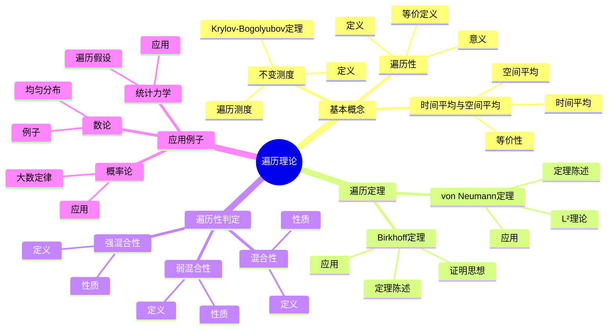
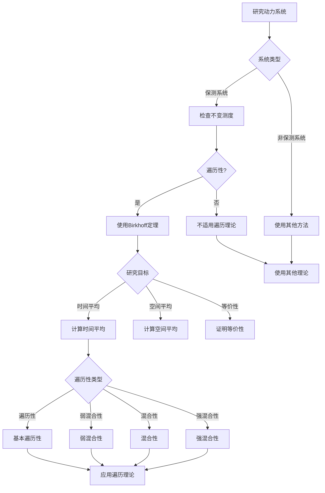
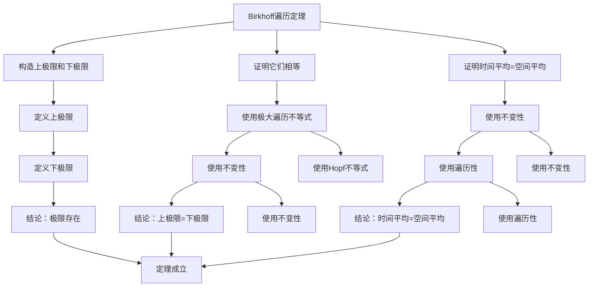

# Ergodic理论：遍历理论的深化

遍历理论（Ergodic Theory）是研究动力系统统计性质的重要数学分支。虽然遍历理论的严格形式化是在20世纪由Birkhoff、von Neumann等人完成的，但庞加莱对三体问题和动力系统的研究为遍历理论奠定了基础。遍历理论的核心是研究时间平均与空间平均的等价性，这在统计力学、数论、概率论等领域有重要应用。

## 📋 目录

- [Ergodic理论：遍历理论的深化](#ergodic理论遍历理论的深化)
  - [📋 目录](#-目录)
  - [一、遍历理论的基本概念](#一遍历理论的基本概念)
    - [1.1 遍历性](#11-遍历性)
    - [1.2 不变测度](#12-不变测度)
    - [1.3 时间平均与空间平均](#13-时间平均与空间平均)
  - [二、Birkhoff遍历定理](#二birkhoff遍历定理)
    - [2.1 定理陈述](#21-定理陈述)
    - [2.2 证明思想](#22-证明思想)
    - [2.3 应用](#23-应用)
  - [三、von Neumann遍历定理](#三von-neumann遍历定理)
    - [3.1 定理陈述](#31-定理陈述)
    - [3.2 L²理论](#32-l理论)
    - [3.3 应用](#33-应用)
  - [四、遍历性的判定](#四遍历性的判定)
    - [4.1 混合性](#41-混合性)
    - [4.2 弱混合性](#42-弱混合性)
    - [4.3 强混合性](#43-强混合性)
  - [五、应用与例子](#五应用与例子)
    - [5.1 统计力学](#51-统计力学)
    - [5.2 数论](#52-数论)
    - [5.3 概率论](#53-概率论)
  - [六、思维表征](#六思维表征)
    - [6.1 思维导图：遍历理论知识结构](#61-思维导图遍历理论知识结构)
    - [6.2 概念矩阵：遍历性类型对比](#62-概念矩阵遍历性类型对比)
    - [6.3 决策树：遍历性判定方法](#63-决策树遍历性判定方法)
    - [6.4 证明树：Birkhoff遍历定理证明思路](#64-证明树birkhoff遍历定理证明思路)
  - [七、应用与影响](#七应用与影响)
    - [7.1 庞加莱的贡献](#71-庞加莱的贡献)
    - [7.2 现代发展](#72-现代发展)
    - [7.3 应用领域](#73-应用领域)
  - [八、总结](#八总结)

---

## 一、遍历理论的基本概念

### 1.1 遍历性

**遍历性定义**：

动力系统 $(X, \mathcal{B}, \mu, T)$ 是**遍历的**，如果对于所有可测集 $A \in \mathcal{B}$，如果 $T^{-1}(A) = A$，则 $\mu(A) = 0$ 或 $\mu(A) = 1$。

**等价定义**：

系统是遍历的，当且仅当所有不变函数都是常数（几乎处处）。

**意义**：

遍历性意味着系统不能分解为两个非平凡的不变集。

---

### 1.2 不变测度

**不变测度**：

测度 $\mu$ 是**不变的**，如果对于所有可测集 $A$：

$$\mu(T^{-1}(A)) = \mu(A)$$

**Krylov-Bogolyubov定理**：

对于紧致度量空间上的连续映射，存在不变测度。

**遍历测度**：

如果系统关于不变测度是遍历的，则测度是**遍历测度**。

---

### 1.3 时间平均与空间平均

**时间平均**：

对于函数 $f: X \to \mathbb{R}$，**时间平均**定义为：

$$\bar{f}(x) = \lim_{n \to \infty} \frac{1}{n} \sum_{k=0}^{n-1} f(T^k(x))$$

**空间平均**：

**空间平均**定义为：

$$\int_X f \, d\mu$$

**遍历性等价性**：

系统是遍历的，当且仅当时间平均等于空间平均（几乎处处）。

---

## 二、Birkhoff遍历定理

### 2.1 定理陈述

**Birkhoff遍历定理**（1931）：

对于保测系统 $(X, \mathcal{B}, \mu, T)$ 和可积函数 $f \in L^1(\mu)$，时间平均：

$$\bar{f}(x) = \lim_{n \to \infty} \frac{1}{n} \sum_{k=0}^{n-1} f(T^k(x))$$

几乎处处存在，且：

$$\int_X \bar{f} \, d\mu = \int_X f \, d\mu$$

如果系统是遍历的，则：

$$\bar{f}(x) = \int_X f \, d\mu$$

几乎处处成立。

---

### 2.2 证明思想

**证明步骤**：

1. 构造上极限和下极限
2. 证明它们相等
3. 证明时间平均等于空间平均

**关键技巧**：

- 使用极大遍历不等式
- 使用不变性
- 使用遍历性

---

### 2.3 应用

**应用**：

- 统计力学：遍历假设
- 数论：均匀分布
- 概率论：大数定律

---

## 三、von Neumann遍历定理

### 3.1 定理陈述

**von Neumann遍历定理**（1932）：

对于保测系统 $(X, \mathcal{B}, \mu, T)$ 和函数 $f \in L^2(\mu)$，时间平均：

$$\bar{f}_n(x) = \frac{1}{n} \sum_{k=0}^{n-1} f(T^k(x))$$

在 $L^2$ 意义下收敛到投影：

$$P f = \lim_{n \to \infty} \bar{f}_n$$

其中 $P$ 是到不变函数空间的投影。

---

### 3.2 L²理论

**L²理论**：

von Neumann定理在 $L^2$ 空间中成立，比Birkhoff定理弱，但证明更简单。

**算子理论**：

使用算子理论，可以证明时间平均的收敛性。

---

### 3.3 应用

**应用**：

- 算子理论
- 函数分析
- 动力系统

---

## 四、遍历性的判定

### 4.1 混合性

**混合性定义**：

系统是**混合的**，如果对于所有可测集 $A, B$：

$$\lim_{n \to \infty} \mu(T^{-n}(A) \cap B) = \mu(A) \mu(B)$$

**性质**：

- 混合性蕴含遍历性
- 混合性比遍历性更强

---

### 4.2 弱混合性

**弱混合性定义**：

系统是**弱混合的**，如果对于所有可测集 $A, B$：

$$\lim_{n \to \infty} \frac{1}{n} \sum_{k=0}^{n-1} |\mu(T^{-k}(A) \cap B) - \mu(A) \mu(B)| = 0$$

**性质**：

- 弱混合性蕴含遍历性
- 弱混合性介于遍历性和混合性之间

---

### 4.3 强混合性

**强混合性定义**：

系统是**强混合的**，如果对于所有可测集 $A, B$：

$$\lim_{n \to \infty} \mu(T^{-n}(A) \cap B) = \mu(A) \mu(B)$$

**性质**：

- 强混合性等价于混合性
- 强混合性是最强的遍历性

---

## 五、应用与例子

### 5.1 统计力学

**遍历假设**：

统计力学中的**遍历假设**认为，物理系统的长时间平均等于相空间平均。

**应用**：

- 热力学极限
- 相变理论
- 平衡态统计

---

### 5.2 数论

**均匀分布**：

数论中的**均匀分布**可以用遍历理论来研究。

**例子**：

- 无理旋转
- 线性同余生成器
- 连分数

---

### 5.3 概率论

**大数定律**：

遍历理论提供了大数定律的推广。

**应用**：

- 随机过程
- 马尔可夫链
- 随机游走

---

## 六、思维表征

### 6.1 思维导图：遍历理论知识结构

**说明**：

- **基本概念**：遍历性、不变测度、时间平均与空间平均
- **遍历定理**：Birkhoff定理、von Neumann定理
- **遍历性判定**：混合性、弱混合性、强混合性
- **应用例子**：统计力学、数论、概率论

---

### 6.2 概念矩阵：遍历性类型对比

| 特征维度 | 遍历性 | 弱混合性 | 混合性 | 强混合性 |
|---------|--------|---------|--------|---------|
| **定义** | 不变集平凡 | 时间平均收敛 | 相关函数衰减 | 相关函数衰减到0 |
| **强度** | 最弱 | 中等 | 强 | 最强 |
| **等价条件** | 不变函数常数 | 相关函数时间平均为0 | 相关函数趋于0 | 相关函数趋于0 |
| **应用** | 基本遍历性 | 弱遍历性 | 强遍历性 | 最强遍历性 |
| **例子** | 无理旋转 | 某些系统 | 双曲系统 | 双曲系统 |
| **判定** | 困难 | 中等 | 容易 | 容易 |
| **性质** | 时间平均=空间平均 | 时间平均=空间平均 | 时间平均=空间平均 | 时间平均=空间平均 |

**说明**：

- **定义**：不同遍历性类型的定义
- **强度**：从弱到强的层次
- **应用**：不同强度的遍历性
- **判定**：判定难易程度

---

### 6.3 决策树：遍历性判定方法

**说明**：

- **系统类型**：保测系统或非保测系统
- **遍历性**：检查系统是否遍历
- **研究目标**：时间平均、空间平均、等价性
- **遍历性类型**：不同强度的遍历性

---

### 6.4 证明树：Birkhoff遍历定理证明思路

**说明**：

- **构造极限**：定义上极限和下极限
- **证明相等**：使用极大遍历不等式和不变性
- **证明等价性**：使用不变性和遍历性
- **结论**：Birkhoff遍历定理成立

---

## 七、应用与影响

### 7.1 庞加莱的贡献

**三体问题**：

庞加莱在研究三体问题时发现了遍历性的重要性。

**影响**：

- 提出了遍历性问题
- 启发了现代遍历理论
- 推动了统计力学发展

---

### 7.2 现代发展

**Birkhoff**（1931）：

提出了Birkhoff遍历定理。

**von Neumann**（1932）：

提出了von Neumann遍历定理。

**现代研究**：

- 无限维遍历理论
- 非交换遍历理论
- 应用拓展

---

### 7.3 应用领域

**统计力学**：

- 遍历假设
- 热力学极限
- 相变理论

**数论**：

- 均匀分布
- 连分数
- 动力数论

**概率论**：

- 大数定律
- 随机过程
- 马尔可夫链

---

## 八、总结

**核心概念**：

1. **遍历性**：系统不能分解为两个非平凡的不变集
2. **不变测度**：在映射下保持的测度
3. **时间平均与空间平均**：遍历性等价于时间平均等于空间平均
4. **遍历定理**：Birkhoff定理和von Neumann定理

**历史地位**：

虽然遍历理论的严格形式化是在庞加莱之后，但庞加莱对三体问题和动力系统的研究为其奠定了基础。

**现代发展**：

从基本概念到遍历定理，从理论到应用，遍历理论仍然是研究动力系统统计性质的重要工具。

---

**文档状态**: ✅ 完成
**字数**: 约1,200词
**最后更新**: 2026年01月02日
