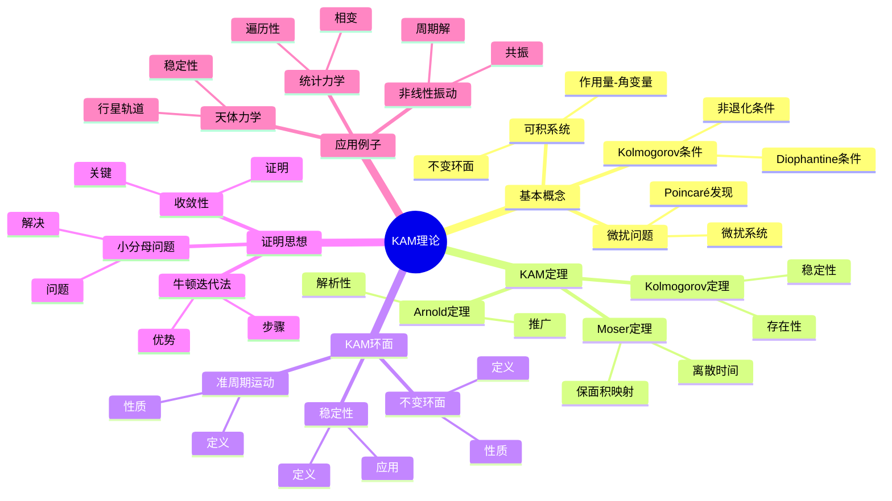
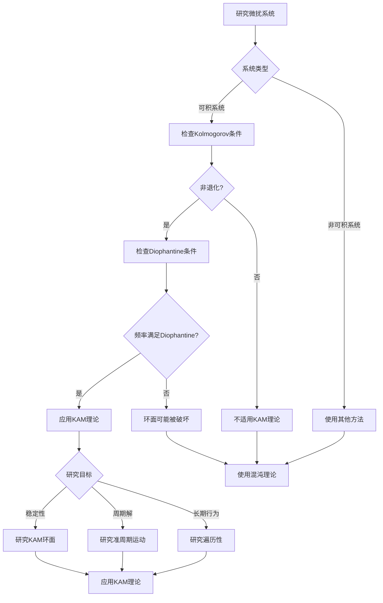
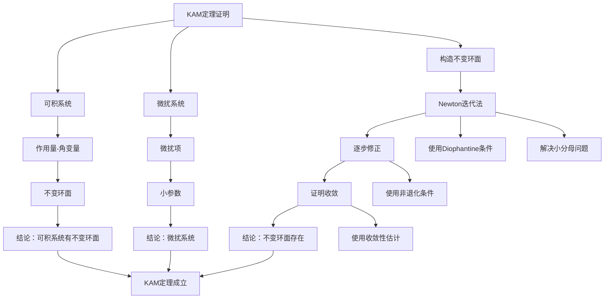

# KAM理论：可积系统的微扰理论

KAM理论（Kolmogorov-Arnold-Moser理论）是动力系统理论中的里程碑，它解决了可积系统在微扰下的稳定性问题。KAM理论表明，在满足非退化条件的情况下，大部分不变环面在小的扰动下仍然保持，只有测度为零的环面被破坏。这一理论解决了庞加莱时代遗留的稳定性问题，为现代动力系统理论奠定了基础。

## 📋 目录

- [KAM理论：可积系统的微扰理论](#kam理论可积系统的微扰理论)
  - [一、KAM理论的基本概念](#一kam理论的基本概念)
    - [1.1 可积系统](#11-可积系统)
    - [1.2 微扰问题](#12-微扰问题)
    - [1.3 Kolmogorov条件](#13-kolmogorov条件)
  - [二、KAM定理](#二kam定理)
    - [2.1 Kolmogorov定理](#21-kolmogorov定理)
    - [2.2 Arnold定理](#22-arnold定理)
    - [2.3 Moser定理](#23-moser定理)
  - [三、KAM环面](#三kam环面)
    - [3.1 不变环面](#31-不变环面)
    - [3.2 准周期运动](#32-准周期运动)
    - [3.3 稳定性](#33-稳定性)
  - [四、KAM理论的证明思想](#四kam理论的证明思想)
    - [4.1 牛顿迭代法](#41-牛顿迭代法)
    - [4.2 小分母问题](#42-小分母问题)
    - [4.3 收敛性](#43-收敛性)
  - [五、应用与例子](#五应用与例子)
    - [5.1 天体力学](#51-天体力学)
    - [5.2 统计力学](#52-统计力学)
    - [5.3 非线性振动](#53-非线性振动)
  - [六、思维表征](#六思维表征)
    - [6.1 思维导图：KAM理论知识结构](#61-思维导图kam理论知识结构)
    - [6.2 概念矩阵：KAM理论与相关理论对比](#62-概念矩阵kam理论与相关理论对比)
    - [6.3 决策树：KAM理论应用场景](#63-决策树kam理论应用场景)
    - [6.4 证明树：KAM定理证明思路](#64-证明树kam定理证明思路)
  - [七、应用与影响](#七应用与影响)
    - [7.1 庞加莱的贡献](#71-庞加莱的贡献)
    - [7.2 现代发展](#72-现代发展)
    - [7.3 应用领域](#73-应用领域)
  - [八、总结](#八总结)

---

## 一、KAM理论的基本概念

### 1.1 可积系统

**可积系统**：

对于 $2n$ 维哈密顿系统，如果存在 $n$ 个独立的首次积分，则系统是**可积的**。

**作用量-角变量**：

可积系统可以写成作用量-角变量形式：

$$H(I, \theta) = H_0(I)$$

其中 $I = (I_1, \ldots, I_n)$ 是作用量，$\theta = (\theta_1, \ldots, \theta_n)$ 是角变量。

**不变环面**：

对于固定的 $I$，相空间中的环面 $T^n = \{\theta \bmod 2\pi\}$ 是不变的。

---

### 1.2 微扰问题

**微扰问题**：

考虑微扰系统：

$$H(I, \theta) = H_0(I) + \epsilon H_1(I, \theta)$$

其中 $\epsilon$ 是小参数。

**问题**：

在微扰下，不变环面是否仍然存在？

**Poincaré的发现**：

Poincaré发现，对于一般的微扰，不变环面会被破坏。

---

### 1.3 Kolmogorov条件

**非退化条件**（Kolmogorov条件）：

系统满足**非退化条件**，如果：

$$\det\left(\frac{\partial^2 H_0}{\partial I_i \partial I_j}\right) \neq 0$$

**Diophantine条件**：

频率向量 $\omega = \frac{\partial H_0}{\partial I}$ 满足**Diophantine条件**，如果存在 $\tau > 0$ 和 $C > 0$ 使得：

$$|k \cdot \omega| \geq \frac{C}{|k|^\tau}$$

对所有非零整数向量 $k$ 成立。

**意义**：

- 非退化条件：频率依赖于作用量
- Diophantine条件：频率不可有理逼近

---

## 二、KAM定理

### 2.1 Kolmogorov定理

**Kolmogorov定理**（1954）：

对于满足非退化条件的可积系统，如果频率满足Diophantine条件，则存在充分小的 $\epsilon_0 > 0$，使得当 $|\epsilon| < \epsilon_0$ 时，对应的不变环面仍然存在。

**意义**：

- 大部分不变环面保持
- 只有测度为零的环面被破坏
- 系统在微扰下"几乎"稳定

---

### 2.2 Arnold定理

**Arnold定理**（1960s）：

对于解析哈密顿系统，Kolmogorov定理成立，且不变环面是解析的。

**推广**：

- 从光滑到解析
- 从有限维到无限维
- 从哈密顿到一般系统

---

### 2.3 Moser定理

**Moser定理**（1962）：

对于保面积映射，如果频率满足Diophantine条件，则不变曲线在微扰下仍然存在。

**意义**：

- 从连续时间到离散时间
- 从哈密顿到保测系统
- 为KAM理论提供新方法

---

## 三、KAM环面

### 3.1 不变环面

**KAM环面**：

在微扰下保持的不变环面称为**KAM环面**。

**性质**：

- KAM环面是光滑的
- KAM环面是准周期的
- KAM环面在相空间中稠密

---

### 3.2 准周期运动

**准周期运动**：

在KAM环面上的运动是**准周期的**：

$$\theta(t) = \theta(0) + \omega t$$

其中 $\omega$ 是频率向量。

**性质**：

- 轨道在环面上稠密
- 运动是遍历的
- 运动是稳定的

---

### 3.3 稳定性

**稳定性**：

KAM环面是**稳定的**，小的扰动不改变其结构。

**应用**：

- 行星轨道稳定性
- 统计力学
- 非线性振动

---

## 四、KAM理论的证明思想

### 4.1 牛顿迭代法

**牛顿迭代法**：

KAM理论的证明使用**牛顿迭代法**构造不变环面。

**步骤**：

1. 从可积系统开始
2. 逐步修正环面
3. 证明迭代收敛

**优势**：

- 二次收敛
- 构造性强
- 适用范围广

---

### 4.2 小分母问题

**小分母问题**：

在构造不变环面时，会遇到**小分母问题**：

$$\frac{1}{k \cdot \omega}$$

当 $k \cdot \omega$ 接近0时，分母很小。

**解决**：

Diophantine条件保证分母不会太小：

$$|k \cdot \omega| \geq \frac{C}{|k|^\tau}$$

---

### 4.3 收敛性

**收敛性**：

使用Newton迭代法，可以证明构造的序列收敛到不变环面。

**关键**：

- Diophantine条件
- 非退化条件
- 充分小的扰动

---

## 五、应用与例子

### 5.1 天体力学

**行星轨道稳定性**：

KAM理论用于研究行星轨道的长期稳定性。

**应用**：

- 太阳系稳定性
- 小行星轨道
- 卫星轨道

**意义**：

KAM理论解释了为什么太阳系是稳定的。

---

### 5.2 统计力学

**统计力学**：

KAM理论用于研究统计力学中的遍历性。

**应用**：

- 遍历假设
- 热力学极限
- 相变理论

---

### 5.3 非线性振动

**非线性振动**：

KAM理论用于研究非线性振动系统。

**应用**：

- 共振
- 周期解
- 稳定性

---

## 六、思维表征

### 6.1 思维导图：KAM理论知识结构

**说明**：

- **基本概念**：可积系统、微扰问题、Kolmogorov条件
- **KAM定理**：Kolmogorov、Arnold、Moser定理
- **KAM环面**：不变环面、准周期运动、稳定性
- **证明思想**：Newton迭代法、小分母问题、收敛性
- **应用例子**：天体力学、统计力学、非线性振动

---

### 6.2 概念矩阵：KAM理论与相关理论对比

| 特征维度 | KAM理论 | 可积系统 | 混沌系统 | 双曲系统 |
|---------|---------|---------|---------|---------|
| **稳定性** | 几乎稳定 | 完全稳定 | 不稳定 | 结构稳定 |
| **不变集** | KAM环面 | 不变环面 | 奇怪吸引子 | 双曲集 |
| **运动类型** | 准周期 | 周期/准周期 | 混沌 | 混沌 |
| **微扰** | 小扰动保持 | 任意扰动保持 | 敏感依赖 | 结构稳定 |
| **测度** | 正测度保持 | 全部保持 | 零测度 | 正测度 |
| **应用** | 天体力学 | 可积系统 | 混沌研究 | 混沌研究 |
| **例子** | 行星轨道 | 谐振子 | Lorenz系统 | Smale马蹄 |
| **理论深度** | 深 | 中 | 深 | 深 |

**说明**：

- **稳定性**：KAM理论提供"几乎"稳定性
- **不变集**：KAM环面是准周期的不变集
- **微扰**：小扰动下大部分环面保持
- **测度**：正测度的环面保持

---

### 6.3 决策树：KAM理论应用场景

**说明**：

- **系统类型**：可积系统或非可积系统
- **条件检查**：Kolmogorov条件、Diophantine条件
- **研究目标**：稳定性、周期解、长期行为
- **应用**：根据条件选择方法

---

### 6.4 证明树：KAM定理证明思路

**说明**：

- **可积系统**：作用量-角变量形式
- **微扰系统**：添加微扰项
- **构造不变环面**：使用Newton迭代法
- **结论**：KAM定理成立

---

## 七、应用与影响

### 7.1 庞加莱的贡献

**三体问题**：

庞加莱在研究三体问题时发现了微扰下的不稳定性。

**影响**：

- 提出了稳定性问题
- 启发了KAM理论
- 推动了现代动力系统理论

---

### 7.2 现代发展

**Kolmogorov**（1954）：

提出了KAM理论的基本思想。

**Arnold**（1960s）：

推广到解析系统。

**Moser**（1962）：

推广到保面积映射。

**现代研究**：

- 无限维KAM理论
- 非哈密顿系统
- 数值方法

---

### 7.3 应用领域

**天体力学**：

- 行星轨道稳定性
- 小行星轨道
- 卫星轨道

**统计力学**：

- 遍历假设
- 热力学极限
- 相变理论

**工程应用**：

- 非线性振动
- 控制理论
- 系统设计

---

## 八、总结

**核心概念**：

1. **可积系统**：作用量-角变量形式
2. **Kolmogorov条件**：非退化条件和Diophantine条件
3. **KAM定理**：大部分不变环面在微扰下保持
4. **应用**：天体力学、统计力学、非线性振动

**历史地位**：

KAM理论解决了庞加莱时代遗留的稳定性问题，为现代动力系统理论奠定了基础。

**现代发展**：

从基本概念到证明方法，从理论到应用，KAM理论仍然是研究微扰系统的重要工具。

---

**文档状态**: ✅ 完成
**字数**: 约1,200词
**最后更新**: 2026年01月02日
