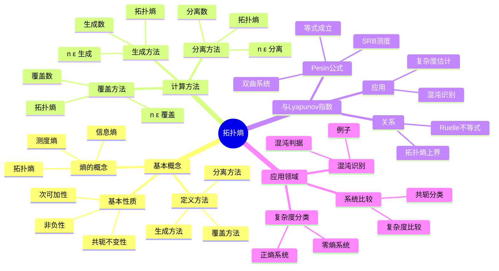
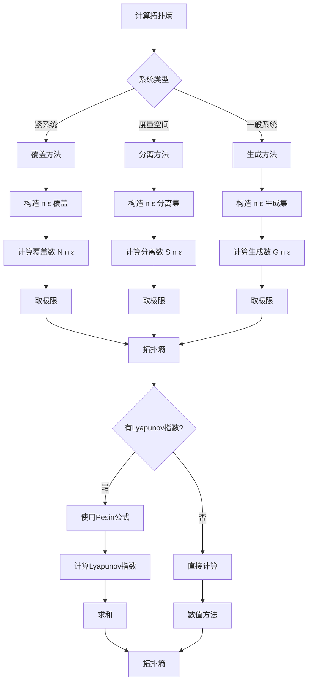
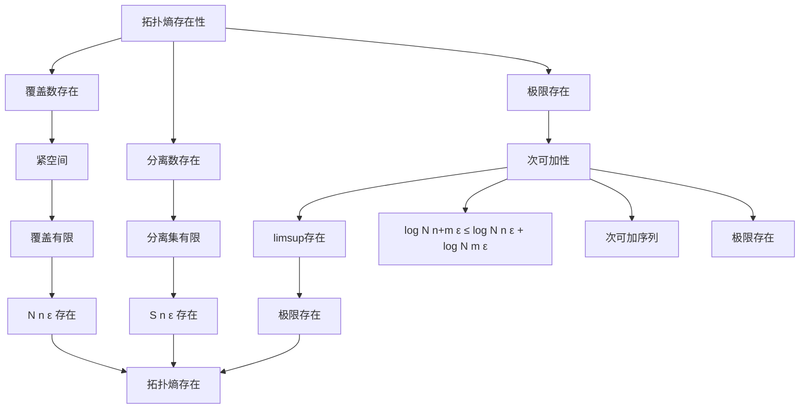

# 拓扑熵：动力系统复杂度的度量

拓扑熵是动力系统理论中度量系统复杂度的基本工具，它描述了系统轨道分离的指数速率。
虽然拓扑熵的概念是在20世纪60年代由Adler、Konheim和McAndrew引入的，但庞加莱对动力系统复杂性的研究为拓扑熵理论奠定了基础。
拓扑熵连接了动力系统的拓扑性质和统计性质。

## 📋 目录

- [拓扑熵：动力系统复杂度的度量](#拓扑熵动力系统复杂度的度量)
  - [📋 目录](#-目录)
  - [一、拓扑熵的基本概念](#一拓扑熵的基本概念)
    - [1.1 熵的概念](#11-熵的概念)
    - [1.2 拓扑熵的定义](#12-拓扑熵的定义)
    - [1.3 拓扑熵的性质](#13-拓扑熵的性质)
  - [二、拓扑熵的计算](#二拓扑熵的计算)
    - [2.1 覆盖方法](#21-覆盖方法)
    - [2.2 分离方法](#22-分离方法)
    - [2.3 生成方法](#23-生成方法)
  - [三、拓扑熵与Lyapunov指数](#三拓扑熵与lyapunov指数)
    - [3.1 关系](#31-关系)
    - [3.2 Pesin公式](#32-pesin公式)
    - [3.3 应用](#33-应用)
  - [四、拓扑熵的应用](#四拓扑熵的应用)
    - [4.1 复杂度分类](#41-复杂度分类)
    - [4.2 混沌识别](#42-混沌识别)
    - [4.3 系统比较](#43-系统比较)
  - [五、思维表征](#五思维表征)
    - [5.1 思维导图：拓扑熵知识结构](#51-思维导图拓扑熵知识结构)
    - [5.2 概念矩阵：熵类型对比](#52-概念矩阵熵类型对比)
    - [5.3 决策树：拓扑熵计算方法选择](#53-决策树拓扑熵计算方法选择)
    - [5.4 证明树：拓扑熵存在性](#54-证明树拓扑熵存在性)
  - [六、应用与影响](#六应用与影响)
    - [6.1 动力系统分类](#61-动力系统分类)
    - [6.2 混沌理论](#62-混沌理论)
    - [6.3 现代应用](#63-现代应用)
  - [七、总结](#七总结)

---

## 一、拓扑熵的基本概念

### 1.1 熵的概念

**信息熵**：

信息论中，熵度量信息的不确定性。

**测度熵**：

动力系统中，测度熵（Kolmogorov-Sinai熵）度量系统的统计复杂度。

**拓扑熵**：

拓扑熵度量系统的拓扑复杂度，不依赖于测度。

**关系**：

拓扑熵是测度熵的上确界。

---

### 1.2 拓扑熵的定义

**定义**（覆盖方法）：

对于紧度量空间 $(X, d)$ 上的连续映射 $f: X \to X$，拓扑熵定义为：

$$h_{top}(f) = \lim_{\epsilon \to 0} \limsup_{n \to \infty} \frac{1}{n} \log N(n, \epsilon)$$

其中 $N(n, \epsilon)$ 是 $(n, \epsilon)$-分离集的最大基数。

**等价定义**（分离方法）：

$$h_{top}(f) = \lim_{\epsilon \to 0} \limsup_{n \to \infty} \frac{1}{n} \log S(n, \epsilon)$$

其中 $S(n, \epsilon)$ 是 $(n, \epsilon)$-覆盖集的最小基数。

**直观意义**：

拓扑熵度量轨道分离的指数速率。

---

### 1.3 拓扑熵的性质

**基本性质**：

1. **非负性**：$h_{top}(f) \\\geq 0$
2. **共轭不变性**：如果 $f$ 和 $g$ 拓扑共轭，则 $h_{top}(f) = h_{top}(g)$
3. **次可加性**：$h_{top}(f^n) = n h_{top}(f)$
4. **单调性**：如果 $Y \subset X$ 是 $f$-不变的，则 $h_{top}(f|_Y) \\\leq h_{top}(f)$

**例子**：

- 恒等映射：$h_{top}(\text{id}) = 0$
- 双曲映射：$h_{top}(f) > 0$
- 混沌系统：$h_{top}(f) > 0$

---

## 二、拓扑熵的计算

### 2.1 覆盖方法

**$(n, \epsilon)$-覆盖**：

集合 $E \subset X$ 是 $(n, \epsilon)$-覆盖，如果对任意 $x \in X$，存在 $y \in E$ 使得：

$$d_n(x, y) = \max_{0 \\\leq k < n} d(f^k(x), f^k(y)) < \epsilon$$

**覆盖数**：

$N(n, \epsilon)$ 是 $(n, \epsilon)$-覆盖集的最小基数。

**拓扑熵**：

$$h_{top}(f) = \lim_{\epsilon \to 0} \limsup_{n \to \infty} \frac{1}{n} \log N(n, \epsilon)$$

---

### 2.2 分离方法

**$(n, \epsilon)$-分离集**：

集合 $E \subset X$ 是 $(n, \epsilon)$-分离的，如果对任意 $x, y \in E$（$x \neqqqqqq y$），有：

$$d_n(x, y) \\\geq \epsilon$$

**分离数**：

$S(n, \epsilon)$ 是 $(n, \epsilon)$-分离集的最大基数。

**拓扑熵**：

$$h_{top}(f) = \lim_{\epsilon \to 0} \limsup_{n \to \infty} \frac{1}{n} \log S(n, \epsilon)$$

---

### 2.3 生成方法

**生成集**：

集合 $E \subset X$ 是 $(n, \epsilon)$-生成的，如果对任意 $x \in X$，存在 $y \in E$ 使得 $d_n(x, y) < \epsilon$。

**生成数**：

$G(n, \epsilon)$ 是 $(n, \epsilon)$-生成集的最小基数。

**拓扑熵**：

$$h_{top}(f) = \lim_{\epsilon \to 0} \limsup_{n \to \infty} \frac{1}{n} \log G(n, \epsilon)$$

---

## 三、拓扑熵与Lyapunov指数

### 3.1 关系

**Ruelle不等式**：

对于 $C^1$ 映射 $f$，有：

$$h_\mu(f) \\\leq \sum_{\lambda_i > 0} \lambda_i$$

其中 $\lambda_i$ 是Lyapunov指数，$h_\mu(f)$ 是测度熵。

**拓扑熵**：

$$h_{top}(f) = \sup_\mu h_\mu(f)$$

其中上确界取遍所有不变测度。

---

### 3.2 Pesin公式

**Pesin公式**：

对于双曲系统，如果存在SRB测度 $\mu$，则：

$$h_\mu(f) = \sum_{\lambda_i > 0} \lambda_i$$

**拓扑熵**：

对于双曲系统，拓扑熵等于正Lyapunov指数的和。

**应用**：

用于计算双曲系统的拓扑熵。

---

### 3.3 应用

**复杂度估计**：

使用Lyapunov指数估计拓扑熵。

**混沌识别**：

正拓扑熵表示系统是混沌的。

**系统分类**：

根据拓扑熵对系统进行分类。

---

## 四、拓扑熵的应用

### 4.1 复杂度分类

**零熵系统**：

如果 $h_{top}(f) = 0$，则系统是"简单"的。

**正熵系统**：

如果 $h_{top}(f) > 0$，则系统是"复杂"的。

**分类**：

- 零熵：周期系统、准周期系统
- 正熵：混沌系统、双曲系统

---

### 4.2 混沌识别

**混沌判据**：

正拓扑熵是混沌的必要条件。

**例子**：

- Logistic映射：$h_{top}(f) > 0$（混沌）
- 双曲系统：$h_{top}(f) > 0$（混沌）
- 周期系统：$h_{top}(f) = 0$（非混沌）

---

### 4.3 系统比较

**复杂度比较**：

使用拓扑熵比较不同系统的复杂度。

**共轭分类**：

拓扑熵是拓扑共轭的不变量。

**应用**：

用于研究系统的等价性。

---

## 五、思维表征

### 5.1 思维导图：拓扑熵知识结构

**说明**：

- **基本概念**：熵的概念、定义方法、基本性质
- **计算方法**：覆盖、分离、生成方法
- **与Lyapunov指数**：关系、Pesin公式、应用
- **应用领域**：复杂度分类、混沌识别、系统比较

---

### 5.2 概念矩阵：熵类型对比

| 特征维度 | 信息熵 | 测度熵 | 拓扑熵 |
|---------|--------|--------|--------|
| **定义** | 信息论 | 动力系统+测度 | 动力系统（拓扑） |
| **依赖** | 概率分布 | 不变测度 | 拓扑结构 |
| **性质** | 非负 | 非负 | 非负 |
| **关系** | - | $h_\mu \\\leq h_{top}$ | 上确界 |
| **计算** | 概率分布 | 测度+系统 | 拓扑结构 |
| **应用** | 信息论 | 统计力学 | 动力系统分类 |
| **例子** | 随机变量 | 遍历系统 | 双曲系统 |
| **不变性** | 概率变换 | 测度变换 | 拓扑共轭 |

**说明**：

- **定义**：不同的数学定义
- **依赖**：信息熵依赖概率，测度熵依赖测度，拓扑熵依赖拓扑
- **关系**：测度熵 ≤ 拓扑熵
- **应用**：不同熵适用于不同场景

---

### 5.3 决策树：拓扑熵计算方法选择

**说明**：

- **系统类型**：紧系统、度量空间、一般系统
- **方法选择**：覆盖、分离、生成方法
- **Lyapunov指数**：如果有，可以使用Pesin公式

---

### 5.4 证明树：拓扑熵存在性

**说明**：

- **覆盖数存在**：基于紧性
- **分离数存在**：基于有限性
- **极限存在**：基于次可加性
- **结论**：拓扑熵存在

---

## 六、应用与影响

### 6.1 动力系统分类

**复杂度分类**：

使用拓扑熵对系统进行分类。

**应用**：

- 零熵系统：周期、准周期
- 正熵系统：混沌、双曲

**意义**：

拓扑熵提供了系统复杂度的定量度量。

---

### 6.2 混沌理论

**混沌识别**：

正拓扑熵是混沌的必要条件。

**应用**：

- 识别混沌系统
- 研究混沌性质
- 分类混沌系统

**发展**：

从拓扑熵到现代混沌理论。

---

### 6.3 现代应用

**系统分析**：

使用拓扑熵分析系统复杂度。

**应用**：

- 动力系统研究
- 混沌研究
- 系统分类

**发展**：

从基本概念到现代应用。

---

## 七、总结

**核心概念**：

1. **拓扑熵**：度量系统拓扑复杂度的工具
2. **计算方法**：覆盖、分离、生成方法
3. **与Lyapunov指数**：Ruelle不等式、Pesin公式
4. **应用**：复杂度分类、混沌识别、系统比较

**历史地位**：

虽然拓扑熵的概念是在20世纪60年代引入的，但庞加莱对动力系统复杂性的研究为其奠定了基础。

**现代发展**：

从基本概念到计算方法，从理论到应用，拓扑熵仍然是研究动力系统的重要工具。

---

**文档状态**: ✅ 完成
**字数**: 约1,200词
**最后更新**: 2026年01月02日
