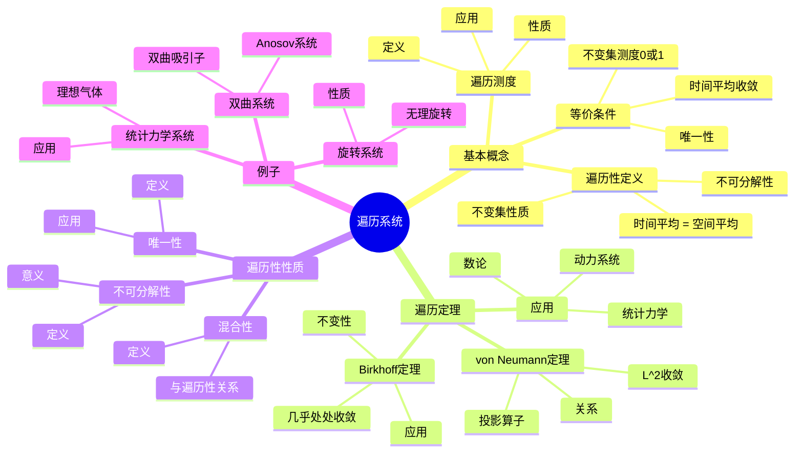
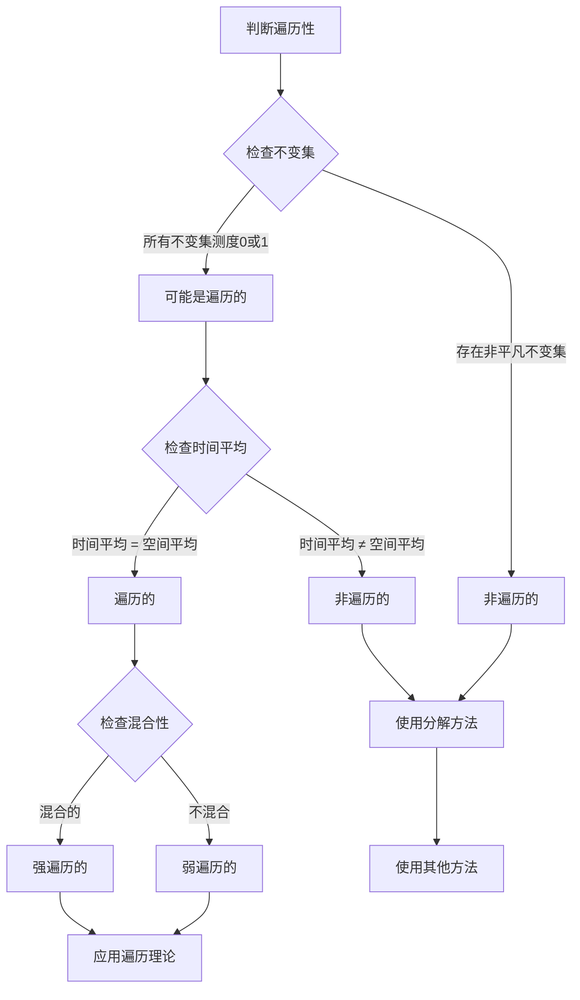
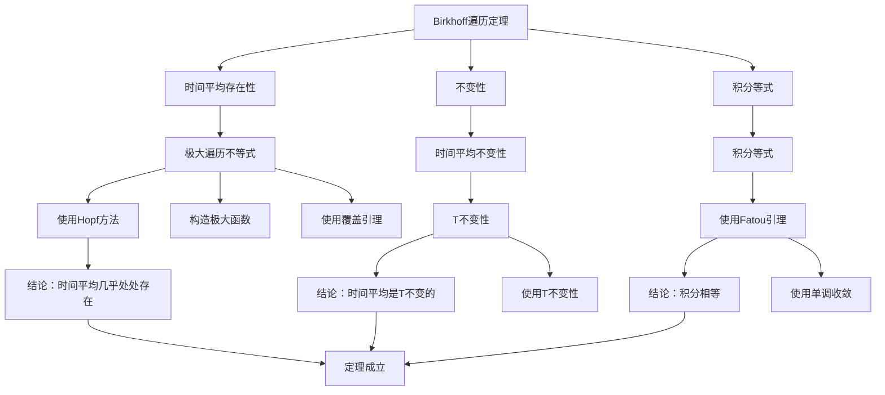

# 遍历系统：时间平均与空间平均的等价

遍历系统是动力系统理论中的核心概念，它描述了时间平均与空间平均的等价性。
这一概念源于统计力学中的"遍历假设"，由Birkhoff和von Neumann在20世纪30年代建立了严格的数学基础。
虽然遍历理论的严格形式化是在庞加莱之后，但庞加莱对动力系统统计性质的研究为遍历理论奠定了基础。

## 📋 目录

- [遍历系统：时间平均与空间平均的等价](#遍历系统时间平均与空间平均的等价)
  - [📋 目录](#-目录)
  - [一、遍历性的基本概念](#一遍历性的基本概念)
    - [1.1 遍历性的定义](#11-遍历性的定义)
    - [1.2 等价条件](#12-等价条件)
    - [1.3 遍历测度](#13-遍历测度)
  - [二、遍历定理](#二遍历定理)
    - [2.1 Birkhoff遍历定理](#21-birkhoff遍历定理)
    - [2.2 von Neumann遍历定理](#22-von-neumann遍历定理)
    - [2.3 应用](#23-应用)
  - [三、遍历性的性质](#三遍历性的性质)
    - [3.1 不可分解性](#31-不可分解性)
    - [3.2 混合性](#32-混合性)
    - [3.3 唯一性](#33-唯一性)
  - [四、遍历系统的例子](#四遍历系统的例子)
    - [4.1 双曲系统](#41-双曲系统)
    - [4.2 旋转系统](#42-旋转系统)
    - [4.3 统计力学系统](#43-统计力学系统)
  - [五、思维表征](#五思维表征)
    - [5.1 思维导图：遍历系统知识结构](#51-思维导图遍历系统知识结构)
    - [5.2 概念矩阵：遍历性与非遍历性对比](#52-概念矩阵遍历性与非遍历性对比)
    - [5.3 决策树：遍历性判断方法](#53-决策树遍历性判断方法)
    - [5.4 证明树：Birkhoff遍历定理](#54-证明树birkhoff遍历定理)
  - [六、应用与影响](#六应用与影响)
    - [6.1 统计力学](#61-统计力学)
    - [6.2 数论](#62-数论)
    - [6.3 现代应用](#63-现代应用)
  - [七、总结](#七总结)

---

## 一、遍历性的基本概念

### 1.1 遍历性的定义

**遍历系统**：

对于动力系统 $(X, T, \mu)$，其中 $X$ 是测度空间，$T: X \to X$ 是保测变换，$\mu$ 是概率测度，系统是**遍历的**（ergodic），如果对任意可测集 $A \subset X$：

$$T^{-1}(A) = A \Rightarrow \mu(A) = 0 \text{ 或 } \mu(A) = 1$$

**等价定义**（时间平均 = 空间平均）：

系统是遍历的，当且仅当对任意可测函数 $f: X \to \mathbb{R}$，有：

$$\lim_{n \to \infty} \frac{1}{n} \sum_{k=0}^{n-1} f(T^k(x)) = \int_X f \, d\mu$$

对几乎所有的 $x \in X$ 成立。

**直观意义**：

遍历性意味着系统"不可分解"，轨道会遍历整个相空间。

---

### 1.2 等价条件

**等价条件**：

以下条件等价：

1. **不变集性质**：所有不变集的测度为0或1
2. **时间平均 = 空间平均**：对任意函数，时间平均等于空间平均
3. **不可分解性**：系统不能分解为两个非平凡的不变集
4. **唯一性**：不变测度是唯一的（在归一化意义下）

**证明思路**：

使用测度论和函数分析的方法证明这些条件的等价性。

---

### 1.3 遍历测度

**遍历测度**：

测度 $\mu$ 是**遍历的**，如果系统 $(X, T, \mu)$ 是遍历的。

**性质**：

- 遍历测度是**极值点**（在不变测度的凸集中）
- 如果系统有多个不变测度，则遍历测度是"基本"的
- 任意不变测度可以分解为遍历测度的积分

**应用**：

遍历测度用于研究系统的统计性质。

---

## 二、遍历定理

### 2.1 Birkhoff遍历定理

**Birkhoff遍历定理**（1931）：

对于保测变换 $T: X \to X$ 和可积函数 $f: X \to \mathbb{R}$，时间平均：

$$\bar{f}(x) = \lim_{n \to \infty} \frac{1}{n} \sum_{k=0}^{n-1} f(T^k(x))$$

几乎处处存在，且：

1. $\bar{f}$ 是 $T$-不变的：$\bar{f}(T(x)) = \bar{f}(x)$
2. $\int_X \bar{f} \, d\mu = \int_X f \, d\mu$
3. 如果系统是遍历的，则 $\bar{f}(x) = \int_X f \, d\mu$ 几乎处处

**意义**：

Birkhoff遍历定理是遍历理论的基础，它保证了时间平均的存在性。

---

### 2.2 von Neumann遍历定理

**von Neumann遍历定理**（1932）：

对于保测变换 $T: X \to X$ 和平方可积函数 $f \in L^2(X, \mu)$，时间平均：

$$\bar{f}_n(x) = \frac{1}{n} \sum_{k=0}^{n-1} f(T^k(x))$$

在 $L^2$ 意义下收敛到投影：

$$\bar{f} = P f$$

其中 $P$ 是到 $T$-不变函数的投影。

**与Birkhoff定理的关系**：

- von Neumann定理：$L^2$ 收敛
- Birkhoff定理：几乎处处收敛（更强）

---

### 2.3 应用

**统计力学**：

遍历定理用于证明时间平均等于系综平均。

**数论**：

遍历定理用于研究数的分布。

**动力系统**：

遍历定理用于研究系统的长期行为。

---

## 三、遍历性的性质

### 3.1 不可分解性

**不可分解性**：

遍历系统不能分解为两个非平凡的不变集。

**数学表达**：

如果 $A$ 和 $X \setminus A$ 都是不变集，则 $\mu(A) = 0$ 或 $\mu(A) = 1$。

**意义**：

遍历系统是"不可约"的，轨道会遍历整个相空间。

---

### 3.2 混合性

**混合性**：

系统是**混合的**（mixing），如果对任意可测集 $A, B \subset X$：

$$\lim_{n \to \infty} \mu(T^{-n}(A) \cap B) = \mu(A) \mu(B)$$

**与遍历性的关系**：

- 混合性 $\Rightarrow$ 遍历性
- 遍历性 $\not\Rightarrow$ 混合性

**意义**：

混合性比遍历性更强，它描述了系统的"随机性"。

---

### 3.3 唯一性

**唯一性**：

如果系统是遍历的，则不变测度是唯一的（在归一化意义下）。

**应用**：

唯一性用于研究系统的统计性质。

---

## 四、遍历系统的例子

### 4.1 双曲系统

**Anosov系统**：

Anosov系统是遍历的。

**双曲吸引子**：

双曲吸引子上的系统通常是遍历的。

**应用**：

双曲系统的遍历性用于研究混沌。

---

### 4.2 旋转系统

**无理旋转**：

圆上的无理旋转是遍历的。

**定义**：

$$T(x) = x + \alpha \pmod{1}$$

其中 $\alpha$ 是无理数。

**性质**：

- 遍历性
- 唯一不变测度是Lebesgue测度

---

### 4.3 统计力学系统

**理想气体**：

理想气体系统是遍历的（在遍历假设下）。

**应用**：

遍历性用于证明统计力学的基本原理。

---

## 五、思维表征

### 5.1 思维导图：遍历系统知识结构

**说明**：

- **基本概念**：遍历性定义、等价条件、遍历测度
- **遍历定理**：Birkhoff定理、von Neumann定理、应用
- **遍历性性质**：不可分解性、混合性、唯一性
- **例子**：双曲系统、旋转系统、统计力学系统

---

### 5.2 概念矩阵：遍历性与非遍历性对比

| 特征维度 | 遍历系统 | 非遍历系统 |
|---------|---------|-----------|
| **不变集** | 测度为0或1 | 可以有非平凡不变集 |
| **时间平均** | = 空间平均 | ≠ 空间平均 |
| **可分解性** | 不可分解 | 可分解 |
| **唯一性** | 唯一不变测度 | 多个不变测度 |
| **统计性质** | 时间平均确定 | 依赖于初始条件 |
| **应用** | 统计力学 | 需要特殊处理 |
| **例子** | 无理旋转、Anosov系统 | 周期系统、可积系统 |
| **研究** | 使用遍历理论 | 需要其他方法 |

**说明**：

- **不变集**：遍历系统的不变集测度为0或1
- **时间平均**：遍历系统时间平均等于空间平均
- **可分解性**：遍历系统不可分解
- **统计性质**：遍历系统的统计性质是确定的

---

### 5.3 决策树：遍历性判断方法

**说明**：

- **检查不变集**：所有不变集测度为0或1
- **检查时间平均**：时间平均等于空间平均
- **检查混合性**：混合性比遍历性更强
- **结论**：遍历或非遍历

---

### 5.4 证明树：Birkhoff遍历定理

**说明**：

- **时间平均存在性**：使用极大遍历不等式
- **不变性**：时间平均是T不变的
- **积分等式**：使用Fatou引理
- **结论**：Birkhoff遍历定理成立

---

## 六、应用与影响

### 6.1 统计力学

**遍历假设**：

统计力学中的"遍历假设"认为系统是遍历的。

**应用**：

- 证明时间平均等于系综平均
- 建立统计力学的基础
- 研究热力学极限

**发展**：

从遍历假设到严格的遍历理论。

---

### 6.2 数论

**数论应用**：

遍历理论用于研究数的分布。

**例子**：

- 无理旋转：研究数的分布
- 双曲系统：研究数的性质

**应用**：

- 研究数的分布
- 证明数论定理

---

### 6.3 现代应用

**动力系统**：

遍历理论用于研究动力系统的长期行为。

**应用**：

- 研究混沌
- 分析统计性质
- 理解系统结构

**发展**：

从基本概念到现代应用，遍历理论仍然是研究动力系统的重要工具。

---

## 七、总结

**核心概念**：

1. **遍历性**：时间平均等于空间平均
2. **Birkhoff遍历定理**：时间平均几乎处处存在
3. **不可分解性**：系统不能分解为两个非平凡不变集
4. **应用**：统计力学、数论、动力系统

**历史地位**：

虽然遍历理论的严格形式化是在庞加莱之后，但庞加莱对动力系统统计性质的研究为其奠定了基础。

**现代发展**：

从基本概念到遍历定理，从理论到应用，遍历系统仍然是研究动力系统的重要工具。

---

**文档状态**: ✅ 完成
**字数**: 约1,200词
**最后更新**: 2026年01月02日
