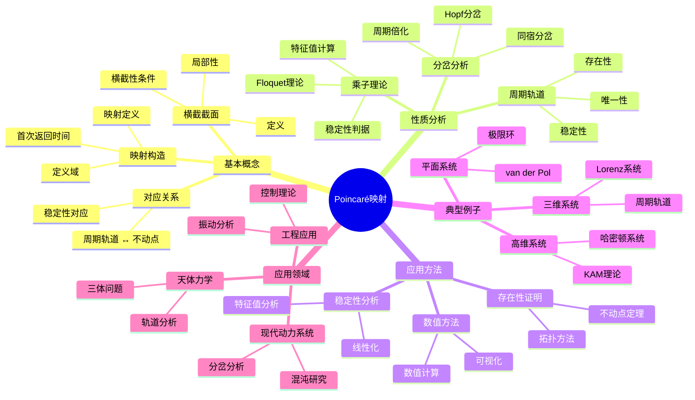
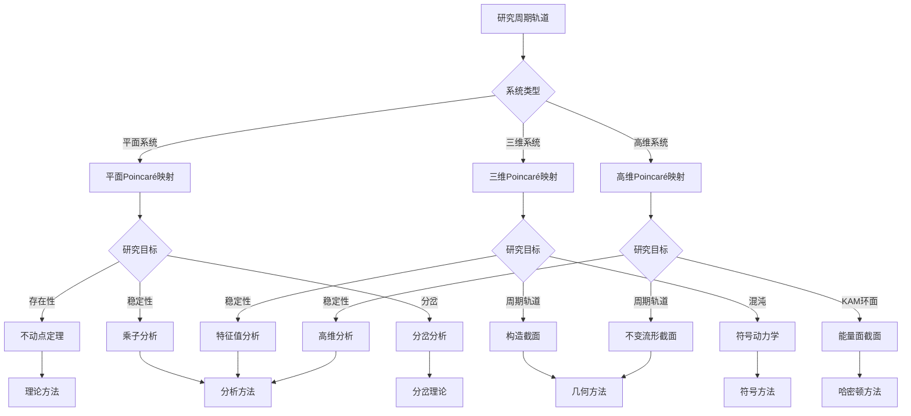
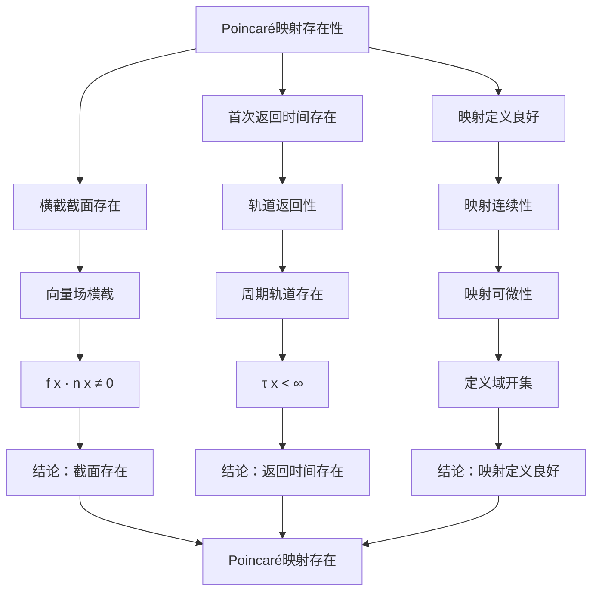

# Poincaré映射：周期轨道的横截截面

Poincaré映射是庞加莱在研究三体问题时引入的重要工具，它将连续时间动力系统转化为离散时间系统，通过研究轨道与横截截面的交点序列来分析周期轨道和系统的稳定性。
这一方法简化了高维系统的分析，是现代动力系统理论的基础。

## 📋 目录

- [Poincaré映射：周期轨道的横截截面](#poincaré映射周期轨道的横截截面)
  - [📋 目录](#-目录)
  - [一、Poincaré映射的定义](#一poincaré映射的定义)
    - [1.1 横截截面](#11-横截截面)
    - [1.2 Poincaré映射的构造](#12-poincaré映射的构造)
    - [1.3 首次返回映射](#13-首次返回映射)
  - [二、Poincaré映射的性质](#二poincaré映射的性质)
    - [2.1 周期轨道与不动点](#21-周期轨道与不动点)
    - [2.2 稳定性分析](#22-稳定性分析)
    - [2.3 乘子与特征值](#23-乘子与特征值)
  - [三、Poincaré映射的应用](#三poincaré映射的应用)
    - [3.1 周期轨道的存在性](#31-周期轨道的存在性)
    - [3.2 稳定性判断](#32-稳定性判断)
    - [3.3 分岔分析](#33-分岔分析)
  - [四、典型例子](#四典型例子)
    - [4.1 平面系统](#41-平面系统)
    - [4.2 三维系统](#42-三维系统)
    - [4.3 高维系统](#43-高维系统)
  - [五、思维表征](#五思维表征)
    - [5.1 思维导图：Poincaré映射知识结构](#51-思维导图poincaré映射知识结构)
    - [5.2 概念矩阵：Poincaré映射与其他方法对比](#52-概念矩阵poincaré映射与其他方法对比)
    - [5.3 决策树：Poincaré映射应用场景](#53-决策树poincaré映射应用场景)
    - [5.4 证明树：Poincaré映射存在性定理](#54-证明树poincaré映射存在性定理)
  - [六、应用与影响](#六应用与影响)
    - [6.1 天体力学](#61-天体力学)
    - [6.2 现代动力系统](#62-现代动力系统)
    - [6.3 应用领域](#63-应用领域)
  - [七、总结](#七总结)

---

## 一、Poincaré映射的定义

### 1.1 横截截面

**定义**：

对于连续时间动力系统 $\dot{x} = f(x)$，**横截截面**（transverse section）$\Sigma$ 是相空间 $M$ 的一个 $(n-1)$ 维子流形，满足：

1. **横截性**：向量场 $f$ 在 $\Sigma$ 上不切于 $\Sigma$
2. **局部性**：$\Sigma$ 是局部嵌入的
3. **返回性**：轨道会多次与 $\Sigma$ 相交

**数学条件**：

对于 $x \in \Sigma$，设 $n(x)$ 是 $\Sigma$ 在 $x$ 处的法向量，则：

$$f(x) \cdot n(x) \neq 0$$

**例子**：

- 平面系统：$\Sigma$ 是一条曲线
- 三维系统：$\Sigma$ 是一个曲面
- 高维系统：$\Sigma$ 是 $(n-1)$ 维超曲面

---

### 1.2 Poincaré映射的构造

**定义**：

**Poincaré映射** $P: \Sigma \to \Sigma$ 将点 $x \in \Sigma$ 映射到轨道下一次与 $\Sigma$ 的交点。

**数学表达**：

设 $\phi_t$ 是系统的流，则：

$$P(x) = \phi_{\tau(x)}(x)$$

其中 $\tau(x) > 0$ 是**首次返回时间**（first return time），满足：

$$\phi_{\tau(x)}(x) \in \Sigma, \quad \phi_t(x) \notin \Sigma \text{ for } 0 < t < \tau(x)$$

**几何意义**：

Poincaré映射将连续时间问题转化为离散时间问题，降低了维度。

---

### 1.3 首次返回映射

**首次返回时间**：

$$\tau(x) = \inf\{t > 0 : \phi_t(x) \in \Sigma\}$$

**定义域**：

Poincaré映射的定义域是：

$$\Sigma_0 = \{x \in \Sigma : \tau(x) < \infty\}$$

**性质**：

- $\tau(x)$ 通常是光滑的
- 如果轨道不返回，则 $\tau(x) = \infty$

**应用**：

首次返回时间用于研究周期轨道的周期。

---

## 二、Poincaré映射的性质

### 2.1 周期轨道与不动点

**对应关系**：

- **周期轨道** $\leftrightarrow$ **Poincaré映射的不动点**
- **周期为 $T$ 的周期轨道** $\leftrightarrow$ **满足 $P^k(x) = x$ 的点**（$k$ 是轨道与 $\Sigma$ 的交点数）

**定理**：

设 $\gamma$ 是周期轨道，与 $\Sigma$ 在点 $p$ 横截相交，则 $p$ 是 $P$ 的不动点。

**证明思路**：

周期轨道会周期性地与 $\Sigma$ 相交，因此 $P(p) = p$。

---

### 2.2 稳定性分析

**稳定性对应**：

- **周期轨道稳定** $\leftrightarrow$ **Poincaré映射的不动点稳定**
- **周期轨道不稳定** $\leftrightarrow$ **Poincaré映射的不动点不稳定**

**判断方法**：

通过分析 $DP(p)$（Poincaré映射在不动点的导数）的特征值来判断稳定性。

**优势**：

Poincaré映射将高维稳定性问题转化为低维问题。

---

### 2.3 乘子与特征值

**乘子**：

Poincaré映射在不动点 $p$ 的**乘子**（multiplier）是 $DP(p)$ 的特征值。

**稳定性判据**：

- 所有乘子 $|\lambda_i| < 1$：稳定（吸引）
- 所有乘子 $|\lambda_i| > 1$：不稳定（排斥）
- 有乘子 $|\lambda_i| = 1$：中性（需要高阶分析）

**与Floquet乘子的关系**：

Poincaré映射的乘子与周期轨道的Floquet乘子相关。

---

## 三、Poincaré映射的应用

### 3.1 周期轨道的存在性

**应用**：

使用Poincaré映射证明周期轨道的存在性。

**方法**：

1. 构造合适的横截截面
2. 证明Poincaré映射有不动点
3. 不动点对应周期轨道

**例子**：

- 平面系统的极限环
- 三维系统的周期轨道

---

### 3.2 稳定性判断

**应用**：

通过Poincaré映射判断周期轨道的稳定性。

**步骤**：

1. 计算Poincaré映射在不动点的导数
2. 计算特征值（乘子）
3. 根据乘子判断稳定性

**优势**：

比直接分析周期轨道更简单。

---

### 3.3 分岔分析

**应用**：

使用Poincaré映射研究分岔。

**方法**：

- 参数变化时，Poincaré映射的不动点发生分岔
- 不动点的分岔对应周期轨道的分岔

**例子**：

- 周期倍化分岔
- Hopf分岔
- 同宿分岔

---

## 四、典型例子

### 4.1 平面系统

**van der Pol振荡器**：

$$
\begin{cases}
\dot{x} = y \\
\dot{y} = -x + \mu(1-x^2)y
\end{cases}
$$

**横截截面**：

选择 $x$ 轴：$\Sigma = \{(x, 0) : x > 0\}$

**Poincaré映射**：

将点 $(x, 0)$ 映射到下一次与 $x$ 轴的交点。

**应用**：

研究极限环的存在性和稳定性。

---

### 4.2 三维系统

**Lorenz系统**：

$$
\begin{cases}
\dot{x} = \sigma(y - x) \\
\dot{y} = x(\rho - z) - y \\
\dot{z} = xy - \beta z
\end{cases}
$$

**横截截面**：

选择平面 $z = \rho - 1$：$\Sigma = \{(x, y, \rho-1)\}$

**Poincaré映射**：

研究周期轨道的结构。

---

### 4.3 高维系统

**哈密顿系统**：

对于 $2n$ 维哈密顿系统，选择能量面作为横截截面。

**Poincaré映射**：

在能量面上定义Poincaré映射，研究周期轨道。

**应用**：

- KAM理论
- 可积性研究

---

## 五、思维表征

### 5.1 思维导图：Poincaré映射知识结构

**说明**：

- **基本概念**：横截截面、映射构造、对应关系
- **性质分析**：周期轨道、乘子理论、分岔分析
- **应用方法**：存在性证明、稳定性分析、数值方法
- **典型例子**：从平面到高维系统
- **应用领域**：天体力学、现代动力系统、工程应用

---

### 5.2 概念矩阵：Poincaré映射与其他方法对比

| 特征维度 | Poincaré映射 | 直接分析 | 数值积分 | 线性化 |
|---------|-------------|---------|---------|--------|
| **维度** | 降1维 | 原维度 | 原维度 | 局部 |
| **适用对象** | 周期轨道 | 所有轨道 | 所有轨道 | 平衡点附近 |
| **稳定性分析** | 简单 | 复杂 | 数值 | 局部 |
| **周期轨道** | 直接对应 | 需要识别 | 需要识别 | 不适用 |
| **计算复杂度** | 中等 | 高 | 高 | 低 |
| **理论深度** | 深 | 深 | 浅 | 浅 |
| **应用范围** | 周期轨道 | 全局 | 全局 | 局部 |
| **优势** | 降维、简化 | 全面 | 直观 | 简单 |
| **劣势** | 需要构造截面 | 复杂 | 计算量大 | 局部性 |

**说明**：

- **维度**：Poincaré映射降低维度
- **适用对象**：专门用于周期轨道
- **稳定性分析**：简化稳定性分析
- **应用范围**：专门用于周期轨道研究

---

### 5.3 决策树：Poincaré映射应用场景

**说明**：

- **系统类型**：平面、三维、高维
- **研究目标**：存在性、稳定性、分岔
- **方法选择**：根据系统类型和目标选择方法

---

### 5.4 证明树：Poincaré映射存在性定理

**说明**：

- **横截截面存在**：基于横截性条件
- **首次返回时间存在**：基于轨道返回性
- **映射定义良好**：基于连续性和可微性
- **结论**：Poincaré映射存在且定义良好

---

## 六、应用与影响

### 6.1 天体力学

**三体问题**：

庞加莱在研究三体问题时引入Poincaré映射。

**应用**：

- 研究周期轨道
- 分析轨道稳定性
- 理解长期行为

**影响**：

Poincaré映射为天体力学提供了强大的分析工具。

---

### 6.2 现代动力系统

**混沌理论**：

Poincaré映射用于研究混沌。

**应用**：

- 符号动力学
- 分岔分析
- 奇怪吸引子

**发展**：

从Poincaré映射到现代符号动力学。

---

### 6.3 应用领域

**工程应用**：

- 控制理论：研究周期解
- 振动分析：分析周期振动
- 电路分析：研究振荡电路

**物理应用**：

- 统计力学：研究周期轨道
- 量子力学：半经典近似
- 非线性物理：研究非线性现象

---

## 七、总结

**核心概念**：

1. **横截截面**：$(n-1)$ 维子流形
2. **Poincaré映射**：首次返回映射
3. **对应关系**：周期轨道 ↔ 不动点
4. **稳定性**：通过乘子判断

**历史地位**：

Poincaré映射是庞加莱的重要贡献，它将连续时间问题转化为离散时间问题，简化了周期轨道的研究。

**现代发展**：

从基本概念到符号动力学，从理论分析到数值计算，Poincaré映射仍然是研究动力系统的重要工具。

---

**文档状态**: ✅ 完成
**字数**: 约1,200词
**最后更新**: 2026年01月02日
