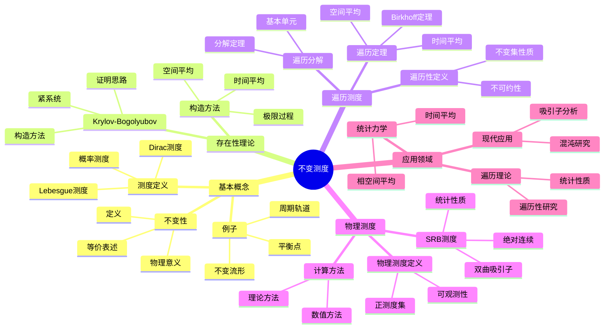
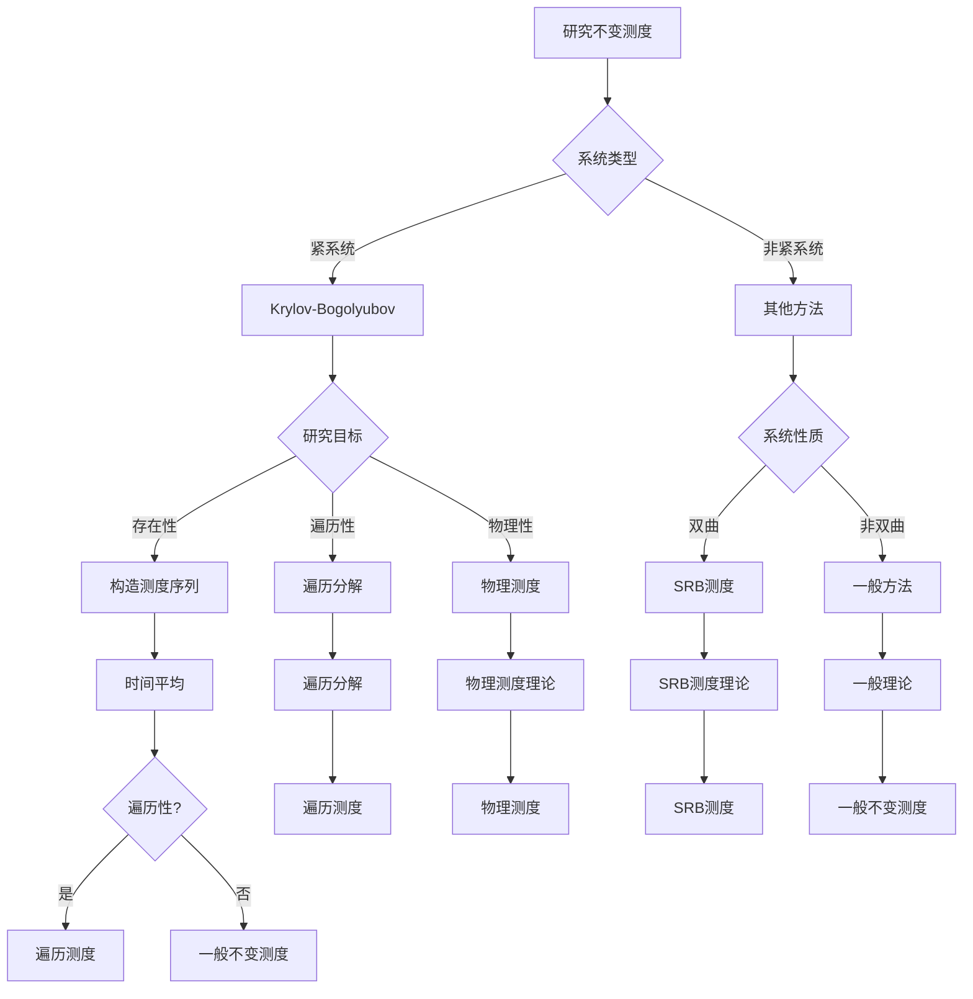
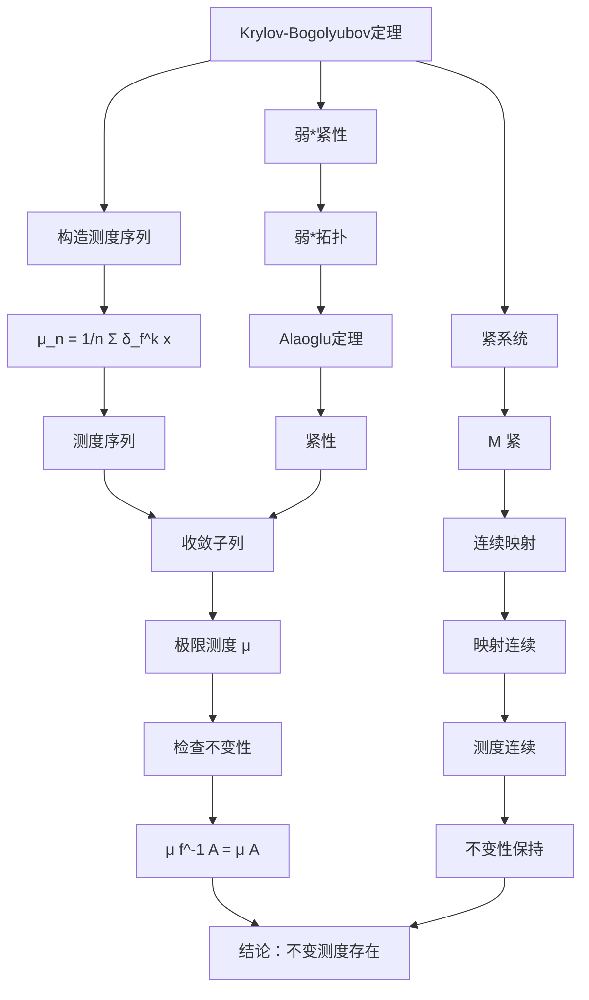

# 不变测度：动力系统的测度理论

不变测度是动力系统理论中的核心概念，它描述了系统在演化过程中保持不变的测度。
庞加莱在研究三体问题时涉及了不变测度的思想，这为后来的遍历理论和统计力学奠定了基础。
不变测度理论连接了动力系统的几何性质和统计性质。

## 📋 目录

- [不变测度：动力系统的测度理论](#不变测度动力系统的测度理论)
  - [📋 目录](#-目录)
  - [一、不变测度的基本概念](#一不变测度的基本概念)
    - [1.1 测度的定义](#11-测度的定义)
    - [1.2 不变测度的定义](#12-不变测度的定义)
    - [1.3 不变测度的例子](#13-不变测度的例子)
  - [二、不变测度的存在性](#二不变测度的存在性)
    - [2.1 Krylov-Bogolyubov定理](#21-krylov-bogolyubov定理)
    - [2.2 紧系统的存在性](#22-紧系统的存在性)
    - [2.3 不变测度的构造](#23-不变测度的构造)
  - [三、遍历测度](#三遍历测度)
    - [3.1 遍历性的定义](#31-遍历性的定义)
    - [3.2 遍历分解](#32-遍历分解)
    - [3.3 遍历定理](#33-遍历定理)
  - [四、物理测度](#四物理测度)
    - [4.1 物理测度的定义](#41-物理测度的定义)
    - [4.2 SRB测度](#42-srb测度)
    - [4.3 物理测度的计算](#43-物理测度的计算)
  - [五、思维表征](#五思维表征)
    - [5.1 思维导图：不变测度知识结构](#51-思维导图不变测度知识结构)
    - [5.2 概念矩阵：测度类型对比](#52-概念矩阵测度类型对比)
    - [5.3 决策树：不变测度研究方法](#53-决策树不变测度研究方法)
    - [5.4 证明树：Krylov-Bogolyubov定理](#54-证明树krylov-bogolyubov定理)
  - [六、应用与影响](#六应用与影响)
    - [6.1 统计力学](#61-统计力学)
    - [6.2 遍历理论](#62-遍历理论)
    - [6.3 现代应用](#63-现代应用)
  - [七、总结](#七总结)

---

## 一、不变测度的基本概念

### 1.1 测度的定义

**测度空间**：

设 $(M, \mathcal{B})$ 是可测空间，$\mu$ 是 $\mathcal{B}$ 上的测度。

**概率测度**：

如果 $\mu(M) = 1$，则 $\mu$ 是概率测度。

**例子**：

- Lebesgue测度
- Dirac测度
- 均匀测度

---

### 1.2 不变测度的定义

**定义**：

对于动力系统 $\phi_t: M \to M$，测度 $\mu$ 是**不变的**（invariant），如果：

$$\mu(\phi_t^{-1}(A)) = \mu(A)$$

对所有可测集 $A$ 和所有 $t$。

**等价表述**：

$$\mu \circ \phi_t = \mu$$

**离散系统**：

对于映射 $f: M \to M$，不变测度满足：

$$\mu(f^{-1}(A)) = \mu(A)$$

**物理意义**：

不变测度描述了系统在演化过程中保持不变的"质量分布"。

---

### 1.3 不变测度的例子

**平衡点**：

Dirac测度 $\delta_p$ 在平衡点 $p$ 是不变测度。

**周期轨道**：

周期轨道上的均匀测度是不变测度。

**不变流形**：

不变流形上的测度可以是不变测度。

**相空间体积**：

对于体积保持系统（如哈密顿系统），Lebesgue测度是不变测度。

---

## 二、不变测度的存在性

### 2.1 Krylov-Bogolyubov定理

**定理**：

对于紧度量空间 $M$ 上的连续映射 $f: M \to M$，存在不变概率测度。

**证明思路**：

1. 构造测度序列：$\mu_n = \frac{1}{n} \sum_{k=0}^{n-1} \delta_{f^k(x)}$
2. 使用弱*紧性，存在收敛子列
3. 极限测度是不变测度

**应用**：

用于证明不变测度的存在性。

---

### 2.2 紧系统的存在性

**紧系统**：

如果相空间 $M$ 是紧的，则存在不变测度。

**原因**：

紧性保证了测度序列有收敛子列。

**应用**：

用于紧流形上的动力系统。

---

### 2.3 不变测度的构造

**时间平均**：

$$\mu_n = \frac{1}{n} \sum_{k=0}^{n-1} \delta_{f^k(x)}$$

**空间平均**：

$$\mu = \lim_{n \to \infty} \mu_n$$

**遍历性**：

如果系统是遍历的，则时间平均等于空间平均。

---

## 三、遍历测度

### 3.1 遍历性的定义

**定义**：

不变测度 $\mu$ 是**遍历的**（ergodic），如果对任意不变集 $A$（$\phi_t(A) = A$），有：

$$\mu(A) = 0 \text{ 或 } \mu(A) = 1$$

**等价表述**：

系统不能分解为两个非平凡的不变子系统。

**意义**：

遍历测度是"不可约的"不变测度。

---

### 3.2 遍历分解

**定理**：

任意不变测度可以分解为遍历测度的积分：

$$\mu = \int \mu_\xi d\nu(\xi)$$

其中 $\mu_\xi$ 是遍历测度。

**意义**：

遍历测度是不变测度的"基本单元"。

---

### 3.3 遍历定理

**Birkhoff遍历定理**：

对于遍历系统，时间平均等于空间平均：

$$\lim_{n \to \infty} \frac{1}{n} \sum_{k=0}^{n-1} g(f^k(x)) = \int g d\mu$$

对几乎所有 $x$。

**应用**：

用于计算统计平均值。

---

## 四、物理测度

### 4.1 物理测度的定义

**定义**：

不变测度 $\mu$ 是**物理测度**（physical measure），如果存在正Lebesgue测度集 $B$ 使得：

$$\lim_{n \to \infty} \frac{1}{n} \sum_{k=0}^{n-1} \delta_{f^k(x)} = \mu$$

对所有 $x \in B$。

**意义**：

物理测度是"可观测的"不变测度。

---

### 4.2 SRB测度

**定义**：

SRB测度（Sinai-Ruelle-Bowen measure）是双曲吸引子上的物理测度。

**性质**：

- 是物理测度
- 有绝对连续的条件测度
- 描述混沌系统的统计性质

**应用**：

用于研究奇怪吸引子的统计性质。

---

### 4.3 物理测度的计算

**数值方法**：

使用时间平均计算物理测度：

$$\mu_n = \frac{1}{n} \sum_{k=0}^{n-1} \delta_{f^k(x)}$$

**理论方法**：

使用遍历分解和SRB测度理论。

**应用**：

用于计算吸引子的统计性质。

---

## 五、思维表征

### 5.1 思维导图：不变测度知识结构

**说明**：

- **基本概念**：测度、不变性、例子
- **存在性理论**：Krylov-Bogolyubov定理、构造方法
- **遍历测度**：遍历性、遍历分解、遍历定理
- **物理测度**：物理测度、SRB测度、计算方法
- **应用领域**：统计力学、遍历理论、现代应用

---

### 5.2 概念矩阵：测度类型对比

| 特征维度 | 不变测度 | 遍历测度 | 物理测度 | SRB测度 |
|---------|---------|---------|---------|---------|
| **不变性** | 是 | 是 | 是 | 是 |
| **遍历性** | 不一定 | 是 | 不一定 | 是 |
| **物理性** | 不一定 | 不一定 | 是 | 是 |
| **存在性** | 紧系统存在 | 不一定存在 | 不一定存在 | 双曲系统存在 |
| **唯一性** | 不唯一 | 不一定唯一 | 不一定唯一 | 可能唯一 |
| **可观测性** | 不一定 | 不一定 | 是 | 是 |
| **绝对连续** | 不一定 | 不一定 | 不一定 | 是 |
| **应用** | 一般理论 | 遍历理论 | 统计力学 | 混沌研究 |
| **例子** | 平衡点、周期轨道 | 遍历系统 | 吸引子 | 奇怪吸引子 |

**说明**：

- **不变性**：所有类型都是不变的
- **遍历性**：只有遍历测度是遍历的
- **物理性**：物理测度和SRB测度是物理的
- **应用**：不同测度适用于不同场景

---

### 5.3 决策树：不变测度研究方法

**说明**：

- **系统类型**：紧系统vs非紧系统
- **研究目标**：存在性、遍历性、物理性
- **方法选择**：根据系统类型和目标选择方法

---

### 5.4 证明树：Krylov-Bogolyubov定理

**说明**：

- **紧系统**：保证测度序列有收敛子列
- **构造测度序列**：使用时间平均
- **弱*紧性**：使用Alaoglu定理
- **结论**：不变测度存在

---

## 六、应用与影响

### 6.1 统计力学

**相空间平均**：

使用不变测度计算相空间平均。

**时间平均**：

使用遍历定理计算时间平均。

**应用**：

- 热力学极限
- 相变理论
- 统计性质

---

### 6.2 遍历理论

**遍历性研究**：

研究系统的遍历性质。

**统计性质**：

使用不变测度研究统计性质。

**应用**：

- 遍历假设
- 统计力学基础
- 量子力学

---

### 6.3 现代应用

**混沌研究**：

使用SRB测度研究奇怪吸引子。

**吸引子分析**：

使用物理测度分析吸引子。

**应用**：

- 混沌理论
- 非线性动力学
- 复杂系统

---

## 七、总结

**核心概念**：

1. **不变测度**：在演化过程中保持不变的测度
2. **存在性**：Krylov-Bogolyubov定理保证紧系统存在不变测度
3. **遍历测度**：不可约的不变测度
4. **物理测度**：可观测的不变测度
5. **SRB测度**：双曲吸引子上的物理测度

**历史地位**：

不变测度理论在庞加莱的基础上得到了发展，为统计力学和遍历理论提供了数学基础。

**现代发展**：

从基本概念到SRB测度，从存在性到计算方法，不变测度理论仍然是研究动力系统的重要工具。

---

**文档状态**: ✅ 完成
**字数**: 约1,200词
**最后更新**: 2026年01月02日
