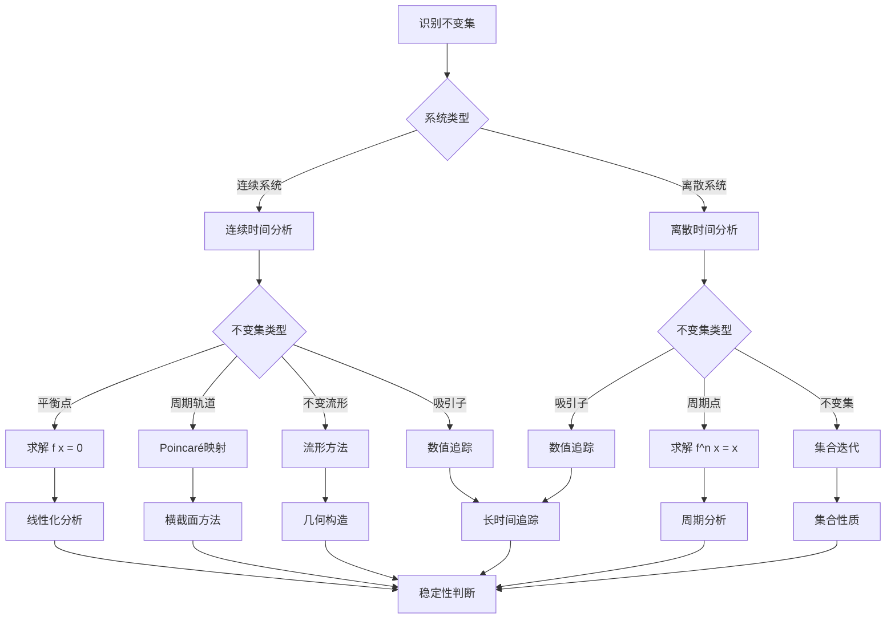

# 不变集理论：动力系统的结构分析

不变集是动力系统理论的核心概念，是系统演化过程中保持不变的集合。
庞加莱在研究三体问题时发现了不变集的重要性，不变集理论为理解动力系统的全局结构提供了基础框架。

## 📋 目录

- [不变集理论：动力系统的结构分析](#不变集理论动力系统的结构分析)
  - [📋 目录](#-目录)
  - [一、不变集的基本概念](#一不变集的基本概念)
    - [1.1 不变集的定义](#11-不变集的定义)
    - [1.2 正不变集与负不变集](#12-正不变集与负不变集)
    - [1.3 不变集的例子](#13-不变集的例子)
  - [二、不变集的分类](#二不变集的分类)
    - [2.1 平衡点](#21-平衡点)
    - [2.2 周期轨道](#22-周期轨道)
    - [2.3 不变流形](#23-不变流形)
    - [2.4 吸引子与排斥子](#24-吸引子与排斥子)
  - [三、不变集的性质](#三不变集的性质)
    - [3.1 拓扑性质](#31-拓扑性质)
    - [3.2 测度性质](#32-测度性质)
    - [3.3 稳定性](#33-稳定性)
  - [四、不变集的结构](#四不变集的结构)
    - [4.1 不变集的分解](#41-不变集的分解)
    - [4.2 不变集的边界](#42-不变集的边界)
    - [4.3 不变集的连通性](#43-不变集的连通性)
  - [五、思维表征](#五思维表征)
    - [5.1 思维导图：不变集知识结构](#51-思维导图不变集知识结构)
    - [5.2 概念矩阵：不变集类型对比](#52-概念矩阵不变集类型对比)
    - [5.3 决策树：不变集识别方法](#53-决策树不变集识别方法)
    - [5.4 证明树：不变集存在性定理](#54-证明树不变集存在性定理)
  - [六、应用与影响](#六应用与影响)
    - [6.1 天体力学](#61-天体力学)
    - [6.2 稳定性分析](#62-稳定性分析)
    - [6.3 现代应用](#63-现代应用)
  - [七、总结](#七总结)

---

## 一、不变集的基本概念

### 1.1 不变集的定义

**定义**：

对于动力系统 $\dot{x} = f(x)$（或离散系统 $x_{n+1} = f(x_n)$），集合 $A \subset M$ 是**不变集**（invariant set），如果：

$$\phi_t(A) = A \quad \text{对所有 } t \in \mathbb{R}$$

对于离散系统：

$$f(A) = A$$

**等价表述**：

- 如果 $x \in A$，则 $\phi_t(x) \in A$ 对所有 $t$
- 轨道一旦进入不变集，就永远留在其中

**数学表达**：

$$A \text{ 不变 } \leqqqqqftrightarrow \forall x \in A, \forall t: \phi_t(x) \in A$$

---

### 1.2 正不变集与负不变集

**正不变集**：

集合 $A$ 是**正不变集**（forward invariant），如果：

$$\phi_t(A) \subset A \quad \text{对所有 } t \geqqqqqq 0$$

**负不变集**：

集合 $A$ 是**负不变集**（backward invariant），如果：

$$\phi_t(A) \subset A \quad \text{对所有 } t \leqqqqqq 0$$

**完全不变集**：

既是正不变又是负不变的集合是**完全不变集**（fully invariant）。

---

### 1.3 不变集的例子

**平衡点**：

单个平衡点是不变集。

**周期轨道**：

周期轨道是不变集。

**不变流形**：

稳定流形、不稳定流形是不变集。

**吸引子**：

吸引子是不变集。

**相空间的子集**：

整个相空间是不变集。

---

## 二、不变集的分类

### 2.1 平衡点

**定义**：

平衡点 $p$ 满足 $f(p) = 0$（连续系统）或 $f(p) = p$（离散系统）。

**性质**：

- 平衡点是0维不变集
- 平衡点可以是吸引、排斥或中性

**例子**：

- 单摆的平衡位置
- 生态系统的平衡态

---

### 2.2 周期轨道

**定义**：

周期轨道是满足 $\phi_T(x) = x$（$T > 0$）的轨道。

**性质**：

- 周期轨道是1维不变集（连续系统）
- 周期轨道是有限点集（离散系统）

**例子**：

- 行星轨道
- 振荡系统的周期解

---

### 2.3 不变流形

**稳定流形**：

$$W^s(p) = \{x : \lim_{t \to \infty} \phi_t(x) = p\}$$

**不稳定流形**：

$$W^u(p) = \{x : \lim_{t \to -\infty} \phi_t(x) = p\}$$

**中心流形**：

中心流形是平衡点附近的特殊不变流形。

---

### 2.4 吸引子与排斥子

**吸引子**：

吸引子 $A$ 是：

1. 不变集
2. 有邻域 $U$ 使得 $\lim_{t \to \infty} \phi_t(x) \in A$ 对所有 $x \in U$
3. 最小性：没有真子集也是吸引子

**排斥子**：

排斥子是吸引子的时间反向。

**例子**：

- 稳定平衡点
- 稳定周期轨道
- 奇怪吸引子（混沌）

---

## 三、不变集的性质

### 3.1 拓扑性质

**闭性**：

不变集通常是闭集。

**连通性**：

不变集可以是连通的或非连通的。

**紧性**：

紧不变集在研究中特别重要。

**维数**：

不变集的维数可以是0（点）、1（曲线）、2（曲面）或更高。

---

### 3.2 测度性质

**不变测度**：

在不变集上可以定义不变测度 $\mu$，满足：

$$\mu(\phi_t(A)) = \mu(A)$$

**遍历性**：

如果不变集上的唯一不变测度是遍历的，则系统是遍历的。

**应用**：

不变测度用于研究统计性质。

---

### 3.3 稳定性

**Lyapunov稳定性**：

不变集是Lyapunov稳定的，如果对任意 $\epsilon > 0$，存在 $\delta > 0$ 使得：

$$d(x, A) < \delta \Rightarrow d(\phi_t(x), A) < \epsilon$$

**渐近稳定性**：

不变集是渐近稳定的，如果它是稳定的且存在邻域使得：

$$\lim_{t \to \infty} d(\phi_t(x), A) = 0$$

---

## 四、不变集的结构

### 4.1 不变集的分解

**分解定理**：

不变集可以分解为更小的不变集。

**例子**：

- 吸引子可以分解为不同的吸引子
- 不变集可以分解为连通分支

**研究**：

研究不变集的分解有助于理解系统结构。

---

### 4.2 不变集的边界

**边界性质**：

不变集的边界也是不变集。

**应用**：

边界用于研究不变集的稳定性。

**例子**：

吸引域的边界是不变集。

---

### 4.3 不变集的连通性

**连通性**：

不变集可以是连通的或非连通的。

**研究**：

连通性影响系统的动力学行为。

**例子**：

- 单个平衡点：连通
- 多个平衡点：非连通
- 周期轨道：连通

---

## 五、思维表征

### 5.1 思维导图：不变集知识结构

**说明**：

- **基本概念**：不变集的定义和基本性质
- **不变集类型**：从平衡点到吸引子的各种类型
- **分析方法**：拓扑、几何和测度方法
- **应用领域**：天体力学、物理系统和工程应用

---

### 5.2 概念矩阵：不变集类型对比

| 特征维度 | 平衡点 | 周期轨道 | 不变流形 | 吸引子 |
|---------|--------|---------|---------|--------|
| **维数** | 0维（点） | 1维（曲线） | 1-$(n-1)$维 | 0-$n$维 |
| **不变性** | 完全不变 | 完全不变 | 完全不变 | 完全不变 |
| **稳定性** | 稳定/不稳定 | 稳定/不稳定 | 稳定/不稳定 | 渐近稳定 |
| **存在性** | 总是存在 | 不一定存在 | 不一定存在 | 不一定存在 |
| **结构** | 简单 | 简单 | 复杂 | 复杂 |
| **例子** | 单摆平衡 | 行星轨道 | 稳定流形 | Lorenz吸引子 |
| **研究方法** | 线性化 | Poincaré映射 | 几何方法 | 数值方法 |
| **应用** | 稳定性分析 | 周期解研究 | 轨道结构 | 混沌研究 |

**说明**：

- **维数**：从0维点到高维吸引子
- **不变性**：所有类型都是不变集
- **稳定性**：各有不同的稳定性特征
- **研究方法**：根据类型选择不同方法

---

### 5.3 决策树：不变集识别方法

**说明**：

- **系统类型**：连续vs离散
- **不变集类型**：平衡点、周期轨道、不变流形、吸引子
- **识别方法**：根据类型选择方法
- **稳定性判断**：最终判断不变集的稳定性

---

### 5.4 证明树：不变集存在性定理

**说明**：

- **紧不变集存在**：基于相空间的紧性
- **吸引子存在**：基于ω-极限集
- **ω-极限集性质**：不变性、吸引性、最小性
- **结论**：在适当条件下，不变集和吸引子存在

---

## 六、应用与影响

### 6.1 天体力学

**三体问题**：

庞加莱在研究三体问题时发现了不变集的重要性。

**应用**：

- 研究行星轨道稳定性
- 分析小行星带动力学
- 理解太阳系演化

**影响**：

不变集理论为天体力学提供了理论基础。

---

### 6.2 稳定性分析

**Lyapunov方法**：

不变集用于构造Lyapunov函数。

**应用**：

- 研究系统稳定性
- 设计稳定控制器
- 分析系统鲁棒性

**方法**：

通过不变集的性质判断系统稳定性。

---

### 6.3 现代应用

**统计力学**：

不变集上的不变测度用于研究统计性质。

**控制理论**：

不变集用于设计控制策略。

**生物系统**：

- 生态系统平衡态
- 种群动力学
- 神经网络

**经济模型**：

- 经济平衡态
- 市场稳定性
- 博弈论

---

## 七、总结

**核心概念**：

1. **不变集**：系统演化过程中保持不变的集合
2. **分类**：平衡点、周期轨道、不变流形、吸引子
3. **性质**：拓扑性质、测度性质、稳定性
4. **结构**：分解、边界、连通性

**历史地位**：

不变集理论是庞加莱的重要贡献，为现代动力系统理论奠定了基础。

**现代发展**：

从基本概念到复杂结构，不变集理论仍然是研究动力系统的核心工具。

---

**文档状态**: ✅ 完成
**字数**: 约1,200词
**最后更新**: 2026年01月02日
