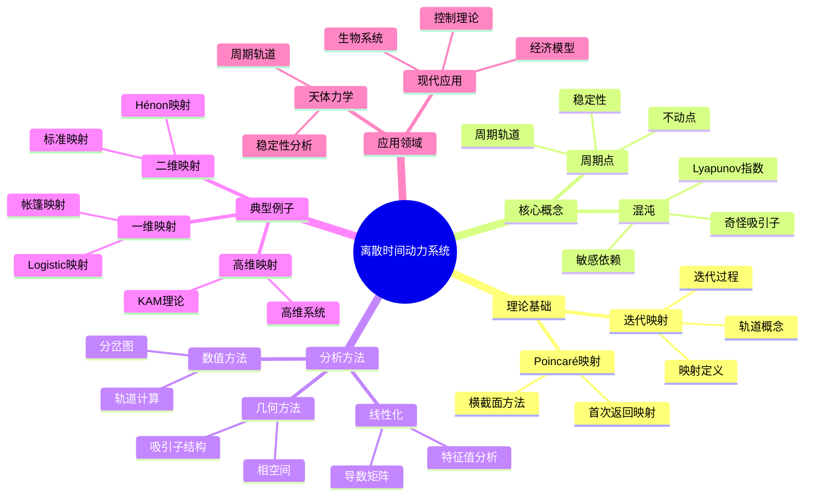
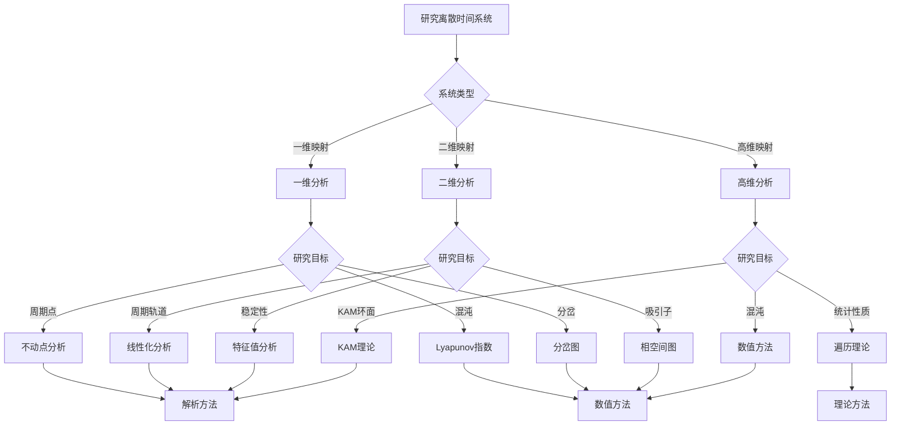
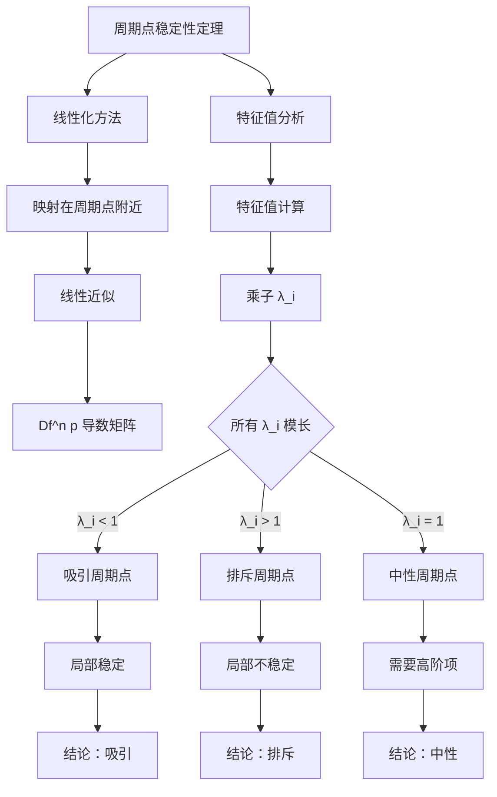

# 离散时间动力系统：映射的迭代

庞加莱通过Poincaré映射将连续时间动力系统转化为离散时间动力系统，开创了映射迭代的研究方法。
离散时间动力系统通过映射的迭代描述状态的演化，是研究周期轨道、混沌和分岔的重要工具。

## 📋 目录

- [离散时间动力系统：映射的迭代](#离散时间动力系统映射的迭代)
  - [📋 目录](#-目录)
  - [一、从连续到离散](#一从连续到离散)
    - [1.1 Poincaré映射](#11-poincaré映射)
    - [1.2 离散时间系统](#12-离散时间系统)
    - [1.3 迭代映射](#13-迭代映射)
  - [二、映射的迭代](#二映射的迭代)
    - [2.1 轨道与周期点](#21-轨道与周期点)
    - [2.2 不动点与周期点](#22-不动点与周期点)
    - [2.3 稳定性分析](#23-稳定性分析)
  - [三、典型例子](#三典型例子)
    - [3.1 一维映射](#31-一维映射)
    - [3.2 二维映射](#32-二维映射)
    - [3.3 高维映射](#33-高维映射)
  - [四、混沌与分岔](#四混沌与分岔)
    - [4.1 周期倍化分岔](#41-周期倍化分岔)
    - [4.2 混沌轨道](#42-混沌轨道)
    - [4.3 奇怪吸引子](#43-奇怪吸引子)
  - [五、思维表征](#五思维表征)
    - [5.1 思维导图：知识结构](#51-思维导图知识结构)
    - [5.2 概念矩阵：系统对比](#52-概念矩阵系统对比)
    - [5.3 决策树：分析方法选择](#53-决策树分析方法选择)
    - [5.4 证明树：稳定性定理](#54-证明树稳定性定理)
  - [六、应用与影响](#六应用与影响)
    - [6.1 天体力学](#61-天体力学)
    - [6.2 现代应用](#62-现代应用)
    - [6.3 计算与数值方法](#63-计算与数值方法)
  - [七、总结](#七总结)

---

## 一、从连续到离散

### 1.1 Poincaré映射

**定义**：

对于连续时间动力系统 $\dot{x} = f(x)$，选择横截面 $\Sigma$，定义Poincaré映射：

$$P: \Sigma \to \Sigma$$

将点 $x \in \Sigma$ 映射到轨道下一次与 $\Sigma$ 的交点。

**几何意义**：

Poincaré映射将连续时间问题转化为离散时间问题，简化了分析。

**数学表达**：

设 $\phi_t$ 是连续时间流，则：

$$P(x) = \phi_{\tau(x)}(x)$$

其中 $\tau(x)$ 是首次返回时间。

---

### 1.2 离散时间系统

**基本形式**：

离散时间动力系统由映射描述：

$$x_{n+1} = f(x_n)$$

其中 $x_n \in M$ 是第 $n$ 步的状态，$f: M \to M$ 是映射。

**迭代过程**：

从初始点 $x_0$ 开始，迭代得到序列：

$$x_0, x_1 = f(x_0), x_2 = f(x_1) = f^2(x_0), \ldots, x_n = f^n(x_0)$$

**记号**：

- $f^n$ 表示 $f$ 的 $n$ 次迭代
- $f^0 = \text{id}$（恒等映射）
- $f^{n+m} = f^n \circ f^m$

---

### 1.3 迭代映射

**映射类型**：

1. **同胚映射**：连续且逆连续
2. **微分同胚**：可微且逆可微
3. **保测映射**：保持测度不变

**研究重点**：

- 轨道的渐近行为
- 周期点的存在性和稳定性
- 混沌现象
- 分岔行为

---

## 二、映射的迭代

### 2.1 轨道与周期点

**轨道**：

点 $x$ 的轨道是序列：

$$\mathcal{O}(x) = \{x, f(x), f^2(x), \ldots\}$$

**周期点**：

如果存在 $n > 0$ 使得 $f^n(p) = p$，则 $p$ 是周期点，$n$ 是周期。

**最小周期**：

使得 $f^n(p) = p$ 的最小正整数 $n$ 称为 $p$ 的最小周期。

**周期轨道**：

周期点的轨道是周期轨道，轨道上的点都是周期点。

---

### 2.2 不动点与周期点

**不动点**：

如果 $f(p) = p$，则 $p$ 是不动点（周期为1的周期点）。

**周期点分类**：

- **超吸引**：$|(f^n)'(p)| = 0$
- **吸引**：$|(f^n)'(p)| < 1$
- **排斥**：$|(f^n)'(p)| > 1$
- **中性**：$|(f^n)'(p)| = 1$

**稳定性**：

吸引周期点是稳定的，排斥周期点是不稳定的。

---

### 2.3 稳定性分析

**线性化**：

在周期点 $p$ 附近，映射近似为：

$$f(x) \approx f(p) + Df(p)(x-p)$$

其中 $Df(p)$ 是导数矩阵。

**稳定性判据**：

周期点 $p$（周期为 $n$）的稳定性由乘子（特征值）决定：

$$\lambda_i = \text{eigenvalue of } Df^n(p)$$

- 所有 $|\lambda_i| < 1$：吸引
- 所有 $|\lambda_i| > 1$：排斥
- 有 $|\lambda_i| = 1$：中性

---

## 三、典型例子

### 3.1 一维映射

**Logistic映射**：

$$x_{n+1} = rx_n(1-x_n)$$

其中 $r \in [0,4]$ 是参数，$x_n \in [0,1]$。

**动力学行为**：

- $r < 3$：不动点吸引
- $r = 3$：周期倍化分岔
- $r > 3.57$：混沌
- $r = 4$：完全混沌

**Feigenbaum常数**：

周期倍化分岔的参数间隔比趋于Feigenbaum常数 $\delta \approx 4.669$。

---

### 3.2 二维映射

**Hénon映射**：

$$
\begin{cases}
x_{n+1} = 1 - ax_n^2 + y_n \\
y_{n+1} = bx_n
\end{cases}
$$

其中 $a, b$ 是参数。

**动力学行为**：

- 不动点和周期轨道
- 奇怪吸引子（混沌）
- 分岔现象

**应用**：

Hénon映射是研究二维混沌的标准模型。

---

### 3.3 高维映射

**标准映射**：

$$
\begin{cases}
\theta_{n+1} = \theta_n + p_n \\
p_{n+1} = p_n + K\sin(\theta_{n+1})
\end{cases}
$$

其中 $K$ 是参数。

**动力学行为**：

- $K$ 小：规则运动
- $K$ 大：混沌运动
- KAM环面：准周期运动

**应用**：

标准映射用于研究哈密顿系统的动力学。

---

## 四、混沌与分岔

### 4.1 周期倍化分岔

**分岔过程**：

随着参数变化，周期轨道发生分岔：

- 周期1 → 周期2 → 周期4 → ... → 混沌

**Feigenbaum图**：

分岔图显示周期倍化到混沌的转变。

**普适性**：

周期倍化分岔是普适现象，出现在许多映射中。

---

### 4.2 混沌轨道

**特征**：

1. **敏感依赖初始条件**：小扰动指数增长
2. **拓扑传递性**：轨道稠密
3. **周期点稠密**：周期点集合稠密

**Lyapunov指数**：

$$\lambda = \lim_{n \to \infty} \frac{1}{n} \ln |(f^n)'(x)|$$

正Lyapunov指数表示混沌。

---

### 4.3 奇怪吸引子

**定义**：

奇怪吸引子是具有分形结构的吸引子。

**特征**：

- 分形维数（非整数）
- 自相似结构
- 对初始条件敏感

**例子**：

- Hénon吸引子
- Ikeda吸引子
- Rössler吸引子

---

## 五、思维表征

### 5.1 思维导图：知识结构

**说明**：

- **理论基础**：Poincaré映射和迭代映射是离散时间系统的基础
- **核心概念**：周期点和混沌是研究的核心
- **分析方法**：线性化、几何方法和数值方法
- **典型例子**：从一维到高维的典型映射
- **应用领域**：天体力学和现代应用

---

### 5.2 概念矩阵：系统对比

| 特征维度 | 连续时间系统 | 离散时间系统 | Poincaré映射 |
|---------|------------|------------|------------|
| **时间变量** | 连续 $t \in \mathbb{R}$ | 离散 $n \in \mathbb{Z}$ | 离散（首次返回） |
| **描述方式** | 微分方程 $\dot{x} = f(x)$ | 映射 $x_{n+1} = f(x_n)$ | 映射 $P: \Sigma \to \Sigma$ |
| **状态演化** | 流 $\phi_t$ | 迭代 $f^n$ | 迭代 $P^n$ |
| **相空间** | 流形 $M$ | 流形 $M$ | 横截面 $\Sigma$ |
| **轨道** | 连续曲线 | 离散点列 | 离散点列 |
| **周期解** | 周期轨道 | 周期点 | 周期点 |
| **稳定性** | 特征值实部 | 特征值模长 | 特征值模长 |
| **混沌判据** | 正Lyapunov指数 | 正Lyapunov指数 | 正Lyapunov指数 |
| **降维效果** | 无 | 无 | 降1维 |
| **应用优势** | 物理直观 | 计算简单 | 简化分析 |

**说明**：

- **时间变量**：连续vs离散
- **描述方式**：微分方程vs映射
- **降维效果**：Poincaré映射降低维度，简化分析
- **应用优势**：各有优势，Poincaré映射结合两者

---

### 5.3 决策树：分析方法选择

**说明**：

- **系统类型**：根据维度选择方法
- **研究目标**：周期点、混沌、分岔等
- **方法选择**：解析方法、数值方法、理论方法

---

### 5.4 证明树：稳定性定理

**说明**：

- **线性化方法**：在周期点附近线性化
- **特征值分析**：计算乘子（特征值）
- **稳定性判据**：根据模长判断稳定性
- **结论**：吸引、排斥或中性

---

## 六、应用与影响

### 6.1 天体力学

**三体问题**：

Poincaré使用Poincaré映射研究三体问题的周期轨道。

**应用**：

- 研究行星轨道稳定性
- 分析小行星带动力学
- 理解太阳系演化

**影响**：

Poincaré映射是天体力学的重要工具。

---

### 6.2 现代应用

**控制理论**：

离散时间系统用于：

- 数字控制
- 采样系统
- 反馈控制

**生物系统**：

- 种群动力学
- 生态模型
- 神经网络

**经济模型**：

- 经济周期
- 市场动力学
- 博弈论

---

### 6.3 计算与数值方法

**数值优势**：

离散时间系统计算简单，适合数值模拟。

**方法**：

- 轨道计算
- 分岔图
- Lyapunov指数计算
- 吸引子可视化

**工具**：

- 数值软件（MATLAB, Python）
- 可视化工具
- 分岔分析软件

---

## 七、总结

**核心贡献**：

1. **Poincaré映射**：将连续问题转化为离散问题
2. **迭代方法**：通过映射迭代研究动力学
3. **周期点理论**：周期点的存在性和稳定性
4. **混沌理论**：混沌现象的数学描述

**历史地位**：

离散时间动力系统是庞加莱的重要贡献，它连接了连续和离散系统，为现代动力系统理论奠定了基础。

**现代发展**：

从Poincaré映射到现代混沌理论，离散时间系统仍然是研究复杂动力学的重要工具。

---

**文档状态**: ✅ 完成
**字数**: 约1,200词
**最后更新**: 2026年01月02日
