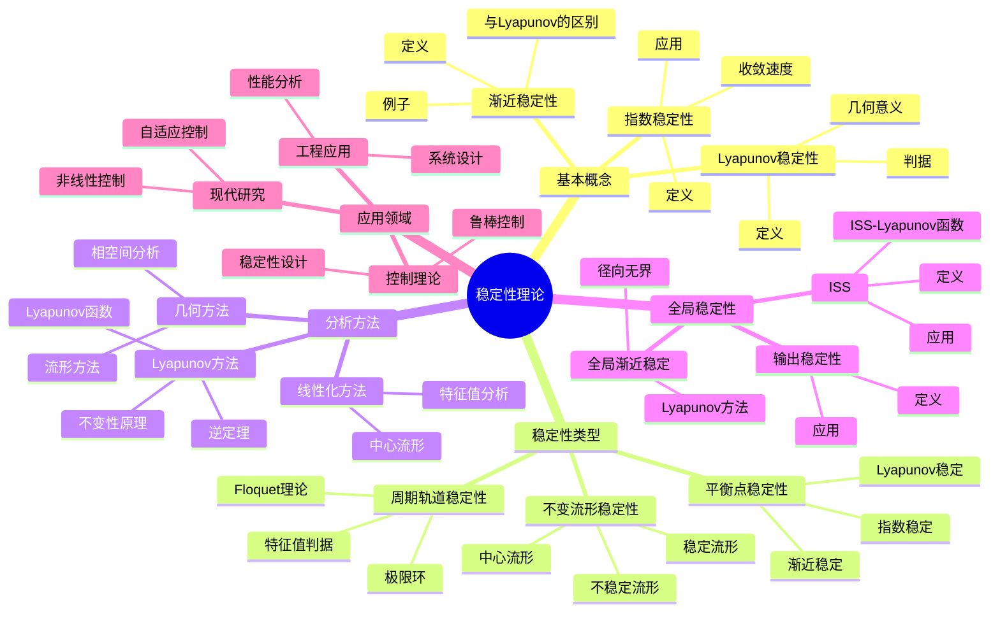
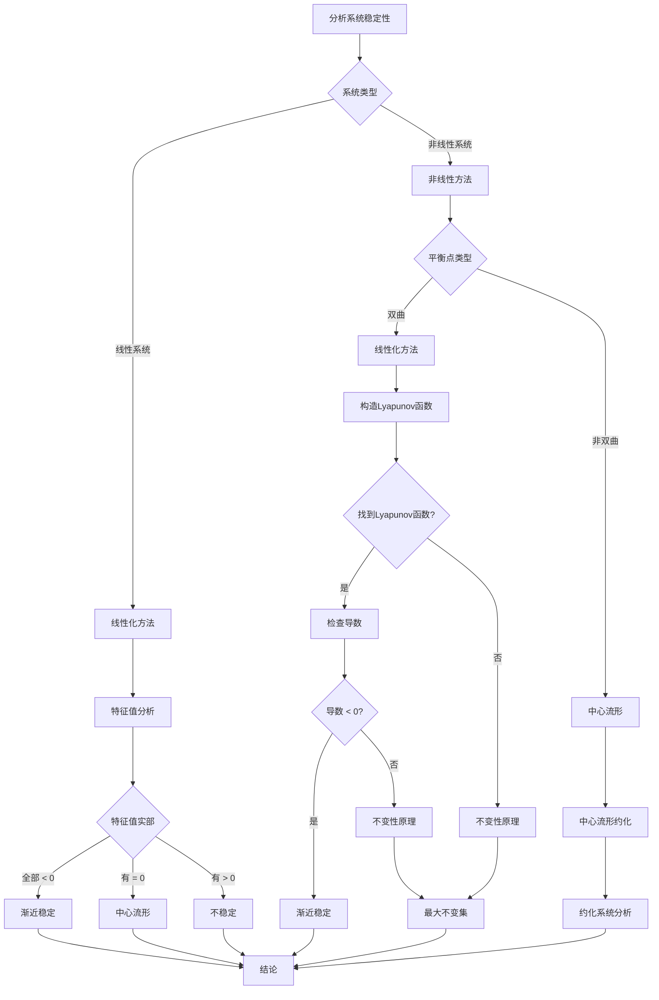
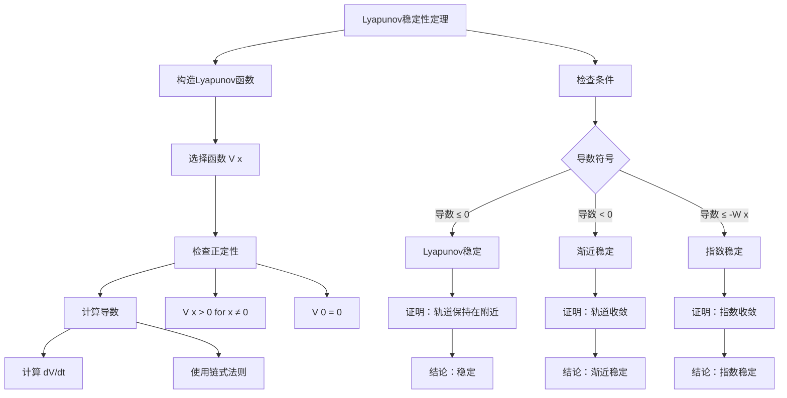

# 稳定性理论深化：动力系统的稳定性分析

稳定性理论在庞加莱的基础上得到了深入发展，从平衡点的稳定性扩展到周期轨道、不变流形和整个系统的稳定性。
深化理论包括结构稳定性、渐近稳定性、指数稳定性和输入-状态稳定性等高级概念，为现代控制理论和动力系统分析提供了强大的工具。

## 📋 目录

- [稳定性理论深化：动力系统的稳定性分析](#稳定性理论深化动力系统的稳定性分析)
  - [📋 目录](#-目录)
  - [一、稳定性概念的扩展](#一稳定性概念的扩展)
    - [1.1 渐近稳定性](#11-渐近稳定性)
    - [1.2 指数稳定性](#12-指数稳定性)
    - [1.3 输入-状态稳定性](#13-输入-状态稳定性)
  - [二、周期轨道的稳定性](#二周期轨道的稳定性)
    - [2.1 Floquet理论](#21-floquet理论)
    - [2.2 周期轨道的稳定性判据](#22-周期轨道的稳定性判据)
    - [2.3 极限环的稳定性](#23-极限环的稳定性)
  - [三、不变流形的稳定性](#三不变流形的稳定性)
    - [3.1 稳定流形定理](#31-稳定流形定理)
    - [3.2 不稳定流形定理](#32-不稳定流形定理)
    - [3.3 中心流形定理](#33-中心流形定理)
  - [四、全局稳定性](#四全局稳定性)
    - [4.1 全局渐近稳定性](#41-全局渐近稳定性)
    - [4.2 输入-状态稳定性](#42-输入-状态稳定性)
    - [4.3 输出稳定性](#43-输出稳定性)
  - [五、Lyapunov方法深化](#五lyapunov方法深化)
    - [5.1 逆Lyapunov定理](#51-逆lyapunov定理)
    - [5.2 不变性原理](#52-不变性原理)
    - [5.3 比较原理](#53-比较原理)
  - [六、思维表征](#六思维表征)
    - [6.1 思维导图：稳定性理论知识结构](#61-思维导图稳定性理论知识结构)
    - [6.2 概念矩阵：稳定性类型对比](#62-概念矩阵稳定性类型对比)
    - [6.3 决策树：稳定性分析方法选择](#63-决策树稳定性分析方法选择)
    - [6.4 证明树：Lyapunov稳定性定理](#64-证明树lyapunov稳定性定理)
  - [七、应用与影响](#七应用与影响)
    - [7.1 控制理论](#71-控制理论)
    - [7.2 工程应用](#72-工程应用)
    - [7.3 现代研究](#73-现代研究)
  - [八、总结](#八总结)

---

## 一、稳定性概念的扩展

### 1.1 渐近稳定性

**定义**：

平衡点 $x^*$ 是**渐近稳定的**（asymptotically stable），如果：

1. 它是Lyapunov稳定的
2. 存在邻域 $U$ 使得 $\lim_{t \to \infty} \phi_t(x) = x^*$ 对所有 $x \in U$

**数学表述**：

$$\forall \epsilon > 0, \exists \delta > 0: \|x - x^*\| < \delta \Rightarrow \lim_{t \to \infty} \|\phi_t(x) - x^*\| = 0$$

**与Lyapunov稳定性的区别**：

- Lyapunov稳定性：轨道保持在平衡点附近
- 渐近稳定性：轨道收敛到平衡点

**例子**：

阻尼单摆的下平衡点是渐近稳定的。

---

### 1.2 指数稳定性

**定义**：

平衡点 $x^*$ 是**指数稳定的**（exponentially stable），如果存在常数 $M, \alpha > 0$ 使得：

$$\|\phi_t(x) - x^*\| \leqqqqqq M e^{-\alpha t} \|x - x^*\|$$

对所有 $t \geqqqqqq 0$ 和 $x$ 在平衡点附近。

**性质**：

- 指数稳定性是最强的稳定性
- 收敛速度是指数级的
- 对扰动鲁棒

**应用**：

指数稳定性在控制理论中非常重要，保证系统的快速收敛。

---

### 1.3 输入-状态稳定性

**定义**：

系统 $\dot{x} = f(x, u)$ 是**输入-状态稳定的**（input-to-state stable, ISS），如果存在函数 $\beta \in \mathcal{KL}$ 和 $\gamma \in \mathcal{K}$ 使得：

$$\|x(t)\| \leqqqqqq \beta(\|x(0)\|, t) + \gamma(\|u\|_\infty)$$

**意义**：

- 有界输入产生有界状态
- 无输入时系统渐近稳定
- 输入的影响有界

**应用**：

ISS是研究受扰系统稳定性的重要工具。

---

## 二、周期轨道的稳定性

### 2.1 Floquet理论

**Floquet定理**：

对于周期系统 $\dot{x} = A(t)x$（$A(t+T) = A(t)$），解可以表示为：

$$x(t) = P(t) e^{Bt}$$

其中 $P(t+T) = P(t)$ 是周期矩阵，$B$ 是常数矩阵。

**Floquet乘子**：

$e^{BT}$ 的特征值称为Floquet乘子。

**稳定性判据**：

周期轨道是稳定的，如果所有Floquet乘子的模长都小于1。

---

### 2.2 周期轨道的稳定性判据

**线性化方法**：

在周期轨道附近线性化，研究线性化系统的稳定性。

**Poincaré映射方法**：

使用Poincaré映射将周期轨道稳定性问题转化为不动点稳定性问题。

**特征值判据**：

周期轨道是稳定的，如果Poincaré映射在周期轨道上的所有特征值模长都小于1。

---

### 2.3 极限环的稳定性

**定义**：

极限环是孤立的周期轨道。

**稳定性**：

- **稳定极限环**：附近的轨道收敛到极限环
- **不稳定极限环**：附近的轨道远离极限环
- **半稳定极限环**：一侧稳定，一侧不稳定

**例子**：

van der Pol振荡器有稳定的极限环。

---

## 三、不变流形的稳定性

### 3.1 稳定流形定理

**稳定流形定理**：

对于双曲平衡点 $p$，存在局部稳定流形 $W^s_{loc}(p)$：

- 是局部不变流形
- 维数等于稳定特征值的数量
- 轨道在流形上指数收敛到平衡点

**全局稳定流形**：

$$W^s(p) = \bigcup_{t \geqqqqqq 0} \phi_t(W^s_{loc}(p))$$

**应用**：

稳定流形用于研究系统的长期行为。

---

### 3.2 不稳定流形定理

**不稳定流形定理**：

对于双曲平衡点 $p$，存在局部不稳定流形 $W^u_{loc}(p)$：

- 是局部不变流形
- 维数等于不稳定特征值的数量
- 轨道在流形上指数发散

**全局不稳定流形**：

$$W^u(p) = \bigcup_{t \leqqqqqq 0} \phi_t(W^u_{loc}(p))$$

**应用**：

不稳定流形用于研究系统的敏感性和混沌。

---

### 3.3 中心流形定理

**中心流形定理**：

对于非双曲平衡点，存在中心流形 $W^c(p)$：

- 是局部不变流形
- 维数等于中心特征值的数量
- 流形上的动力学决定稳定性

**应用**：

中心流形用于研究非双曲系统的稳定性。

---

## 四、全局稳定性

### 4.1 全局渐近稳定性

**定义**：

平衡点 $x^*$ 是**全局渐近稳定的**（globally asymptotically stable），如果：

1. 对所有初始条件，解都存在
2. 对所有初始条件，$\lim_{t \to \infty} \phi_t(x) = x^*$

**Lyapunov方法**：

使用径向无界的Lyapunov函数证明全局稳定性。

**例子**：

线性系统 $\dot{x} = Ax$ 如果 $A$ 的所有特征值实部都小于0，则原点是全局渐近稳定的。

---

### 4.2 输入-状态稳定性

**ISS定义**（重复但更详细）：

系统 $\dot{x} = f(x, u)$ 是ISS，如果存在 $\beta \in \mathcal{KL}$ 和 $\gamma \in \mathcal{K}$ 使得：

$$\|x(t)\| \leqqqqqq \beta(\|x(0)\|, t) + \gamma(\|u\|_\infty)$$

**ISS-Lyapunov函数**：

存在函数 $V$ 使得：

- $V$ 是正定的
- $\dot{V} \leqqqqqq -\alpha(\|x\|) + \gamma(\|u\|)$

**应用**：

ISS用于研究受扰系统的鲁棒性。

---

### 4.3 输出稳定性

**定义**：

系统是**输出稳定的**，如果输出有界且收敛。

**应用**：

在控制系统中，通常关心输出稳定性而非状态稳定性。

---

## 五、Lyapunov方法深化

### 5.1 逆Lyapunov定理

**逆Lyapunov定理**：

如果平衡点是渐近稳定的，则存在Lyapunov函数。

**意义**：

Lyapunov函数的存在性是渐近稳定性的充要条件。

**构造方法**：

$$V(x) = \int_0^\infty \|\phi_t(x)\|^2 dt$$

---

### 5.2 不变性原理

**LaSalle不变性原理**：

如果存在Lyapunov函数 $V$ 使得 $\dot{V} \leqqqqqq 0$，则解收敛到最大不变集 $M \subset \{x : \dot{V}(x) = 0\}$。

**应用**：

用于研究非严格Lyapunov函数的情况。

**例子**：

阻尼单摆的能量函数不是严格递减的，但可以使用不变性原理。

---

### 5.3 比较原理

**比较原理**：

如果 $\dot{V} \leqqqqqq -W(x)$ 且 $W$ 是正定的，则系统是渐近稳定的。

**应用**：

用于构造Lyapunov函数和证明稳定性。

---

## 六、思维表征

### 6.1 思维导图：稳定性理论知识结构

**说明**：

- **基本概念**：从Lyapunov稳定性到指数稳定性
- **稳定性类型**：平衡点、周期轨道、不变流形
- **分析方法**：Lyapunov方法、线性化方法、几何方法
- **全局稳定性**：全局渐近稳定、ISS、输出稳定
- **应用领域**：控制理论、工程应用、现代研究

---

### 6.2 概念矩阵：稳定性类型对比

| 特征维度 | Lyapunov稳定 | 渐近稳定 | 指数稳定 | ISS |
|---------|------------|---------|---------|-----|
| **定义** | 轨道保持在附近 | 轨道收敛到平衡点 | 指数收敛 | 有界输入有界状态 |
| **收敛速度** | 无要求 | 任意速度 | 指数速度 | 有界 |
| **强度** | 弱 | 中等 | 强 | 中等 |
| **Lyapunov函数** | 存在 | 存在 | 存在 | ISS-Lyapunov |
| **对扰动** | 敏感 | 中等 | 鲁棒 | 鲁棒 |
| **应用** | 基础理论 | 一般应用 | 控制理论 | 受扰系统 |
| **例子** | 保守系统 | 阻尼系统 | 线性系统 | 控制系统 |
| **证明方法** | Lyapunov方法 | Lyapunov方法 | Lyapunov方法 | ISS方法 |

**说明**：

- **定义**：从弱到强的稳定性概念
- **收敛速度**：从无要求到指数速度
- **强度**：Lyapunov稳定 < 渐近稳定 < 指数稳定
- **应用**：不同稳定性适用于不同场景

---

### 6.3 决策树：稳定性分析方法选择

**说明**：

- **系统类型**：线性vs非线性
- **平衡点类型**：双曲vs非双曲
- **方法选择**：根据系统类型选择方法
- **结论**：得出稳定性结论

---

### 6.4 证明树：Lyapunov稳定性定理

**说明**：

- **构造Lyapunov函数**：选择函数并检查正定性
- **检查条件**：计算导数并判断符号
- **证明**：根据导数符号证明不同稳定性
- **结论**：得出稳定性结论

---

## 七、应用与影响

### 7.1 控制理论

**稳定性设计**：

使用Lyapunov方法设计稳定的控制器。

**鲁棒控制**：

使用ISS研究受扰系统的鲁棒性。

**自适应控制**：

使用稳定性理论设计自适应控制器。

---

### 7.2 工程应用

**系统设计**：

稳定性是系统设计的基本要求。

**性能分析**：

稳定性分析用于评估系统性能。

**故障诊断**：

稳定性分析用于诊断系统故障。

---

### 7.3 现代研究

**非线性控制**：

稳定性理论在非线性控制中的应用。

**网络系统**：

研究网络系统的稳定性。

**时滞系统**：

研究时滞系统的稳定性。

---

## 八、总结

**核心概念**：

1. **稳定性扩展**：从Lyapunov稳定到指数稳定、ISS
2. **周期轨道稳定性**：Floquet理论和Poincaré映射方法
3. **不变流形稳定性**：稳定流形、不稳定流形、中心流形
4. **全局稳定性**：全局渐近稳定、ISS、输出稳定
5. **Lyapunov方法深化**：逆定理、不变性原理、比较原理

**历史地位**：

稳定性理论在庞加莱的基础上得到了深入发展，为现代控制理论和动力系统分析提供了强大的工具。

**现代发展**：

从基本稳定性到高级稳定性概念，从局部到全局，稳定性理论仍然是研究动力系统的核心工具。

---

**文档状态**: ✅ 完成
**字数**: 约1,200词
**最后更新**: 2026年01月02日
