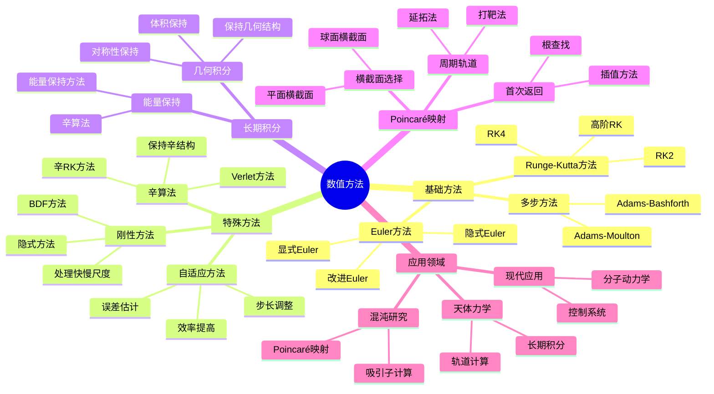
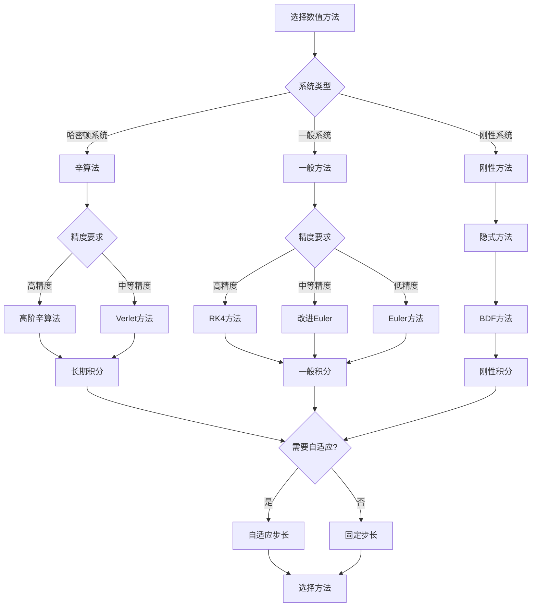
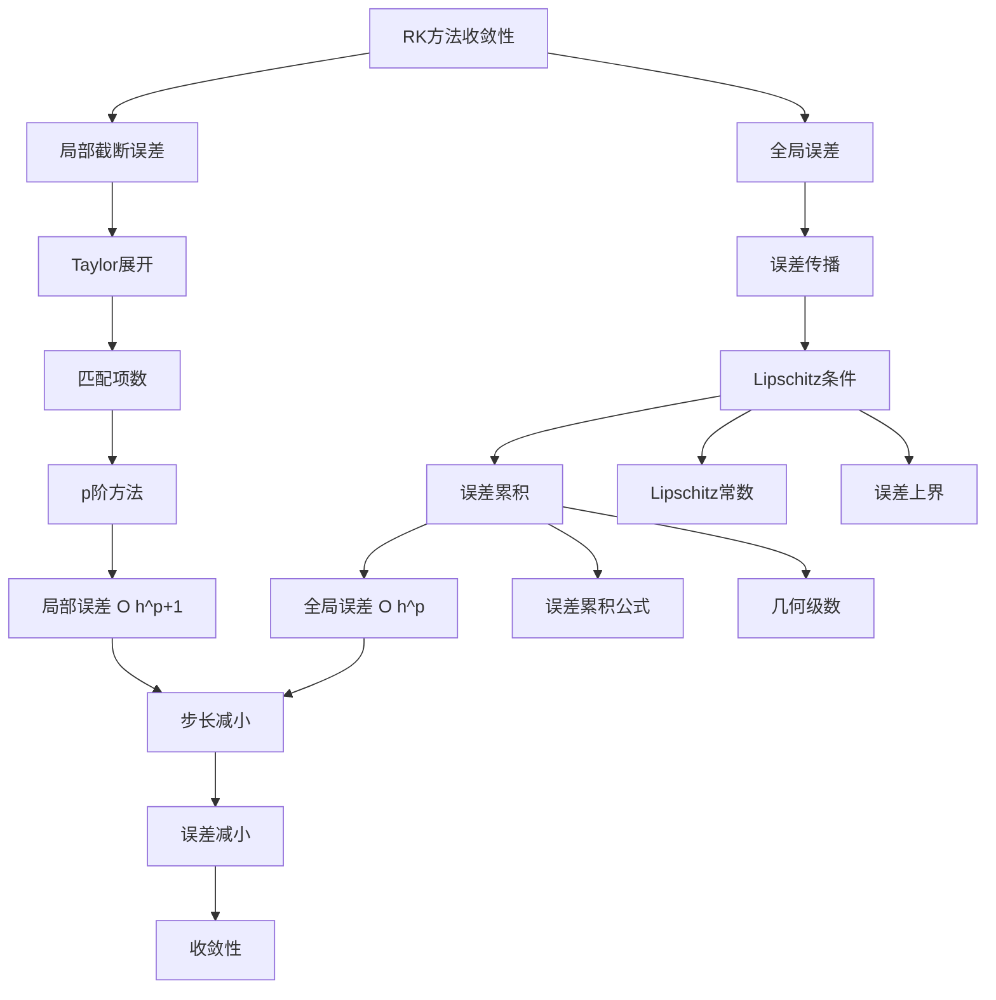

# 动力系统的数值方法：计算与模拟

动力系统的数值方法是研究复杂动力系统的重要工具。由于大多数动力系统无法解析求解，数值方法成为理解系统行为的主要途径。从Euler方法到Runge-Kutta方法，从自适应步长到辛算法，数值方法的发展使得我们能够模拟和分析复杂的动力系统。

## 📋 目录

- [动力系统的数值方法：计算与模拟](#动力系统的数值方法计算与模拟)
  - [一、数值方法基础](#一数值方法基础)
    - [1.1 初值问题](#11-初值问题)
    - [1.2 数值积分方法](#12-数值积分方法)
    - [1.3 误差分析](#13-误差分析)
  - [二、经典数值方法](#二经典数值方法)
    - [2.1 Euler方法](#21-euler方法)
    - [2.2 Runge-Kutta方法](#22-runge-kutta方法)
    - [2.3 多步方法](#23-多步方法)
  - [三、特殊方法](#三特殊方法)
    - [3.1 辛算法](#31-辛算法)
    - [3.2 自适应步长方法](#32-自适应步长方法)
    - [3.3 刚性系统方法](#33-刚性系统方法)
  - [四、长期积分](#四长期积分)
    - [4.1 长期行为的挑战](#41-长期行为的挑战)
    - [4.2 能量保持方法](#42-能量保持方法)
    - [4.3 几何数值积分](#43-几何数值积分)
  - [五、Poincaré映射的数值计算](#五poincaré映射的数值计算)
    - [5.1 横截面的选择](#51-横截面的选择)
    - [5.2 首次返回时间](#52-首次返回时间)
    - [5.3 周期轨道的计算](#53-周期轨道的计算)
  - [六、思维表征](#六思维表征)
    - [6.1 思维导图：数值方法知识结构](#61-思维导图数值方法知识结构)
    - [6.2 概念矩阵：数值方法对比](#62-概念矩阵数值方法对比)
    - [6.3 决策树：数值方法选择](#63-决策树数值方法选择)
    - [6.4 证明树：Runge-Kutta方法收敛性](#64-证明树runge-kutta方法收敛性)
  - [七、应用与影响](#七应用与影响)
    - [7.1 天体力学](#71-天体力学)
    - [7.2 混沌研究](#72-混沌研究)
    - [7.3 现代应用](#73-现代应用)
  - [八、总结](#八总结)

---

## 一、数值方法基础

### 1.1 初值问题

**问题形式**：

对于动力系统：

$$\dot{x} = f(x, t), \quad x(t_0) = x_0$$

需要计算 $x(t)$ 在离散时间点 $t_n = t_0 + nh$ 的值。

**数值解**：

数值方法给出近似值 $x_n \approx x(t_n)$。

**目标**：

- 高精度
- 高效率
- 保持系统性质（如能量、体积）

---

### 1.2 数值积分方法

**基本思想**：

将微分方程转化为积分方程：

$$x(t_{n+1}) = x(t_n) + \int_{t_n}^{t_{n+1}} f(x(s), s) ds$$

**数值积分**：

使用数值积分方法近似积分。

**方法分类**：

- **单步方法**：只使用 $x_n$ 计算 $x_{n+1}$
- **多步方法**：使用多个历史值
- **显式方法**：直接计算
- **隐式方法**：需要求解方程

---

### 1.3 误差分析

**局部截断误差**：

$$e_n = x(t_n) - x_n$$

**全局误差**：

$$E_n = \max_{0 \leq k \leq n} |x(t_k) - x_k|$$

**收敛性**：

如果 $\lim_{h \to 0} E_n = 0$，则方法收敛。

**阶数**：

如果局部截断误差为 $O(h^{p+1})$，则方法是 $p$ 阶的。

---

## 二、经典数值方法

### 2.1 Euler方法

**公式**：

$$x_{n+1} = x_n + h f(x_n, t_n)$$

**几何意义**：

使用切线的斜率近似解。

**性质**：

- 一阶方法
- 显式方法
- 简单但精度低

**改进**：

- 隐式Euler方法
- 改进Euler方法

---

### 2.2 Runge-Kutta方法

**RK4方法**（四阶Runge-Kutta）：

$$\begin{align}
k_1 &= h f(x_n, t_n) \\
k_2 &= h f(x_n + k_1/2, t_n + h/2) \\
k_3 &= h f(x_n + k_2/2, t_n + h/2) \\
k_4 &= h f(x_n + k_3, t_n + h) \\
x_{n+1} &= x_n + (k_1 + 2k_2 + 2k_3 + k_4)/6
\end{align}$$

**性质**：

- 四阶方法
- 显式方法
- 高精度

**应用**：

RK4是最常用的数值方法之一。

---

### 2.3 多步方法

**Adams-Bashforth方法**：

$$x_{n+1} = x_n + h \sum_{j=0}^{k} \beta_j f(x_{n-j}, t_{n-j})$$

**Adams-Moulton方法**：

$$x_{n+1} = x_n + h \sum_{j=-1}^{k} \beta_j f(x_{n-j}, t_{n-j})$$

**性质**：

- 使用历史值
- 高精度
- 需要启动值

---

## 三、特殊方法

### 3.1 辛算法

**定义**：

辛算法保持哈密顿系统的辛结构。

**重要性**：

- 保持能量（近似）
- 保持体积
- 长期积分稳定

**例子**：

- Verlet方法
- 辛Runge-Kutta方法

**应用**：

用于哈密顿系统的长期积分。

---

### 3.2 自适应步长方法

**基本思想**：

根据局部误差自动调整步长。

**方法**：

- 估计局部误差
- 如果误差大，减小步长
- 如果误差小，增大步长

**优点**：

- 提高效率
- 保证精度

**应用**：

用于复杂系统的数值积分。

---

### 3.3 刚性系统方法

**刚性系统**：

系统有快慢时间尺度。

**挑战**：

显式方法需要很小的步长。

**解决方法**：

- 隐式方法
- 刚性稳定方法

**例子**：

- 隐式Euler方法
- BDF方法

---

## 四、长期积分

### 4.1 长期行为的挑战

**问题**：

- 误差累积
- 能量漂移
- 相空间结构破坏

**挑战**：

长期积分需要保持系统性质。

---

### 4.2 能量保持方法

**目标**：

保持哈密顿系统的能量。

**方法**：

- 辛算法
- 能量保持方法

**应用**：

用于天体力学和分子动力学。

---

### 4.3 几何数值积分

**定义**：

几何数值积分保持系统的几何结构。

**保持的性质**：

- 辛结构
- 体积
- 能量
- 对称性

**应用**：

用于长期积分和结构保持。

---

## 五、Poincaré映射的数值计算

### 5.1 横截面的选择

**选择原则**：

- 横截面与轨道横截
- 易于计算交点
- 数值稳定

**例子**：

- 平面横截面
- 球面横截面

---

### 5.2 首次返回时间

**问题**：

计算轨道首次返回横截面的时间。

**方法**：

- 插值方法
- 根查找方法

**数值实现**：

使用数值方法找到首次返回时间。

---

### 5.3 周期轨道的计算

**问题**：

计算周期轨道。

**方法**：

- 打靶法
- 延拓法
- 变分法

**应用**：

用于研究周期轨道和分岔。

---

## 六、思维表征

### 6.1 思维导图：数值方法知识结构

**说明**：

- **基础方法**：Euler、Runge-Kutta、多步方法
- **特殊方法**：辛算法、自适应方法、刚性方法
- **长期积分**：能量保持、几何积分
- **Poincaré映射**：横截面、首次返回、周期轨道
- **应用领域**：天体力学、混沌研究、现代应用

---

### 6.2 概念矩阵：数值方法对比

| 特征维度 | Euler方法 | RK4方法 | 多步方法 | 辛算法 |
|---------|----------|---------|---------|--------|
| **阶数** | 1阶 | 4阶 | 2-6阶 | 2-4阶 |
| **类型** | 显式/隐式 | 显式 | 显式/隐式 | 显式/隐式 |
| **精度** | 低 | 高 | 高 | 中等 |
| **效率** | 高 | 中等 | 高 | 中等 |
| **能量保持** | 否 | 否 | 否 | 是 |
| **体积保持** | 否 | 否 | 否 | 是 |
| **长期积分** | 差 | 中等 | 中等 | 好 |
| **刚性系统** | 差 | 差 | 中等 | 中等 |
| **启动** | 简单 | 简单 | 需要启动值 | 简单 |
| **应用** | 简单系统 | 一般系统 | 一般系统 | 哈密顿系统 |

**说明**：

- **阶数**：从1阶到高阶
- **精度**：Euler < 辛算法 < RK4 ≈ 多步方法
- **能量保持**：只有辛算法保持能量
- **应用**：根据系统类型选择方法

---

### 6.3 决策树：数值方法选择

**说明**：

- **系统类型**：哈密顿、一般、刚性
- **精度要求**：高、中、低
- **长期积分**：需要辛算法
- **自适应**：根据误差调整步长

---

### 6.4 证明树：Runge-Kutta方法收敛性

**说明**：

- **局部截断误差**：通过Taylor展开分析
- **全局误差**：通过误差传播分析
- **收敛性**：步长减小时误差减小
- **结论**：RK方法是收敛的

---

## 七、应用与影响

### 7.1 天体力学

**轨道计算**：

使用数值方法计算行星轨道。

**长期积分**：

使用辛算法进行长期积分。

**应用**：

- 太阳系演化
- 小行星动力学
- 卫星轨道

---

### 7.2 混沌研究

**吸引子计算**：

使用数值方法计算奇怪吸引子。

**Poincaré映射**：

使用数值方法计算Poincaré映射。

**应用**：

- Lorenz吸引子
- Hénon吸引子
- 分岔分析

---

### 7.3 现代应用

**分子动力学**：

使用辛算法模拟分子运动。

**控制系统**：

使用数值方法模拟控制系统。

**生物系统**：

- 种群动力学
- 神经网络
- 生态系统

---

## 八、总结

**核心方法**：

1. **基础方法**：Euler、Runge-Kutta、多步方法
2. **特殊方法**：辛算法、自适应方法、刚性方法
3. **长期积分**：能量保持、几何积分
4. **Poincaré映射**：横截面、首次返回、周期轨道

**历史地位**：

数值方法是研究动力系统的重要工具，从Euler方法到现代几何数值积分，方法的发展使得我们能够模拟和分析复杂的动力系统。

**现代发展**：

从基本方法到特殊方法，从短期积分到长期积分，数值方法仍然是研究动力系统的核心工具。

---

**文档状态**: ✅ 完成
**字数**: 约1,200词
**最后更新**: 2026年01月02日
