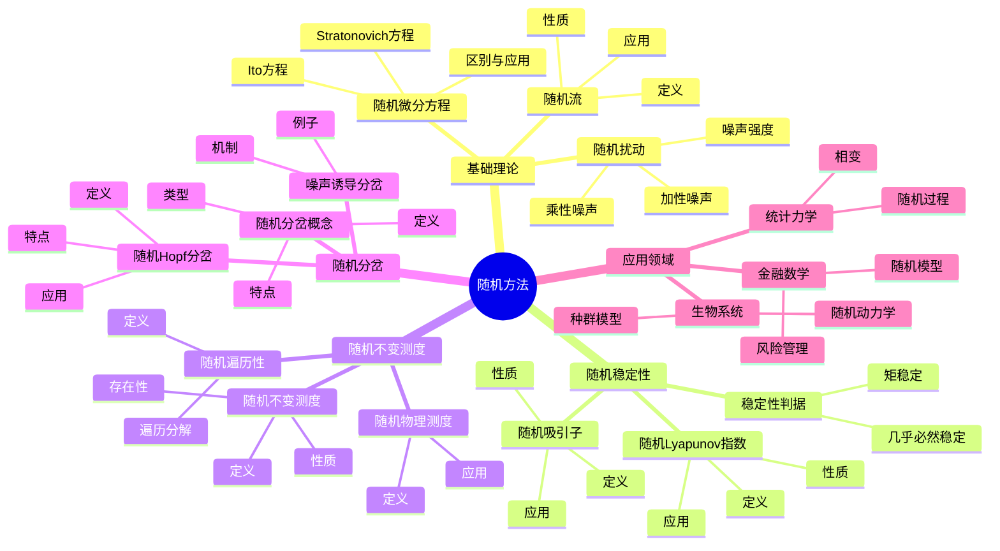
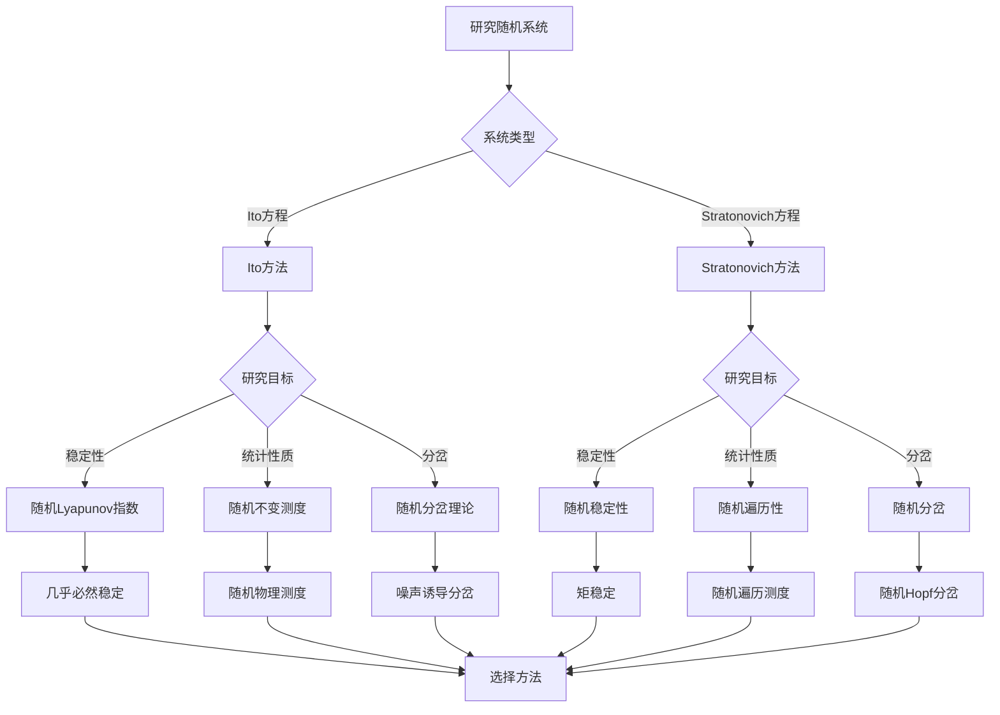
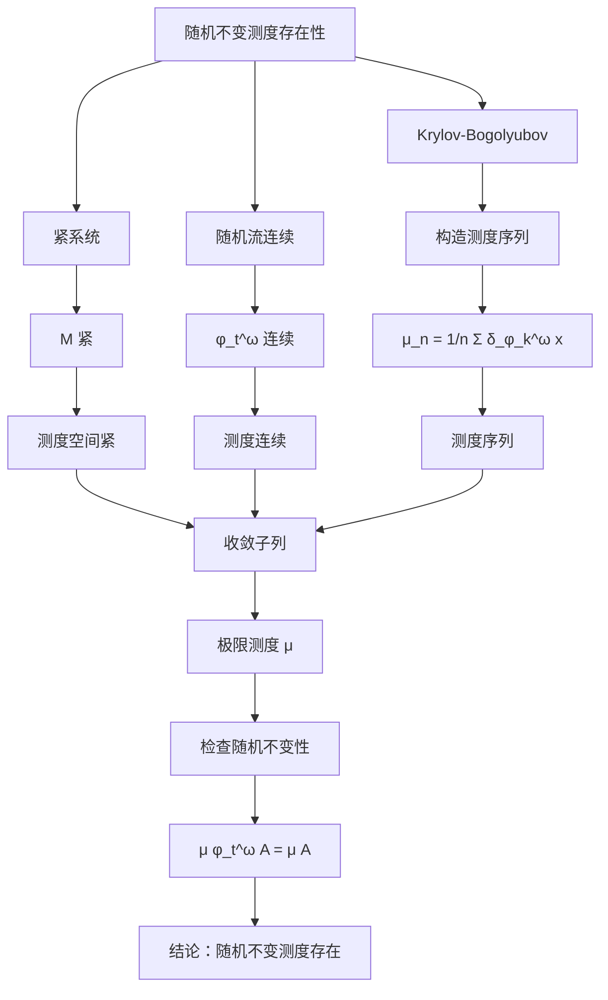

# 动力系统的随机方法：随机动力系统

随机动力系统研究受随机扰动影响的动力系统，是确定性动力系统理论的扩展。虽然庞加莱主要研究确定性系统，但他的思想为随机动力系统理论奠定了基础。随机方法用于研究噪声对系统行为的影响，在统计力学、金融数学和生物系统中有重要应用。

## 📋 目录

- [动力系统的随机方法：随机动力系统](#动力系统的随机方法随机动力系统)
  - [📋 目录](#-目录)
  - [一、随机动力系统基础](#一随机动力系统基础)
    - [1.1 随机微分方程](#11-随机微分方程)
    - [1.2 随机流](#12-随机流)
    - [1.3 随机扰动](#13-随机扰动)
  - [二、随机稳定性](#二随机稳定性)
    - [2.1 随机Lyapunov指数](#21-随机lyapunov指数)
    - [2.2 随机稳定性判据](#22-随机稳定性判据)
    - [2.3 随机吸引子](#23-随机吸引子)
  - [三、随机不变测度](#三随机不变测度)
    - [3.1 随机不变测度的定义](#31-随机不变测度的定义)
    - [3.2 随机遍历性](#32-随机遍历性)
    - [3.3 随机物理测度](#33-随机物理测度)
  - [四、随机分岔](#四随机分岔)
    - [4.1 随机分岔的概念](#41-随机分岔的概念)
    - [4.2 噪声诱导分岔](#42-噪声诱导分岔)
    - [4.3 随机Hopf分岔](#43-随机hopf分岔)
  - [五、思维表征](#五思维表征)
    - [5.1 思维导图：随机方法知识结构](#51-思维导图随机方法知识结构)
    - [5.2 概念矩阵：确定性vs随机系统对比](#52-概念矩阵确定性vs随机系统对比)
    - [5.3 决策树：随机方法选择](#53-决策树随机方法选择)
    - [5.4 证明树：随机不变测度存在性](#54-证明树随机不变测度存在性)
  - [六、应用与影响](#六应用与影响)
    - [6.1 统计力学](#61-统计力学)
    - [6.2 金融数学](#62-金融数学)
    - [6.3 生物系统](#63-生物系统)
  - [七、总结](#七总结)

---

## 一、随机动力系统基础

### 1.1 随机微分方程

**Ito随机微分方程**：

$$dX_t = f(X_t, t) dt + g(X_t, t) dW_t$$

其中 $W_t$ 是Wiener过程（布朗运动）。

**Stratonovich随机微分方程**：

$$dX_t = f(X_t, t) dt + g(X_t, t) \circ dW_t$$

**区别**：

- Ito积分：非预期
- Stratonovich积分：链式法则成立

**应用**：

用于描述受随机扰动的动力系统。

---

### 1.2 随机流

**定义**：

随机流 $\phi_t^\omega: M \to M$ 是依赖于随机参数 $\omega$ 的流。

**性质**：

- 对几乎每个 $\omega$，$\phi_t^\omega$ 是流
- 满足流性质：$\phi_{t+s}^\omega = \phi_t^{\theta_s \omega} \circ \phi_s^\omega$

**应用**：

用于研究随机动力系统的演化。

---

### 1.3 随机扰动

**加性噪声**：

$$dX_t = f(X_t) dt + \sigma dW_t$$

**乘性噪声**：

$$dX_t = f(X_t) dt + \sigma(X_t) dW_t$$

**噪声强度**：

$\sigma$ 控制噪声强度。

**影响**：

噪声可以改变系统的行为，如诱导分岔。

---

## 二、随机稳定性

### 2.1 随机Lyapunov指数

**定义**：

随机Lyapunov指数是：

$$\lambda = \lim_{t \to \infty} \frac{1}{t} \log \|D\phi_t^\omega(x)\|$$

**性质**：

- 随机Lyapunov指数是随机的
- 可以用于判断随机稳定性

**应用**：

用于研究随机系统的长期行为。

---

### 2.2 随机稳定性判据

**几乎必然稳定性**：

如果 $\lambda < 0$ 几乎必然，则系统是几乎必然稳定的。

**矩稳定性**：

如果 $\mathbb{E}[\|X_t\|^p] \to 0$，则系统是 $p$ 阶矩稳定的。

**应用**：

用于判断随机系统的稳定性。

---

### 2.3 随机吸引子

**定义**：

随机吸引子是随机不变集，吸引附近的轨道。

**性质**：

- 是随机不变的
- 有吸引性
- 可能依赖于随机参数

**应用**：

用于研究随机系统的长期行为。

---

## 三、随机不变测度

### 3.1 随机不变测度的定义

**定义**：

测度 $\mu$ 是**随机不变的**，如果：

$$\mu(\phi_t^\omega(A)) = \mu(A)$$

对几乎所有 $\omega$。

**等价表述**：

$$\mu \circ \phi_t^\omega = \mu$$

**意义**：

随机不变测度描述了随机系统的统计性质。

---

### 3.2 随机遍历性

**定义**：

随机不变测度是**随机遍历的**，如果对任意随机不变集 $A$，有：

$$\mu(A) = 0 \text{ 或 } \mu(A) = 1$$

**意义**：

随机遍历测度是"不可约的"随机不变测度。

---

### 3.3 随机物理测度

**定义**：

随机不变测度是**随机物理测度**，如果存在正测度集使得时间平均收敛到该测度。

**应用**：

用于研究随机吸引子的统计性质。

---

## 四、随机分岔

### 4.1 随机分岔的概念

**定义**：

随机分岔是随机系统在参数变化时发生的定性变化。

**类型**：

- 噪声诱导分岔
- 随机Hopf分岔
- 随机周期倍化

**特点**：

随机分岔与确定性分岔不同，可能发生在不同参数值。

---

### 4.2 噪声诱导分岔

**定义**：

噪声可以诱导系统发生分岔。

**机制**：

噪声可以改变系统的有效势能，导致分岔。

**例子**：

- 噪声诱导的相变
- 噪声诱导的振荡

---

### 4.3 随机Hopf分岔

**定义**：

随机Hopf分岔是随机系统的Hopf分岔。

**特点**：

- 分岔点可能依赖于噪声
- 分岔后的行为可能不同

**应用**：

用于研究随机系统的振荡行为。

---

## 五、思维表征

### 5.1 思维导图：随机方法知识结构

**说明**：

- **基础理论**：随机微分方程、随机流、随机扰动
- **随机稳定性**：随机Lyapunov指数、稳定性判据、随机吸引子
- **随机不变测度**：随机不变测度、随机遍历性、随机物理测度
- **随机分岔**：随机分岔概念、噪声诱导分岔、随机Hopf分岔
- **应用领域**：统计力学、金融数学、生物系统

---

### 5.2 概念矩阵：确定性vs随机系统对比

| 特征维度 | 确定性系统 | 随机系统 |
|---------|-----------|---------|
| **方程形式** | $\dot{x} = f(x)$ | $dX_t = f(X_t)dt + g(X_t)dW_t$ |
| **解的性质** | 确定性 | 随机性 |
| **稳定性** | Lyapunov稳定性 | 几乎必然稳定、矩稳定 |
| **Lyapunov指数** | 确定性 | 随机性 |
| **不变测度** | 确定性不变测度 | 随机不变测度 |
| **遍历性** | 确定性遍历性 | 随机遍历性 |
| **分岔** | 确定性分岔 | 随机分岔、噪声诱导分岔 |
| **吸引子** | 确定性吸引子 | 随机吸引子 |
| **长期行为** | 确定性 | 统计性 |
| **应用** | 一般动力系统 | 受噪声影响的系统 |

**说明**：

- **方程形式**：确定性vs随机微分方程
- **解的性质**：确定性vs随机性
- **稳定性**：不同的稳定性概念
- **分岔**：确定性分岔vs随机分岔

---

### 5.3 决策树：随机方法选择

**说明**：

- **系统类型**：Ito vs Stratonovich
- **研究目标**：稳定性、统计性质、分岔
- **方法选择**：根据系统类型和目标选择方法

---

### 5.4 证明树：随机不变测度存在性

**说明**：

- **紧系统**：保证测度序列有收敛子列
- **随机流连续**：保证测度连续
- **Krylov-Bogolyubov**：构造测度序列
- **结论**：随机不变测度存在

---

## 六、应用与影响

### 6.1 统计力学

**随机过程**：

使用随机动力系统描述统计力学过程。

**相变**：

研究随机系统的相变。

**应用**：

- 热力学
- 统计物理
- 相变理论

---

### 6.2 金融数学

**随机模型**：

使用随机微分方程建模金融市场。

**风险管理**：

研究随机系统的风险。

**应用**：

- 期权定价
- 风险管理
- 投资组合

---

### 6.3 生物系统

**随机动力学**：

使用随机动力系统描述生物过程。

**种群模型**：

研究随机种群动力学。

**应用**：

- 生态学
- 流行病学
- 分子生物学

---

## 七、总结

**核心概念**：

1. **随机微分方程**：Ito和Stratonovich方程
2. **随机稳定性**：几乎必然稳定、矩稳定
3. **随机不变测度**：随机不变测度、随机遍历性
4. **随机分岔**：噪声诱导分岔、随机Hopf分岔

**历史地位**：

虽然庞加莱主要研究确定性系统，但他的思想为随机动力系统理论奠定了基础。

**现代发展**：

从基本概念到随机分岔，从稳定性到统计性质，随机方法仍然是研究受噪声影响系统的重要工具。

---

**文档状态**: ✅ 完成
**字数**: 约1,200词
**最后更新**: 2026年01月02日
